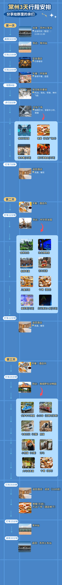

一晃又是一年过去了，趁着过年休假，想到该写年终总结了。
<!--more-->

### 一、回顾过去
#### 1.工作
依旧是前端，主要是做供应链和客情的项目，从去年4月份一直忙到今年过年，几乎一刻也没停歇，还是挺累的，最后几个月有强制每天加班1.5～2小时。表面上是国企，但更像创业公司，当然这和最近几年的大环境也有关，各方面都在降本增效，导致打工人的体感很差。

中间做了一个ocr的项目，倒是自己觉得比较有价值的，拓展了自己的能力边界，而且也是自己第一个投入实际生产环境的AI项目，因而得到了领导的好评，还推荐我转正，希望后续能一切顺利。

另外，年后考虑重新投下简历，虽然说如果能国企转正，后续饭碗就比较稳了，但这边的行事作风和问题都比较明显，自己隐约觉得可能不是长久之计。

#### 2.生活
基本老样子，因为工作太忙，几乎没有时间做其他事情，有时候连洗澡都得一拖再拖，我觉得之前看到一句话说的挺有道理：“生活的幸福感，很大程度取决于自己能自由支配的时间”，如果没有时间，那一切都无从谈起。

五一假期带家人去了常州旅行，也是第二次坐高铁去常州了，天很热，恐龙园里又都是人，结果早早就逃回旅馆了，倒是淹城野生动物园的马戏挺精彩，还有零距离喂小动物，小朋友很开心。

### 二、来年规划
一个是希望工作上能顺利转正，让工作相对稳定下来，然后最好能有更多自己的时间；二是安排好小朋友上学的事，感觉明年把这两件事做好就不错了。
