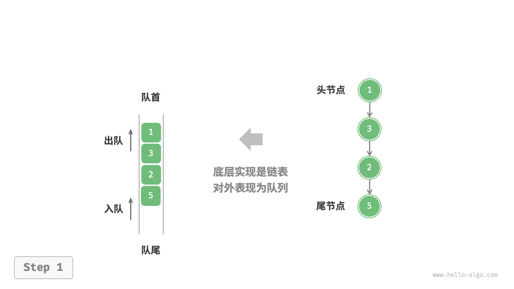
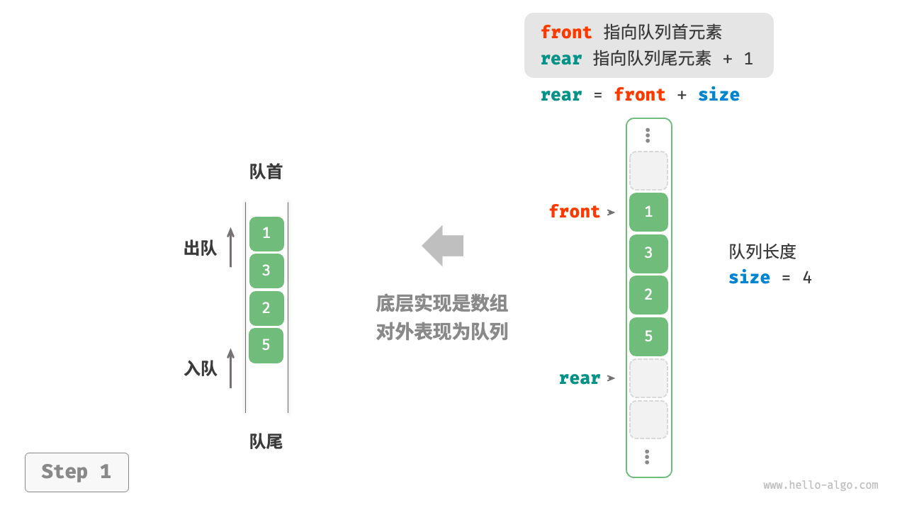
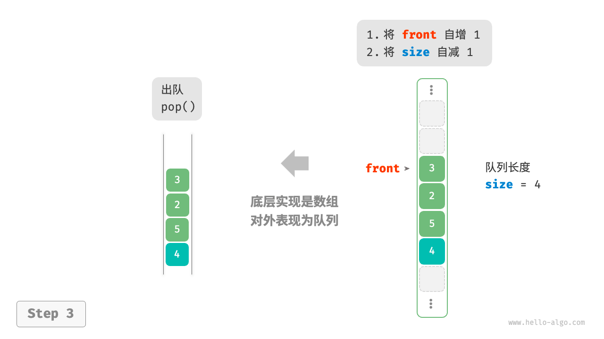
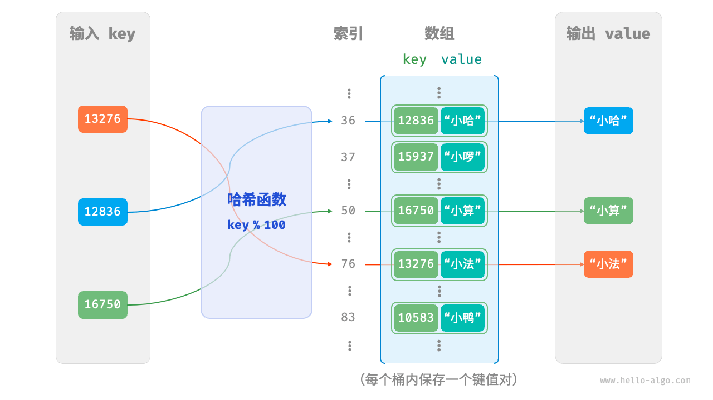
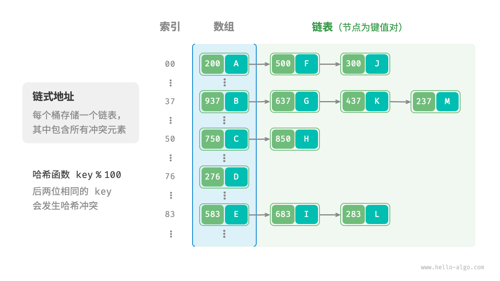
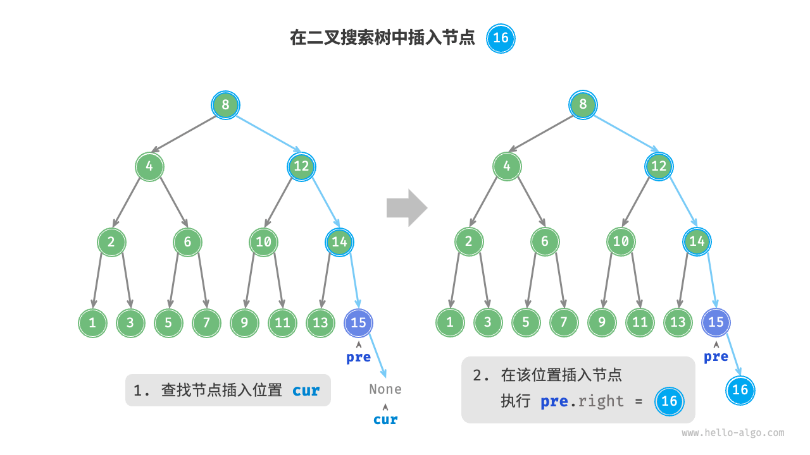
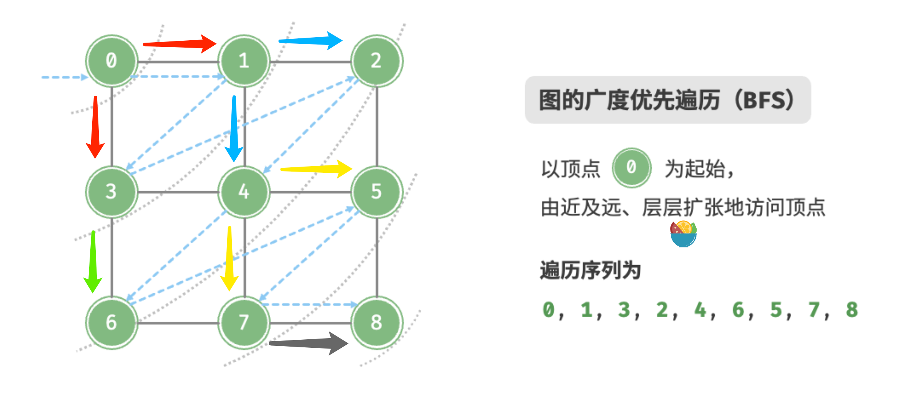
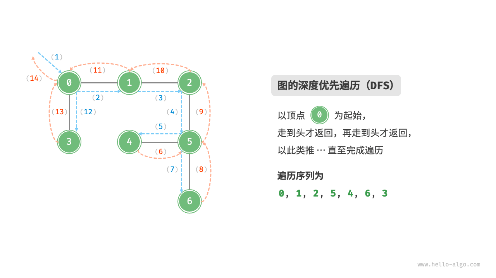

### 一、链表
#### 1.简单实现一个链表
<!--more-->
```python
class ListNode:
    def __init__(self, val):
        self.val = val
        self.next: ListNode | None = None


# 初始化链表 1 -> 3 -> 2 -> 5 -> 4
n0 = ListNode(1)
n1 = ListNode(3)
n2 = ListNode(2)
n3 = ListNode(5)
n4 = ListNode(4)

n0.next = n1
n1.next = n2
n2.next = n3
n3.next = n4


# 插入
def insert(n0, p):
    """在n0后插入节点p"""
    p = ListNode(6)
    p.next = n1
    n0.next = p


# 删除
def remove(n0):
    """删除n0后的节点p"""
    if not n0.next:
        return
    p = n0.next
    n1 = p.next
    n0.next = n1


# 访问
def access(head: ListNode, index: int) -> ListNode | None:
    if not head:
        return None
    for _ in range(index):
        head = head.next
    return head


# print(access(n0, 2).val)

# 查找
def find(head: ListNode, val: int) -> int:
    """在链表中查找值为 target 的首个节点"""
    index = 0
    while head:
        if head.val == val:
            return index
        else:
            index += 1
            head = head.next
    return -1


print(find(n0, 4))

```

### 二、队列
#### 1.基于链表实现队列
我们可以将链表的“头节点”和“尾节点”分别视为“队首”和“队尾”，规定队尾仅可添加节点，队首仅可删除节点

```python
class ListNode:
    def __init__(self, val):
        self.val = val
        self.next: ListNode | None = None


class LinkedListQueue:
    """基于链表实现的队列"""

    def __init__(self):
        self._front = None  # 头节点
        self._rear = None  # 尾节点
        self._size = 0

    def size(self):
        return self._size

    def is_empty(self):
        return self.size() == 0

    def push(self, num):
        node = ListNode(num)
        if self._front is None:
            self._front = node
            self._rear = node
        else:
            self._rear.next = node
            self._rear = node
            self._size += 1

    def peek(self):
        if self.is_empty():
            raise IndexError("队列为空")
        return self._front.val

    def pop(self):
        num = self.peek()
        self._front = self._front.next
        self._size -= 1
        return num

    def to_list(self):
        arr = []
        node = self._front
        while node:
            arr.append(node.val)
            node = node.next
        return arr

```

#### 2.基于数组实现队列
我们可以使用一个变量 front 指向队首元素的索引，并维护一个变量 size 用于记录队列长度。定义 rear = front + size ，这个公式计算出的 rear 指向队尾元素之后的下一个位置。

基于此设计，**数组中包含元素的有效区间为 [front, rear - 1]**，各种操作的实现方法如图所示。
- 入队操作：将输入元素赋值给 rear 索引处，并将 size 增加 1 。
- 出队操作：只需将 front 增加 1 ，并将 size 减少 1 。





```python
class ArrayQueue:
    """基于环形数组实现的队列"""

    def __init__(self, size):
        self._nums = [0] * size
        self._front = 0  # 队首指针
        self._size = 0  # 队列长度

    def capacity(self) -> int:
        """获取队列的容量"""
        return len(self._nums)

    def size(self):
        return self._size

    def is_empty(self):
        return self._size == 0

    def push(self, num):
        if self.size() == self.capacity():
            raise IndexError("队列已满")
        # 计算队尾指针，指向队尾索引 + 1
        # 通过取余操作实现 rear 越过数组尾部后回到头部
        rear: int = (self._front + self._size) % self.capacity()
        self._nums[rear] = num
        self._size += 1

    def pop(self) -> int:
        """出队"""
        num: int = self.peek()
        # 队首指针向后移动一位，若越过尾部，则返回到数组头部
        self._front = (self._front + 1) % self.capacity()
        self._size -= 1
        return num

    def peek(self):
        if self.is_empty():
            raise IndexError("队列为空")
        return self._nums[self._front]

    def to_list(self) -> list[int]:
        """返回列表用于打印"""
        res = [0] * self.size()
        j: int = self._front
        for i in range(self.size()):
            res[i] = self._nums[(j % self.capacity())]
            j += 1
        return res

```

### 三、栈
#### 1.基于链表实现栈
使用链表实现栈时，我们可以将链表的头节点视为栈顶，尾节点视为栈底
对于入栈操作，我们只需将**元素插入链表头部**，而对于出栈操作，只需将**头节点从链表中删除**即可
```python
class ListNode:
    def __init__(self, val):
        self.val = val
        self.next: ListNode | None = None


class LinkedListStack:
    """基于链表实现的栈"""

    def __init__(self):
        self._peek: ListNode | None = None
        self._size: int = 0

    def size(self):
        return self._size

    def is_empty(self):
        return self._size == 0

    def push(self, val: int):
        p = ListNode(val)
        p.next = self._peek
        self._peek = p
        self._size += 1

    def peek(self):
        if self.is_empty():
            raise IndexError("栈为空")
        return self._peek.val

    def pop(self):
        num = self.peek()
        self._peek = self._peek.next
        self._size -= 1
        return num

    def to_list(self):
        node = self._peek
        arr = []
        while node:
            arr.append(node)
            node = node.next
        return arr

```

#### 2.基于数组实现栈
可以将数组的尾部作为栈顶。入栈与出栈操作分别对应在数组尾部添加元素与删除元素
```python
class ArrayStack:
    """基于数组实现的栈"""

    def __init__(self):
        self._stack = []

    def size(self):
        return len(self._stack)

    def is_empty(self):
        return self.size() == 0

    def push(self, item):
        self._stack.append(item)

    def pop(self):
        if self.is_empty():
            raise IndexError("栈为空")
        return self._stack.pop()

    def peek(self):
        if self.is_empty():
            raise IndexError("栈为空")
        return self._stack[-1]

    def to_list(self):
        return self._stack

```

### 四、哈希表
#### 1.基于数组实现哈希表


```python
class Pair:
    def __init__(self, key, val):
        self.key = key
        self.val = val


class ArrayHashMap:
    """基于数组实现的哈希表"""

    def __init__(self):
        self.buckets: list[Pair | None] = [None] * 100

    def hash_func(self, key):
        index = key % 100
        return index

    def get(self, key):
        index = self.hash_func(key)
        pair: Pair = self.buckets[index]
        if pair is None:
            return None
        return pair.val

    def put(self, key, val):
        pair = Pair(key, val)
        index = self.hash_func(key)
        self.buckets[index] = pair

    def remove(self, key):
        index = self.hash_func(key)
        self.buckets[index] = None

    def entry_set(self) -> list[Pair]:
        """获取所有键值对"""
        result: list[Pair] = []
        for pair in self.buckets:
            if pair is not None:
                result.append(pair)
        return result

    def key_set(self) -> list[int]:
        """获取所有键"""
        result = []
        for pair in self.buckets:
            if pair is not None:
                result.append(pair.key)
        return result

    def value_set(self) -> list[str]:
        """获取所有值"""
        result = []
        for pair in self.buckets:
            if pair is not None:
                result.append(pair.val)
        return result

    def print(self):
        """打印哈希表"""
        for pair in self.buckets:
            if pair is not None:
                print(pair.key, "->", pair.val)

```

#### 2.基于链式地址实现哈希表
链式地址（separate chaining）将单个元素转换为链表，将键值对作为链表节点，将所有发生冲突的键值对都存储在同一链表中。

基于链式地址实现的哈希表的操作方法发生了以下变化。
- 查询元素：输入 key ，经过哈希函数得到桶索引，即可访问链表头节点，然后遍历链表并对比 key 以查找目标键值对。
- 添加元素：首先通过哈希函数访问链表头节点，然后将节点（键值对）添加到链表中。
 -删除元素：根据哈希函数的结果访问链表头部，接着遍历链表以查找目标节点并将其删除。

**缺点：**
- 占用空间增大：链表包含节点指针，它相比数组更加耗费内存空间。
- 查询效率降低：因为需要线性遍历链表来查找对应元素。

**可优化：**值得注意的是，当链表很长时，查询效率 𝑂(𝑛) 很差。此时可以将链表转换为“AVL 树”或“红黑树”，从而将查询操作的时间复杂度优化至 𝑂(log⁡𝑛) 。


```python
class Pair:
    def __init__(self, key, val):
        self.key = key
        self.val = val


class HashMapChaining:
    """基于数组实现的链式地址哈希表"""

    def __init__(self):
        """构造方法"""
        self.size = 0  # 键值对数量
        self.capacity = 4  # 哈希表容量
        self.load_thres = 2.0 / 3.0  # 触发扩容的负载因子阈值
        self.extend_ratio = 2  # 扩容倍数
        self.buckets = [[] for _ in range(self.capacity)]  # 桶数组

    def hash_func(self, key):
        return key % self.capacity

    def load_factor(self) -> float:
        """负载因子"""
        return self.size / self.capacity

    def get(self, key):
        index = self.hash_func(key)
        bucket = self.buckets[index]
        for pair in bucket:
            if pair.key == key:
                return pair.val
        return None

    def put(self, key, val):
        """添加操作"""
        # 当负载因子超过阈值时，执行扩容
        if self.load_factor() > self.load_thres:
            self.extend()
        index = self.hash_func(key)
        bucket = self.buckets[index]
        # 遍历桶，若遇到指定 key ，则更新对应 val 并返回
        for pair in bucket:
            if pair.key == key:
                pair.val = val
                return
        # 若无该 key ，则将键值对添加至尾部
        pair = Pair(key, val)
        bucket.append(pair)
        self.size += 1

    def remove(self, key):
        index = self.hash_func(key)
        bucket = self.buckets[index]
        for pair in bucket:
            if pair.key == key:
                bucket.remove(pair)
                self.size -= 1
                break

    def extend(self):
        """扩容哈希表"""
        # 暂存原哈希表
        buckets = self.buckets
        self.capacity *= self.extend_ratio
        self.buckets = [[] for _ in range(self.capacity)]
        # 将键值对从原哈希表搬运至新哈希表
        for bucket in buckets:
            for pair in bucket:
                self.put(pair.key, pair.val)

    def print(self):
        """打印哈希表"""
        for bucket in self.buckets:
            res = []
            for pair in bucket:
                res.append(str(pair.key) + " -> " + pair.val)
            print(res)

```

### 五、二叉树
#### 1.简单二叉树的实现
```python
class TreeNode:
    def __init__(self, val):
        self.val = val
        self.left: TreeNode | None = None
        self.right: TreeNode | None = None


n1 = TreeNode(val=1)
n2 = TreeNode(val=2)
n3 = TreeNode(val=3)
n4 = TreeNode(val=4)
n5 = TreeNode(val=5)

n1.left = n2
n1.right = n3
n2.left = n4
n2.right = n5

# 插入：在 n1 -> n2 中间插入节点 P
p = TreeNode(val=6)
n1.left = p
p.left = n2

# 删除p
n1.left = n2

```
#### 2.基于数组实现的二叉树
```python
class ArrayBinaryTree:
    """数组表示下的二叉树类"""

    def __init__(self, arr: list[int | None]):
        """构造方法"""
        self._tree = list(arr)

    def size(self):
        """列表容量"""
        return len(self._tree)

    def val(self, i: int) -> int | None:
        """获取索引为 i 节点的值"""
        # 若索引越界，则返回 None ，代表空位
        if i < 0 or i >= self.size():
            return None
        return self._tree[i]

    def left(self, i: int) -> int | None:
        """获取索引为 i 节点的左子节点的索引"""
        return 2 * i + 1

    def right(self, i: int) -> int | None:
        """获取索引为 i 节点的右子节点的索引"""
        return 2 * i + 2

    def parent(self, i: int) -> int | None:
        """获取索引为 i 节点的父节点的索引"""
        return (i - 1) // 2

    def level_order(self) -> list[int]:
        """层序遍历"""
        self.res = []
        # 直接遍历数组
        for i in range(self.size()):
            if self.val(i) is not None:
                self.res.append(self.val(i))
        return self.res

    def dfs(self, i: int, order: str):
        """深度优先遍历"""
        if self.val(i) is None:
            return
        # 前序遍历
        if order == "pre":
            self.res.append(self.val(i))
        self.dfs(self.left(i), order)
        # 中序遍历
        if order == "in":
            self.res.append(self.val(i))
        self.dfs(self.right(i), order)
        # 后序遍历
        if order == "post":
            self.res.append(self.val(i))

    def pre_order(self) -> list[int]:
        """前序遍历"""
        self.res = []
        self.dfs(0, order="pre")
        return self.res

    def in_order(self) -> list[int]:
        """中序遍历"""
        self.res = []
        self.dfs(0, order="in")
        return self.res

    def post_order(self) -> list[int]:
        """后序遍历"""
        self.res = []
        self.dfs(0, order="post")
        return self.res
```

### 六、二叉搜索树
二叉搜索树（binary search tree）满足以下条件。
1. 对于根节点，左子树中所有节点的值 < 根节点的值 < 右子树中所有节点的值。
2. 任意节点的左、右子树也是二叉搜索树，即同样满足条件 1.
3. 不允许存在重复节点

#### 1.查找节点
```python
def search(root, num):
    cur = root
    while cur:
        if cur.val < num:
            cur = cur.right
        elif cur.val > num:
            cur = cur.left
        else:
            return cur
```

#### 2.插入节点
给定一个待插入元素 num ，为了保持二叉搜索树“左子树 < 根节点 < 右子树”的性质，插入操作流程如图所示。
1. 查找插入位置：与查找操作相似，从根节点出发，根据当前节点值和 num 的大小关系循环向下搜索，直到越过叶节点（遍历至 None ）时跳出循环。
2. 在该位置插入节点：初始化节点 num ，将该节点置于 None 的位置



```python
def insert(root, num):
    """插入节点"""
    # 若树为空，则初始化为根节点
    if root is None:
        root = TreeNode(num)
        return

    cur, pre = root, None
    while cur is not None:
        # 找到重复节点，直接返回
        if cur.val == num:
            return
        pre = cur
        if cur.val < num:
            cur = cur.right
        else:
            cur = cur.left
    # 插入节点
    node = TreeNode(num)
    if pre.val < num:
        pre.right = node
    else:
        pre.left = node
```

#### 3.删除节点
根据目标节点的子节点数量，分 0、1 和 2 三种情况:
1. 度为0：直接删除
2. 度为1：将待删除节点替换为其子节点
3. 度为2：找到待删除节点在“中序遍历序列”中的下一个节点，记为 tmp；用 tmp 的值覆盖待删除节点的值，并在树中递归删除节点 tmp

```python
def remove(self, num: int):
    """删除节点"""
    # 若树为空，直接提前返回
    if self._root is None:
        return
    # 循环查找，越过叶节点后跳出
    cur, pre = self._root, None
    while cur is not None:
        # 找到待删除节点，跳出循环
        if cur.val == num:
            break
        pre = cur
        # 待删除节点在 cur 的右子树中
        if cur.val < num:
            cur = cur.right
        # 待删除节点在 cur 的左子树中
        else:
            cur = cur.left
    # 若无待删除节点，则直接返回
    if cur is None:
        return

    # 子节点数量 = 0 or 1
    if cur.left is None or cur.right is None:
        # 当子节点数量 = 0 / 1 时， child = null / 该子节点
        child = cur.left or cur.right
        # 删除节点 cur
        if cur != self._root:
            if pre.left == cur:
                pre.left = child
            else:
                pre.right = child
        else:
            # 若删除节点为根节点，则重新指定根节点
            self._root = child
    # 子节点数量 = 2
    else:
        # 获取中序遍历中 cur 的下一个节点
        tmp: TreeNode = cur.right
        while tmp.left is not None:
            tmp = tmp.left
        # 递归删除节点 tmp
        self.remove(tmp.val)
        # 用 tmp 覆盖 cur
        cur.val = tmp.val
```

#### 4.将list转换为bst（二叉搜索树）
```python
a = [7, 1, 2, 4, 6, 8, 3, 5, 9, 10]


class TreeNode:
    def __init__(self, val):
        self.val = val
        self.left = None
        self.right = None


def build_bst(arr):
    if not arr:
        return None
    arr.sort()
    mid = len(arr) // 2
    root = TreeNode(arr[mid])
    root.left = build_bst(arr[:mid])
    root.right = build_bst(arr[mid + 1:])
    return root


root = build_bst(a)


def inorder(root):
    if not root:
        return None
    inorder(root.left)
    print(root.val)
    inorder(root.right)


inorder(root)

```

### 七、堆
#### 1.使用数组实现大顶堆
```python
class MyMaxHeap:
    """使用数组实现大顶堆"""

    def __init__(self):
        self.max_heap = []

    def size(self):
        return len(self.max_heap)

    def is_empty(self):
        return not self.max_heap

    def left(self, i: int) -> int:
        return 2 * i + 1

    def right(self, i: int) -> int:
        return 2 * i + 2

    def parent(self, i: int) -> int:
        return (i - 1) // 2

    def peek(self):
        return self.max_heap[0]

    def swap(self, i, j):
        """交换堆中的两个元素"""
        self.max_heap[i], self.max_heap[j] = self.max_heap[j], self.max_heap[i]

    def push(self, val):
        self.max_heap.append(val)
        self.sift_up(self.size() - 1)

    def sift_up(self, i):
        """从节点 i 开始，从底至顶堆化"""
        while True:
            p_index = self.parent(i)
            # 当“越过根节点”或“节点无须修复”时，结束堆化
            if p_index < 0 or self.max_heap[i] <= self.max_heap[p_index]:
                break
            # 交换两节点
            self.swap(i, p_index)
            # 循环向上堆化
            i = p_index

    def pop(self):
        if self.is_empty():
            raise IndexError("堆为空")
        # 交换根节点和最后一个节点
        self.swap(0, self.size() - 1)
        # 删除最后一个节点
        val = self.max_heap.pop()
        # 从顶至下进行堆化
        self.sift_down(0)
        return val

    def sift_down(self, i: int):
        """从节点 i 开始，从顶至底堆化"""
        while True:
            # 判断节点 i, l, r 中值最大的节点，记为 ma
            l_index, r_index, max_index = self.left(i), self.right(i), i
            if l_index < self.size() and self.max_heap[l_index] > self.max_heap[max_index]:
                max_index = l_index
            if r_index < self.size() and self.max_heap[r_index] > self.max_heap[max_index]:
                max_index = r_index
            # 若节点 i 最大或索引 l, r 越界，则无须继续堆化，跳出
            if max_index == i:
                break
            # 交换两节点
            self.swap(i, max_index)
            # 循环向下堆化
            i = max_index

```
#### 2.Top-k 问题
1. 初始化一个小顶堆，其堆顶元素最小。
2. 先将数组的前 𝑘 个元素依次入堆。
3. 从第 𝑘+1 个元素开始，若当前元素大于堆顶元素，则将堆顶元素出堆，并将当前元素入堆（并堆化）。
4. 遍历完成后，堆中保存的就是最大的 𝑘 个元素。

```python
def top_k_heap(nums: list[int], k: int) -> list[int]:
    """基于堆查找数组中最大的 k 个元素"""
    # 初始化小顶堆
    heap = []
    # 将数组的前 k 个元素入堆
    for i in range(k):
        heapq.heappush(heap, nums[i])
    # 从第 k+1 个元素开始，保持堆的长度为 k
    for i in range(k, len(nums)):
        # 若当前元素大于堆顶元素，则将堆顶元素出堆、当前元素入堆
        if nums[i] > heap[0]:
            heapq.heappop(heap)
            heapq.heappush(heap, nums[i])
    return heap
```
### 八、图
#### 1.基于邻接矩阵实现图
```python
class GraphAdjMat:
    """基于邻接矩阵实现的无向图类"""

    def __init__(self, vertices: list[int], edges: list[list[int]]):
        # 顶点列表，元素代表“顶点值”，索引代表“顶点索引”
        self.vertices: list[int] = []
        # 邻接矩阵，行列索引对应“顶点索引”
        self.adj_mat: list[list[int]] = []
        for val in vertices:
            self.add_vertex(val)
        for pair in edges:
            self.add_edge(pair[0], pair[1])

    def size(self):
        """获取顶点数量"""
        return len(self.vertices)

    def add_vertex(self, val):
        n = self.size()
        self.vertices.append(val)
        new_row = [0] * n
        # 添加行
        self.adj_mat.append(new_row)
        # 添加列
        for row in self.adj_mat:
            row.append(0)

    def remove_vertex(self, index):
        if index > self.size():
            raise IndexError
        self.vertices.pop(index)
        self.adj_mat.pop(index)
        for row in self.adj_mat:
            row.pop(index)

    def add_edge(self, i, j):
        # 索引越界与相等处理
        if i < 0 or j < 0 or i > self.size() or j > self.size() or i == j:
            raise IndexError
        # 在无向图中，邻接矩阵关于主对角线对称，即满足 (i, j) == (j, i)
        self.adj_mat[i][j] = 1
        self.adj_mat[j][i] = 1

    def remove_edge(self, i, j):
        # 索引越界与相等处理
        if i < 0 or j < 0 or i > self.size() or j > self.size() or i == j:
            raise IndexError
        # 在无向图中，邻接矩阵关于主对角线对称，即满足 (i, j) == (j, i)
        self.adj_mat[i][j] = 0
        self.adj_mat[j][i] = 0

    def print(self):
        """打印邻接矩阵"""
        print("顶点列表 =", self.vertices)
        print("邻接矩阵 =")
        print(self.adj_mat)

```
#### 2.基于邻接表实现图
```python
class Vertex:
    """顶点类"""

    def __init__(self, val: int):
        self.val = val


class GraphAdjList:
    """
    基于邻接表实现的无向图类
    顶点使用dict存储，边用list存储
    """

    def __init__(self, edges: list[list[Vertex]]):
        self.adj_dict = dict[Vertex, list[Vertex]]()
        for edge in edges:
            self.add_vertex(edge[0])
            self.add_vertex(edge[1])
            self.add_edge(edge[0], edge[1])

    def size(self):
        return len(self.adj_dict)

    def add_vertex(self, vet: Vertex):
        if vet in self.adj_dict:
            return
        self.adj_dict[vet] = []

    def remove_vertex(self, vet: Vertex):
        if vet not in self.adj_dict:
            raise ValueError
        self.adj_dict.pop(vet)
        for key in self.adj_dict:
            edge_list = self.adj_dict[key]
            if vet in edge_list:
                edge_list.remove(vet)

    def add_edge(self, vet1: Vertex, vet2: Vertex):
        if vet1 not in self.adj_dict or vet2 not in self.adj_dict or vet1 == vet2:
            raise ValueError()
        self.adj_dict[vet1].append(vet2)
        self.adj_dict[vet2].append(vet1)

    def remove_edge(self, vet1: Vertex, vet2: Vertex):
        if vet1 not in self.adj_dict or vet2 not in self.adj_dict or vet1 == vet2:
            raise ValueError()
        self.adj_dict[vet1].remove(vet2)
        self.adj_dict[vet2].remove(vet1)

    def print(self):
        """打印邻接表"""
        print("邻接表 =")
        for vertex in self.adj_dict:
            tmp = [v.val for v in self.adj_dict[vertex]]
            print(f"{vertex.val}: {tmp},")

```
#### 3.基于邻接表的bfs
广度优先遍历是一种由近及远的遍历方式，从某个节点出发，始终优先访问距离最近的顶点，并一层层向外扩张。
从左上角顶点出发，首先遍历该顶点的所有邻接顶点，然后遍历下一个顶点的所有邻接顶点，以此类推，直至所有顶点访问完毕。


```python
from graph_adjacency_list import Vertex, GraphAdjList
from collections import deque


def graph_bfs(graph: GraphAdjList, start_vet: Vertex) -> list[Vertex]:
    """广度优先遍历"""
    # 使用邻接表来表示图，以便获取指定顶点的所有邻接顶点
    # 顶点遍历序列
    res = []
    # 哈希集合，用于记录已被访问过的顶点
    visited = set[Vertex]([start_vet])
    que = deque[Vertex]([start_vet])
    # 以顶点 vet 为起点，循环直至访问完所有顶点
    while len(que) > 0:
        vet = que.popleft()
        res.append(vet)
        vet_list = graph.adj_dict[vet]
        for v in vet_list:
            if v in visited:
                continue
            visited.add(v)
            que.append(v)
    return res

```
#### 4.基于邻接表的dfs
深度优先遍历是一种优先走到底、无路可走再回头的遍历方式。如图所示，从左上角顶点出发，访问当前顶点的某个邻接顶点，直到走到尽头时返回，再继续走到尽头并返回，以此类推，直至所有顶点遍历完成。


```python
from graph_adjacency_list import Vertex, GraphAdjList


def dfs(graph: GraphAdjList, visited: set[Vertex], res: list[Vertex], vet: Vertex):
    """深度优先遍历辅助函数"""
    res.append(vet)
    visited.add(vet)
    vet_list = graph.adj_dict[vet]
    for v in vet_list:
        if v in visited:
            continue
        dfs(graph, visited, res, v)


def graph_dfs(graph: GraphAdjList, start_vet: Vertex) -> list[Vertex]:
    """深度优先遍历"""
    # 使用邻接表来表示图，以便获取指定顶点的所有邻接顶点
    res = []
    visited = set[Vertex]()
    dfs(graph, visited, res, start_vet)
    return res

```
