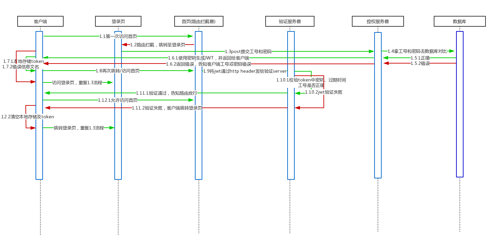

### 一、流程图

此项目为员工考勤查询系统，前端为angular 5，后端为php、MySQL(LNMP)，前端页面包含登录页、首页（考勤数据查询页），主要在用户访问首页时进行校验。用户登录所需相关信息已提前录入数据库，故这里只涉及登录，不讨论注册流程。因在开发环境下，涉及跨域测试，故还通过后端php实现了CORS。<!--more-->

*如下内容，是本人参考多篇文章后，自己的理解与实现，可能与实际使用有出入*



**流程文字说明：**

- 用户第一次访问首页时，因客户端没有token，会被首页的路由守卫拦截，然后引导至登录页
- 用户输入工号、密码，post提交给后端授权服务器
- 授权服务器拿着工号、密码，到MySQL中比对，如果正确，则使用secret key（签名）、工号、时间戳，生成jwt，并返回给客户端；如果MySQL中查询错误，则将错误信息返回给客户端
- 客户端根据返回数据中的result字段，判断授权是否通过；通过则将其中的token、工号、英文名存入LocalStorage，以备后续使用，然后再次尝试访问首页；如果不通过，则在登录页显示错误信息，告知用户重新输入
- 路由守卫得知用户需访问首页，先检查token，发现存在，则将此token放入http header中（Authorization: Bearer）发送给后端验证服务器
- 验证服务器解包，读取token字串，比对三项信息：secret key是否正确、token是否过期、工号是否是对应的客户端，只要三项中任一出错，则返回给路由守卫false；如果都正确则返回true
- 路由守卫获得验证服务器发来的信息，如果为true，则表示验证通过，允许用户访问首页；如果为false，表示用户token错误（一般是过期），则引导用户至登录页，重新登录获取新的token

### 二、实现步骤
#### 1.php配置CORS
后端的授权、验证服务，都配置上，方便测试；实际生产环境，要按需修改
```php
<?php
header('Access-Control-Allow-Origin: *');
header('Access-Control-Allow-Headers: Origin, X-Requested-With, Content-Type, Accept, Authorization');
```

#### 2.配置前端auth.service.ts
此服务包含向后端请求的登录授权、token验证服务
```typescript
import {Injectable} from '@angular/core';
import 'rxjs/Rx';
import {HttpClient} from '@angular/common/http';

@Injectable()
export class AuthService {

  constructor(private http: HttpClient) {
  }

  login(uwid: string, upwd: any) {
    const postData = new FormData();
    postData.append('uwid' , uwid);
    postData.append('upwd' , upwd);
    return this.http.post('https://test.com/backend/authentication.php', postData);
  }

  validate(uwid: string){
    const postData = new FormData();
    postData.append('uwid' , uwid);
    return this.http.post('https://test.com/validation.php', postData);
  }

  logout(){
    localStorage.clear();
  }
}
```
**注意：**http.post数据，需以formdata形式传送，否则后端无法获取到

#### 3.配置首页的路由守卫服务
```typescript
import {Injectable} from '@angular/core';
import {Router, CanActivate, ActivatedRouteSnapshot, RouterStateSnapshot} from '@angular/router';
import {AuthService} from './auth.service';
import {Observable} from 'rxjs/Observable';

@Injectable()
export class AuthGuardService implements CanActivate {
  validate;

  constructor(private router: Router,
              private authService: AuthService) {
  }

  canActivate(route: ActivatedRouteSnapshot, state: RouterStateSnapshot): Observable<boolean> | boolean {
    if (localStorage.getItem('token')) {
      const uwid = localStorage.getItem('uwid');
      return this.authService.validate(uwid).map(data => {
        console.log(data);
        if(data['result']) return true;
        this.router.navigate(['/login'], {queryParams: {returnUrl: state.url}});
        return false;
      });
    } else {
      // not logged in so redirect to login page with the return url
      this.router.navigate(['/login'], {queryParams: {returnUrl: state.url}});
      return false;
    }
  }
}
```
**注意：**由于验证动作是异步返回数据，故路由守卫需返回Observable类型的布尔值，这样才能正常判断

#### 4.前端登录组件
接收授权服务返回的数据，并存入LocalStorage，如有错误，提示用户
```typescript
import {Component, OnInit} from '@angular/core';
import {FormBuilder, FormGroup, Validators} from '@angular/forms';
import {AuthService} from '../services/auth.service';
import {ActivatedRoute, Router} from '@angular/router';
import {Md5} from 'ts-md5/dist/md5';

@Component({
  selector: 'app-login',
  templateUrl: './login.component.html',
  styleUrls: ['./login.component.css']
})
export class LoginComponent implements OnInit {
  formModel: FormGroup;
  returnUrl: string;
  loginErrInfo = false;

  constructor(private authService: AuthService,
              private route: ActivatedRoute,
              private router: Router,) {
  }

  ngOnInit() {
    const fb = new FormBuilder;
    this.formModel = fb.group({
      uwid: ['', [Validators.required]],
      upwd: ['', [Validators.required]]
    });
    this.returnUrl = this.route.snapshot.queryParams['returnUrl'] || '/';
    this.authService.logout();
  }

  login() {
    const uid = this.formModel.value.uwid;
    const password = Md5.hashStr(this.formModel.value.upwd);
    this.authService.login(uid, password).subscribe(data => {
      console.log(data);
      if (data['result'] === 1) {
        this.loginErrInfo = false;
        this.setSession(data);
      } else {
        this.loginErrInfo = true;
      }
    });
  }

  setSession(data) {
    localStorage.setItem('token', data.token);
    localStorage.setItem('uwid', data.uwid);
    localStorage.setItem('uename', data.uename);
    this.router.navigate([this.returnUrl]);
  }
}
```

#### 5.前端Http拦截器服务
用于将token插入每个http request header中，方便后端获取token
##### (1)需先在根模块中声明
```typescript
import {HTTP_INTERCEPTORS, HttpClientModule} from '@angular/common/http';
import {TokenInterceptorService} from './services/token-interceptor.service';

providers: [
    RecordService,
    AuthService,
    AuthGuardService,
    {
      provide: HTTP_INTERCEPTORS,
      useClass: TokenInterceptorService,
      multi: true
    }
  ],
```
##### (2)实现
如果有token，则更新request；如果没有，则直接发送
```typescript
import {Injectable} from '@angular/core';
import {HttpEvent, HttpHandler, HttpRequest} from '@angular/common/http';
import {Observable} from 'rxjs/Observable';

@Injectable()
export class TokenInterceptorService {

  constructor() {
  }

  intercept(req: HttpRequest<any>,
            next: HttpHandler): Observable<HttpEvent<any>> {

    const token = localStorage.getItem('token');

    if (token) {
      const cloned = req.clone({
        headers: req.headers.set('Authorization',
          'Bearer ' + token)
      });

      return next.handle(cloned);
    } else {
      return next.handle(req);
    }
  }

}
```

#### 6.配置后端php安装jwt库
##### （1）这里使用 [lcobucci/jwt](https://github.com/lcobucci/jwt/blob/3.2/README.md)实现php-jwt，按照文档说明，先安装composer

##### （2）按照 [composer官网](https://getcomposer.org/download/)，在Linux中输入如下命令，获取composer.phar
```shell
php -r "copy('https://getcomposer.org/installer', 'composer-setup.php');"
php -r "if (hash_file('SHA384', 'composer-setup.php') === '544e09ee996cdf60ece3804abc52599c22b1f40f4323403c44d44fdfdd586475ca9813a858088ffbc1f233e9b180f061') { echo 'Installer verified'; } else { echo 'Installer corrupt'; unlink('composer-setup.php'); } echo PHP_EOL;"
php composer-setup.php
```

##### (3)将composer.phar拷贝至项目相关目录下，比如test/backend，运行`composer.phar require lcobucci/jwt`，这里将安装lcobucci/jwt

更新（2018/05/21）: ubuntu可以直接运行`sudo apt-get install composer`来安装，然后在php文件相关目录下安装jwt`sudo composer require lcobucci/jwt`

#### 7.配置php授权服务器
用于获取用户发来的工号、密码信息，并与MySQL比对后，生成jwt返回客户端
```php
<?php
header('Access-Control-Allow-Origin: *');
header('Access-Control-Allow-Headers: Origin, X-Requested-With, Content-Type, Accept, Authorization');
header("Content-Type:application/json;charset=utf-8");

require_once 'vendor/autoload.php';
use Lcobucci\JWT\Builder;
use Lcobucci\JWT\Parser;
use Lcobucci\JWT\ValidationData;
use Lcobucci\JWT\Signer\Hmac\Sha256;

  $uwid = $_REQUEST['uwid'];
  $upwd = $_REQUEST['upwd'];

  include('config.php');
  $link = mysqli_connect($db_url,$db_user,$db_pwd,$db_name,$db_port);

  $sql = "set names utf8";
  mysqli_query($link,$sql);

  $sql = "select * from asus_user where uwid='$uwid' and upwd='$upwd'";
  $result = mysqli_query($link,$sql);
  $list = mysqli_fetch_assoc($result);
  $uename = $list['uename'];

  if($list){
  $signer = new Sha256();
  $token = (new Builder())->setIssuer('test.com')
        ->setAudience('test.com')
        ->setIssuedAt(time())
        ->setId($uwid, true)
        ->setExpiration(time() + 3600) //一小时后过期
        ->sign($signer, 'your secret key')
        ->getToken();
        echo json_encode(['result' => 1, 'message' => 'Token generated successfully', 'uwid' => $uwid, 'uename' => $uename, 'token' => '' . $token]);
          } else {
            echo json_encode(['result' => 0, 'message' => 'Invalid username and/or password']);
          }
```

#### 8.配置验证服务器
用于获取http request header中的token字串，并做校验，然后返回结果
```php
<?php
header('Access-Control-Allow-Origin: *');
header('Access-Control-Allow-Headers: Origin, X-Requested-With, Content-Type, Accept, Authorization');
header("Content-Type:application/json;charset=utf-8");

require_once 'vendor/autoload.php';
use Lcobucci\JWT\Builder;
use Lcobucci\JWT\Parser;
use Lcobucci\JWT\ValidationData;
use Lcobucci\JWT\Signer\Hmac\Sha256;

$uwid = $_REQUEST['uwid'];
$fetchToken = '';
$validateMsg = '';

foreach ($_SERVER as $name => $value){
           if ($name == 'HTTP_AUTHORIZATION'){
               $fetchToken = substr($value, 7);
           }
       }
$token = (new Parser())->parse($fetchToken);
$signer = new Sha256();
$signerCheck = $token->verify($signer, 'your secret key');
$expireCheck = $token->getClaim('exp') > time();
$uwidCheck = $token->getClaim('jti') == $uwid;

if(!$signerCheck) $validateMsg .= '签名已被篡改！';
if(!$expireCheck) $validateMsg .= ' token已过期！';
if(!$uwidCheck) $validateMsg .= ' 非当前用户的token！';

if(!$signerCheck || !$expireCheck || !$uwidCheck){
  echo json_encode(['result' => false, 'message' => $validateMsg]);
} else {
  echo json_encode(['result' => true, 'message' => '验证通过！']);
}
```
参考链接：

[Angular Security - Authentication With JSON Web Tokens (JWT): The Complete Guide](https://blog.angular-university.io/angular-jwt-authentication/)

[Angular 2/5 User Registration and Login Example & Tutorial](http://jasonwatmore.com/post/2016/09/29/angular-2-user-registration-and-login-example-tutorial)

[How to simplify your app’s authentication by using JSON Web Token](https://medium.freecodecamp.org/how-to-make-authentication-easier-with-json-web-token-cc15df3f2228)

[php使用jwt的例子](https://blog.csdn.net/HobHunter/article/details/78524922)

[JWT - Simple API example](https://codereview.stackexchange.com/questions/111402/jwt-simple-api-example)

[JWT（Json Web Token）初探与实践](http://www.cnblogs.com/leestar54/p/7242165.html)

[lcobucci/jwt](https://github.com/lcobucci/jwt/blob/3.2/README.md)

[angular 中使用md5](https://blog.csdn.net/qq_34438958/article/details/72792977)

[Angular2 canActivate() calling async function
](https://stackoverflow.com/questions/38425461/angular2-canactivate-calling-async-function)

[Angular Authentication: Using the Http Client and Http Interceptors](https://medium.com/@ryanchenkie_40935/angular-authentication-using-the-http-client-and-http-interceptors-2f9d1540eb8)

