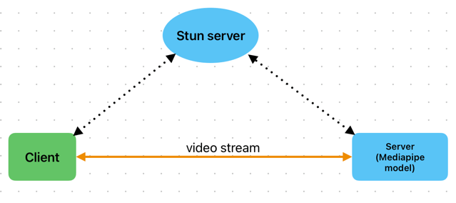
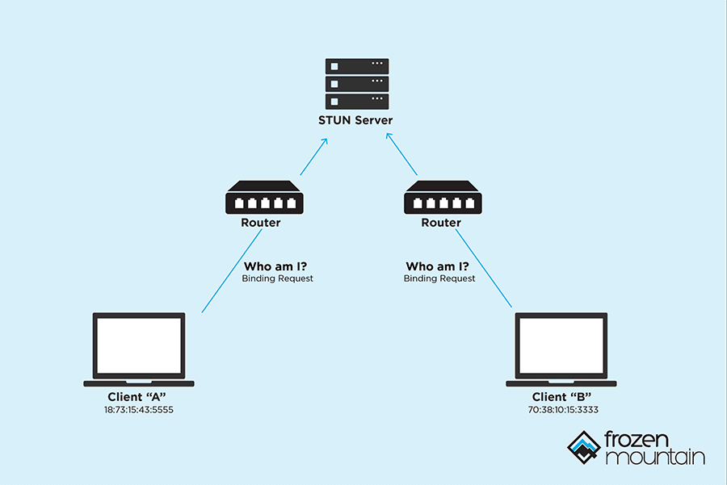
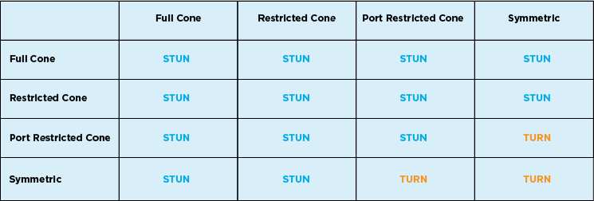
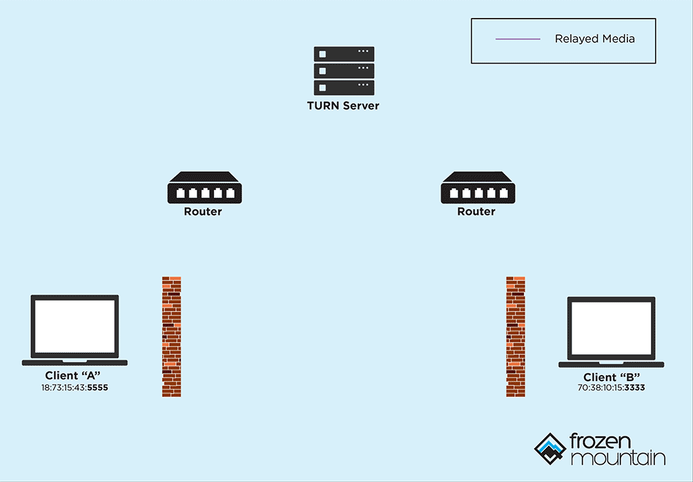
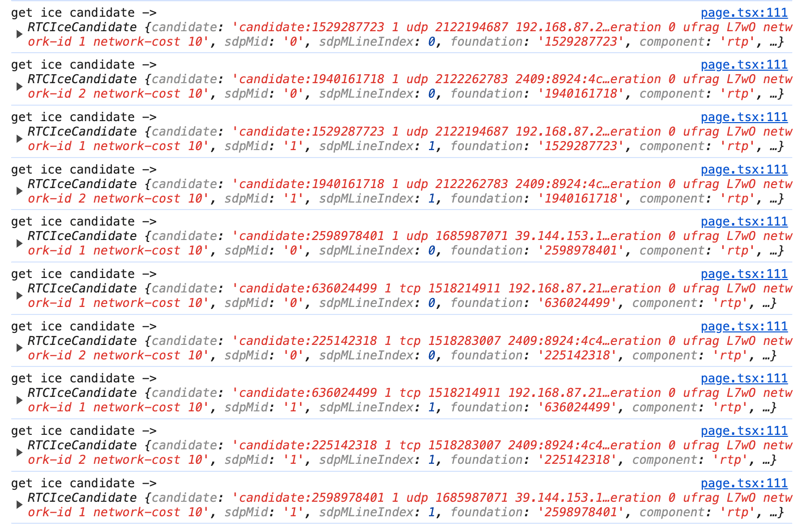
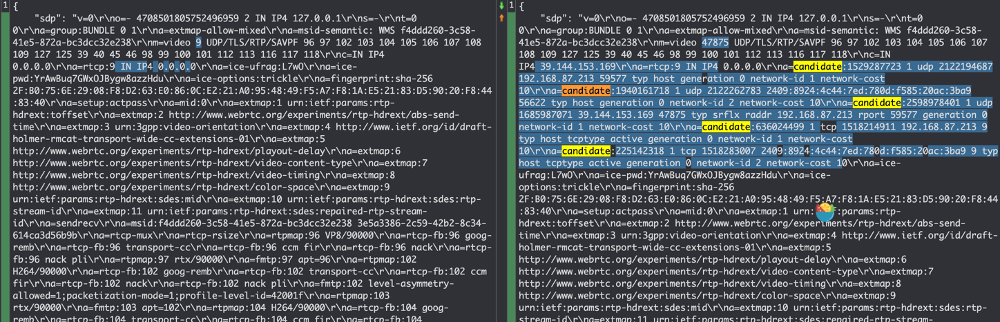
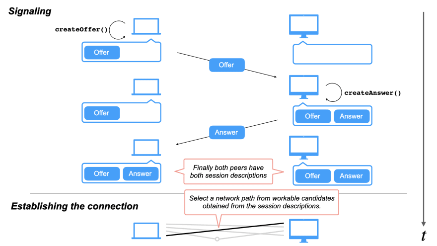
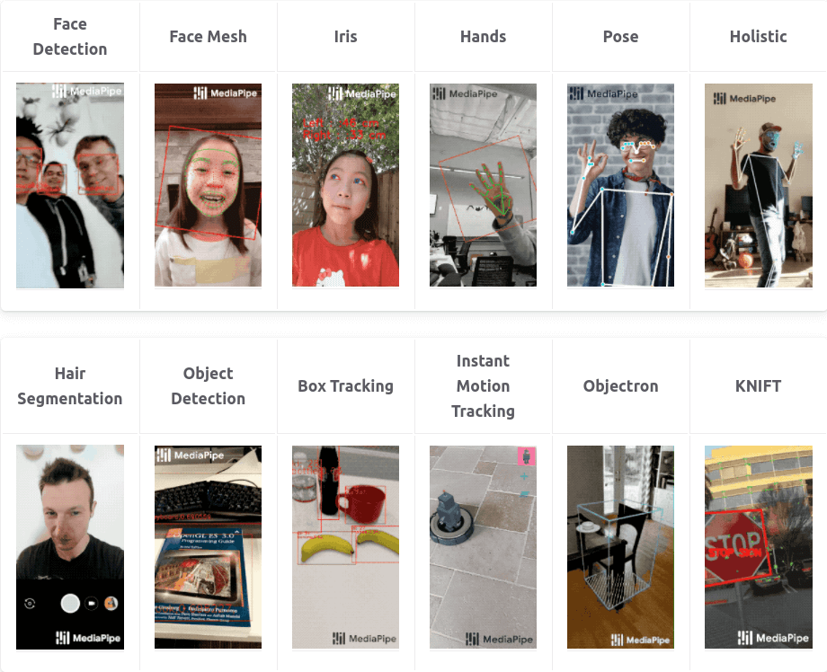
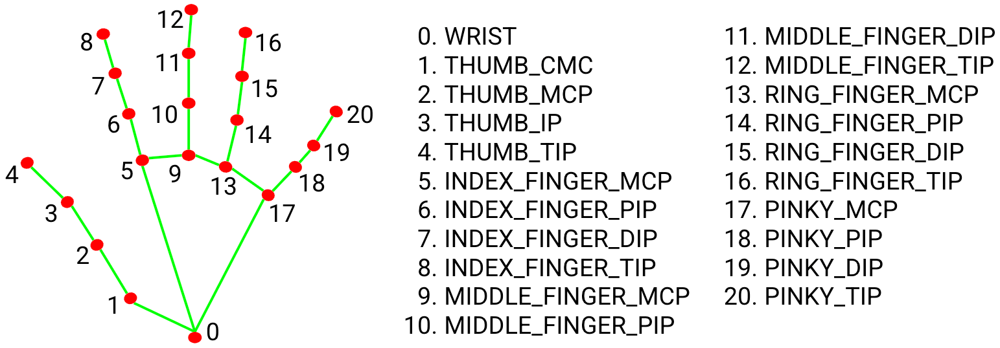
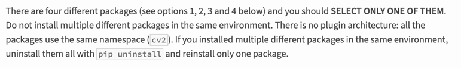

魔法盾（magic shield）指的是下面这位的，熟悉漫威的朋友肯定都见过，记得我第一次看到的时候感觉还挺酷的

<!--more-->

本文旨在记录并总结基于 WebRTC 和 MediaPipe 实现的上述 AR 魔法盾特效，主要内容包括：
- MediaPipe Hand LandMarker 模型的使用
- WebRTC 视频传输在前后端的实现
- 使用 OpenCV 对模型输出进行后处理

实际效果如下：最多可以同时检测2只手，当手张开到一定程度会显示魔法盾


**Demo地址：**[Next Web ML](https://next.regulusai.top/)（注：因服务端算力有限，已对客户端连接数量和连接时长作了限制）

### 一、环境与架构
#### 1.软硬件环境
| 硬件     | 配置                                          |
|--------|---------------------------------------------|
| VGA    | Quadro K620 (Memory 2G, 0.863 TFLOPS)       |
| CPU    | 9 x vCPU (Intel Xeon E312xx (Sandy Bridge)) |
| Memory | 12G                                         |
| SSD    | 160G                                        |

| 软件         | 版本              |
|------------|-----------------|
| OS         | CentOS 8 Stream |
| VGA Driver | 550.78          |
| CUDA       | 12.4            |
| OpenGL ES  | 3.2           
| Python     | 3.10.14        
| MediaPipe  | 0.10.14       
| Numpy      | 1.26       
| OpenCV     | 4.10.0.84       
| aiortc     | 1.9.0       
| fastapi    | 0.111.0      
| redis      | 5.0.3      

#### 2.架构

如上图，采用了一个典型的WebRTC架构，相较于前几次模型在client展开，这次将模型改到server端来推理。

通常，将模型部署到不同位置，会带来不一样的收益和问题：

| 模型位置   | 优点           | 缺点             |
|--------|--------------|----------------|
| client | 低延迟、低成本、隐私安全 | 性能限制           |
| server | 高性能、灵活扩展     | 较高延迟、较高成本、隐私问题 |

可以看到client和server两者是互补的，所以业界会大力倡导发展端侧性能或采用云端结合的方式。

当然，作为开发者，还会考虑到架构复杂度和软件生态的问题。经过几轮实践后，对于cv应用，站在前后端的角度来看，我感觉基于js或python的实现，各自也存在着明显的优势/痛点：

|        | 优势                  | 痛点                      |
|--------|---------------------|-------------------------|
| js     | 面向用户的ui构建和呈现方式更灵活多样 | cv或者说ai相关生态还不完善 |
| python | ai相关生态更丰富且完善        | 面向用户的ui构建和呈现方式不够灵活      |


所以这次决定将模型放到server端推理，综合了如下几点考量：
- 针对高延迟：了解到WebRTC可以较好地解决视频帧传输的延迟问题，值得尝试
- 针对高成本：mediapipe基于TFLite，模型对端侧设备（当前场景下指server）有较好的优化，低配置的server也可以运行推理
- 针对软件开发：由于当前AR效果需要相对复杂的post process，离不开opencv。尝试过一版基于opencv.js实现的纯client推理，目前的opencv.js需要手动内存管理，开发体验一般，有内存溢出的风险，而python的生态则更丰富和完善
- 针对架构：结合js和python各自优势，采用c/s架构。其实针对c/s架构，还额外考虑过让模型仍然运行在client，需要post process时，将数据给到server来处理，但这样就涉及到帧同步问题，而且当前[Web Worker对WebRTC DataChannel的支持还不够](https://github.com/w3c/webrtc-pc/issues/230)，实现起来有点复杂，且优势不明显，所以最终采用了更简洁的方式

### 二、WebRTC简介
#### 1.核心概念
##### （1）ICE
WebRTC本身是一种用于音视频传输的peer-to-peer的技术，但是现实世界中，网络较为复杂，存在各种软硬件的阻隔（防火墙、路由器、NAT等），导致端与端不一定能相互连上，这时候就需要ICE（Interactive Connectivity Establishment，交互式连接创建）的帮忙，来绕过这些限制，ICE的核心是STUN/TURN。

##### （2）STUN

STUN(Session Traversal Utilities for NAT, NAT会话穿越功能)，本质上就解决一个问题：**帮client找出他们的公网ip和port**。当两个client知道了自己的ip和port后，就可以相互直连进行通讯了，当然这是比较理想的情况

##### （3）Symmetric NAT 和 Cone NAT
Symmetric NAT 和 Cone NAT 都是网络地址转换（NAT）的一种类型，用于将内部网络上的私有地址转换为公网地址。

Cone NAT：在同一主机上，同一端口会被映射为相同的公网IP和端口。这意味着无论从哪个内部地址发起连接，NAT都会使用相同的外部端口号。

Symmetric NAT：每次请求一个新的外部地址时，NAT会分配一个新的外部端口号。即使是从同一个内部地址和端口发起的连接，每次请求也可能被映射到不同的外部端口号

下图列出了可能的NAT组合情况：


所以即使用上了stun server，还是存在无法绕过NAT的可能，这时候就需要turn出场了

##### （4）TURN

TURN(NAT中继穿越方式Traversal Using Relays around NAT)，用于在对等连接失败时中继流量，当然这样就需要消耗额外的资源和带宽，还有隐私风险，所以网上有很多公开免费的stun server，却很少有免费的turn server。

##### （5）Server的优势
将server作为peer的一个显著优势，是server通常情况下都是reachable的，也就是说可以没有turn。当然，在连接建立后，还会受到网络质量、通信距离、带宽等的影响，如何保持稳定的连接，就是另外一个话题了。

##### （6）SDP
会话描述协议Session Description Protocol (SDP), 是一个描述多媒体连接内容的协议，例如分辨率，格式，编码，加密算法等，在数据传输时让两端都能够理解彼此的数据。

#### 2.建立连接的流程
下面的代码部分：client webrtc用纯js实现（当然也可以选用[peerjs](https://peerjs.com/)等三方包），server使用python版[aiortc](https://github.com/aiortc/aiortc)实现

##### （1）client通过`navigator.mediaDevices.getUserMedia()`获取本地媒体
```javascript
const stream = await navigator.mediaDevices.getUserMedia({ video: true }); // 这里只获取摄像头权限
```

##### （2）client创建一个RTCPeerConnection，并添加一些listener
```javascript
const createPeerConnection = () => {
    console.log("createPeerConnection");
    const config = {
        sdpSemantics: "unified-plan",
        iceServers: [{ urls: [STUN_SERVER] }],
    };

    pc = new RTCPeerConnection(config);

    // register some listeners to help debugging
    pc.addEventListener(
        "icegatheringstatechange",
        () => {
            console.log("ice gathering state change ->", pc.iceGatheringState,
            );
        },
        false,
    );

    pc.addEventListener(
        "iceconnectionstatechange",
        () => {
            console.log("ice connection state change -->", pc.iceConnectionState,
            );
        },
        false,
    );

    pc.addEventListener(
        "signalingstatechange",
        () => {
            console.log("signaling state change -->", pc.signalingState);
        },
        false,
    );

    // connect audio / video
    pc.addEventListener("track", (evt) => {
        console.log("get backend track ->", evt);
        if (videoRef.current && evt.track.kind === "video")
            videoRef.current.srcObject = evt.streams[0];
    });
};
```

##### （3）client将音视频轨添加到PeerConnection中
```javascript
stream.getTracks().forEach((track) => {
        if (pc) {
          console.log("add track");
          pc.addTrack(track, stream);
        }
});
```
##### （4）client创建offer，并设置为本地sdp描述
```javascript
const offer = await pc.createOffer();
await pc.setLocalDescription(offer);
```

##### （5）client请求 STUN server 提供 ice 候选 (ice candidates)
stun server会返回多个ice候选，通过添加listener，我们可以看到相关信息：
```javascript
pc.addEventListener("icecandidate", (evt) => {
      if (evt.candidate) {
        console.log("get ice candidate ->", evt.candidate);
      }
});
```


单个candidate包含的信息如下：
```javascript
address:"192.168.87.213"
candidate:"candidate:1529287723 1 udp 2122194687 192.168.87.213 63733 typ host generation 0 ufrag L7wO network-id 1 network-cost 10"
component:"rtp"
foundation:"1529287723"
port:63733
priority:2122194687
protocol:"udp"
relatedAddress:null
relatedPort:null
relayProtocol:null
sdpMLineIndex:1
sdpMid:"1"
tcpType:null
type:"host"
url:null
usernameFragment:"L7wO"
```
##### （6）client会通过一套算法，对获得的candidates进行过滤筛选，然后添加到offer中
对比添加candidates前后的offer，可以看到这里有5个candidates被加了进来


##### （7）开始signaling信令交换，client通过某种方式将offer发给server
这里的“某种方式”，在协议中并没有强制规定，可以是http、websocket等，如下是使用fetch的示例：
```javascript
const response = await fetch(`${BACKEND_URL_PREFIX}webrtc/offer`, {
    body: JSON.stringify({
        sdp: finalOffer.sdp,
        type: finalOffer.type,
        video_transform: "shield",
    }),
    headers: {
        "Content-Type": "application/json",
    },
    method: "POST",
});
```

##### （8）server接收offer，并创建一个peerConnection
```python
@router.post("/offer", response_model=AnswerResponse)
async def handle_offer(req: OfferRequest, request: Request):
    offer = RTCSessionDescription(sdp=req.sdp, type=req.type)
    pc = RTCPeerConnection()
    pc_id = f"PeerConnection({uuid.uuid4()})"
```

##### （9）server为peerConnection设置一些listener
```python
@pc.on("connectionstatechange")
    async def on_connectionstatechange():
        logger.info(f"{pc_id} is {pc.connectionState}")

    @pc.on("track")
    def on_track(track):
        logger.info(f"Track {track.kind} received")

        @track.on("ended")
        async def on_ended():
            logger.info(f"Track {track.kind} ended")
```

##### （10）server将offer设置为远端sdp描述
```python
await pc.setRemoteDescription(offer)
```

##### （11）server创建answer，设置为本地sdp描述，并将answer返回给远端
```python
answer = await pc.createAnswer()
await pc.setLocalDescription(answer)
return {"sdp": pc.localDescription.sdp, "type": pc.localDescription.type}
```

##### （12）client接收到answer，将其设置为远端sdp描述
```javascript
const answer = await response.json();
await pc.setRemoteDescription(answer);
```
至此，signaling完成，client和server都保存了自己和对方的sdp描述信息

##### （13）建立p2p连接
根据双方收集到的ice candidates，测试连通性，选择最优路径，建立p2p连接，这一步是协议自动完成的。

webrtc建立连接的整个流程，可以用下图来表示：



#### 3.DataChannel
WebRTC中的DataChannel可以用来发送一些额外的数据，比如在视频会议中，可以发送文件或消息。

这里我是用来计算RTT和获取一些server端的资源信息：
```javascript
// client
const createDataChannel = () => {
    if (!pc) return;
    dc = pc.createDataChannel("shield", {ordered: false, maxRetransmits: 0});
    dc.addEventListener("close", () => {
        clearInterval(dcInterval);
        console.log("data channel closed");
    });
    dc.addEventListener("open", () => {
        console.log("data channel opened");
        dcInterval = window.setInterval(() => {
            const message = "ping " + performance.now();
            dc && dc.send(message);
        }, 1000);
    });
    dc.addEventListener("message", (evt) => {
        cnosole.log("server message", evt.data)
    })
}
```
```python
# server
@pc.on("datachannel")
    def on_datachannel(channel):
        @channel.on("message")
        def on_message(message):
            pcs[pc_id]["channel"] = channel  # 保存datachannel的引用
            if isinstance(message, str) and message.startswith("ping"):
                channel.send("pong" + message[4:] + f" {psutil.cpu_percent()} {len(pcs)}")
```

### 三、MediaPipe简介
#### 1.什么是MediaPipe？

MediaPipe是Google Research开发并开源的一款跨平台多媒体机器学习应用框架，用于构建基于机器学习的应用程序，特别是涉及到计算机视觉、音频处理、姿势估计等领域。

MediaPipe包括了MediaPipe Solution、MediaPipe Framework等。我这次用到的是Solution，它基于MediaPipe Framework构建，提供了很多现成的解决方案，如人脸检测、手势识别、姿态估计等，可以快速的集成到自己的应用中，并且支持多种平台，包括移动设备、桌面和网页。

#### 2.MediaPipe Hand Landmarker
该模型可以检测手部关键点，基于这些关键点信息，我们可以用来构建视觉渲染效果

根据上图，手点的英文可以归纳为：
- thumb【大拇指】，index【食指】，middle【中指】，ring【无名指】，pinky【小指】
- wrist【掌根】，mcp【指根】，tip【指尖】

模型返回的是一个二维数组，包含左手21个点的xyz坐标，右手21个点的xyz坐标

### 四、AR魔法盾实现
这里主要参考了油管上[这位up主](https://www.youtube.com/watch?v=LffHViW9mYA&list=PLWyN7K28ZraQHPw_PdT6IlFZ1XHOi5tpP&index=7)，并做了调整改进，主要区别在于：
- up主是用python在本地摄像头上实现的，我调整成了整合前端的webrtc方式
- up主后半段代码有些乱，我重新对结构进行了调整优化

#### 1.加载模型和魔法盾图片
```python
MODEL_PATH = f"{Path(__file__).parent.parent}/model/hand_landmarker.task"
SHIELD_1 = cv2.imread(f"{Path(__file__).parent.parent}/asserts/magic_circle_ccw.png", -1)
SHIELD_2 = cv2.imread(f"{Path(__file__).parent.parent}/asserts/magic_circle_cw.png", -1)
```
魔法盾的图片长这样：


#### 2.模型初始化
num_hands最多同时侦测2只手，Delegate可以选择CPU或GPU
```python
def init_detector(callback):
    logger.info("init detector")
    base_options = BaseOptions(model_asset_path=MODEL_PATH, delegate=BaseOptions.Delegate.GPU)
    options = HandLandmarkerOptions(base_options=base_options, running_mode=VisionRunningMode.LIVE_STREAM,
                                    num_hands=2,
                                    result_callback=callback)
    return HandLandmarker.create_from_options(options)
```

#### 3.opencv读取视频帧，并传入模型进行推理
```python
image = cv2.flip(frame, 1)
image_for_detect = mp.Image(image_format=mp.ImageFormat.SRGBA, data=cv2.cvtColor(image, cv2.COLOR_BGR2RGBA))

self.timestamp += 1
detector.detect_async(image_for_detect, self.timestamp)
```

#### 4.解析模型输出
```python
h, w, c = image.shape
for index, hand_landmark in enumerate(self.result.hand_landmarks):
    hand = self.hand0 if index == 0 else self.hand1

    # set hand landmarks data
    lm_list = []
    for idx, lm in enumerate(hand_landmark):
        coor_x, coor_y = int(lm.x * w), int(lm.y * h)
        lm_list.append([coor_x, coor_y])
    self.set_position_data(lm_list, hand)

def set_position_data(self, lmlist, hand):
    hand["wrist"] = (lmlist[0][0], lmlist[0][1])
    hand["thumb_tip"] = (lmlist[4][0], lmlist[4][1])
    hand["index_mcp"] = (lmlist[5][0], lmlist[5][1])
    hand["index_tip"] = (lmlist[8][0], lmlist[8][1])
    hand["midle_mcp"] = (lmlist[9][0], lmlist[9][1])
    hand["midle_tip"] = (lmlist[12][0], lmlist[12][1])
    hand["ring_tip"] = (lmlist[16][0], lmlist[16][1])
    hand["pinky_tip"] = (lmlist[20][0], lmlist[20][1])
```

#### 5.计算单只手的张开比例
手的张开比例ratio = hand_open距离 / hand_close距离

hand_open距离 = 食指指尖到小指指尖的距离，其实换成大拇指指尖应该也可以

hand_close距离 = 掌根到食指指根距离

```python
# calculate distance and ratio
ratio, hand_close, hand_open = self.calc_ratio(hand)

def calc_ratio(self, hand):
    wrist = hand["wrist"]
    index_mcp = hand["index_mcp"]
    index_tip = hand["index_tip"]
    pinky_tip = hand["pinky_tip"]
    hand_close = self.calc_distance(wrist, index_mcp)
    hand_open = self.calc_distance(index_tip, pinky_tip)
    return hand_open / hand_close, hand_close, hand_open
    
def calc_distance(self, p1, p2):
    x1, y1, x2, y2 = p1[0], p1[1], p2[0], p2[1]
    return ((x2 - x1) ** 2 + (y2 - y1) ** 2) ** (1.0 / 2)
```

#### 6.如果ratio在0.5～阈值之间，则显示手指连线；超过阈值则显示魔法盾
```python
# draw hand lines or show shield
if ratio and (0.5 < ratio < SHOW_SHIELD_RATIO):
    self.draw_hand_lines(image, hand)
if ratio and ratio > SHOW_SHIELD_RATIO:
    logger.info("show shield")
    x1, y1, diameter, shield_size = self.calc_shield_position(image, hand, hand_close)
    rotated1, rotated2 = self.get_rotated_image()
    if diameter != 0:
        image = self.transparent(rotated1, x1, y1, image, shield_size)
        image = self.transparent(rotated2, x1, y1, image, shield_size)
```

#### 7.计算魔法盾显示位置和尺寸
以中指指根为圆心坐标，手掌闭合时的距离放大一定比例作为直径，来计算出左上顶点的坐标，并保证直径和左上顶点不会超过图片的宽和高
```python
x1, y1, diameter, shield_size = self.calc_shield_position(image, hand, hand_close)

def calc_shield_position(self, image, hand, hand_close):
    midle_mcp = hand["midle_mcp"]
    center_x, center_y = midle_mcp
    diameter = round(hand_close * SHIELD_SCALE)
    x1 = round(center_x - (diameter / 2))  # shield left
    y1 = round(center_y - (diameter / 2))  # shield top
    h, w, c = image.shape
    if x1 < 0:
        x1 = 0
    elif x1 > w:
        x1 = w
    if y1 < 0:
        y1 = 0
    elif y1 > h:
        y1 = h
    if x1 + diameter > w:
        diameter = w - x1
    if y1 + diameter > h:
        diameter = h - y1
    shield_size = diameter, diameter
    return x1, y1, diameter, shield_size
```

#### 8.获取旋转一定角度的图片
self.deg是实例属性，ANG_VEL为角速度，搭配旋转矩阵和仿射变换，每次都可以让图片旋转一定角度
```python
def get_rotated_image(self):
    self.deg += ANG_VEL
    if self.deg > 360:
        self.deg = 0
    hei, wid, col = SHIELD_1.shape  # SHIELD_1和SHIELD_2尺寸相同
    cen = (wid // 2, hei // 2)
    M1 = cv2.getRotationMatrix2D(cen, round(self.deg), 1.0)
    M2 = cv2.getRotationMatrix2D(cen, round(360 - self.deg), 1.0)
    rotated1 = cv2.warpAffine(SHIELD_1, M1, (wid, hei))
    rotated2 = cv2.warpAffine(SHIELD_2, M2, (wid, hei))
    return rotated1, rotated2
```

#### 9.合成视频帧
根据计算出的shield_size，对shield img做resize，并取出alpha通道做中值模糊，作为后续合成的mask。

根据左上顶点坐标，在原图中裁剪出shield img大小的区域，作为背景；shield img则作为前景，两者进行图片合成

将合成后的图片重新填充回原始图片，然后作为视频帧返回
```python
def transparent(self, shield_img, x, y, image, size=None):
    if size is not None:
        shield_img = cv2.resize(shield_img, size)

    original_image = image.copy()
    b, g, r, a = cv2.split(shield_img)
    overlay_color = cv2.merge((b, g, r))
    mask = cv2.medianBlur(a, 1)
    h, w, _ = overlay_color.shape
    roi = original_image[y:y + h, x:x + w]

    img1_bg = cv2.bitwise_and(roi.copy(), roi.copy(), mask=cv2.bitwise_not(mask))
    img2_fg = cv2.bitwise_and(overlay_color, overlay_color, mask=mask)
    original_image[y:y + h, x:x + w] = cv2.add(img1_bg, img2_fg)

    return original_image
```
至此整个后处理过程完成，**完整代码可参考**：[前端](https://github.com/satorioh/next_web_ai) [后端](https://github.com/satorioh/next_web_ai_backend)

### 五、遇到的问题
#### 1.ImportError: libGL.so.1: cannot open shared object file: No such file or directory
python版opencv有4种包：opencv-python、opencv-contrib-python、opencv-python-headless、opencv-contrib-python-headless，[官方建议](https://pypi.org/project/opencv-python/)只安装4种中的1种。而mediapipe目前包含的是opencv-contrib-python，如果已经安装了其他版本的包，则可能会冲突

其实如果在server端使用opencv的话，官方更推荐headless版的，它不包含GUI功能，更小更轻量，但遗憾的是，mediapipe目前还未提供对headless包的支持：[相关issue](https://github.com/google-ai-edge/mediapipe/issues/3661)

#### 2.在云服务器上的ICE Connection Fails
ice通信需要用到udp端口，一开始没有在防火墙上开启，开启后就连接正常了：[相关信息](https://stackoverflow.com/questions/78659229/ice-connection-fails-to-complete-in-webrtc-application-on-aws-ec2-instance)

#### 3.No accelerated colorspace conversion found from yuv420p to bgr24
平台相关问题，在我的Mac M1上遇到了，而在云服务器上是好的。视频流在传输过程中用的yuv格式，而opencv在转码时用到了ffmpeg。根据目前查到的信息，Mac的ffmpeg在底层加速时用了quick time，似乎需要更新quick time才能解决。

#### 4.RuntimeWarning: As the c extension couldn't be imported, `google-crc32c` is using a pure python implementation that is significantly slower. If possible, please configure a c build environment and compile the extension
暂未解决

#### 5.Feedback manager requires a model with a single signature inference. Disabling support for feedback tensors
暂未解决

### 六、有待改进的地方
1.实际测试中，发现signaling花费的时间较长，存在优化空间

2.后端代码运行后，CPU和GPU占用率都很高，可以进一步优化，比如对待处理的视频帧进行缩小，减少计算的数据量

3.server端配置一般，算力有待提高

4.魔法盾的实现代码中，部分算法可以优化，个别阈值也是写死的，可以进一步调优

5.整体效果上，还可以用seg模型进行背景替换，比如换成卡玛泰姬或电影中的场景，会更逼真

### 七、思考
因为自己不玩抖音小红书之类的，所以一开始对于这种华而不实的AR特效并不关注，以为cv只能在工业领域用到，倒是老婆的一句“这多好玩啊”让我如梦初醒，想想当初，很大程度上，自己也是因为能亲手做出各种好玩的页面效果而选择转行前端，现在回过头来看，初衷原来如此简单纯粹。好玩，也许才是真正源源不断的内在驱动力。


参考文章：

[WebRTC 协议介绍](https://developer.mozilla.org/zh-CN/docs/Web/API/WebRTC_API/Protocols)

[WebRTC connectivity](https://developer.mozilla.org/zh-CN/docs/Web/API/WebRTC_API/Connectivity)

[Codecs used by WebRTC](https://developer.mozilla.org/en-US/docs/Web/Media/Formats/WebRTC_codecs)

[WebRTC NAT Traversal Methods: A Case for Embedded TURN](https://www.liveswitch.io/blog/webrtc-nat-traversal-methods-a-case-for-embedded-turn)

[Python WebRTC basics with aiortc](https://dev.to/whitphx/python-webrtc-basics-with-aiortc-48id)

[Add support for WebRTC Data Channel in Workers](https://github.com/w3c/webrtc-pc/issues/230)

[Python 手部特征点检测指南](https://ai.google.dev/edge/mediapipe/solutions/vision/hand_landmarker/python?hl=zh-cn)

[WEBRTC DATA CHANNELS](https://www.remcotukker.com/WebRTC-Data-Channels/)

[WebRTC with Python & React: Building Real-Time Communication Applications](https://www.videosdk.live/developer-hub/webrtc/webrtc-python)

[From Zero to Hero with WebRTC in JavaScript and Python in small snippets of code](https://medium.com/@iftimiealexandru/from-zero-to-hero-with-webrtc-in-javascript-and-python-in-small-snippets-of-code-part-1-1c4154d6ed9d)
