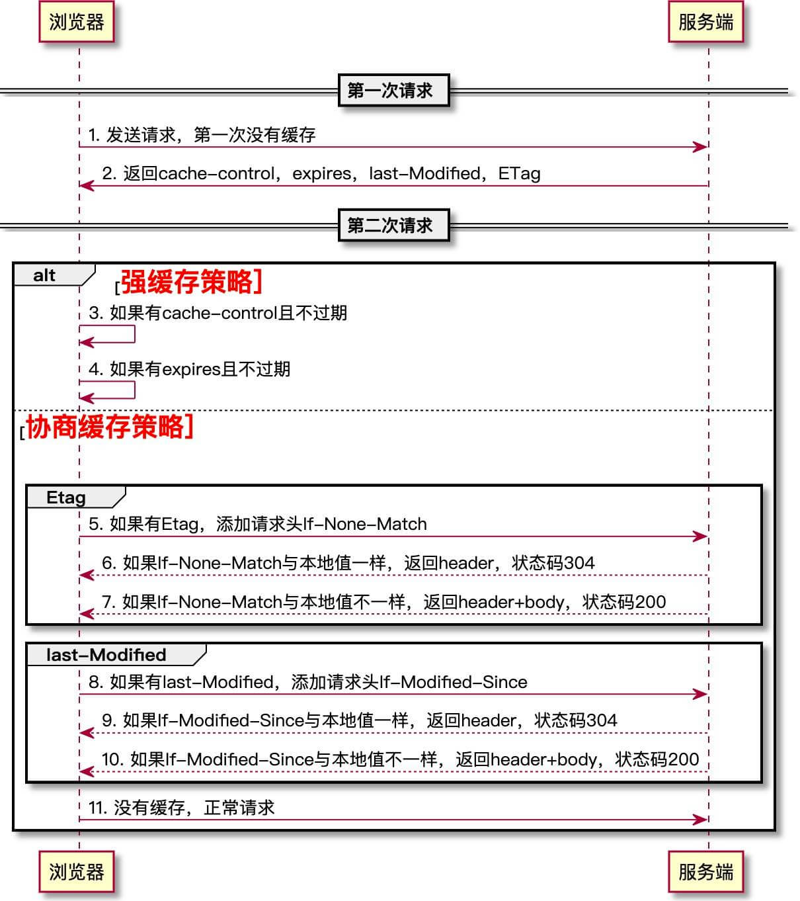

<!--more-->

#### 一、过程
##### 1.浏览器发送第一次请求：不缓存，服务端根据设定的缓存策略，返回相应的header：cache-control，expires，last-Modified，ETag。
##### 2.浏览器发送第二次请求：
**强缓存阶段：**
- 有cache-control且不过期。是：返回本地磁盘缓存，状态值200(from cache)；否：走下一步
- 有expires且不过期。是：返回本地磁盘缓存，状态值200(from cache)；否：走下一步

**协商缓存阶段**
- 有Etag。是的话请求头添加If-None-Match，值就是上次返回的Etag值，然后发送给服务端。服务端对比If-None-Match与现有的Etag值是否一样；一样的话只返回header，状态码304，浏览器从本地磁盘获取缓存信息；不一样走正常流程，返回header+body，状态码200。否：走下一步
- 有last-Modified。是的话添加请求头If-Modified-Since，值是上次返回的last-Modified，然后发送给服务端。服务端对比If-Modified-Since与现有的是否一样；一样的话返回只返回header，状态码304，浏览器从本地磁盘获取缓存信息；不一样走正常流程，返回header+body，状态码200。否：走下一步
- 没有缓存，正常请求

#### 二、HTTP缓存控制头字段
##### 1.Expires(响应头)
包含日期/时间， 即在此时候之后，响应过期。无效的日期，比如 0, 代表着过去的日期，即该资源已经过期。

示例：
```
Expires: Wed, 21 Oct 2015 07:28:00 GMT
```

##### 2.Cache-Control(请求/响应头)：优先级高于Expires
被用于在http请求和响应中，通过指定指令来实现缓存机制。缓存指令是单向的，这意味着在请求中设置的指令，不一定被包含在响应中。

常用的指令如下:

**public:** 该响应可以被任何对象缓存，该对象可以是中间代理或者是发送本请求的客户端。

**private:** 该响应可以被单个用户缓存，不可以被任何中间对象（如中间代理器）缓存。

**no-cache:** 当客户缓存了此响应，然后在再次使用此缓存之前，必须向服务器验证此缓存的有效性。值得注意的是，此指令也可以出现在请求头中。当此指令出现在请求头中时，表示客户端强制重新请求最新的服务器资源，而不使用缓存。

**no-store:** 任何对象（代理器和个人浏览器）不可以缓存该响应。

**max-age:** 在指定的时间内，客户端不应该再向浏览器请求该响应，而应该使用本地缓存

**s-maxage:** 覆盖max-age或者Expires头，但是仅适用于共享缓存(比如各个代理)，私有缓存会忽略它。

**must-revalidate:** 一旦资源过期（比如已经超过max-age），在成功向原始服务器验证之前，缓存不能用该资源响应后续请求。

##### 3.Pragma(响应头)
HTTP/1.0标准中定义，效果跟Cache-Control: no-cache相同，通常定义Pragma以向后兼容基于HTTP/1.0的客户端。

##### 4.Last-Modified(响应头)
其值为一个GMT日期（时间戳），指示请求的资源最后更改时间

示例：
```
Last-Modified: Wed, 21 Oct 2015 07:28:00 GMT
```

##### 5.ETag(响应头)：优先级高于Last-Modified
全称为entity-tag，是请求的文件的一个标识符，当文件被修改时，该标识符也会发生变化

如果用户再次访问给定的URL（设有ETag字段），显示资源过期了且不可用，客户端就发送值为ETag的If-None-Match header字段：
```
If-None-Match: "33a64df551425fcc55e4d42a148795d9f25f89d4"
```
服务器将客户端的ETag（作为If-None-Match字段的值一起发送）与其当前版本的资源的ETag进行比较，如果两个值匹配（即资源未更改），服务器将返回不带任何内容的304未修改状态，告诉客户端缓存版本可用（新鲜）。

##### 6.If-None-Match(请求头)：优先级高于If-Modified-Since
验证缓存的资源的 ETag 是否和服务器上的资源的 ETag 相匹配。匹配时，服务器返回304状态码。否则服务器返回200状态码，并向客户端发送请求的资源文件。

##### 7.If-Modified-Since(请求头)
验证缓存的资源在一个给定的时间后是否被修改过，此给定的时间来自服务器返回的 Last-Modified 响应头。如果资源在此时间后被修改过了，服务器会返回304状态码。否则服务器将返回200状态码，并向客户端发送请求的资源文件。

#### 三、缓存寿命计算
对于含有特定头信息的请求，会去计算缓存寿命。比如Cache-control: max-age=N的头，相应的缓存的寿命就是N。通常情况下，对于不含这个属性的请求则会去查看是否包含Expires属性，通过比较Expires的值和头里面Date属性的值来判断是否缓存还有效。如果max-age和expires属性都没有，找找头里的Last-Modified信息。如果有，缓存的寿命就等于头里面Date的值减去Last-Modified的值除以10


参考：
- [浏览器缓存策略与webpack持久化缓存](https://juejin.im/post/5df886896fb9a0161104cd45)
- [HTTP缓存机制详解](https://blog.wildcoder.me/2019/10/27/http-cache/)
- [MDN Cache-Control](https://developer.mozilla.org/zh-CN/docs/Web/HTTP/Headers/Cache-Control)
- [MDN Caching_FAQ](https://developer.mozilla.org/zh-CN/docs/Web/HTTP/Caching_FAQ)
- [RFC7234](https://tools.ietf.org/html/rfc7234)

