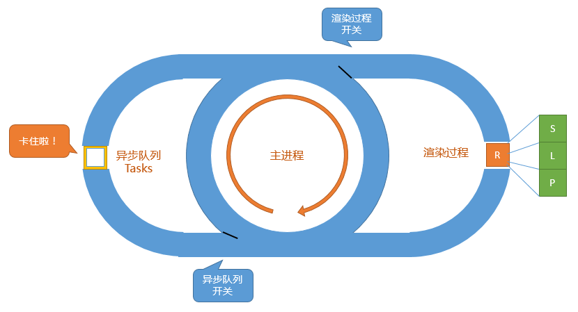

#### 一、基本执行流程
每次碰到异步操作，就把它添加到异步队列中，等待主进程为空（即没有同步代码需要执行了），就去执行异步队列，执行完成后再回到主进程。如果此时异步队列中有死循环，则会阻塞渲染进程

<!--more-->

#### 二、异步任务类型
##### 1.宏任务(Task/Macrotask)
- 特点：每次loop只执行一个
- 举例：setTimeout、setInterval

##### 2.微任务(Microtask)
- 特点：在当次loop的结尾立刻执行；执行并清空微任务队列，如果在微任务的执行中又加入了新的微任务，会一起执行；当存在宏任务时，优先执行微任务
- 举例：Promise.then()

##### 3.Animation callbacks
- 特点：不加入异步队列，而是加入渲染这一边的队列中，在渲染进程前执行；如果任务本身内部又新增 Animation callback 就不会当场执行了，因为那是下一个loop
- 举例：requestAnimationFrame

参考：

[浏览器的 Event Loop](https://juejin.im/post/5c32eb726fb9a049ee809e2f)

[事件循环机制的那些事](https://zhuanlan.zhihu.com/p/50356136)
