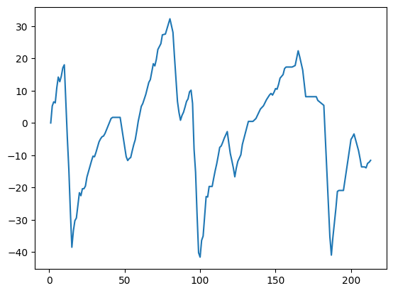

### 一、简介
正值巴黎奥运会来临之际，结合当下AI热点趋势，本文基于深度学习和数据分析技术，构建了一个简易的网球比赛视频分析系统，为广大体育爱好者，特别是专业球迷，能够借助AI和大数据赋能，实现科学看球、专业看球，提供便利。
<!--more-->

### 二、需求与功能
#### 1.需求分析
在传统赛事转播过程中，对于比赛数据的展示，存在如下局限性：
- 种类少：通常只会展示局分、大局分、赛点、时间等
- 有延迟：部分数据需要等待解说员或中场休息时才能看到
- 个性化：对于专业球迷，更多细分数据无法获取

#### 2.功能展示
当前系统实现的功能如下：
- 球员的实时追踪与标定
- 网球的实时预测与标定
- 球场 keypoints 的标定
- 迷你球场（mini court，右上角），使用上帝视角，全方位动态展示球场信息
- 数据看板（stats dashboard，右下角），可展示球员的即时球速、平均球速、即时移动速度、平均移动速度等

**效果展示**：
<iframe src="//player.bilibili.com/player.html?isOutside=true&aid=112771010134696&bvid=BV1FcbWeaEC6&cid=500001612596980&p=1&autoplay=0" scrolling="no" border="0" frameborder="no" framespacing="0" allowfullscreen="true"></iframe>


基于当前系统，后续还可扩展更多功能：
- 击球频率
- 击球位置
- 过界检测
- AR 特效

### 三、技术要点与难点
要点：
- 基于 YOLOv8 的球员检测与追踪
- 基于 YOLOv5 + 自定义数据集的网球检测
- 基于 Resnet50 + 自定义数据集的球场 keypoints 检测
- 使用 pandas 对网球运动轨迹的插值
- 使用 pandas 进行击球计算
- 使用 opencv 进行数据绘制和展示

难点：
- 小物体（网球）的检测
- keypoints 的检测
- 物理距离与像素距离的转换
- 击球帧的检测

**完整代码见**：[这里](https://github.com/satorioh/tennis_system)

### 四、实现过程
#### 1.球员追踪与标定
思路：player track model直接使用yolov8x，设置classes为 0 (person)进行检测，然后根据court keypoints，计算离keypoints距离最近的前两个person，即为players
```python
def detect_frame(self, frame):
    results = self.model.track(frame, persist=True, classes=[0])[0]

def get_choose_player_ids(self, court_keypoints, player_dict_from_first_frame):
    print("get choose player ids...")
    distances = []
    for track_id, bbox in player_dict_from_first_frame.items():
        player_center = get_center_of_bbox(bbox)

        min_distance = float('inf')
        court_keypoints_len = len(court_keypoints)
        for i in range(0, court_keypoints_len, 2):
            court_keypoint = (court_keypoints[i], court_keypoints[i + 1])
            distance = measure_distance(player_center, court_keypoint)
            if distance < min_distance:
                min_distance = distance
        distances.append((track_id, min_distance))
    # sort the distances in ascending order
    distances.sort(key=lambda x: x[1])
    return [i[0] for i in distances[:2]]
```


#### 2.网球检测与标定
ball detect model 基于 yolov5l6u pretrain model 进行 fine tune，数据集使用 [tennis-ball-detection](https://universe.roboflow.com/viren-dhanwani/tennis-ball-detection)，包含576张1280x720的网球比赛图片，跑100个epoch，结果如下：


中间oom了一次，resume回来继续跑。因为网球本身目标较小，所以training结果一般，后续通过插值方式来弥补检测时的不足。


#### 3.对网球运动轨迹进行插值
由于ball detect model准确度不是很高，有时无法检测到ball，比如下图第74帧：


考虑到ball在空中的飞行轨迹通常是一条直线，可以采用线性插值来填补未检测到的数据
```python
def interpolate_ball_positions(self, ball_positions):
    """
    :param ball_positions: [{}, {1: [895.4949340820312, 613.216064453125, 909.893798828125, 637.4019165039062]}, {}...]
    :return:
    """
    ball_positions = [position.get(1, []) for position in ball_positions]
    # convert the list into pandas dataframe
    df_ball_positions = pd.DataFrame(ball_positions, columns=['x1', 'y1', 'x2', 'y2'])
    # interpolate the missing values
    df_ball_positions = df_ball_positions.interpolate()
    df_ball_positions = df_ball_positions.bfill()  # fill the first missing value
    ball_positions = [{1: result} for result in df_ball_positions.to_numpy().tolist()]

    return ball_positions
```
插值后的结果：


#### 4.keypoints的检测
keypoints detect model 基于 Resnet50，使用pytorch搭建，数据集使用[TennisCourtDetector](https://github.com/yastrebksv/TennisCourtDetector)里提供的链接，包含8841张各式网球场的图片

create dataset:：
```python
class KeypointsDataset(Dataset):
    def __init__(self, img_dir, data_file):
        self.img_dir = img_dir
        with open(data_file, "r") as f:
            self.data = json.load(f)
        
        self.transforms = transforms.Compose([
            transforms.ToPILImage(),
            transforms.Resize((224, 224)),
            transforms.ToTensor(),
            transforms.Normalize(mean=[0.485, 0.456, 0.406], std=[0.229, 0.224, 0.225])
        ])
    
    def __len__(self):
        return len(self.data)
    
    def __getitem__(self, idx):
        item = self.data[idx]
        img = cv2.imread(f"{self.img_dir}/{item['id']}.png")
        h,w = img.shape[:2]

        img = cv2.cvtColor(img, cv2.COLOR_BGR2RGB)
        img = self.transforms(img)
        kps = np.array(item['kps']).flatten()
        kps = kps.astype(np.float32)

        kps[::2] *= 224.0 / w # Adjust x coordinates
        kps[1::2] *= 224.0 / h # Adjust y coordinates

        return img, kps
```
load dataset:
```python
train_dataset = KeypointsDataset("data/images","data/data_train.json")
val_dataset = KeypointsDataset("data/images","data/data_val.json")

train_loader = DataLoader(train_dataset, batch_size=8, shuffle=True)
val_loader = DataLoader(val_dataset, batch_size=8, shuffle=True)
```

create model:
```python
model = models.resnet50(pretrained=True)
model.fc = torch.nn.Linear(model.fc.in_features, 14*2) # Replaces the last layer
model = model.to(device)
```
train model:
```python
criterion = torch.nn.MSELoss()
optimizer = torch.optim.Adam(model.parameters(), lr=1e-4)

epochs=20
for epoch in range(epochs):
    for i, (imgs,kps) in enumerate(train_loader):
        imgs = imgs.to(device)
        kps = kps.to(device)

        optimizer.zero_grad()
        outputs = model(imgs)
        loss = criterion(outputs, kps)
        loss.backward()
        optimizer.step()

        if i % 10 == 0:
            print(f"Epoch {epoch}, iter {i}, loss: {loss.item()}")
            wandb.log({"epoch": epoch, "iter": i, "loss": loss.item()})
```
save model:
```python
torch.save(model.state_dict(), "keypoints_model.pth")
```
training 结果如下：


实际检测结果：可以看到存在误差，有优化空间


#### 5.迷你球场（mini court）
迷你球场，即以上帝视角，全方位动态展示球场信息，适用于大型场地比赛（比如网球、足球）。

实现思路：现实世界中的网球场是有标准尺寸定义的（如下图），通过将mini court的pixel size、player和ball的pixel position/move、现实世界的meter size三者相关联，达到互相转换并展示的目的


##### （1）在mini court上绘制 keypoints 和 lines:
```python
def draw_court(self, frame):
    drawing_key_points_len = len(self.drawing_key_points)
    for i in range(0, drawing_key_points_len, 2):
        x = int(self.drawing_key_points[i])
        y = int(self.drawing_key_points[i + 1])
        cv2.circle(frame, (x, y), 5, (0, 0, 255), -1)

    # draw Lines
    for line in self.lines:
        start_point = (int(self.drawing_key_points[line[0] * 2]), int(self.drawing_key_points[line[0] * 2 + 1]))
        end_point = (int(self.drawing_key_points[line[1] * 2]), int(self.drawing_key_points[line[1] * 2 + 1]))
        cv2.line(frame, start_point, end_point, (0, 0, 0), 2)

    # Draw net
    net_start_point = (
        self.drawing_key_points[0], int((self.drawing_key_points[1] + self.drawing_key_points[5]) / 2))
    net_end_point = (
        self.drawing_key_points[2], int((self.drawing_key_points[1] + self.drawing_key_points[5]) / 2))
    cv2.line(frame, net_start_point, net_end_point, (255, 0, 0), 2)

    return frame
```


##### （2）在mini court上绘制 player 和 ball:

核心方法如下：先将player/ball的pixel move 转换为 meter，再将 meter 转换为 mini court pixel size。之所以没有跳过meter，是考虑后续计算现实世界的物理量（比如speed）依然需要基于meter来实现
```python
def get_mini_court_coordinates(self,
                               object_position,
                               closest_court_key_point,
                               closest_court_key_point_index,
                               player_height_in_pixels,
                               player_height_in_meters
                               ):
    distance_from_keypoint_x_pixels, distance_from_keypoint_y_pixels = measure_xy_distance(object_position,
                                                                                           closest_court_key_point)
    # Convert pixel distance to meters
    distance_from_keypoint_x_meters = convert_pixel_distance_to_meters(distance_from_keypoint_x_pixels,
                                                                       player_height_in_meters,
                                                                       player_height_in_pixels
                                                                       )
    distance_from_keypoint_y_meters = convert_pixel_distance_to_meters(distance_from_keypoint_y_pixels,
                                                                       player_height_in_meters,
                                                                       player_height_in_pixels
                                                                       )
    # Convert to mini court coordinates
    mini_court_x_distance_pixels = self.convert_meters_to_pixels(distance_from_keypoint_x_meters)
    mini_court_y_distance_pixels = self.convert_meters_to_pixels(distance_from_keypoint_y_meters)

    # min court keypoint has the same order as the court keypoint
    closest_mini_court_keypoint = get_key_point_by_index(closest_court_key_point_index, self.drawing_key_points)

    mini_court_object_position = (closest_mini_court_keypoint[0] + mini_court_x_distance_pixels,
                                  closest_mini_court_keypoint[1] + mini_court_y_distance_pixels
                                  )

    return mini_court_object_position
```


#### 6.击球帧的确定
为了后续计算speed，需要先标定击球帧，即player何时击中的球

实现思路：通过在序列数据中计算ball的y坐标变化方向（delta_y），来确定ball在哪一刻被改变了方向（即被击中）

##### （1）将序列数据转换为dateFrame
```python
ball_positions = [position.get(1, []) for position in ball_positions]
# convert the list into pandas dataframe
df_ball_positions = pd.DataFrame(ball_positions, columns=['x1', 'y1', 'x2', 'y2'])
# interpolate the missing values
df_ball_positions = df_ball_positions.interpolate()
df_ball_positions = df_ball_positions.bfill()  # fill the first missing value
```

##### （2）以球心为y值，并使用滚动平均法来平滑数据
```python
df_ball_positions['mid_y'] = (df_ball_positions['y1'] + df_ball_positions['y2'])/2
df_ball_positions['mid_y_rolling_mean'] = df_ball_positions['mid_y'].rolling(window=5, min_periods=1, center=False).mean()
```
可以看到`mid_y_rolling_mean`有明显的周期性


另外，对比`mid_y`（红色），`mid_y_rolling_mean`（橙色）更平滑


##### （3）使用差分计算delta_y
```python
df_ball_positions['delta_y'] = df_ball_positions['mid_y_rolling_mean'].diff()
```

`delta_y`也有明显的规律

##### （4）观察击球的时刻
`delta_y` = 当前帧`mid_y` - 前一帧`mid_y`，具体的：
- 如果前一帧`delta_y`为正，当前帧`delta_y`为负，则说明球被击中（往上跑了）
- 如果前一帧`delta_y`为负，当前帧`delta_y`为正，则说明球被击中（往下跑了）

落到图上就是这样：


红点：代表击球的时刻

黄色圈圈：挺有意思的，一开始没想明白，后来看了视频，才恍然大悟


理论上球的飞行轨迹为直线，但是在球下落阶段其实是抛物线，而相机架在了正中间的上方，从这个角度来看，球下落过程中y值在增加，落地后弹起，y值又减小了，才有了黄圈那部分。突然想到之前在油管上看一位DS说过：“数据科学的有趣之处，就在于看到数据背后现实世界的人和事”，真是妙不可言

##### （5）使用算法定位击球帧
对于正常击球帧，就是通过检测`delta_y`的正负变化来确定。

而对于刚才黄圈部分，可以通过检测到击球帧 + 该帧后续的多少帧以内，都保持相同趋势，来屏蔽异常数据
```python
minimum_change_frames_for_hit = 25
for i in range(1, len(df_ball_positions) - int(minimum_change_frames_for_hit * 1.2)):
    negative_position_change = df_ball_positions['delta_y'].iloc[i] > 0 > df_ball_positions['delta_y'].iloc[
        i + 1]
    positive_position_change = df_ball_positions['delta_y'].iloc[i] < 0 < df_ball_positions['delta_y'].iloc[
        i + 1]

    if negative_position_change or positive_position_change:
        change_count = 0
        for change_frame in range(i + 1, i + int(minimum_change_frames_for_hit * 1.2) + 1):
            negative_position_change_following_frame = df_ball_positions['delta_y'].iloc[i] > 0 > \
                                                       df_ball_positions['delta_y'].iloc[change_frame]
            positive_position_change_following_frame = df_ball_positions['delta_y'].iloc[i] < 0 < \
                                                       df_ball_positions['delta_y'].iloc[change_frame]

            if negative_position_change and negative_position_change_following_frame:
                change_count += 1
            elif positive_position_change and positive_position_change_following_frame:
                change_count += 1

        if change_count > minimum_change_frames_for_hit - 1:
            df_ball_positions.loc[df_ball_positions.index[i], 'ball_hit'] = 1
```
#### 7.数据看板（stats dashboard）
确定击球帧后，通过定位两个击球帧之间，player和ball的状态变化量，就可以计算各种物理量了

##### （1）计算球的飞行时间
```python
# Get ball shot time
start_frame = ball_shot_frames[ball_shot_index]
end_frame = ball_shot_frames[ball_shot_index + 1]
ball_shot_time_in_seconds = (end_frame - start_frame) / constants.FPS
```

##### （2）计算球的飞行距离
```python
distance_covered_by_ball_pixels = measure_distance(ball_mini_court_detections[start_frame][1],
                                                           ball_mini_court_detections[end_frame][1])
distance_covered_by_ball_meters = convert_pixel_distance_to_meters(distance_covered_by_ball_pixels,
                                                                           constants.DOUBLE_LINE_WIDTH,
                                                                           mini_court.get_width_of_mini_court()
                                                                           )
```

##### （3）计算球速
```python
# Speed of the ball shot in km/h
speed_of_ball_shot = distance_covered_by_ball_meters / ball_shot_time_in_seconds * 3.6
```

##### （4）谁击中的球
思路：球被击中那一刻，谁离球最近，就是击球者
```python
# player who hit the ball
player_positions = player_mini_court_detections[start_frame]
ball_position = ball_mini_court_detections[start_frame][1]
player_shot_ball = get_closest_player_by_point(player_positions, ball_position)
```

##### （5）对手的跑动距离
```python
opponent_player_id = 1 if player_shot_ball == 2 else 2
distance_covered_by_opponent_pixels = measure_distance(
    player_mini_court_detections[start_frame][opponent_player_id],
    player_mini_court_detections[end_frame][opponent_player_id])
distance_covered_by_opponent_meters = convert_pixel_distance_to_meters(distance_covered_by_opponent_pixels,
                                                                       constants.DOUBLE_LINE_WIDTH,
                                                                       mini_court.get_width_of_mini_court()
                                                                       )
```
##### （6）对手的速度
```python
speed_of_opponent = distance_covered_by_opponent_meters / ball_shot_time_in_seconds * 3.6
```

还有各种想到想不到的物理量，就不一一例举了

#### 五、有待改进的地方
##### 1.ball detect model 有待改进
针对小目标的检测，还没有进一步研究过，目前能想到的比如通过数据增强、调整学习率、更换更适合的base model来提升准确度。另外，[这里](https://github.com/aash1999/yolov5-cbam)还找到一篇基于HIC-YOLOv5 CBAM的实现，有空研究下

##### 2.keypoints detect model 有待改进
给出数据集链接的[这个仓库](https://github.com/yastrebksv/TennisCourtDetector)，其实就做了更好的实现，通过使用不同的backbone，搭配2种postprocess来校正keypoints的位置:


##### 3.court keypoints只检测第一帧
默认机位不变的情况下，keypoints只使用视频第一帧来检测，之后就固定下来了，如果像上图那样机位带追踪的，则需要改为实时检测

##### 4.player id的确定
player id的确定，目前也是默认取第一帧中离court最近的两个人。如果第一帧中player不是离court最近（比如还没开始比赛），则会有问题

##### 5.把player和ball的检测用一个模型
这样就能提升效率，减少推理时间，而不是现在的分两个模型

#### 六、心得体会
整个项目的实现，参考了油管上这位[up](https://www.youtube.com/watch?v=L23oIHZE14w)主，和up主training的model相比，我这边ball detect model要好一些，而keypoints model则稍逊一筹。

其实在整个项目过程中，模型的training并没有花太多时间，而对于模型数据的使用、视频中有效数据的提取、解析和转化，则占了大部分时间，也让我对机器学习项目有了更全面的了解，同时认识到自己的一些不足，后续需要多实践多总结。

参考文章：

[Tennis Ball Detection_Dataset](https://universe.roboflow.com/viren-dhanwani/tennis-ball-detection)

[HIC-YOLOv5: Improved YOLOv5 for Small Object Detection](https://github.com/aash1999/yolov5-cbam)

[Build an AI/ML Tennis Analysis system with YOLO, PyTorch, and Key Point Extraction](https://www.youtube.com/watch?v=L23oIHZE14w)

[How to Detect Small Objects: A Guide](https://blog.roboflow.com/detect-small-objects/)

[Small Object Detection: An Image Tiling Based Approach](https://binginagesh.medium.com/small-object-detection-an-image-tiling-based-approach-bce572d890ca)
