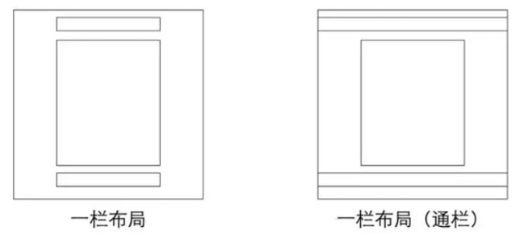
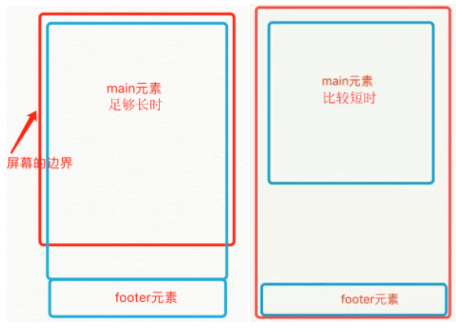

## 一、居中布局
### 1.水平居中
#### （1）text-align:center
- 父元素：块
- 子元素：块
```html
<div class="parent">
    <div class="child>DEMO</div>
</div>

.child{
    display:inline/inline-block;
}
.parent{
    text-align:center;
}
```
<!--more-->
- 优点：兼容性好，甚至可以兼容ie6、ie7
- 缺点：child里的文字也会水平居中，可以在.child添加text-align:left;还原

#### （2）margin:0 auto;
- 父元素：块
- 子元素：块
```html
<div class="parent">
    <div class="child>DEMO</div>
</div>

.child {
    width:100px;
    margin:0 auto;
}
```

#### （3）absolute + transform
- 父元素：块
- 子元素：块
```html
<div class="parent">
    <div class="child>DEMO</div>
</div>

.parent {
    position:relative;
}
.child {
    position:absolute;
    left:50%;
    transform:translateX(-50%);
}
```
- 优点：居中元素不会对其他的产生影响
- 缺点：transform属于css3内容，兼容性存在一定问题，高版本浏览器需要添加一些前缀

#### （4）flex + justify-content
- 父元素：块
```html
<div class="parent">
    <div class="child>DEMO</div>
</div>

.parent {
    display:flex;
    justify-content:center;
}
```
- 优点：设置parent即可
- 缺点：低版本浏览器(ie6 ie7 ie8)不支持

#### （5）浮动元素水平居中
- 父元素：块
- 子元素：块
```html
<div class="box">
    <p>我是浮动的</p>
    <p>我也是居中的</p>
</div>

.box{
    float:left;
    position:relative;
    left:50%;
}
p{
    float:left;
    position:relative;
    right:50%; //或left: -50%
}
```

### 2.垂直居中
#### （1）table-cell + vertical-align
- 父元素：块
- 子元素：块
```html
<div class="parent">
    <div class="child>DEMO</div>
</div>

.parent {
    display:table-cell;
    vertical-align:middle;
}
```
- 优点：兼容性较好，ie8以上均支持

#### （2）absolute + transform
- 父元素：块
- 子元素：块
```html
<div class="parent">
    <div class="child>DEMO</div>
</div>

.parent {
    position:relative;
}
.child {
    position:absolute;
    top:50%;
    transform:translateY(-50%);
}
```
- 优点：居中元素不会对其他的产生影响
- 缺点：transform属于css3内容，兼容性存在一定问题，高版本浏览器需要添加一些前缀

#### （3）absolute + margin:auto
- 父元素：块
- 子元素：块
```html
<div class="parent">
    <div class="child>DEMO</div>
</div>

.parent {
    position:relative;
}
.child {
    position:absolute;
    width: 100px;
    height: 100px;
    top:0;
    bottom:0;
    margin:auto;
}
```
- 优点：兼容性好

#### （4）flex + align-items
- 父元素：块
```html
<div class="parent">
    <div class="child>DEMO</div>
</div>

.parent {
    position:flex;
    align-items:center;
}
```
- 优点：只设置parent
- 缺点：兼容性问题

#### （5）line-height法
- 父元素：块，定高
- 子元素：单行的button、图片或者文本
```html
#father{
    height:100px;
    line-height:100px;
    background:#999;
}
```

#### （6）多行文本垂直居中
- 父元素：块
- 子元素：行
```html
.box {line-height:300px;}
.box>span {
    display:inline-block;
    line-height:normal;
    vertical-align:middle;
}
```

### 3.水平垂直居中
#### （1）absolute + transform
```html
<div class="parent">
    <div class="child>DEMO</div>
</div>

.parent {
    position:relative;
}
.child {
    position:absolute;
    left:50%;
    top:50%;
    transform:tranplate(-50%,-50%);
}
```

#### （2）inline-block + text-align + table-cell + vertical-align
```html
<div class="parent">
    <div class="child>DEMO</div>
</div>

.parent {
    text-align:center;
    display:table-cell;
    vertical-align:middle;
}
.child {
    display:inline-block;
}
```

#### （3）flex + justify-content + align-items
```html
<div class="parent">
    <div class="child>DEMO</div>
</div>

.parent {
    display:flex;
    justify-content:center;
    align-items:center;
}
```

#### （4）absolute + margin:auto
```html
<div class="parent">
    <div class="child>DEMO</div>
</div>

.parent {
    position:relative;
}
.child {
    position:absolute;
    width: 100px;
    height: 100px;
    top:0;
    bottom:0;
    left:0;
    right:0;
    margin:auto;
}
```

## 二、单列布局

### 1.一栏布局
通过对header,content,footer统一设置width：1000px;或者max-width：1000px(这两者的区别是当屏幕小于1000px时，前者会出现滚动条，后者则不会，显示出实际宽度);然后设置margin:auto实现居中即可得到
```html
<div class="header"></div>
<div class="content"></div>
<div class="footer"></div>
```
```css
.header{
    margin:0 auto; 
    max-width: 960px;
    height:100px;
    background-color: blue;
}
.content{
    margin: 0 auto;
    max-width: 960px;
    height: 400px;
    background-color: aquamarine;
}
.footer{
    margin: 0 auto;
    max-width: 960px;
    height: 100px;
    background-color: aqua;
}
```

### 2.一栏布局(通栏)
header、footer的内容宽度不设置，块级元素充满整个屏幕，但header、content和footer的内容区设置同一个width，并通过margin:auto实现居中
```html
<div class="header">
    <div class="nav"></div>
</div>
<div class="content"></div>
<div class="footer"></div>
```
```css
.header{
    margin:0 auto;
    max-width: 960px;
    height:100px;
    background-color: blue;
}
.nav{
    margin: 0 auto;
    max-width: 800px;
    background-color: darkgray;
    height: 50px;
}
.content{
    margin: 0 auto;
    max-width: 800px;
    height: 400px;
    background-color: aquamarine;
}
.footer{
    margin: 0 auto;
    max-width: 960px;
    height: 100px;
    background-color: aqua;
}
```

## 三、多列布局
### 1.两栏布局
#### （1）float + overflow(BFC)
```html
<div class="parent">
    <div class="left">
        <p>left</p>
    </div>
    <div class="right">
        <p>right</p>
        <p>right</p>
    </div>
</div>

.left {
    float:left;
    width:100px;
    margin-right:20px;
}
.right {
    overflow:hidden;
}
```
- 优点：简单
- 缺点：不支持IE6

#### （2）float + margin/padding
```html
<div class="parent">
    <div class="left">
        <p>left</p>
    </div>
    <div class="right">
        <p>right</p>
        <p>right</p>
    </div>
</div>

.left {
    float:left;
    width:100px;
}
.right {
    margin-left/padding-left:120px;
}
```
- 优点：简单，容易理解
- 缺点：兼容性存在一定问题，ie6下有3px的bug。right下的p清除浮动将产生bug

#### （3）table
```html
<div class="parent">
    <div class="left">
        <p>left</p>
    </div>
    <div class="right">
        <p>right</p>
        <p>right</p>
    </div>
</div>

.parent {
    display:table;
    width:100%;
    table-layout:fixed;//提升表格渲染加载速度
}
.left {
    width:100px;
}
.right,.left {
    display:table-cell;    
}
```

#### （4）flex
```html
<div class="parent">
    <div class="left">
        <p>left</p>
    </div>
    <div class="right">
        <p>right</p>
        <p>right</p>
    </div>
</div>

.parent {
    display:flex;
}
.left {
    width:100px;
    margin-right:20px;
}
.right {
    flex:1;
}
```

### 2. 三栏布局
#### （1）float + overflow(BFC)
```html
<div class="parent">
    <div class="left">
        <p>left</p>
    </div>
    <div class="center">
        <p>center</p>
    </div>
    <div class="right">
        <p>right</p>
        <p>right</p>
    </div>
</div>

.left,.center {
    float:left;
    width:100px;
    margin-right:20px;
}
.right {
    overflow:hidden;
}
```

#### （2）圣杯布局
**原理：**

a. 外面一个container，里面三个div(middle要在前，left , right)，height都设为100%

b. 三个div都浮动

c. middle宽度100%，left: margin-left:-100%拉上来，right:margin-left:-自身宽度拉上来，但会遮盖middle两边

d. container加左右padding留空间，left和right相对定位，往左右拉开，即可
```html
<!doctype html>
<html>
<head>
  <meta charset="UTF-8">
  <title>Document</title>
  <style>
    html,body {
      margin:0;
      height:100%;
    }
    h1 {
      margin:0;
    }
    #main {
      height: 100%;
      overflow: auto;
      padding: 0 200px;
    }
    #main #middle {
      float: left;
      width: 100%;
      height: 100%;
      background-color: green;
    }
    #left,#right {
      float: left;
      width: 200px;
      height: 100%;
      background-color: yellow;
    }
    #left{
      margin-left: -100%;
      position: relative;
      left: -200px;
    }
    #right{
      position: relative;
      right: -200px;
      margin-left: -200px;
    }
  </style>
</head>
<body>
<div id="main">
  <div id="middle">
    <h1>Main content</h1>
    <p>Lorem ipsum dolor sit amet, consectetur adipisicing elit, sed do eiusmod tempor incididunt ut labore et dolore magna aliqua. Ut enim ad Excepteur sint occaecat cupidatat non proident, sunt in culpa qui officia deserunt mollit anim id est laborum.</p>
  </div>

<div id="left">
  <h1>Left sidebar</h1>
  <p>Lorem ipsum dolor sit amet, consectetur adipisicing elit, sed do eiusmod tempor incididunt ut labore et dolore magna aliqua. Ut enim ad minim veniam, quis nostrud exercitation ullamco laboris nisi ut aliquip ex ea commodo consequat. Duis aute irure dolor in reprehenderit in voluptate velit esse cillum dolore eu fugiat nulla pariatur. Excepteur sint occaecat cupidatat non proident, sunt in culpa qui officia deserunt mollit anim id est laborum.</p>
</div>
<div id="right">
  <h1>Right sidebar</h1>
  <p>Lorem ipsum dolor sit amet, consectetur adipisicing elit, sed do llum dolore eu fugiat nulla pariatur. Excepteur sint occaecat cupidatat non proident, sunt in culpa qui officia deserunt mollit anim id est laborum.</p>
</div>
</div>
</body>
</html>
```
**缺点：**
- center部分的最小宽度不能小于left部分的宽度，否则会left部分掉到下一行
- 如果其中一列内容高度拉长，其他两列的背景并不会自动填充

#### （3）双飞翼布局
**原理：**

a.外面一个container，middle,left,right三个div，middle要加一个wrap div，height都设为100%

b. 三个div都浮动

c. middle宽度100%，left: margin-left:-100%拉上来，right:margin-left:-自身宽度拉上来，但会遮盖middle两边

d.middle加左右margin来留空间
```html
<!doctype html>
<html>
<head>
  <meta charset="UTF-8">
  <title>Document</title>
  <style>
    html,body {
      margin:0;
      height:100%;
    }
    h1 {
      margin:0;
    }
    #main {
      overflow: auto;
      height: 100%;
    }
    #main #wrap {
      float: left;
      width: 100%;
      height: 100%;
      background-color: green;
    }
    #left,#right {
      float: left;
      height: 100%;
      width: 200px;
      background-color: yellow;
    }
    #left{
      margin-left: -100%;
    }
    #right{
      margin-left: -200px;
    }
    #middle {
      margin: 0 200px;
    }
  </style>
</head>
<body>
<div id="main">
  <div id="wrap">
  <div id="middle">
    <h1>Main content</h1>
    <p>Lorem ipsum dolor sit amet, consectetur adipisicing elit, sed do eiusmod tempor incididunt ut labore et dolore magna aliqua. Ut enim ad Excepteur sint occaecat cupidatat non proident, sunt in culpa qui officia deserunt mollit anim id est laborum.</p>
  </div>
</div>
<div id="left">
  <h1>Left sidebar</h1>
  <p>Lorem ipsum dolor sit amet, consectetur adipisicing elit, sed do eiusmod tempor incididunt ut labore et dolore magna aliqua. Ut enim ad minim veniam, quis nostrud exercitation ullamco laboris nisi ut aliquip ex ea commodo consequat. Duis aute irure dolor in reprehenderit in voluptate velit esse cillum dolore eu fugiat nulla pariatur. Excepteur sint occaecat cupidatat non proident, sunt in culpa qui officia deserunt mollit anim id est laborum.</p>
</div>
<div id="right">
  <h1>Right sidebar</h1>
  <p>Lorem ipsum dolor sit amet, consectetur adipisicing elit, sed do llum dolore eu fugiat nulla pariatur. Excepteur sint occaecat cupidatat non proident, sunt in culpa qui officia deserunt mollit anim id est laborum.</p>
</div>
</div>
</body>
</html>
```
**缺点：**
- 多加一层 dom 树节点，增加渲染树生成的计算量

#### （4）浮动布局
**原理：**

a.三个div分别按left、right、middle放置

b.left左浮动，right右浮动

c.middle通过添加左右外边距来留空间
```html
<!doctype html>
<html>
<head>
  <meta charset="UTF-8">
  <title>Document</title>
  <style>
    html,body {
      margin:0;
      height:100%;
    }
    h1 {
      margin:0;
    }
    #main {
      height:100%;
      background:orange;
      /*margin:0 210px;*/
    }
    #left,#right {
      width:200px;
      height:100%;
      background:green;
    }
    #left{
      float:left;
    }
    #right{
      float:right;
    }
  </style>
</head>
<body>

<div id="left">
  <h1>Left sidebar</h1>
  <p>Lorem ipsum dolor sit amet, consectetur adipisicing elit, sed do eiusmod tempor incididunt ut labore et dolore magna aliqua. Ut enim ad Excepteur sint occaecat cupidatat non proident, sunt in culpa qui officia deserunt mollit anim id est laborum.</p>
</div>
<div id="right">
  <h1>Right sidebar</h1>
  <p>Lorem ipsum dolor sit amet, consectetur adipisicing elit, sed do eiusmod tempor incididunt ut labore et dolore magna aliqua. Ut enim ad minim veniam, quis nostrud exercitation ullamco laboris nisi ut aliquip ex ea commodo consequat. Duis aute irure dolor in reprehenderit in voluptate velit esse cillum dolore eu fugiat nulla pariatur. Excepteur sint occaecat cupidatat non proident, sunt in culpa qui officia deserunt mollit anim id est laborum.</p>
</div>
<div id="main">
  <h1>Main content</h1>
  <p>Lorem ipsum dolor sit amet, consectetur adipisicing elit, sed do llum dolore eu fugiat nulla pariatur. Excepteur sint occaecat cupidatat non proident, sunt in culpa qui officia deserunt mollit anim id est laborum.</p>
</div>
</body>
</html>
```
#### （5）flex布局
```html
<!DOCTYPE html>
<html lang="en">
<head>
    <style>
    .container {
            display: flex;
    }
    .main {
            flex-grow: 1;
        height: 300px;
        background-color: red;
    }
    .left {
        order: -1;
        flex: 0 1 200px;
        margin-right: 20px;
        height: 300px;
        background-color: blue;
    }
    .right {
        flex: 0 1 100px;
            margin-left: 20px;
        height: 300px;
        background-color: green;
    }
    </style>
</head>
<body>
    <div class="container">
    <div class="main"></div>
    <div class="left"></div>
    <div class="right"></div>
    </div>
</body>
</html>
```

#### （6）table布局
```html
<!DOCTYPE html>
<html lang="en">
<head>
    <style>
        .container {
        display: table;
        width: 100%;
        }
        .left, .main, .right {
        display: table-cell;
        }
        .left {
        width: 200px;
        height: 300px;
        background-color: red;
        }
        .main {
        background-color: blue;
        }
        .right {
        width: 100px;
        height: 300px;
        background-color: green;
        }
    </style>
</head>
<body>
    <div class="container">
    <div class="left"></div>
    <div class="main"></div>
    <div class="right"></div>
    </div>
</body>
</html>
```

## 四、等分布局
#### （1）float + box-sizing
```html
<div class="parent">
    <div class="column"><p>1</p></div>
    <div class="column"><p>2</p></div>
    <div class="column"><p>3</p></div>
    <div class="column"><p>4</p></div>
</div>

.parent{
    margin-left: -20px;//l增加g
}
.column{
    float: left;
    width: 25%;
    padding-left: 20px;
    box-sizing: border-box;//包含padding区域 w+g
}
```

#### （2）table
```html
<div class="parent-fix">
    <div class="parent">
        <div class="column"><p>1</p></div>
        <div class="column"><p>2</p></div>
        <div class="column"><p>3</p></div>
        <div class="column"><p>4</p></div>
    </div>
</div>

.parent-fix{
    margin-left: -20px;//l+g
}
.parent{
    display: table;
    width:100%;
    table-layout: fixed;
}
.column{
    display: table-cell;
    padding-left: 20px;//w+g
}
```
#### （3）flex
```html
<div class="parent">
    <div class="column"><p>1</p></div>
    <div class="column"><p>2</p></div>
    <div class="column"><p>3</p></div>
    <div class="column"><p>4</p></div>
</div>

.parent{
    display: flex;
}
.column{
    flex: 1;
}
.column+.column{
    margin-left:20px;
}
```

## 五、等高布局
#### (1)正padding+负margin
在圣杯布局基础上：
```css
      .center,
      .left,
      .right {
        padding-bottom: 10000px;
        margin-bottom: -10000px;
      }
      .container {
        padding-left: 220px;
        padding-right: 220px;
        overflow: hidden;//把溢出背景切掉
      }
```

#### (2)table布局
```html
<div class="container table">
      <div class="containerInner tableRow">
        <div class="column tableCell cell1">
          <div class="left aside">
            ....
          </div>
        </div>
        <div class="column tableCell cell2">
          <div class="content section">
            ...
          </div>
        </div>
        <div class="column tableCell cell3">
          <div class="right aside">
            ...
          </div>
        </div>
      </div>
    </div>
```
```css
.table {
  width: auto;
  min-width: 1000px;
  margin: 0 auto;
  padding: 0;
  display: table;
}
.tableRow {
  display: table-row;
}
.tableCell {
  display: table-cell;
  width: 33%;
}
.cell1 {
  background: #f00;
  height: 800px;
}
.cell2 {
  background: #0f0;
}
.cell3 {
  background: #00f;
}
```

#### (3)边框和定位
```html
<div id="wrapper">
    <div id="mainContent">...</div>
    <div id="sidebar">...</div>
</div>
```
```css
#wrapper {
  width: 960px;
  margin: 0 auto;
}
#mainContent {
  border-right: 220px solid #dfdfdf;
  position: absolute;
  width: 740px;
  height: 800px;  
  background: green;
}
#sidebar {
  background: #dfdfdf;
  margin-left: 740px;
  position: absolute;
  height: 800px;
  width: 220px;
}
```

## 六、粘连布局


**特点：**
- 有一块内容main，当main的高度足够长的时候，紧跟在main后面的元素footer会跟在main元素的后面
- 当main元素比较短的时候(比如小于屏幕的高度),我们期望这个footer元素能够“粘连”在屏幕的底部

**步骤：**
- footer必须是一个独立的结构，与wrap没有任何嵌套关系
- wrap区域的高度通过设置min-height，变为视口高度
- footer要使用margin为负来确定自己的位置
- 在main区域需要设置 padding-bottom。这也是为了防止负 margin 导致 footer 覆盖任何实际内容

```html
<div id="wrap">
      <div class="main">
        main <br />
        main <br />
        main <br />
      </div>
</div>
<div id="footer">footer</div>
```
```css
 * {
        margin: 0;
        padding: 0;
      }
      html,
      body {
        height: 100%;//高度一层层继承下来
      }
      #wrap {
        min-height: 100%;
        background: pink;
        text-align: center;
        overflow: hidden;
      }
      #wrap .main {
        padding-bottom: 50px;
      }
      #footer {
        height: 50px;
        line-height: 50px;
        background: deeppink;
        text-align: center;
        margin-top: -50px;
      }
```

参考链接：

[CSS布局解决方案（终结版）](https://segmentfault.com/a/1190000013565024)

[我熟知的三种三栏网页宽度自适应布局方法](http://www.zhangxinxu.com/wordpress/2009/11/%E6%88%91%E7%86%9F%E7%9F%A5%E7%9A%84%E4%B8%89%E7%A7%8D%E4%B8%89%E6%A0%8F%E7%BD%91%E9%A1%B5%E5%AE%BD%E5%BA%A6%E8%87%AA%E9%80%82%E5%BA%94%E5%B8%83%E5%B1%80%E6%96%B9%E6%B3%95/)

[几种常见的CSS布局](https://segmentfault.com/a/1190000016956641)