#### 1.echarts元素样式
```css
#scoreLine {
    width: 100%;
    height: 280px;
    padding: 0 40px;
    box-sizing: border-box;
}
```
<!--more-->

#### 2.柱状图-当数据较多时，动态调整bar间距
```javascript
this.$nextTick(() => {
    let len = this.compareImgData.length
    let ele = document.getElementById('indexCompareBar')
    if (len > 15) {
        let barChart = echarts.init(ele)
        barChart.setOption(option)

        setTimeout(function (){
            ele.style.height = len * 20 + 'px'
            barChart.resize()
        },200)
    } else {
        if (len > 0) {
            let barChart = echarts.init(ele)
            barChart.setOption(option)
            setTimeout(function (){
                ele.style.height = 400 + 'px'
                barChart.resize()
            },200)
        }
    }
})
```

#### 3.强制显示坐标轴label(不间隔隐藏)
```javascript
xAxis: {
    type: 'category',
    boundaryGap: true,
    data: param.examName,
    axisLabel: {
        interval:'0',
    }
}
```

#### 4.折线图dataZoom设置
```javascript
let dataZoom = []
    if (param.date.length > 10) {
        dataZoom.push({
        type: 'slider',
        start : 85,  //伸缩条开始位置（1-100），可以随时更改
        end : 100,  //伸缩条结束位置（1-100），可以随时更改
    })
}
let option = {
	dataZoom:dataZoom,
}
```

#### 5.legend点击事件
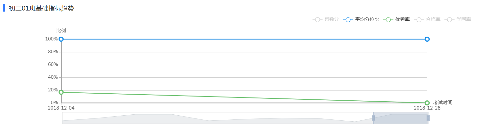
```javascript
lineChart.on('legendselectchanged', function(obj) {
          let selected = obj.selected
          let legend = obj.name
          if (selected != undefined) {
            if (legend == '系数分' && selected['系数分']) {
              for (let key in selected) {
                if (key == '系数分') continue
                selected[key] = false
              }
              self.trendSeries = 1
              self.yAxis[0].name = '分数'
              self.yAxis[0].axisLabel.formatter = '{value}'
            } else {
              selected['系数分'] = false
              self.trendSeries = 0
              self.yAxis[0].name = '比例'
              self.yAxis[0].axisLabel.formatter = '{value}%'
            }
            self.legend.selected = selected
            self.$nextTick(()=>{
              lineChart.clear()
              lineChart.setOption(option)
            })
          }
        })
```

#### 6.折线图
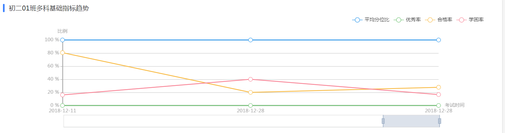
```javascript
classIndextrendData (val) {
        let param = {
          examName:[],
          date:[],
          averageScore:[],
          excelRate:[],
          passRate:[],
          tiredRate:[],
        }
        for (let item of val) {
          param.date.push(util.formatDate(item.createTime))
          param.examName.push('考试名称：' + item.name)
          param.averageScore.push(parseFloat(item.bitRatio * 100).toFixed(2))
          param.excelRate.push(parseFloat(item.excelRate))
          param.passRate.push(parseFloat(item.passRate))
          param.tiredRate.push(parseFloat(item.tiredRate))
        }

        let dataZoom = []
        if (param.date.length > 10) {
          dataZoom.push({
            type: 'slider',
            start : 85,  //伸缩条开始位置（1-100），可以随时更改
            end : 100,  //伸缩条结束位置（1-100），可以随时更改
          })
        }

        let options = {
          tooltip : {
            trigger: 'axis',
            formatter:function (resp) {
              // console.log(resp)
              let res = `<p>${resp[0].data}</p>`
              for (let i = 1; i < resp.length; i++) {
                let item = resp[i]
                res += `<p>${item.marker}${item.seriesName} : ${item.data}%</p>`
              }
              return res
            }
          },
          legend: {
            data:['平均分位比','优秀率','合格率','学困率'],
            x: 'right'
          },
          toolbox: {
            show : true
          },
          dataZoom:dataZoom,
          calculable : true,
          xAxis : [
            {
              name: '考试时间',
              type : 'category',
              boundaryGap : false,
              axisLine: {
                lineStyle: {
                  type: 'solid',
                  color: '#aaa',
                  width: '2'
                }
              },
              axisLabel: {
                textStyle: {
                  color: '#aaa'
                }
              },
              data : param.date
            }
          ],
          yAxis : [
            {
              name: '比例',
              type : 'value',
              axisLine: {
                lineStyle: {
                  type: 'solid',
                  color: '#aaa',
                  width: '2'
                }
              },
              axisLabel: {
                formatter: '{value} %'
              }
            }
          ],
          series : [
            {
              name:'考试名称',
              symbol:'none',
              type:'line',
              data:param.examName
            },
            {
              name:'平均分位比',
              type:'line',
              symbolSize: 10,
              itemStyle:{
                normal:{
                  color:'#2393eb'
                }
              },
              data:param.averageScore
            },
            {
              name:'优秀率',
              type:'line',
              symbolSize: 10,
              itemStyle:{
                normal:{
                  color:'#6dc171'
                }
              },
              data:param.excelRate
            },
            {
              name:'合格率',
              type:'line',
              symbolSize: 10,
              itemStyle:{
                normal:{
                  color:'#f8bb46'
                }
              },
              data:param.passRate
            },
            {
              name:'学困率',
              type:'line',
              symbolSize: 10,
              itemStyle:{
                normal:{
                  color:'#f88496'
                }
              },
              data:param.tiredRate
            }
          ]
        }
        let lineChart = echarts.init(document.getElementById('scoreLine'))
        this.$nextTick(() => {
          lineChart.setOption(options)
        })
      }
```

#### 7.倾斜x轴标签，防止拥挤
```javascript
xAxis : [
	axisLabel: {
        interval:0,
        rotate: param.date.length > 8 ? 20 : 0,
        textStyle: {
            color: '#666'
        }
    },
]
```

#### 8.环形图
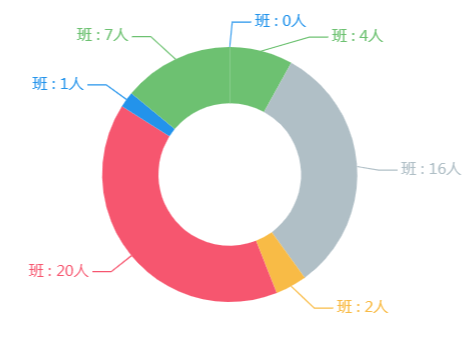
```javascript
let hardDegreeOptions = {
          data: [],
          tip: '{b}：{c}题 </br> 占比{d}%'
        }
        for (let item of this.hardDegree) {
          hardDegreeOptions.data.push({
            name: item.name,
            value: item.num
          })
        }
myEchartPie(hardDegreeOptions, 'questionDegreePie')

export function myEchartPie(option, el) {
  option.redius = option.redius || ['38%', '58%']
  option.color = option.color || ['#2393eb', '#6dc171', '#b0bfc6', '#f8bb46', '#f6566f']

  let options = {
    tooltip: {
      show: true,
      formatter: option.tip
    },
    legend: {
      data:['极优','优秀', '良好', '合格', '学困', '学弱'],
      x: 'right',
      y: 'bottom',
      orient:'vertical'
    },
    series: [{
      type: 'pie',
      center:['50%','50%'],
      radius: option.redius,
      hoverAnimation: true,
      color: option.color,                   // 圆环图的颜色
      label: {
        normal: {
          show: true,
          position: 'outside',
          formatter: '{b}'
        }
      },
      labelLine: {                    // 标签的视觉引导线样式,在 label 位置 设置为'outside'的时候会显示视觉引导线。
        normal: {
          show: true,             // 是否显示视觉引导线。
          length: 10,             // 在 label 位置 设置为'outside'的时候会显示视觉引导线。
          length2: 20            // 视觉引导项第二段的长度。
        }
      },
      data: option.data                      // 系列中的数据内容数组。
    }]
  }

  echarts.init(document.getElementById(el)).setOption(options)
}
```

#### 9.折线图圆点加粗（borderWidth）
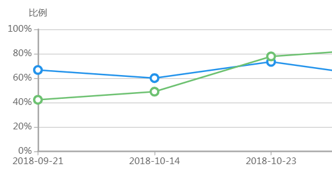
```javascript
series：[
	{
        name:'平均分位比',
        type:'line',
        symbolSize: 10,
        itemStyle:{
            normal:{
                color:'#2393eb',
                borderWidth:3,
            }
        },
        	data:param.bitRatio
        },
]
```

#### 10.grid设置
```javascript
grid: {
    left: 0,
    right:60,
    top: 20,
    bottom: 10,
    containLabel: true
},
```

#### 11.柱状图-series重叠显示
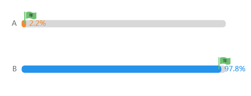
```javascript
series：[
	{
        type: 'bar',
        itemStyle: {
            normal: {
                color: '#D8D8D8',
                barBorderRadius: 10,
            }
        },
        silent: true,
        barWidth: 12,
        barGap: '-100%', // Make series be overlap
        data: maxData
    }
]
```

#### 12.动态颜色、label position
```javascript
series：[
	{
            name: '班级占比',
            itemStyle: {
              normal: {
                color: function (item) {
                  if (item.name == self.standAnswer) {
                    return '#2393EB'
                  } else {
                    return '#F48A33'
                  }
                },
                barBorderRadius: 10,
                label:{
                  show:true,
                  position:'right',
                  formatter:'{c}%'
                },
              },
            },
            barWidth: 12,
            data: mySeriesData,
            type: 'bar'
          }
]
```

#### 13.横向柱状图-图标自定义（小旗子）
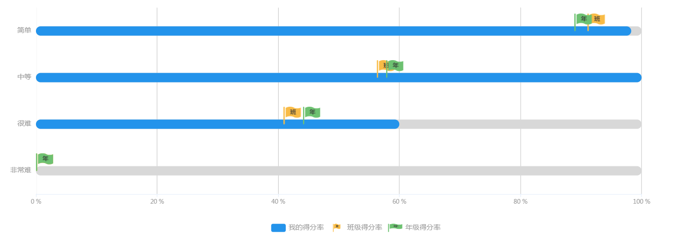
```javascript
studentHardData (val) {
        let yAxisData = []
        let mySeriesData = []
        let classSeriesData = []
        let gradeSeriesData = []
        let maxData = []
        for (let item of this.studentHardData) {
          yAxisData.push(item.name)
          mySeriesData.push(item.score)
          classSeriesData.push(item.classAverageScore)
          gradeSeriesData.push(item.gradeAverageScore)
          maxData.push(100)
        }

        let studentHardOption = {
          tooltip: {
            trigger: 'axis',
            // axisPointer: {
            //   axis: "x",
            // },
            formatter: function (resp) {
              let res = ''
              for (let i = 1; i < resp.length; i++) {
                let item = resp[i]
                res += `<p>${item.marker}${item.seriesName} : ${item.data}%</p>`
              }
              return res
            }
          },
          legend: {
            selectedMode:false, //阻止点击
            orient: 'horizontal',
            x: 'center',
            y: 'bottom',
            data: [{
              name: '我的得分率',
              textStyle: {
                fontSize: 12,
                color: '#999'
              }
            },
              {
                name: '班级得分率',
                textStyle: {
                  fontSize: 12,
                  color: '#999',
                },
                icon: 'image://data:img/jpg;base64,iVBORw0KGgoAAAANSUhEUgAAACEAAAAkCAYAAAAHKVPcAAAAAXNSR0IArs4c6QAAA/1JREFUWAnt\n' +
                'V29sFEUU/729u72rPdp6pmAilmADGowmYkwbIKAUijQB5M8XojFGI5pgYjSRKJBoonwgajR8UVGJ\n' +
                'Gj+Ajf8ogZM2QCKCSg0aEg0aJKfB1Bbp3XHXdre3+3yz517L9qQ3JSF86Gx2Z97MvPd+896bebNk\n' +
                'dS7bBcJ8M2TOp/s6zuO/wsxUONy20HXdVmYsBLiBCFNlOASmQSb0gfkMwThOoC/NpQdO+ry6NVld\n' +
                'ra4oITKMNdGW5OfcvSEynE5tEBBPMzCrYoFEXQZos7kkeaJiHpnI3SuuCysAHpMsR9V2OtUtAO70\n' +
                '+nQ+zEuYuEUsu5vCxo7IvU3fE73klhPBR1dOsYeGWgB6zM5YP4bHTuKGsX2V9RQXxOu54Ky3u45n\n' +
                'rc7Wn2WNGXHjkFg1CkZcudUetKYLbUgbxPRTGRCVKRxvFoNrZE6zUiTgLinScwmtDcIVAw87I0LM\n' +
                'sPhRHPn8Rxex4p4oZk4LlRQk4gZiZtHbpc4yDW0QyZMWtrXnSqLe3ViLOTeH8XfaRccJC6dSw8gM\n' +
                'MBJxwqbVcSyYY5bm/l9D/KJX2u6OYt/W6z2mw68k0NPvYOfBAY9+oDmGHY/Xoq7awN4tiYoAKEZt\n' +
                'EIpJmV8VQxr9ecaFiyPuKY7ofbVBDFiMMz2Op+X0uWGk8y5qq/WUBmdrg1AAtn9ajImXP8njd6Hr\n' +
                'a0JesB77xcbDb6bRn3Ox4IV/kOotgg0qDdLaIO6YEcZOCUZVPn6mDhdyjKbZEfx53sGDi6rw1pM1\n' +
                'EhOE5IsJNNSP7JSg4tG0NojRzKr9xqNTkJejSAXjtDoD1TE5vCVW4rHi1g3OL0drb9HRQt7+Ko+7\n' +
                'ZkZw+pyDW2+auChtS3wjft/4TlbiQFYsT1/Wxe6jg3hiWZWAKeC3vwooyGF2KlVAT7qymNCGP/2G\n' +
                'EJ5dVY25t0S84/ghCcQt6+JovDGM5z7Iojfjem557YucnKAxrJs3flxog5gxNQT1qqLOi11P1ZaO\n' +
                '5lcfUelCv2i7I6iiktwQ5AnSVwwiKHAi9LjukOCzJf66JSX/IdbvlbbjulQlrqiXoGgU+nZJ1ZGJ\n' +
                'KPd5yoIQBQW5R+5lw3jPrIofoXntgz5DsOZvl9fYOWe5RMgmuZHNDY5fjlZ6ZJFnx4CQVLQnGolu\n' +
                'p0UdZy8nwB+j5gNZae9Rr3Xo/jVweJtcWm7zx8vVoniADXrfhPE6texP0VBnq5cCKWSsjS5OflaO\n' +
                'SbfPPtTW5LpOs2yfRmJW6U2uPpxmNvpE+Q9RN36MlrZnfLljLOEPXEltLt7/nfCrt6JyTeyOSRC+\n' +
                'ryYtMWkJ3wJ+PRkT15YlJJMVf5+Cv8o+zKtQS0zQh3JF/9U0Il9fBX1lVfwLjHJP6c7uu4YAAAAA\n' +
                'SUVORK5CYII='
              },
              {
                name: '年级得分率',
                textStyle: {
                  fontSize: 12,
                  color: '#999',
                },
                icon: 'image://data:img/jpg;base64,iVBORw0KGgoAAAANSUhEUgAAACEAAAAkCAYAAAAHKVPcAAAAAXNSR0IArs4c6QAAA41JREFUWAnt\n' +
                'WE1ME1EQntltLaVSQAUBCT/iD4HowWBAqnDAmJB4MHgy8aImegIEDQdPjYkHEgoCXkjUhJMajUYv\n' +
                'XjxAISpSf0hERUGUIAZK1VaBguw+Zxd3A+0WuxUJJrx0d96bN2++b2fe250UK5xnrjJgtjXRaHPk\n' +
                'Ocbhd2OMYUVHdRENDyAgSZZGqkRAxiPAFAC6STcADB8xI9xtLqx/rqzVK7HcWSUCA0QOypr2Ndxp\n' +
                'cbUYeyf6ThJAJQPYGrZDhAccz51rtDm6w15DhnaXPdogEZAWccjJsnfyjYvAd+pxJNsy2C8KYkm5\n' +
                's/o6cNC03mZ9Yke7qOWnprMmZkYUSujpT3imvr8wBBkxSAvShauQH4gdAQGOfOnw+iraq18xBC8C\n' +
                '81P6TORmrZRWvzibSunmJLfIoCeYRLiAf7BjDKwEWECRln7U5u5zy+b3KQtzSv338RdueHmpR/9C\n' +
                'jRURR2KkbRh++mbg/a1+DbcUZgNC5qEszblAZUSRkAhMuacgYfdGMFoM8uV+NgbC9Kw6NlqMgVgh\n' +
                'x7oj8bXXA0P3P0DOqR1g3RyrOh7tHoXE/CSI3RKn6sLt6CZhJZDs47ng9/hh4OY7FUdKTf+1PuDW\n' +
                '8LIuaU8yJBdtUucX6+gmwZt4iNseDyPtw2AwGyD9YKbsv6/1NaQUp4IllU4hNVN8lCzDuekmMd+p\n' +
                'gd51SkqQXubRKRZ1PN/uT33dJPzjfvj6ygO+Aa+cks/OTzKGOC2Ap8cNkyMTKmZ8zjqI2mBWx6E6\n' +
                'ukn8/DED3oFvdAYBzInmuT55F2dFmCACM7Q3lLY2PebfkIjJsEL2sVwFR5Wu812QVpoR0emI6D2h\n' +
                'Ii9RR3c6QuFuO5oN0UmWUNOL6peMhHJKFkULMfl/pAMRpe3uouMwRDXAGCITaEznDhOAsSyqF3Lp\n' +
                'Kx3+h0IjGprpoJpylurOezzPXUZObGsobKCaUruVP7ZbuWlfqYishsjs0rbS1ko4VPAMBpFgHN4w\n' +
                'iVxtXXHdoPbShdrmAruPNDek63TnmTJBYBeogMleaBUwQpgkAleMPDoctvqPWN5eJZc59NSHL+51\n' +
                '3A4wj2hY2XE2nyJJVRXLouhYCEB62G8cMDfy3FNTlOFhbV6tV3EeFAll4m9k4766LlovXWG1FXE6\n' +
                'VkkouVqNxGoklAgocnVPrLBI0GdMYiQyUZYKu+WUtCewlf6neWs0cx3LCTwf6xehLhzc6g4K0AAA\n' +
                'AABJRU5ErkJggg=='
              }
            ]
          },
          grid: {
            left: 20,
            top: 10,
            bottom: 50,
            containLabel: true
          },
          xAxis: {
            type: 'value',
            axisLine: {
              lineStyle: {
                type: 'solid',
                color: '#E7EFFB', //左边线的颜色
                width: '1' //坐标线的宽度
              }
            },
            axisLabel: {
              formatter: '{value} %',
              textStyle: {
                color: '#999', //坐标值得具体的颜色
                fontSize: 10
              }
            },
          },
          yAxis: {
            type: 'category',
            data: ['非常难', '很难', '中等', '简单'],
            axisLine: {
              lineStyle: {
                type: 'solid',
                color: '#fff',
                width: 1
              }
            },
            splitLine: {
              lineStyle: {
                color: ['#E7EFFB'],
                width: 1,
                type: 'solid'
              }
            },
            axisLabel: {
              textStyle: {
                color: '#999'
              }
            }
          },
          series: [{
            type: 'bar',
            itemStyle: {
              normal: {
                color: '#D8D8D8',
                barBorderRadius: 10,
              }
            },
            silent: true,
            barWidth: 16,
            barGap: '-100%', // Make series be overlap
            data: maxData
          },
            {
            name: '我的得分率',
            itemStyle: {
              normal: {
                color: '#2393EB',
                barBorderRadius: 10,
              },
            },
            barWidth: 16,
            data: mySeriesData,
            type: 'bar'
          },
            {
              name: '班级得分率',
              symbol: 'image://data:img/jpg;base64,iVBORw0KGgoAAAANSUhEUgAAACEAAAAkCAYAAAAHKVPcAAAAAXNSR0IArs4c6QAAA/1JREFUWAnt\n' +
              'V29sFEUU/729u72rPdp6pmAilmADGowmYkwbIKAUijQB5M8XojFGI5pgYjSRKJBoonwgajR8UVGJ\n' +
              'Gj+Ajf8ogZM2QCKCSg0aEg0aJKfB1Bbp3XHXdre3+3yz517L9qQ3JSF86Gx2Z97MvPd+896bebNk\n' +
              'dS7bBcJ8M2TOp/s6zuO/wsxUONy20HXdVmYsBLiBCFNlOASmQSb0gfkMwThOoC/NpQdO+ry6NVld\n' +
              'ra4oITKMNdGW5OfcvSEynE5tEBBPMzCrYoFEXQZos7kkeaJiHpnI3SuuCysAHpMsR9V2OtUtAO70\n' +
              '+nQ+zEuYuEUsu5vCxo7IvU3fE73klhPBR1dOsYeGWgB6zM5YP4bHTuKGsX2V9RQXxOu54Ky3u45n\n' +
              'rc7Wn2WNGXHjkFg1CkZcudUetKYLbUgbxPRTGRCVKRxvFoNrZE6zUiTgLinScwmtDcIVAw87I0LM\n' +
              'sPhRHPn8Rxex4p4oZk4LlRQk4gZiZtHbpc4yDW0QyZMWtrXnSqLe3ViLOTeH8XfaRccJC6dSw8gM\n' +
              'MBJxwqbVcSyYY5bm/l9D/KJX2u6OYt/W6z2mw68k0NPvYOfBAY9+oDmGHY/Xoq7awN4tiYoAKEZt\n' +
              'EIpJmV8VQxr9ecaFiyPuKY7ofbVBDFiMMz2Op+X0uWGk8y5qq/WUBmdrg1AAtn9ajImXP8njd6Hr\n' +
              'a0JesB77xcbDb6bRn3Ox4IV/kOotgg0qDdLaIO6YEcZOCUZVPn6mDhdyjKbZEfx53sGDi6rw1pM1\n' +
              'EhOE5IsJNNSP7JSg4tG0NojRzKr9xqNTkJejSAXjtDoD1TE5vCVW4rHi1g3OL0drb9HRQt7+Ko+7\n' +
              'ZkZw+pyDW2+auChtS3wjft/4TlbiQFYsT1/Wxe6jg3hiWZWAKeC3vwooyGF2KlVAT7qymNCGP/2G\n' +
              'EJ5dVY25t0S84/ghCcQt6+JovDGM5z7Iojfjem557YucnKAxrJs3flxog5gxNQT1qqLOi11P1ZaO\n' +
              '5lcfUelCv2i7I6iiktwQ5AnSVwwiKHAi9LjukOCzJf66JSX/IdbvlbbjulQlrqiXoGgU+nZJ1ZGJ\n' +
              'KPd5yoIQBQW5R+5lw3jPrIofoXntgz5DsOZvl9fYOWe5RMgmuZHNDY5fjlZ6ZJFnx4CQVLQnGolu\n' +
              'p0UdZy8nwB+j5gNZae9Rr3Xo/jVweJtcWm7zx8vVoniADXrfhPE6texP0VBnq5cCKWSsjS5OflaO\n' +
              'SbfPPtTW5LpOs2yfRmJW6U2uPpxmNvpE+Q9RN36MlrZnfLljLOEPXEltLt7/nfCrt6JyTeyOSRC+\n' +
              'ryYtMWkJ3wJ+PRkT15YlJJMVf5+Cv8o+zKtQS0zQh3JF/9U0Il9fBX1lVfwLjHJP6c7uu4YAAAAA\n' +
              'SUVORK5CYII=',
              symbolSize: [30, 30],
              symbolOffset: ['50%', '-50%'],
              itemStyle: {
                normal: {
                  color: '#6DC171',
                  lineStyle: {
                    color: 'rgba(255,255,255,0)'
                  }
                },
              },
              barWidth: 16,
              data: classSeriesData,
              type: 'line'
            },
            {
            name: '年级得分率',
            symbol: 'image://data:img/jpg;base64,iVBORw0KGgoAAAANSUhEUgAAACEAAAAkCAYAAAAHKVPcAAAAAXNSR0IArs4c6QAAA41JREFUWAnt\n' +
            'WE1ME1EQntltLaVSQAUBCT/iD4HowWBAqnDAmJB4MHgy8aImegIEDQdPjYkHEgoCXkjUhJMajUYv\n' +
            'XjxAISpSf0hERUGUIAZK1VaBguw+Zxd3A+0WuxUJJrx0d96bN2++b2fe250UK5xnrjJgtjXRaHPk\n' +
            'Ocbhd2OMYUVHdRENDyAgSZZGqkRAxiPAFAC6STcADB8xI9xtLqx/rqzVK7HcWSUCA0QOypr2Ndxp\n' +
            'cbUYeyf6ThJAJQPYGrZDhAccz51rtDm6w15DhnaXPdogEZAWccjJsnfyjYvAd+pxJNsy2C8KYkm5\n' +
            's/o6cNC03mZ9Yke7qOWnprMmZkYUSujpT3imvr8wBBkxSAvShauQH4gdAQGOfOnw+iraq18xBC8C\n' +
            '81P6TORmrZRWvzibSunmJLfIoCeYRLiAf7BjDKwEWECRln7U5u5zy+b3KQtzSv338RdueHmpR/9C\n' +
            'jRURR2KkbRh++mbg/a1+DbcUZgNC5qEszblAZUSRkAhMuacgYfdGMFoM8uV+NgbC9Kw6NlqMgVgh\n' +
            'x7oj8bXXA0P3P0DOqR1g3RyrOh7tHoXE/CSI3RKn6sLt6CZhJZDs47ng9/hh4OY7FUdKTf+1PuDW\n' +
            '8LIuaU8yJBdtUucX6+gmwZt4iNseDyPtw2AwGyD9YKbsv6/1NaQUp4IllU4hNVN8lCzDuekmMd+p\n' +
            'gd51SkqQXubRKRZ1PN/uT33dJPzjfvj6ygO+Aa+cks/OTzKGOC2Ap8cNkyMTKmZ8zjqI2mBWx6E6\n' +
            'ukn8/DED3oFvdAYBzInmuT55F2dFmCACM7Q3lLY2PebfkIjJsEL2sVwFR5Wu812QVpoR0emI6D2h\n' +
            'Ii9RR3c6QuFuO5oN0UmWUNOL6peMhHJKFkULMfl/pAMRpe3uouMwRDXAGCITaEznDhOAsSyqF3Lp\n' +
            'Kx3+h0IjGprpoJpylurOezzPXUZObGsobKCaUruVP7ZbuWlfqYishsjs0rbS1ko4VPAMBpFgHN4w\n' +
            'iVxtXXHdoPbShdrmAruPNDek63TnmTJBYBeogMleaBUwQpgkAleMPDoctvqPWN5eJZc59NSHL+51\n' +
            '3A4wj2hY2XE2nyJJVRXLouhYCEB62G8cMDfy3FNTlOFhbV6tV3EeFAll4m9k4766LlovXWG1FXE6\n' +
            'VkkouVqNxGoklAgocnVPrLBI0GdMYiQyUZYKu+WUtCewlf6neWs0cx3LCTwf6xehLhzc6g4K0AAA\n' +
            'AABJRU5ErkJggg==',
            symbolSize: [30, 30],
            symbolOffset: ['50%', '-50%'],
            itemStyle: {
              normal: {
                color: '#f8bb46',
                lineStyle: {
                  color: 'rgba(255,255,255,0)'
                }
              },
            },
            barWidth: 16,
            data: gradeSeriesData,
            type: 'line'
          }]
        }

        let barChart = echarts.init(document.getElementById('compareBar'))
        this.$nextTick(()=>{
          barChart.setOption(studentHardOption)
        })
      }
```

#### 14.水球效果
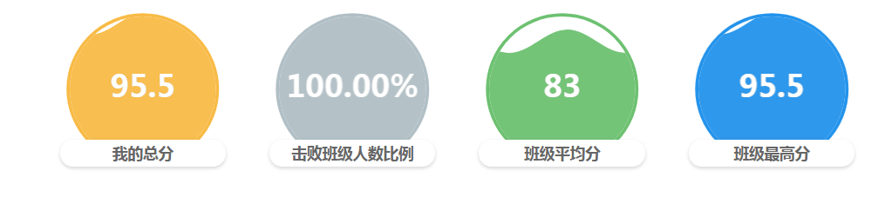

html:
```html
<div class="semicircle">
	<div class="semicircle-top" id="liquidFillScore"></div>
	<p class="num yellow">{{studentBaseData.score}}</p>
	<div class="semicircle-body">
    	<div class="card-itme-text">我的总分</div>
	</div>
</div>
```
css:
```css
.semicircle{
      .num{
        font-size: 30px;
        margin-top: -90px;
        margin-bottom: 30px;
        height: 30px;
      }
    }
    .semicircle-top{
      position: relative;
      display: inline-block;
      .semicircle{
        width: 120px;
        height: 120px;
        border-radius: 50%;
        &.yellow{
          border: 8px solid $yellow;
        }
        &.red{
          border: 8px solid $pink;
        }
        &.blue{
          border: 8px solid $middle-blue;
        }
        &.green{
          border: 8px solid $green;
        }

      }
    }
    .semicircle-body{
      position: relative;
      z-index: 10;
      margin: 0 20px;
      background-color: #fff;
      height: 40px;
      .card-itme-text{
        /*padding: 5px 20px;*/
        box-shadow: 0 2px 4px 0 rgba(0,0,0,.12), 0 0 6px 0 rgba(0,0,0,.04);
        background-color: #FFFFFF;
        font-size: 14px;
        font-weight: 600;
        text-align: center;
        color: #666666;
        line-height: 25px;
        border-radius: 15px;
      }
    }
    #liquidFillScore {
      width: 150px;
      height: 150px;
    }
```
js：
```javascript
import { echartLiquidFill } from '@/utils/echart-liquidfill'

let score = parseFloat((val.score / 100).toPrecision(12))
    let scoreParam = {
          data:[{
            name:val.score,
            value: score
          }],
          color:['#F8BB46'],
          borderColor:'#F8BB46'
        }
    this.$nextTick(()=>{
        echartLiquidFill(scoreParam, 'liquidFillScore')
    })
```
echarts-liquidFill.js：
```javascript
import echarts from "echarts/lib/echarts"
import 'echarts-liquidfill'

export function echartLiquidFill(param, id) {
  param.color = param.color || ['#F8BB46','#B0BFC6','#6DC171','#2393EB','#F6566F']
  param.borderColor = param.borderColor || '#F8BB46'

  let option = {
    series: [{
      type: 'liquidFill',
      radius:'90%',
      color:param.color,//内部水的颜色
      data: param.data,
      itemStyle: {
        shadowBlur: 0
      },
      outline: {//外圈样式
        borderDistance: -2,
        itemStyle: {
          borderWidth: 5,
          borderColor: param.borderColor,
          shadowColor: '#fff'
        },
      },
      label: {//中间文字样式
        normal: {
          formatter: '{b}',
          color: '#6B6965',//未被淹没的文字颜色
          insideColor: '#fff',//被淹没的文字颜色
          fontSize: 28,
        },
      },
      backgroundStyle: {//背景图样式
        color:'#fff',
      },
    }]
  }
  echarts.init(document.getElementById(id)).setOption(option)
}
```

#### 16.雷达图-带底色
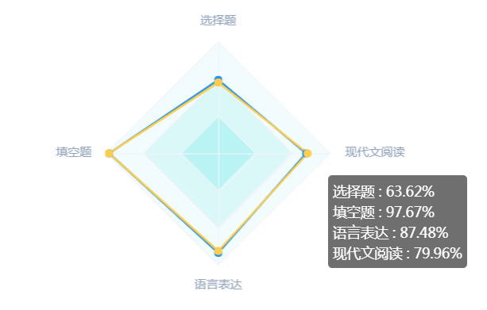
```javascript
classQuestionStat (val) {
        for (let item of val) {
          item.weight = parseFloat(item.weight)
          item.averageScore = parseFloat(item.averageScore)
        }

        let param = {}
        let className = this.className
        let indicator = []
        let classSeriesValue = []
        let gradeSeriesValue = []
        for (let item of this.classQuestionStat) {
          indicator.push({
            name:item.name,
            max:100
          })
          classSeriesValue.push(parseFloat(item.averageScore))
          gradeSeriesValue.push(parseFloat(item.gradeAverageScore))
        }

        param.className = className
        param.indicator = indicator
        param.classSeriesValue = classSeriesValue
        param.gradeSeriesValue = gradeSeriesValue

        let options = {
          tooltip: {
            formatter:function (resp) {
              let res = ''
              for (let item of val) {
                if (resp.name == '年级') {
                  res +='<p>'+item.name+' : '+item.gradeAverageScore+'</p>'
                } else {
                  res +='<p>'+item.name+' : '+item.averageScore+'%</p>'
                }
              }
              return res
            }
          },
          legend: {
            data:[param.className,'年级'],
            x: 'right',
            y: 'bottom',
            orient:'vertical'
          },
          radar: {
            name: {
              textStyle: {
                color: '#94a5bc',
                fontSize: 12
              }
            },
            splitNumber: 3,
            indicator: param.indicator,
            axisLine: {               // (圆内的几条直线)坐标轴轴线相关设置
              lineStyle: {
                color: '#eff3f9',     // 坐标轴线线的颜色。
              }
            },
            splitLine: {             	// (这里是指所有圆环)坐标轴在 grid 区域中的分隔线。
              lineStyle: {
                color: '#eff3f9', 		// 分隔线颜色
              }
            },
            splitArea: {              // 坐标轴在 grid 区域中的分隔区域，默认不显示。
              show: true,
              areaStyle: {
                color: ["#b9f3f4", "#daf8f8", "#f2fcfd"]  // 图表背景网格的颜色
              }
            }
          },
          series: [{
            type: 'radar',
            symbol: 'circle',
            symbolSize: 8,
            data : [
              {
                value : param.gradeSeriesValue,
                name : '年级',
                itemStyle:{
                  normal:{
                    color:'#f8bb46'
                  }
                }
              },{
                value : param.classSeriesValue,
                name : param.className,
                itemStyle:{
                  normal:{
                    color:'#2393eb'
                  }
                }
              }
            ]
          }]
        }
        this.$nextTick(() => {
          let radarChart = echarts.init(document.getElementById('questionRadar'))
          radarChart.setOption(options)
        })
      }
```

#### 17.markLine
```javascript
series: [{
            name: '得分率',
            itemStyle: {
              normal: {
                color: '#447ED9',
              },
            },
            barMaxWidth: 20,
            data: param.score,
            type: 'bar',
            markLine: {
              data: [{
                xAxis: gradeData
              }],
              lineStyle:{
                normal:{
                  type:'solid',
                  color:'#f9c157'
                }
              }
            }
          }]
```

#### 18.柱状图-折线图混合
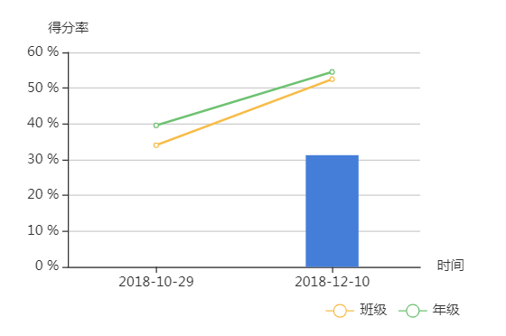
```javascript
stuWeakKnowPoint (val) {
        let param = {
          examName:[],
          teacherName:[],
          date:[],
          selfScoreRate:[],
          classScoreRate:[],
          gradeScoreRate:[],
        }
        for (let item of val) {
          param.examName.push('考试名称：' + item.examName)
          param.teacherName.push(item.teacherName)
          param.date.push(utils.formatDate(item.createTime))
          param.selfScoreRate.push(parseFloat(item.selfScoreRate))
          param.classScoreRate.push(parseFloat(item.classScoreRate))
          param.gradeScoreRate.push(parseFloat(item.gradeScoreRate))
        }
        let options = {
          color: ['#447ED9'],
          tooltip : {
            trigger: 'axis',
            axisPointer : {            // 坐标轴指示器，坐标轴触发有效
                     // 默认为直线，可选为：'line' | 'shadow'
            },
            formatter:function (resp) {
              let res = `<p>${resp[0].data}</p><p>${resp[1].seriesName} : ${resp[1].data}</p>`
              for (let i = 2; i < resp.length; i++) {
                let item = resp[i]
                res += `<p>${item.marker}${item.seriesName} : ${item.data}%</p>`
              }
              return res
            }
          },
          legend: {
            data:['班级','年级'],
            x: 'right',
            y: 'bottom'
          },
          grid: {
            left: '3%',
            right: '10%',
            bottom: '10%',
            containLabel: true
          },
          xAxis : [
            {
              name: '时间',
              type : 'category',
              data : param.date,
              axisLabel:{},
              axisTick: {
                alignWithLabel: true
              }
            }
          ],
          yAxis : [
            {
              name:'得分率',
              type : 'value',
              axisLabel: {
                formatter: '{value} %'
              }
            }
          ],
          series : [
            {
              name:'考试名称',
              type:'line',
              symbol:'none',
              data:param.examName
            },
            {
              name:'任课教师',
              type:'line',
              symbol:'none',
              data:param.teacherName
            },
            {
              name:'得分率',
              type:'bar',
              barWidth: '30%',
              data:param.selfScoreRate
            },
            {
              name:'班级',
              type:'line',
              color:'#F8BB46',
              data:param.classScoreRate
            },
            {
              name:'年级',
              type:'line',
              color:'#6DC171',
              data:param.gradeScoreRate
            },
          ]
        }

        this.knowledgeDialogVisible = true
        this.$nextTick(() => {
          let barChart = echarts.init(document.getElementById('weaknowledgeBar'))
          barChart.setOption(options)
        })
      }
```

#### 19.折线图-节点点击事件
```javascript
let self = this
          pointLine.on('click',function (e) {
            if (e.componentType === 'series') {
              let index = e.dataIndex
              colorIndex = index
              self.pointExamName = self.weakData[index].examName
              self.pointSelfScoreRate = self.weakData[index].scoreRate

              self.$nextTick(()=>{
                pointLine.clear()
                pointLine.setOption(options)
              })
            }
          }
```

#### 20.波浪图
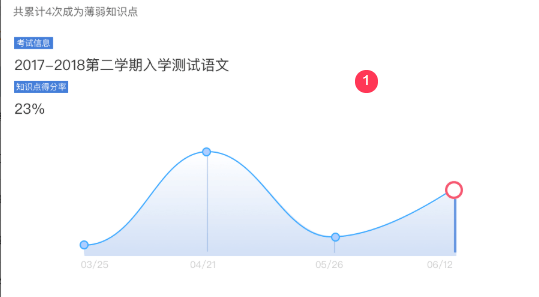
```javascript
weakData (val) {
        this.pointExamName = val[0].examName
        this.pointSelfScoreRate = val[0].scoreRate

        let param = {
          examName:[],
          date:[],
          selfScoreRate:[],
        }

        for (let item of val) {
          param.examName.push(item.examName)
          param.date.push(util.formatDate(item.examTime))
          param.selfScoreRate.push(parseFloat(item.scoreRate))
        }
        let colorIndex = 0
        let options = {
          color: ["#e2f1fe"],
          grid: {
            left: '0',
            right: '0',
            top: '10',
            bottom: '30',
          },
          xAxis: {
            axisLine: {
              lineStyle: {
                type: 'solid',
                color: '#447ED9', //左边线的颜色
                width: '0' //坐标线的宽度
              }
            },
            axisLabel: {
              textStyle: {
                color: '#ccc', //坐标值的具体的颜色
              }
            },
            type: 'category',
            boundaryGap: true,
            data: param.date,
          },
          yAxis: {
            axisLine: {
              lineStyle: {
                type: 'solid',
                color: '#447ED9', //左边线的颜色
                width: '0' //坐标线的宽度
              }
            },
            axisLabel: {
              textStyle: {
                color: '#447ED9', //坐标值得具体的颜色
              }
            },
            x: 'center',
            type: 'value',
            splitLine: {
              show: false
            }
          },
          series: [{
            itemStyle: {
              normal: {
                lineStyle: {
                  color: '#3AA7FF'
                },
                borderColor: 'rgba(255,255,255,0)',
                borderWidth: 30,
                color: function(param) {
                  if (colorIndex == param.dataIndex) {
                    return '#F6566F'
                  } else {
                    return '#3AA7FF'
                  }
                },
                areaStyle: {
                  color: new echarts.graphic.LinearGradient(
                    0, 0, 0, 1, [{
                      offset: 0,
                      color: 'rgba(255,255,255,0.45)'
                    }, {
                      offset: .85,
                      color: 'rgba(68, 126, 217, .3)'
                    }, {
                      offset: 1,
                      color: 'rgba(68, 126, 217, 0)'
                    }]
                  ),
                  type: 'default'
                }
              }
            },
            showAllSymbol: true,
            symbol: 'circle',
            smooth: true,
            symbolSize: 10,
            type: 'line',
            data: param.selfScoreRate
          }, {
            type: 'bar',
            barWidth: 1,
            data: param.selfScoreRate,
            itemStyle: {
              normal: {
                color: function(params) {
                  return '#3AA7FF'
                }
              }
            }
          }]
        }

        this.$nextTick(()=>{
          let pointLine = echarts.init(document.getElementById('pointLine'))
          pointLine.setOption(options)
        })
      }
```

#### 21.玫瑰图
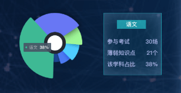
```javascript
initMistakeChartRose(val) {
        let data = []
        for (let item of val) {
          data.push({
            name:item.subjectName,
            value:item.ratio
          })
        }
        // 玫瑰图
        this.mistakeChartRose = echarts.init(document.getElementById('chartRose'))

        let option = {
            tooltip: {
                trigger: 'item',
                formatter: "{b} : {d}%"
            },

            calculable: true,
            color:['#6877f4','#96eb8e','#4eccff','#4c7af2','#1c4693','#3fb994'],

            series: [{
              type: 'pie',
              silent: true,
              clockWise: true,
              hoverAnimation: false,
              animationType: 'scale',
              radius: '14%',
              center: ['50%', '50%'],
              label: {
                normal: {
                  position: 'center'
                }
              },
              data: [{
                value: 100,
                itemStyle: {
                  normal: {
                    color: {
                      colorStops: [{
                        offset: 0,
                        color: '#fff' // 0% 处的颜色
                      }, {
                        offset: 1,
                        color: '#cfcfcf' // 100% 处的颜色
                      }]
                    }
                  }
                }
              }]
            },{
              type: 'pie',
              radius: ['20%', '80%'],
              center: ['50%', '50%'],
              roseType: 'radius',
              width: '40%',
              itemStyle: {
                normal: {
                  label: {
                      show: false
                  },
                  labelLine: {
                      show: false
                  }
                }
              },
              data: data
            }
          ]
        };

        this.mistakeChartRose.setOption(option)
        let self = this
        this.mistakeChartRose.on('click',function (e) {
          let index = e.dataIndex
          self.subjectMistakeShow = self.subjectMistakeData[index]
        })
      }
```

#### 22.雷达图-普通
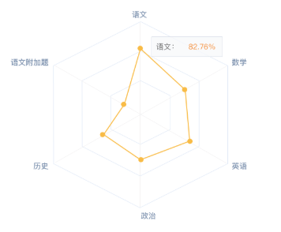
```javascript
schoolRankingData (val) {
        if (val.length > 0) {
          let param = {
            indicator:[],
            gradeSeriesValue:[],
          }
          for (let item of val) {
            param.indicator.push({
              name: item.subjectName + ' (' + parseFloat((item.ratio * 100).toFixed(2)) + '%)',
              max: 100
            })
            param.gradeSeriesValue.push(parseFloat((item.ratio * 100).toFixed(2)))
          }
          let options = {
            // backgroundColor: '#f8f8f8',
            tooltip: {
              formatter:function (resp) {
                let res = ''
                for (let item of val) {
                  res +=`<p>${item.subjectName} : <em style="padding-left: 10px;color: #fabb0a">${parseFloat((item.ratio * 100).toFixed(2))}%</em></p>`
                }
                return res
              }
            },
            radar: {
              name: {
                textStyle: {
                  color: '#94a5bc',
                  fontSize: 12
                }
              },
              splitNumber: 3,
              indicator: param.indicator,
              axisLine: {               // (圆内的几条直线)坐标轴轴线相关设置
                lineStyle: {
                  color: '#eff3f9',     // 坐标轴线线的颜色。
                }
              },
              splitLine: {             	// (这里是指所有圆环)坐标轴在 grid 区域中的分隔线。
                lineStyle: {
                  color: '#eff3f9', 		// 分隔线颜色
                }
              },
              splitArea: {             	// 坐标轴在 grid 区域中的分隔区域，默认不显示。
                show: true,
                areaStyle: {
                  color: ["#b9f3f4", "#daf8f8", "#f2fcfd"]  // 图表背景网格的颜色
                }
              }
            },
            series: [{
              type: 'radar',
              symbol: 'circle',
              symbolSize: 8,
              data : [
                {
                  value : param.gradeSeriesValue,
                  name:'学科',
                  itemStyle:{
                    normal:{
                      color:'#fabb0a'
                    }
                  }
                },
              ]
            }]
          }

          let radarChart = echarts.init(document.getElementById('subjectRadar'))
          this.$nextTick(() => {
            radarChart.setOption(options)
          })
        }
      }
```

