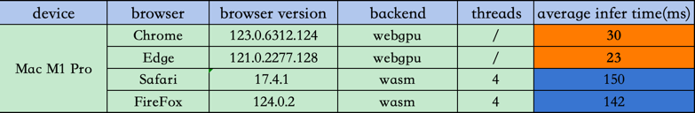
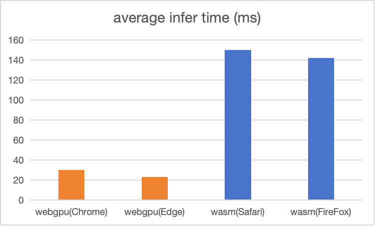
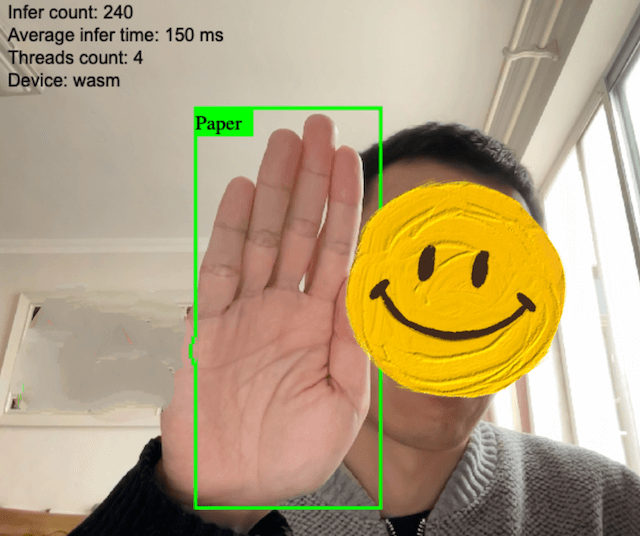
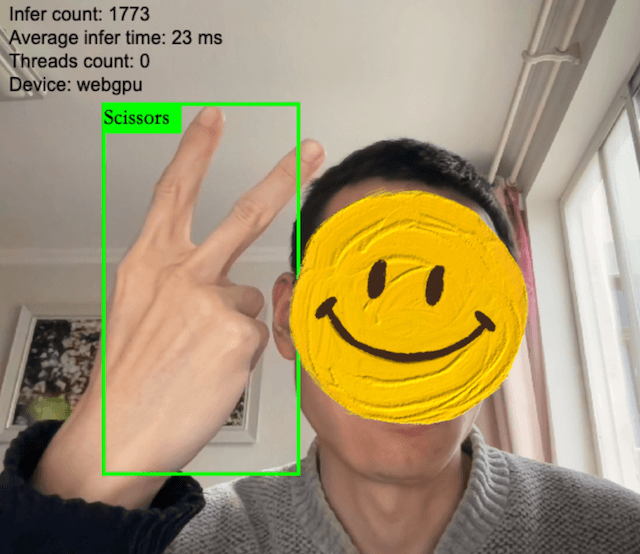
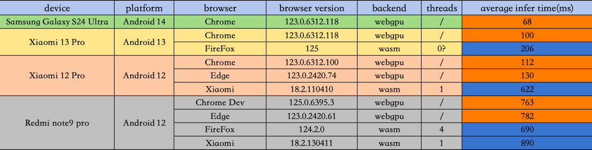
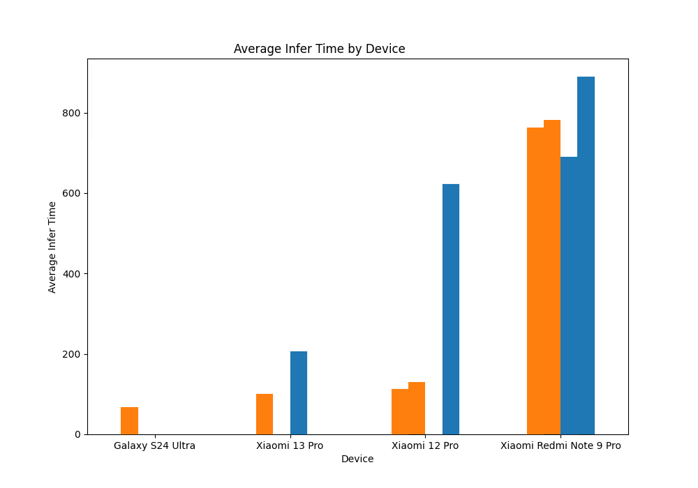
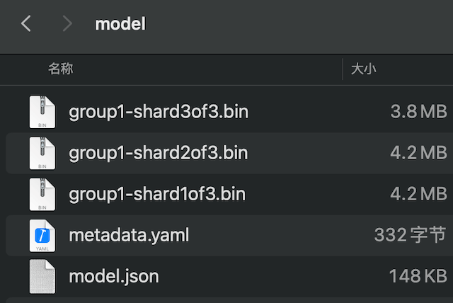
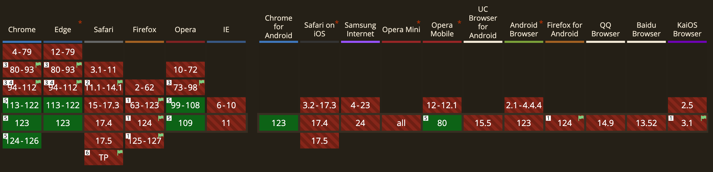

在上一篇[《基于ONNX的Web端YOLOv8模型部署与推理》](https://roubin.me/yolov8-onnxruntime-web-deploy)的最后，我写了一些改进措施，其中有提到“调用端侧设备的GPU资源，来加速浏览器中模型的推理”，之后自己就一直在思考和尝试这方面的技术方案。本文描述了基于tensorflow.js的代码实现，通过在端侧(PC、mobile)浏览器中启用WebGPU backend，达到了模型推理速度的显著提升。
<!--more-->

### 一、启用WebGPU后的效果
#### 1.PC端
先讲一下最终效果，PC端测试数据和结果如下：


在我的Mac M1 Pro上，使用tensorflow.js实现的基于wasm(cpu) backend推理，平均速度可以达到150ms (4 threads)


而使用support WebGPU backend的Chrome和Edge，平均推理时间分别达到了30ms和23ms，如果按一秒30帧来计算，这个速度，可以满足普通视频的实时推理需求。


#### 2.mobile端
mobile端测试数据和结果如下：


mobile端受限于测试环境等因素，并没有在每个device上把浏览器逐个测全，但也能看到：主流设备在启用WebGPU后，有比较明显的推理速度提升，而在低端设备上，差异似乎不明显。 但总体来说，和之前使用onnxruntime的mobile端动辄1800～2000ms的速度对比，这版使用tensorflow.js的实现，整体上都快了很多

### 二、代码实现
#### 1.模型导出为tfjs格式
要使用tensorflow.js在浏览器端加载模型，先要将训练好的模型导出为tfjs格式，好在YOLOv8官方的`export`方法已经支持了tfjs格式，我是在colab上跑的导出，完整的notebook代码如下：
```python
!pip cache purge
!pip install tensorflow-decision-forests==1.5.0
!pip install tensorflow==2.13.1

import tensorflow as tf
print(tf.__version__)

!pip install tensorflowjs

!pip install --upgrade ultralytics
import ultralytics
ultralytics.checks()

!pip show tensorflowjs
!pip show ultralytics
!pip show tensorflow
!pip show tensorflow-decision-forests

!tensorflowjs_converter --version

!cp /content/drive/MyDrive/DL/model/yolo/rps_best.pt ./
from ultralytics import YOLO
model = YOLO('./rps_best.pt')
model.export(format='tfjs')
```
导出后的模型文件长下面这样：包含三个4M左右的权重文件，一个元数据文件，一个模型算子和层参数json文件


#### 2.将onnxruntime-web换成tensorflow.js
其实改成tensorflow.js实现，代码需要调整的地方并不多，本质上就是把model infer的框架换一下，再调整一下preprocess和postprocess就好了

这里preprocess函数可以直接返回ImageData，无需手动拼接RGB像素数组，代码如下：
```javascript
function prepare_input(img) {
  const canvas = document.createElement("canvas");
  canvas.width = 640;
  canvas.height = 640;
  const context = canvas.getContext("2d");
  context.drawImage(img, 0, 0, 640, 640);
  return context.getImageData(0, 0, 640, 640);
}
```
然后调用`tf.browser.fromPixels`把图片像素数据转成tensor，并做归一化和升维
```javascript
  tf_img = tf.browser.fromPixels(input);
  input = tf_img.div(255.0).expandDims().toFloat();
  const outputs = await model.predict(input);
  const data = outputs.data();
```
模型的输出也是一个tensor，通过调用tensor上的`data()`方法，可以异步获取到shape为(1,7,8400)的输出结果，正好和postprocess的输入对上，postprocess就不需要改了。

#### 3.backend判断
这部分实现了使用何种backend的判断：如果支持WebGPU，则使用webgpu相关参数来初始化，否则使用默认的wasm(cpu)来推理
```javascript
let device = "wasm";

async function init() {
  if (navigator.gpu && (await navigator.gpu.requestAdapter())) {
    device = "webgpu";
  } else {
    tf.wasm.setWasmPaths(
      "https://regulussig.s3.ap-southeast-1.amazonaws.com/tfjs/wasm/",
    );
  }
  load_model();
}
```

**完整代码可参考：**[这里](https://github.com/satorioh/yolov8_tf_js)

**demo地址：**[Paper, Rock, Scissors WebCam Detection](https://tf.regulusai.top/)

### 三、遇到的问题
1.移动端浏览器目前对WebGPU的支持比较有限，主要还是Chrome和Edge为主


2.PC端FireFox和Safari，在使用wasm backend时，推理到280次左右时，有时会出现推理中断的情况，原因有待排查

3.移动端Safari似乎无法完成模型初始化，一直在loading中，原因有待排查（由于测试设备有限，不排除设备原因）

4.某些移动平台上的FireFox，在使用wasm backend时，threads count会显示为0，怀疑是`tf.wasm.getThreadsCount`方法在移动端FireFox上有兼容性问题，有待排查

5.YOLOv8导出tfjs格式，目前需要搭配特定版本的tensorflow（[issue](https://github.com/ultralytics/ultralytics/issues/9175)），不然会导出失败，并且目前无法导出tfjs格式的int8量化模型，会报错（[issue](https://github.com/ultralytics/ultralytics/issues/8569)）

### 四、有待改进的地方
1.由于时间和手头设备限制，文中测试数据还比较有限，还是需要更多数据来对比和完善实际差异

2.如果能使用int8/int4量化，可以进一步缩减模型尺寸，提升模型加载速度

3.将tensorflow.js和现代化的前端框架结合，可以进一步减小bundle size，优化渲染和加载速度

4.使用Cache API或Indexed DB对模型文件进行缓存

5.针对遇到的问题，代码还存在优化调整的空间


参考：

[TFJS-object-detection](https://github.com/hugozanini/TFJS-object-detection)

[tfjs-backend-wasm](https://github.com/tensorflow/tfjs/tree/master/tfjs-backend-wasm)

[TensorFlow.js Repo](https://github.com/tensorflow/tfjs)

[Custom object detection in the browser using TensorFlow.js](https://blog.tensorflow.org/2021/01/custom-object-detection-in-browser.html)

[WebGPU API](https://developer.mozilla.org/en-US/docs/Web/API/WebGPU_API)

[WebGPU 的新变化 (Chrome 121)](https://developer.chrome.com/blog/new-in-webgpu-121?hl=zh-cn)
