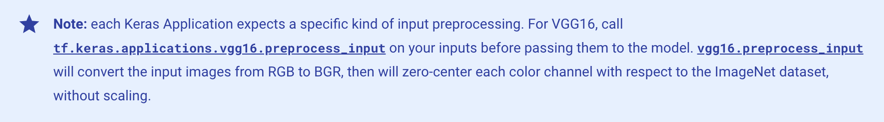

记录一次较为满意的实验。调优过程参考了Chollet大神的《Python深度学习》第8章中部分内容

### 一、任务描述
任务：水果图片分类，是一个典型的图像多分类任务

实验环境：colab (tensorflow 2.15.0)

数据集：爬虫从百度图片搜索结果爬取的，包含1036张水果图片，共5个类别（苹果288张、香蕉275张、葡萄216张、橙子276张、梨251张），分类较为均衡
<!--more-->
数据文件夹结构，如下图：


### 二、实验过程
#### 1.数据准备
##### （1）将图片转为dataset
使用keras的`image_dataset_from_directory`接口，可以自动将fruits下的每个子文件夹当作一个class（分类），从而生成dataset(生成的label是文件夹名)

```python
from tensorflow.keras.utils import image_dataset_from_directory

base_dir = 'fruits'
train_ds, validation_ds = image_dataset_from_directory(base_dir, label_mode='categorical',validation_split=0.2,subset="both",batch_size=32,image_size=(180, 180),seed=42)
```
上述代码对dataset做了如下操作：
- validation_split=0.2：划分为训练集（80%）、验证集（20%），
- image_size=(180, 180)：统一图片尺寸为180x180，减小后续训练时的计算量和内存占用
- label_mode='categorical'：label使用何种编码方式。此处为one-hot编码，对应后面使用的损失函数为categorical_crossentropy；如果label_mode设为'int'，则损失函数需要使用sparse_categorical_crossentropy

##### （2）划分测试集
训练集用于模型训练中的参数调整，验证集用于模型超参数确定，测试集则用于最后的模型评估，虽然这里使用的数据集不大，但我还是划分了一个测试集出来
```python
# 计算validation_ds的大小
num_validation_samples = tf.data.experimental.cardinality(validation_ds).numpy() # 9
# 定义我们想要用于验证的样本数量，剩下的将用于测试
num_val_samples = int(num_validation_samples * 0.5) # 4
# 验证集
val_ds = validation_ds.take(num_val_samples)
# 测试集
test_ds = validation_ds.skip(num_val_samples)
```

#### 2.模型构建与训练
##### （1）构建

网络结构如上图，包含3个卷积池化组（用于图像特征提取、降维），并添加了Dropout层（正则化，防止过拟合，因为模型层数多，但相对的数据集并不大），然后是2个全连接层（对特征进行抽象整合，最后输出），构建代码如下：

```python
from keras import layers

inputs = keras.Input(shape=(180, 180, 3))
x = layers.Rescaling(1./255)(inputs) # 归一化
x = layers.Conv2D(filters=32, kernel_size=3, activation="relu")(x) # 使用3x3的卷积核
x = layers.MaxPooling2D(pool_size=2)(x) # 使用window size 2x2、步长2的池化
x = layers.Dropout(0.5)(x) # 50%的随机丢弃率
x = layers.Conv2D(filters=64, kernel_size=3, activation="relu")(x)
x = layers.MaxPooling2D(pool_size=2)(x)
x = layers.Dropout(0.5)(x)
x = layers.Conv2D(filters=128, kernel_size=3, activation="relu")(x)
x = layers.MaxPooling2D(pool_size=2)(x)
x = layers.Dropout(0.5)(x)
x = layers.Flatten()(x) # 转成二维格式
x = layers.Dense(512, activation="relu")(x)
x = layers.Dropout(0.5)(x)
outputs = layers.Dense(5, activation="softmax")(x) # 因为有5种类别，所以只需要5个神经元做输出
model = keras.Model(inputs=inputs, outputs=outputs)
```
上述代码在开头还添加了一个Rescaling层，用于归一化（将数据映射到0～1之间，加速模型收敛，提高精度）

##### （2）编译
```python
model.compile(loss="categorical_crossentropy",
              optimizer="rmsprop",
              metrics=["accuracy"])
```
- loss="categorical_crossentropy": 分类交叉熵损失函数
- optimizer="rmsprop"：优化器使用rmsprop（均方根前向梯度下降），一种梯度下降算法的改进版本，可动态调整学习率，提高训练效率
- metrics=["accuracy"]：使用精度（这里是CategoricalAccuracy）作为评估指标

##### （3）训练
```python
history = model.fit(
    train_ds,
    epochs=30,
    validation_data=val_ds)
```
跑30轮，输出结果如下：
```shell
Epoch 1/30
33/33 [==============================] - 9s 93ms/step - loss: 4.8970 - accuracy: 0.2325 - val_loss: 1.5861 - val_accuracy: 0.1641
Epoch 2/30
33/33 [==============================] - 2s 66ms/step - loss: 1.3967 - accuracy: 0.3933 - val_loss: 1.2182 - val_accuracy: 0.5078
Epoch 3/30
33/33 [==============================] - 2s 65ms/step - loss: 0.9339 - accuracy: 0.6651 - val_loss: 1.0185 - val_accuracy: 0.6250
Epoch 4/30
33/33 [==============================] - 2s 59ms/step - loss: 0.7777 - accuracy: 0.7043 - val_loss: 0.8928 - val_accuracy: 0.7422
Epoch 5/30
33/33 [==============================] - 2s 59ms/step - loss: 0.6181 - accuracy: 0.7646 - val_loss: 0.7527 - val_accuracy: 0.7422
Epoch 6/30
33/33 [==============================] - 2s 58ms/step - loss: 0.6319 - accuracy: 0.7876 - val_loss: 0.8239 - val_accuracy: 0.6875
Epoch 7/30
33/33 [==============================] - 2s 58ms/step - loss: 0.4638 - accuracy: 0.8373 - val_loss: 0.5568 - val_accuracy: 0.8359
Epoch 8/30
33/33 [==============================] - 3s 68ms/step - loss: 0.4330 - accuracy: 0.8526 - val_loss: 0.4941 - val_accuracy: 0.8203
Epoch 9/30
33/33 [==============================] - 2s 62ms/step - loss: 0.4230 - accuracy: 0.8632 - val_loss: 0.4629 - val_accuracy: 0.8750
Epoch 10/30
33/33 [==============================] - 2s 58ms/step - loss: 0.2967 - accuracy: 0.9100 - val_loss: 0.8572 - val_accuracy: 0.6719
Epoch 11/30
33/33 [==============================] - 2s 59ms/step - loss: 0.3056 - accuracy: 0.9024 - val_loss: 0.3813 - val_accuracy: 0.8828
Epoch 12/30
33/33 [==============================] - 2s 58ms/step - loss: 0.2053 - accuracy: 0.9254 - val_loss: 0.4152 - val_accuracy: 0.8516
Epoch 13/30
33/33 [==============================] - 2s 68ms/step - loss: 0.2324 - accuracy: 0.9263 - val_loss: 0.3878 - val_accuracy: 0.8750
Epoch 14/30
33/33 [==============================] - 2s 66ms/step - loss: 0.2329 - accuracy: 0.9301 - val_loss: 0.3411 - val_accuracy: 0.9219
Epoch 15/30
33/33 [==============================] - 2s 59ms/step - loss: 0.1377 - accuracy: 0.9665 - val_loss: 0.3957 - val_accuracy: 0.8906
Epoch 16/30
33/33 [==============================] - 2s 59ms/step - loss: 0.1833 - accuracy: 0.9455 - val_loss: 0.2581 - val_accuracy: 0.9609
Epoch 17/30
33/33 [==============================] - 2s 58ms/step - loss: 0.0786 - accuracy: 0.9703 - val_loss: 0.3576 - val_accuracy: 0.8672
Epoch 18/30
33/33 [==============================] - 2s 59ms/step - loss: 0.1816 - accuracy: 0.9598 - val_loss: 0.2799 - val_accuracy: 0.9531
Epoch 19/30
33/33 [==============================] - 2s 70ms/step - loss: 0.0762 - accuracy: 0.9789 - val_loss: 0.2764 - val_accuracy: 0.9453
Epoch 20/30
33/33 [==============================] - 2s 63ms/step - loss: 0.0911 - accuracy: 0.9761 - val_loss: 0.3179 - val_accuracy: 0.9531
Epoch 21/30
33/33 [==============================] - 2s 60ms/step - loss: 0.0966 - accuracy: 0.9818 - val_loss: 0.3839 - val_accuracy: 0.9609
Epoch 22/30
33/33 [==============================] - 2s 59ms/step - loss: 0.0784 - accuracy: 0.9828 - val_loss: 0.2903 - val_accuracy: 0.9531
Epoch 23/30
33/33 [==============================] - 2s 59ms/step - loss: 0.0491 - accuracy: 0.9856 - val_loss: 0.3415 - val_accuracy: 0.9453
Epoch 24/30
33/33 [==============================] - 2s 59ms/step - loss: 0.0317 - accuracy: 0.9914 - val_loss: 0.3351 - val_accuracy: 0.9531
Epoch 25/30
33/33 [==============================] - 2s 70ms/step - loss: 0.0901 - accuracy: 0.9799 - val_loss: 0.3475 - val_accuracy: 0.9531
Epoch 26/30
33/33 [==============================] - 2s 63ms/step - loss: 0.0694 - accuracy: 0.9809 - val_loss: 0.2907 - val_accuracy: 0.9531
Epoch 27/30
33/33 [==============================] - 2s 59ms/step - loss: 0.0029 - accuracy: 1.0000 - val_loss: 0.3122 - val_accuracy: 0.9531
Epoch 28/30
33/33 [==============================] - 2s 59ms/step - loss: 0.1168 - accuracy: 0.9780 - val_loss: 0.3631 - val_accuracy: 0.9531
Epoch 29/30
33/33 [==============================] - 2s 60ms/step - loss: 0.0359 - accuracy: 0.9866 - val_loss: 0.8567 - val_accuracy: 0.8672
Epoch 30/30
33/33 [==============================] - 2s 60ms/step - loss: 0.0501 - accuracy: 0.9885 - val_loss: 0.3891 - val_accuracy: 0.9531

```
#### 3.评估与预测
##### （1）绘制loss和accuracy曲线
```python
import matplotlib.pyplot as plt


def show_history(history):
    loss = history.history['loss']
    val_loss = history.history['val_loss']
    epochs = range(1, len(loss) + 1)
    plt.figure(figsize=(12, 4))
    plt.subplot(1, 2, 1)
    plt.plot(epochs, loss, 'bo', label='Training loss')
    plt.plot(epochs, val_loss, 'b', label='Validation loss')
    plt.title('Training and validation loss')
    plt.xlabel('Epochs')
    plt.ylabel('Loss')
    plt.legend()
    acc = history.history['accuracy']
    val_acc = history.history['val_accuracy']
    plt.subplot(1, 2, 2)
    plt.plot(epochs, acc, 'bo', label='Training acc')
    plt.plot(epochs, val_acc, 'b', label='Validation acc')
    plt.title('Training and validation accuracy')
    plt.xlabel('Epochs')
    plt.ylabel('Accuracy')
    plt.legend()
    plt.show()
    
show_history(history)
```

如上图，loss和accuracy都不错，也没有太大的过拟合，说明Dropout还是很有效的

执行一下评估：
```python
test_loss, test_acc = model.evaluate(test_ds)
print(f"Test accuracy: {test_acc:.3f}")
```
结果：0.925
```shell
5/5 [==============================] - 1s 104ms/step - loss: 0.3252 - accuracy: 0.9248
Test accuracy: 0.925
```

##### （2）预测并获取分类报告
```python
from sklearn.metrics import classification_report

# 获取预测结果
y_pred = model.predict(test_ds)

# 获取测试集的真实标签
y_true = np.concatenate([y for x, y in test_ds], axis=0)

y_pred = np.argmax(y_pred, axis=1)
y_true = np.argmax(y_true, axis=1)
```
模型使用softmax输出的是一个二维的概率值（5个分类各自可能的概率大小），而classification_report需要传入一维的真实label和预测值，所以这里使用np.argmax将每个样本中概率最大的值，转为对应的整数索引
```shell
print(y_true)

array([1, 0, 3, 2, 2, 3, 3, 3, 0, 1, 3, 3, 1, 2, 4, 3, 2, 2, 3, 2, 2, 0,
       3, 1, 1, 4, 4, 3, 3, 0, 0, 3, 0, 3, 0, 1, 1, 1, 1, 2, 4, 4, 2, 4,
       1, 0, 0, 4, 4, 1, 1, 0, 2, 0, 3, 4, 3, 1, 2, 1, 3, 1, 3, 0, 3, 0,
       0, 2, 1, 2, 4, 2, 3, 3, 4, 0, 0, 2, 1, 4, 0, 3, 2, 2, 0, 0, 1, 2,
       1, 0, 3, 0, 2, 4, 3, 4, 1, 4, 2, 3, 0, 3, 2, 1, 4, 1, 3, 2, 0, 0,
       1, 4, 0, 3, 4, 1, 3, 1, 2, 0, 3, 4, 0, 1, 4, 1, 0, 3, 4, 4, 4, 3,
       4])
```
最后看下分类报告的结果
```python
# 生成分类报告
report = classification_report(y_true, y_pred)
print(report)
```
```shell
              precision    recall  f1-score   support

           0       0.93      0.96      0.95        28
           1       0.89      0.93      0.91        27
           2       0.95      0.91      0.93        23
           3       0.97      0.97      0.97        31
           4       0.87      0.83      0.85        24

    accuracy                           0.92       133
   macro avg       0.92      0.92      0.92       133
weighted avg       0.92      0.92      0.92       133

```
从support一栏可以看到每个类别实际参与测试的样本数，总体还算均衡；accuracy是0.92，不错的成绩，但还有优化空间


### 三、模型调优
#### 1.数据增强（data augmentation）
图片的数据增强，指的是通过对原始图像进行变换、扩充等操作，增加训练数据的多样性，从而提高模型的泛化能力。对于数据集较小的情况，使用数据增强是一种很有效的解决方法

##### （1）添加数据增强层
```python
data_augmentation = keras.Sequential(
    [
        layers.RandomFlip("horizontal"),
        layers.RandomRotation(0.1),
        layers.RandomZoom(0.2),
    ]
)
```
- RandomFlip("horizontal"):将水平翻转应用于随机抽取的50% 的图像
- RandomRotation(0.1):将输入图像在[-10%,+10%]的范围随机旋转(这个范围是相对于整个圆的比例，用角度表示的话，范围是[-36，+36°])
- RandomZoom(0.2):放大或缩小图像，缩放比例在[-20%，+20%]范围内随机取值

##### （2）重新构建模型
```python
from keras import layers

inputs = keras.Input(shape=(180, 180, 3))
x = data_augmentation(inputs)
x = layers.Rescaling(1./255)(x)
x = layers.Conv2D(filters=32, kernel_size=3, activation="relu")(x)
x = layers.MaxPooling2D(pool_size=2)(x)
x = layers.Dropout(0.5)(x)
x = layers.Conv2D(filters=64, kernel_size=3, activation="relu")(x)
x = layers.MaxPooling2D(pool_size=2)(x)
x = layers.Dropout(0.5)(x)
x = layers.Conv2D(filters=128, kernel_size=3, activation="relu")(x)
x = layers.MaxPooling2D(pool_size=2)(x)
x = layers.Dropout(0.5)(x)
x = layers.Flatten()(x)
x = layers.Dense(512, activation="relu")(x)
x = layers.Dropout(0.5)(x)
outputs = layers.Dense(5, activation="softmax")(x)
model = keras.Model(inputs=inputs, outputs=outputs)
```
##### （3）使用callback函数
keras的callback函数可以在训练过程的不同阶段执行特定的操作。它可以在训练的开始或结束、每个批次之前或之后等时刻执行诸如：中断训练、保存模型、加载一组不同的权重或改变模型的状态等
```python
callbacks = [
    keras.callbacks.ModelCheckpoint(
        filepath="fruits_with_aug.keras",
        save_best_only=True,
        monitor="val_loss")
]
```
这里设置为在训练过程中，监测val_loss，当其有更优值时，才覆盖保存之前的模型

##### （4）训练与评估
```python
history = model.fit(
    train_ds,
    epochs=50,
    validation_data=val_ds,
    callbacks=callbacks)
```
训练50轮（让其自动保存最优模型），结果如下：
```shell
Epoch 1/50
33/33 [==============================] - 6s 99ms/step - loss: 5.9965 - accuracy: 0.2057 - val_loss: 1.6067 - val_accuracy: 0.2188
Epoch 2/50
33/33 [==============================] - 3s 95ms/step - loss: 1.5082 - accuracy: 0.3426 - val_loss: 1.4788 - val_accuracy: 0.3594
Epoch 3/50
33/33 [==============================] - 3s 94ms/step - loss: 1.3154 - accuracy: 0.4833 - val_loss: 1.2293 - val_accuracy: 0.5156
Epoch 4/50
33/33 [==============================] - 3s 76ms/step - loss: 0.9649 - accuracy: 0.6431 - val_loss: 1.3895 - val_accuracy: 0.3594
Epoch 5/50
33/33 [==============================] - 3s 94ms/step - loss: 0.8895 - accuracy: 0.6699 - val_loss: 1.1524 - val_accuracy: 0.5312
Epoch 6/50
33/33 [==============================] - 4s 102ms/step - loss: 0.7342 - accuracy: 0.7110 - val_loss: 0.9722 - val_accuracy: 0.5938
Epoch 7/50
33/33 [==============================] - 4s 103ms/step - loss: 0.6668 - accuracy: 0.7483 - val_loss: 0.7654 - val_accuracy: 0.7188
Epoch 8/50
33/33 [==============================] - 3s 91ms/step - loss: 0.6270 - accuracy: 0.7550 - val_loss: 0.7171 - val_accuracy: 0.7500
Epoch 9/50
33/33 [==============================] - 2s 63ms/step - loss: 0.7062 - accuracy: 0.7416 - val_loss: 0.7718 - val_accuracy: 0.7109
Epoch 10/50
33/33 [==============================] - 3s 93ms/step - loss: 0.5799 - accuracy: 0.7876 - val_loss: 0.6397 - val_accuracy: 0.7188
Epoch 11/50
33/33 [==============================] - 2s 63ms/step - loss: 0.6105 - accuracy: 0.7713 - val_loss: 0.7777 - val_accuracy: 0.7266
Epoch 12/50
33/33 [==============================] - 2s 61ms/step - loss: 0.5552 - accuracy: 0.7943 - val_loss: 0.6451 - val_accuracy: 0.8359
Epoch 13/50
33/33 [==============================] - 2s 62ms/step - loss: 0.5336 - accuracy: 0.7962 - val_loss: 0.7344 - val_accuracy: 0.7266
Epoch 14/50
33/33 [==============================] - 3s 91ms/step - loss: 0.5414 - accuracy: 0.8019 - val_loss: 0.5638 - val_accuracy: 0.8047
Epoch 15/50
33/33 [==============================] - 4s 120ms/step - loss: 0.5912 - accuracy: 0.7952 - val_loss: 0.5456 - val_accuracy: 0.8359
Epoch 16/50
33/33 [==============================] - 2s 64ms/step - loss: 0.5123 - accuracy: 0.8038 - val_loss: 0.6544 - val_accuracy: 0.7812
Epoch 17/50
33/33 [==============================] - 2s 61ms/step - loss: 0.5065 - accuracy: 0.8134 - val_loss: 0.6357 - val_accuracy: 0.8125
Epoch 18/50
33/33 [==============================] - 2s 62ms/step - loss: 0.5032 - accuracy: 0.8134 - val_loss: 0.6908 - val_accuracy: 0.6797
Epoch 19/50
33/33 [==============================] - 4s 107ms/step - loss: 0.4910 - accuracy: 0.8230 - val_loss: 0.5172 - val_accuracy: 0.8516
Epoch 20/50
33/33 [==============================] - 4s 127ms/step - loss: 0.4639 - accuracy: 0.8182 - val_loss: 0.4979 - val_accuracy: 0.8203
Epoch 21/50
33/33 [==============================] - 3s 93ms/step - loss: 0.4460 - accuracy: 0.8383 - val_loss: 0.4966 - val_accuracy: 0.8359
Epoch 22/50
33/33 [==============================] - 4s 104ms/step - loss: 0.4515 - accuracy: 0.8325 - val_loss: 0.4871 - val_accuracy: 0.7891
Epoch 23/50
33/33 [==============================] - 3s 98ms/step - loss: 0.4238 - accuracy: 0.8297 - val_loss: 0.4816 - val_accuracy: 0.8125
Epoch 24/50
33/33 [==============================] - 3s 91ms/step - loss: 0.4302 - accuracy: 0.8469 - val_loss: 0.4627 - val_accuracy: 0.7969
Epoch 25/50
33/33 [==============================] - 3s 98ms/step - loss: 0.3918 - accuracy: 0.8660 - val_loss: 0.3938 - val_accuracy: 0.8906
Epoch 26/50
33/33 [==============================] - 4s 104ms/step - loss: 0.3881 - accuracy: 0.8545 - val_loss: 0.3335 - val_accuracy: 0.8828
Epoch 27/50
33/33 [==============================] - 2s 62ms/step - loss: 0.4168 - accuracy: 0.8622 - val_loss: 0.4780 - val_accuracy: 0.8203
Epoch 28/50
33/33 [==============================] - 2s 61ms/step - loss: 0.3576 - accuracy: 0.8517 - val_loss: 0.3802 - val_accuracy: 0.8359
Epoch 29/50
33/33 [==============================] - 2s 62ms/step - loss: 0.3465 - accuracy: 0.8699 - val_loss: 0.3780 - val_accuracy: 0.8828
Epoch 30/50
33/33 [==============================] - 4s 101ms/step - loss: 0.3819 - accuracy: 0.8699 - val_loss: 0.3204 - val_accuracy: 0.8828
Epoch 31/50
33/33 [==============================] - 3s 72ms/step - loss: 0.3188 - accuracy: 0.8871 - val_loss: 0.4560 - val_accuracy: 0.7891
Epoch 32/50
33/33 [==============================] - 3s 89ms/step - loss: 0.3191 - accuracy: 0.8842 - val_loss: 0.3184 - val_accuracy: 0.8906
Epoch 33/50
33/33 [==============================] - 2s 60ms/step - loss: 0.3205 - accuracy: 0.8861 - val_loss: 0.6812 - val_accuracy: 0.7734
Epoch 34/50
33/33 [==============================] - 2s 64ms/step - loss: 0.2959 - accuracy: 0.8947 - val_loss: 0.6108 - val_accuracy: 0.7500
Epoch 35/50
33/33 [==============================] - 4s 98ms/step - loss: 0.2957 - accuracy: 0.9033 - val_loss: 0.3047 - val_accuracy: 0.8672
Epoch 36/50
33/33 [==============================] - 4s 119ms/step - loss: 0.3158 - accuracy: 0.8967 - val_loss: 0.2987 - val_accuracy: 0.8828
Epoch 37/50
33/33 [==============================] - 3s 91ms/step - loss: 0.3012 - accuracy: 0.8995 - val_loss: 0.2637 - val_accuracy: 0.8750
Epoch 38/50
33/33 [==============================] - 4s 102ms/step - loss: 0.2853 - accuracy: 0.8976 - val_loss: 0.2145 - val_accuracy: 0.9297
Epoch 39/50
33/33 [==============================] - 2s 61ms/step - loss: 0.3012 - accuracy: 0.9062 - val_loss: 0.2886 - val_accuracy: 0.9141
Epoch 40/50
33/33 [==============================] - 2s 61ms/step - loss: 0.3324 - accuracy: 0.8947 - val_loss: 0.2401 - val_accuracy: 0.9219
Epoch 41/50
33/33 [==============================] - 2s 61ms/step - loss: 0.2516 - accuracy: 0.9110 - val_loss: 0.4127 - val_accuracy: 0.8594
Epoch 42/50
33/33 [==============================] - 3s 77ms/step - loss: 0.3404 - accuracy: 0.8995 - val_loss: 0.3658 - val_accuracy: 0.8516
Epoch 43/50
33/33 [==============================] - 2s 64ms/step - loss: 0.2272 - accuracy: 0.9148 - val_loss: 0.6187 - val_accuracy: 0.7891
Epoch 44/50
33/33 [==============================] - 2s 61ms/step - loss: 0.2449 - accuracy: 0.9053 - val_loss: 0.2393 - val_accuracy: 0.9219
Epoch 45/50
33/33 [==============================] - 2s 62ms/step - loss: 0.2187 - accuracy: 0.9282 - val_loss: 0.5503 - val_accuracy: 0.7891
Epoch 46/50
33/33 [==============================] - 2s 61ms/step - loss: 0.2731 - accuracy: 0.9072 - val_loss: 0.3276 - val_accuracy: 0.8750
Epoch 47/50
33/33 [==============================] - 2s 68ms/step - loss: 0.2309 - accuracy: 0.9177 - val_loss: 0.4530 - val_accuracy: 0.7969
Epoch 48/50
33/33 [==============================] - 3s 70ms/step - loss: 0.2479 - accuracy: 0.9234 - val_loss: 0.3031 - val_accuracy: 0.8672
Epoch 49/50
33/33 [==============================] - 2s 61ms/step - loss: 0.2583 - accuracy: 0.9187 - val_loss: 0.2214 - val_accuracy: 0.9453
Epoch 50/50
33/33 [==============================] - 3s 89ms/step - loss: 0.2406 - accuracy: 0.9225 - val_loss: 0.1947 - val_accuracy: 0.9531

```
loss和accuracy曲线如下：

依旧没有明显的过拟合，然后30轮和50轮的精度差别其实并不大

也来评估一下：
```python
test_model = keras.models.load_model("fruits_with_aug.keras")
test_loss, test_acc = test_model.evaluate(test_ds)
print(f"Test accuracy: {test_acc:.3f}")
```
结果：0.947，有小幅提升！
```shell
5/5 [==============================] - 0s 21ms/step - loss: 0.1702 - accuracy: 0.9474
Test accuracy: 0.947

```
然后是分类报告（代码没变，我就不贴了）：
```shell
              precision    recall  f1-score   support

           0       0.96      0.96      0.96        28
           1       0.93      0.96      0.95        27
           2       1.00      0.91      0.95        23
           3       0.97      0.94      0.95        31
           4       0.88      0.96      0.92        24

    accuracy                           0.95       133
   macro avg       0.95      0.95      0.95       133
weighted avg       0.95      0.95      0.95       133

```
accuracy 0.95,f1分数也基本都达到了0.95，说明数据增强还是有效果的


#### 2.使用预训练模型
好了，该上“牛刀”了——使用预训练模型。意思是在我们训练时，使用已经在其他数据集上训练好的模型作为起点，“站在巨人的肩膀上”

这里预训练模型选择了vgg16，它在ImageNet（该数据集包含超过1400万张属于1000个类别的图像）图像分类竞赛中取得了第二名，参数量大约为1.3亿
##### （1）原理

上图摘自《Python深度学习》，原理就是使用vgg16作为训练好的卷积基，然后将其冻结，防止在训练过程中，内部参数被改变；在其上添加我们自己的全连接层，作为新的分类器，然后开始训练

##### （2）获取卷积基
```python
conv_base  = keras.applications.vgg16.VGG16(
    weights="imagenet",
    include_top=False)
```
keras中自带了一些常用模型，其中就包括vgg16。`include_top`指是否需要包括vgg16的全连接层，由于它的全连接层有1000个类别的输出，而我们这里只有5个类别，所以并不需要

##### （3）执行冻结
```python
conv_base.trainable = False
print("This is the number of trainable weights "
      "after freezing the conv base:", len(conv_base.trainable_weights)) # 0
```

##### （4）模型构建
```python
  from keras import layers

  inputs = keras.Input(shape=(180, 180, 3))
  x = data_augmentation(inputs)
# x = layers.Rescaling(1./255)(x)
  x = keras.applications.vgg16.preprocess_input(x)
  x = conv_base(x)
# x = layers.Conv2D(filters=32, kernel_size=3, activation="relu")(x)
# x = layers.MaxPooling2D(pool_size=2)(x)
# x = layers.Dropout(0.5)(x)
# x = layers.Conv2D(filters=64, kernel_size=3, activation="relu")(x)
# x = layers.MaxPooling2D(pool_size=2)(x)
# x = layers.Dropout(0.5)(x)
# x = layers.Conv2D(filters=128, kernel_size=3, activation="relu")(x)
# x = layers.MaxPooling2D(pool_size=2)(x)
# x = layers.Dropout(0.5)(x)
  x = layers.Flatten()(x)
  x = layers.Dense(512, activation="relu")(x)
  x = layers.Dropout(0.5)(x)
  outputs = layers.Dense(5, activation="softmax")(x)
  model = keras.Model(inputs=inputs, outputs=outputs)
```
使用vgg16对输入数据格式有要求，可以调用`keras.applications.vgg16.preprocess_input`来处理，tf官方也给出了说明（如下图）


##### （5）训练与评估
```python
history = model.fit(
    train_ds,
    epochs=50,
    validation_data=val_ds,
    callbacks=callbacks)
```
依旧是跑50轮，自动保存最佳模型，结果如下：
```shell
Epoch 1/50
33/33 [==============================] - 5s 121ms/step - loss: 8.9553 - accuracy: 0.8488 - val_loss: 5.7501 - val_accuracy: 0.8516
Epoch 2/50
33/33 [==============================] - 4s 117ms/step - loss: 1.6742 - accuracy: 0.9483 - val_loss: 0.0697 - val_accuracy: 0.9922
Epoch 3/50
33/33 [==============================] - 4s 120ms/step - loss: 1.3791 - accuracy: 0.9522 - val_loss: 0.0000e+00 - val_accuracy: 1.0000
Epoch 4/50
33/33 [==============================] - 4s 111ms/step - loss: 0.8950 - accuracy: 0.9703 - val_loss: 0.1849 - val_accuracy: 0.9844
Epoch 5/50
33/33 [==============================] - 4s 110ms/step - loss: 0.6955 - accuracy: 0.9732 - val_loss: 5.3784e-06 - val_accuracy: 1.0000
Epoch 6/50
33/33 [==============================] - 4s 112ms/step - loss: 0.7686 - accuracy: 0.9675 - val_loss: 1.8626e-09 - val_accuracy: 1.0000
Epoch 7/50
33/33 [==============================] - 4s 107ms/step - loss: 0.5589 - accuracy: 0.9789 - val_loss: 1.3970e-07 - val_accuracy: 1.0000
Epoch 8/50
33/33 [==============================] - 4s 108ms/step - loss: 0.6402 - accuracy: 0.9770 - val_loss: 0.0020 - val_accuracy: 1.0000
Epoch 9/50
33/33 [==============================] - 4s 110ms/step - loss: 0.4821 - accuracy: 0.9923 - val_loss: 1.2935 - val_accuracy: 0.9844
Epoch 10/50
33/33 [==============================] - 4s 106ms/step - loss: 0.6913 - accuracy: 0.9789 - val_loss: 0.1530 - val_accuracy: 0.9844
Epoch 11/50
33/33 [==============================] - 4s 106ms/step - loss: 0.2504 - accuracy: 0.9885 - val_loss: 1.7731e-04 - val_accuracy: 1.0000
Epoch 12/50
33/33 [==============================] - 4s 107ms/step - loss: 0.1919 - accuracy: 0.9933 - val_loss: 0.0678 - val_accuracy: 0.9922
Epoch 13/50
33/33 [==============================] - 4s 107ms/step - loss: 0.3878 - accuracy: 0.9895 - val_loss: 0.5037 - val_accuracy: 0.9844
Epoch 14/50
33/33 [==============================] - 4s 105ms/step - loss: 0.5507 - accuracy: 0.9876 - val_loss: 0.1472 - val_accuracy: 0.9922
Epoch 15/50
33/33 [==============================] - 4s 114ms/step - loss: 0.5431 - accuracy: 0.9866 - val_loss: 0.4348 - val_accuracy: 0.9922
Epoch 16/50
33/33 [==============================] - 4s 105ms/step - loss: 0.3337 - accuracy: 0.9895 - val_loss: 0.7943 - val_accuracy: 0.9922
Epoch 17/50
33/33 [==============================] - 4s 106ms/step - loss: 0.3115 - accuracy: 0.9885 - val_loss: 0.0187 - val_accuracy: 0.9922
Epoch 18/50
33/33 [==============================] - 4s 114ms/step - loss: 0.1026 - accuracy: 0.9943 - val_loss: 0.0096 - val_accuracy: 0.9922
Epoch 19/50
33/33 [==============================] - 4s 106ms/step - loss: 0.1187 - accuracy: 0.9923 - val_loss: 3.4478e-05 - val_accuracy: 1.0000
Epoch 20/50
33/33 [==============================] - 4s 106ms/step - loss: 0.2564 - accuracy: 0.9914 - val_loss: 0.2398 - val_accuracy: 0.9922
Epoch 21/50
33/33 [==============================] - 4s 115ms/step - loss: 0.0961 - accuracy: 0.9933 - val_loss: 0.0000e+00 - val_accuracy: 1.0000
Epoch 22/50
33/33 [==============================] - 4s 106ms/step - loss: 0.2745 - accuracy: 0.9943 - val_loss: 3.7253e-09 - val_accuracy: 1.0000
Epoch 23/50
33/33 [==============================] - 4s 106ms/step - loss: 0.2143 - accuracy: 0.9952 - val_loss: 0.0000e+00 - val_accuracy: 1.0000
Epoch 24/50
33/33 [==============================] - 4s 116ms/step - loss: 0.2618 - accuracy: 0.9914 - val_loss: 2.7008e-08 - val_accuracy: 1.0000
Epoch 25/50
33/33 [==============================] - 4s 108ms/step - loss: 0.0689 - accuracy: 0.9962 - val_loss: 0.0000e+00 - val_accuracy: 1.0000
Epoch 26/50
33/33 [==============================] - 4s 107ms/step - loss: 0.2700 - accuracy: 0.9952 - val_loss: 0.5954 - val_accuracy: 0.9844
Epoch 27/50
33/33 [==============================] - 4s 108ms/step - loss: 0.0642 - accuracy: 0.9971 - val_loss: 0.0012 - val_accuracy: 1.0000
Epoch 28/50
33/33 [==============================] - 4s 107ms/step - loss: 0.0589 - accuracy: 0.9962 - val_loss: 0.0000e+00 - val_accuracy: 1.0000
Epoch 29/50
33/33 [==============================] - 4s 114ms/step - loss: 0.2216 - accuracy: 0.9952 - val_loss: 0.0026 - val_accuracy: 1.0000
Epoch 30/50
33/33 [==============================] - 4s 118ms/step - loss: 0.2171 - accuracy: 0.9933 - val_loss: 0.0000e+00 - val_accuracy: 1.0000
Epoch 31/50
33/33 [==============================] - 4s 106ms/step - loss: 0.0095 - accuracy: 0.9990 - val_loss: 0.0000e+00 - val_accuracy: 1.0000
Epoch 32/50
33/33 [==============================] - 4s 106ms/step - loss: 0.1920 - accuracy: 0.9943 - val_loss: 9.3132e-10 - val_accuracy: 1.0000
Epoch 33/50
33/33 [==============================] - 4s 117ms/step - loss: 0.1269 - accuracy: 0.9943 - val_loss: 0.0000e+00 - val_accuracy: 1.0000
Epoch 34/50
33/33 [==============================] - 4s 106ms/step - loss: 0.2172 - accuracy: 0.9943 - val_loss: 2.7940e-09 - val_accuracy: 1.0000
Epoch 35/50
33/33 [==============================] - 4s 106ms/step - loss: 0.0248 - accuracy: 0.9971 - val_loss: 0.0000e+00 - val_accuracy: 1.0000
Epoch 36/50
33/33 [==============================] - 4s 110ms/step - loss: 0.0794 - accuracy: 0.9971 - val_loss: 0.0000e+00 - val_accuracy: 1.0000
Epoch 37/50
33/33 [==============================] - 4s 107ms/step - loss: 0.1331 - accuracy: 0.9943 - val_loss: 0.0000e+00 - val_accuracy: 1.0000
Epoch 38/50
33/33 [==============================] - 4s 107ms/step - loss: 6.6318e-05 - accuracy: 1.0000 - val_loss: 0.0000e+00 - val_accuracy: 1.0000
Epoch 39/50
33/33 [==============================] - 4s 108ms/step - loss: 0.1238 - accuracy: 0.9952 - val_loss: 0.0000e+00 - val_accuracy: 1.0000
Epoch 40/50
33/33 [==============================] - 4s 108ms/step - loss: 0.0394 - accuracy: 0.9952 - val_loss: 2.7940e-09 - val_accuracy: 1.0000
Epoch 41/50
33/33 [==============================] - 4s 106ms/step - loss: 0.0162 - accuracy: 0.9981 - val_loss: 0.0000e+00 - val_accuracy: 1.0000
Epoch 42/50
33/33 [==============================] - 4s 107ms/step - loss: 0.1025 - accuracy: 0.9962 - val_loss: 0.0000e+00 - val_accuracy: 1.0000
Epoch 43/50
33/33 [==============================] - 4s 118ms/step - loss: 0.2053 - accuracy: 0.9981 - val_loss: 3.0987e-05 - val_accuracy: 1.0000
Epoch 44/50
33/33 [==============================] - 4s 107ms/step - loss: 0.1768 - accuracy: 0.9962 - val_loss: 0.0000e+00 - val_accuracy: 1.0000
Epoch 45/50
33/33 [==============================] - 4s 114ms/step - loss: 8.4492e-06 - accuracy: 1.0000 - val_loss: 0.0000e+00 - val_accuracy: 1.0000
Epoch 46/50
33/33 [==============================] - 4s 109ms/step - loss: 0.1554 - accuracy: 0.9943 - val_loss: 0.0000e+00 - val_accuracy: 1.0000
Epoch 47/50
33/33 [==============================] - 4s 107ms/step - loss: 0.1252 - accuracy: 0.9962 - val_loss: 0.0000e+00 - val_accuracy: 1.0000
Epoch 48/50
33/33 [==============================] - 4s 107ms/step - loss: 0.1492 - accuracy: 0.9962 - val_loss: 0.0880 - val_accuracy: 0.9922
Epoch 49/50
33/33 [==============================] - 4s 116ms/step - loss: 0.1301 - accuracy: 0.9962 - val_loss: 0.0000e+00 - val_accuracy: 1.0000
Epoch 50/50
33/33 [==============================] - 4s 107ms/step - loss: 2.5325e-08 - accuracy: 1.0000 - val_loss: 0.0000e+00 - val_accuracy: 1.0000

```
loss和accuracy曲线：

绝了，一个顶天一个立地（哈哈～），希望有生之年还能见到这样美妙的情景

最后，加载一下最佳模型，执行预测：
```python
test_model = keras.models.load_model("fruits_vgg16_with_aug.h5")
test_loss, test_acc = test_model.evaluate(test_ds)
print(f"Test accuracy: {test_acc:.3f}")
```
结果：1.00
```shell
5/5 [==============================] - 2s 430ms/step - loss: 2.4407e-05 - accuracy: 1.0000
Test accuracy: 1.000

```
分类报告如下：
```shell
              precision    recall  f1-score   support

           0       1.00      1.00      1.00        28
           1       1.00      1.00      1.00        27
           2       1.00      1.00      1.00        23
           3       1.00      1.00      1.00        31
           4       1.00      1.00      1.00        24

    accuracy                           1.00       133
   macro avg       1.00      1.00      1.00       133
weighted avg       1.00      1.00      1.00       133

```
这就是使用预训练模型的效果，杀鸡用牛刀，满分！

### 四、实验中遇到的问题
#### 1.报错：Input 0 of layer "model" is incompatible with the layer: expected shape=(None, 180, 180, 3), found shape=(256, 256, 3)
原因：输入模型的图片数据shape与定义的shape不符

解决：在使用`image_dataset_from_directory`转换dataset时，是可以直接定义image_size的，这样很方便

#### 2.刚开始使用vgg16时，发现训练中loss不下降
原因：《Python深度学习》这本书中，关于训练中常见的一些问题，都提供了很详实的原因和解决方案。对于这种情况，通常是训练的配置有问题

解决：查了下vgg16的`preprocess_input`方法，文档中对输入要求为：`A floating point numpy.array or a tf.Tensor, 3D or 4D with 3 color channels, with values in the range [0, 255]`，所以Rescaling层并不需要，需要注释掉
```python
inputs = keras.Input(shape=(180, 180, 3))
x = data_augmentation(inputs)
# x = layers.Rescaling(1./255)(x)
x = keras.applications.vgg16.preprocess_input(x)
```

#### 3.colab跑epoch时很慢
原因：一开始以为是显卡不给力，还额外买了点算力，但问题依旧，后来想到可能是因为数据集放在了google drive上的原因，因为dataset是generator，是惰性读取，并不会一次性将数据读入内存，训练时还是会和磁盘有交互

解决：将数据集搬到实验环境的本地磁盘上

### 五、总结
整个实验是一个标准的图像多分类问题，在深度学习中是比较基础、入门的内容。实验先是构建了一个初始的模型，然后针对数据集较小的问题，使用数据增强来提升数据多样性，从而优化了模型精度。在此基础上，又尝试了vgg16，见证了预训练模型的强大之处。

其实，《Python深度学习》中还介绍了对预训练模型的fine tune，但是考虑到data augmentation + vgg16的accuracy已经到1.0了，就没有再尝试。

多实践多总结，相信“日拱一卒，功不唐捐”
