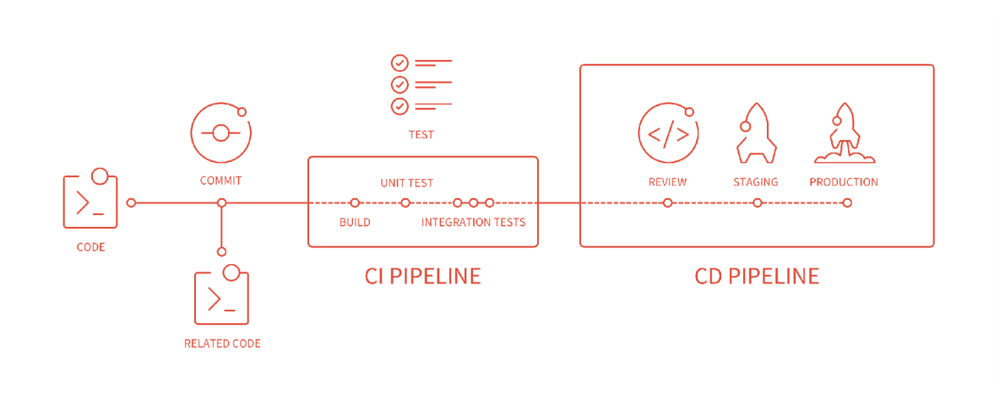
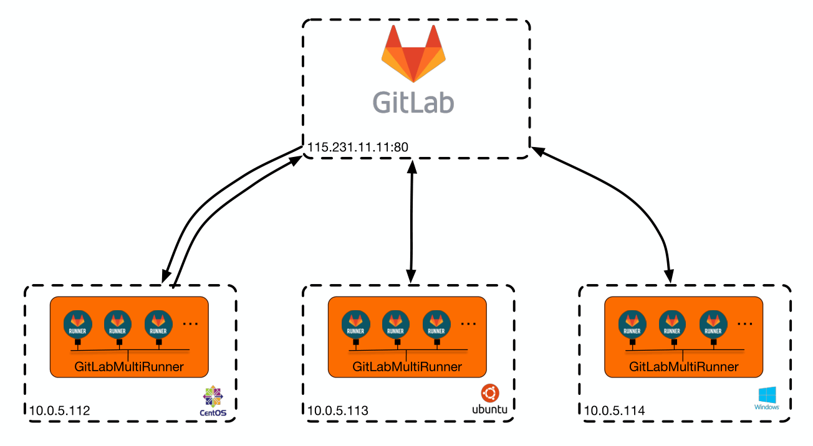
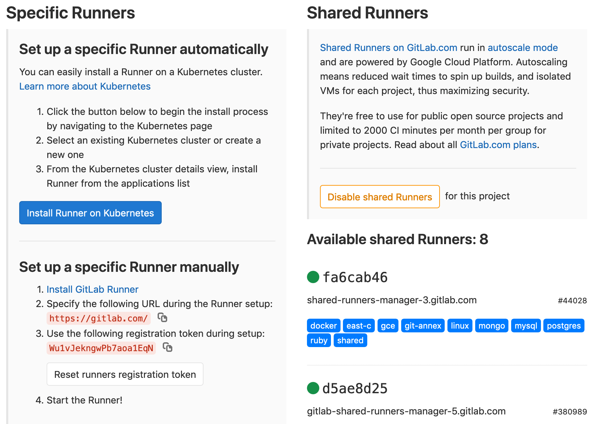

### 一、什么是GitLab CI ？
GitLab-CI是一套配合GitLab使用的持续集成系统（类似的还有Jenkins、Github Actions），从GitLab 8.0后就默认集成了GitLab-CI，并且所有项目默认启用，只要在项目仓库的根目录添加 .gitlab-ci.yml 文件，并且配置了Runner，那么每一次MR / push 都会触发CI Pipeline 。
<!--more-->
### 二、什么是GitLab WorkFlow ？


### 三、GitLab相关术语
#### 1.什么是PipeLine ?
一次构建任务，流水线，包含多个Stage，比如build、test、deploy

#### 2.什么是Stage ?
构建阶段，默认有三个：build阶段（安装依赖、编译）、test阶段（单元测试、集成测试）、deploy阶段（部署到d/q/p环境）。可以在Pipeline中定义多个Stage，和Pipeline的关系如下：
```
+--------------------------------------------------------+
|                                                        |
|  Pipeline                                              |
|                                                        |
|  +-----------+     +------------+      +------------+  |
|  |  Stage 1  |---->|   Stage 2  |----->|   Stage 3  |  |
|  +-----------+     +------------+      +------------+  |
|                                                        |
+--------------------------------------------------------+
```
特点：
- 所有 Stages 会按照顺序运行，即当一个 Stage 完成后，下一个 Stage 才会开始
- 只有当所有 Stages 完成后，该构建任务 (Pipeline) 才会成功
- 如果任何一个 Stage 失败，那么后面的 Stages 不会执行，该构建任务 (Pipeline) 失败

#### 3.什么是Job ?
在Stage中执行的工作，是执行具体的指令集合，只负责一件事情，和Stage的关系如下：
```
+------------------------------------------+
|                                          |
|  Stage 1                                 |
|                                          |
|  +---------+  +---------+  +---------+   |
|  |  Job 1  |  |  Job 2  |  |  Job 3  |   |
|  +---------+  +---------+  +---------+   |
|                                          |
+------------------------------------------+
```
特点：
- 相同 Stage 中的 Job 会并行执行
- 相同 Stage 中的 Job 都执行成功时，该 Stage 才会成功
- 如果任何一个 Job 失败，那么该 Stage 失败，即该构建任务 (Pipeline) 失败

#### 4.什么是GitLab-Runner ?（[参考](https://www.upyun.com/tech/article/245/%E5%BD%93%E8%B0%88%E5%88%B0%20GitLab%20CI%20%E7%9A%84%E6%97%B6%E5%80%99%EF%BC%8C%E6%88%91%E4%BB%AC%E8%AF%A5%E8%81%8A%E4%BA%9B%E4%BB%80%E4%B9%88%EF%BC%88%E4%B8%8A%E7%AF%87%EF%BC%89.html)）
Job的实际执行者。GitLab CI浏览项目里的.gitlab-ci.yml文件，根据里面的规则，分配到各个Runner来运行相应的Job，同一时间单个 Runner 只能处理一个 Job。

**分类**：

按类型：Specific Runner 和 Shared Runner 。Specific Runner 只能供部分项目使用，而Shared Runner 是所有开启了Allow shared runners选项的项目都可以使用的。

按状态：Active Runner、Paused Runner



#### 5.什么是.gitlab-ci.yml文件 ？
项目根目录下的CI配置文件，记录了Pipeline中的阶段和执行规则，可以为不同分支配置不同的规则
```
stages:  // 首先按顺序定义有几个步骤。步骤下面的所有job是同步执行的
  - test  
  - build
  
job1:
  stage: test  // 属于test的stage
  script:
    - npm run test // 这个job执行的脚本
  only:
    - master  // 只监听master分支的代码提交
  tags:
    - tengxun  // 要使用哪个runner

job2:
  stage: build
  script:
    - npm run build
  only:
    - master
  tags:
    - tengxun
```

### 四、安装 GitLab Runner (https://docs.gitlab.com/runner/)
#### 1.添加官方rpm源
```
# For RHEL/CentOS/Fedora
curl -L https://packages.gitlab.com/install/repositories/runner/gitlab-runner/script.rpm.sh | sudo bash
```
#### 2.安装
```
# For RHEL/CentOS/Fedora
sudo yum install -y gitlab-runner
```
#### 3.注册（https://docs.gitlab.com/runner/register/index.html）
a.获取注册用的 url和token：project -> settings -> CI/CD -> Specific Runner



b.执行注册程序
```
sudo gitlab-runner register

Please enter the gitlab-ci coordinator URL (e.g. https://gitlab.com )
https://gitlab.com

Please enter the gitlab-ci token for this runner
xxx

Please enter the gitlab-ci description for this runner
[hostname] my-runner

Please enter the gitlab-ci tags for this runner (comma separated):
my-tag,another-tag

Please enter the executor: ssh, docker+machine, docker-ssh+machine, kubernetes, docker, parallels, virtualbox, docker-ssh, shell:
shell
```
关于executor: https://docs.gitlab.com/runner/executors/README.html#compatibility-chart

### 五、编写.gitlab-ci.yml文件（https://segmentfault.com/a/1190000010442764）
```
stages:
  - build
dev_build:
  stage: build
  tags:
    - test
  only:
    - dev
  script:
    - npm i
    - npm run build
    - lftp -e "set ssl:verify-certificate no;open $TARGET_IP; user $FTP_USERNAME $FTP_PASSWORD; mirror --reverse --verbose --delete $CI_PROJECT_DIR/build/ ./; bye"
```

### 六、GitLab-CI的优势
1.和GitLab集成，功能集成度较高

2.界面美观，结果直接展现在GitLab页面上，直观清晰

3.无需复杂配置，上手容易

### 七、遇到的问题
#### 1.GitLab-runner 权限修改
解决：
- 目录增加对应权限
- 将gitlab-runner user添加到root群组
- 更改执行用户为root(http://www.fidding.me/article/111)

#### 2.GitLab-runner拉取代码失败
```
Running with gitlab-runner 12.3.0 (a8a019e0)
  on test-runner XHF4ESi3
Using Shell executor...
Running on vps...
Fetching changes with git depth set to 50...
Reinitialized existing Git repository in /home/gitlab-runner/builds/XHF4ESi3/0/charlesFinch/ci-test/.git/
fatal: git fetch-pack: expected shallow list
fatal: The remote end hung up unexpectedly
ERROR: Job failed: exit status 1
```
解决：升级Git
```
# centos 6
yum install http://opensource.wandisco.com/centos/6/git/x86_64/wandisco-git-release-6-1.noarch.rpm

# centos 7
yum install http://opensource.wandisco.com/centos/7/git/x86_64/wandisco-git-release-7-1.noarch.rpm

yum install –y git
git --version
```
