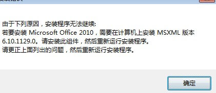

#### 一、问题描述
安装office 2010，提示需要安装MSXML版本6.10.1129

<!--more-->
#### 二、问题解决
创建一个txt文件，把如下复制进去,名字改为a.reg 运行一下即可解决
```bash
Windows Registry Editor Version 5.00
[HKEY_CLASSES_ROOT\TypeLib\{F5078F18-C551-11D3-89B9-0000F81FE221}]
[HKEY_CLASSES_ROOT\TypeLib\{F5078F18-C551-11D3-89B9-0000F81FE221}\6.0]
[HKEY_CLASSES_ROOT\TypeLib\{F5078F18-C551-11D3-89B9-0000F81FE221}\6.0\0]
[HKEY_CLASSES_ROOT\TypeLib\{F5078F18-C551-11D3-89B9-0000F81FE221}\6.0\0\win32]
@="c:\\windows\\system32\\msxml6.dll"
```

参考链接：

[安装office 2010，提示需要安装MSXML版本6.10.1129.0组件的解决办法](http://blog.51cto.com/chinaxin/1891418)
