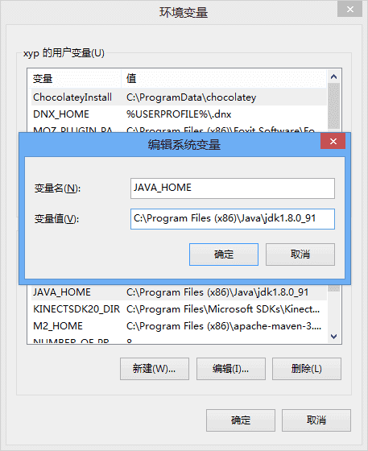
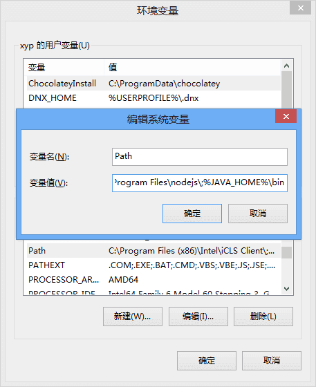
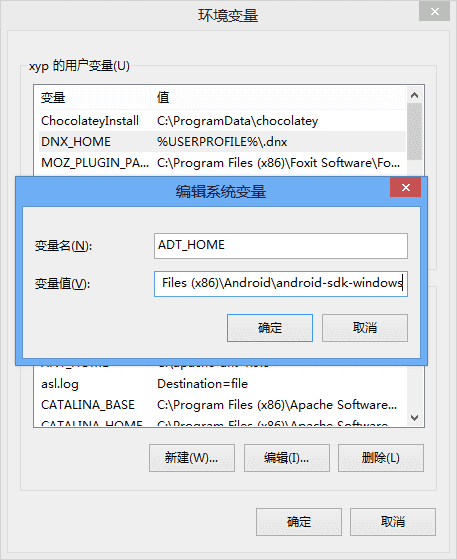
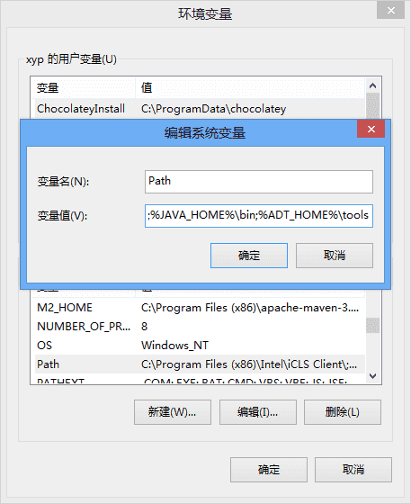
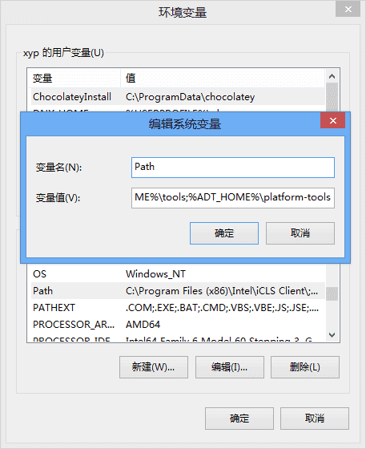

### 一、安装软件
**1.安装:** [Nodejs](https://nodejs.org/en/)

**2.cmd验证：**`node -v`

**3.安装cnpm(npm镜像)：**`npm i cnpm -g`
<!--more-->
**4.cmd验证：**`cnpm -v`

**5.安装cordova和Ionic:**`cnpm i cordova ionic -g`

**6.cmd验证：**`cordova -v  `和 `ionic -v`

**7.安装64bit的** [JDK](http://www.oracle.com/technetwork/java/javase/downloads/index.html)

**8.安装:** [Android Studio](https://developer.android.com/studio/index.html)

### 二、设置环境变量
**1.JDK相关环境变量：**

a.新建一个系统变量“JAVA_HOME”，值为刚才安装的64bit jdk 的路径:C:\Program Files\Java\jdk1.8.0_121



b.找到Path，将jdk的bin路径添加至末尾，保存



c.cmd验证：`java -version`

**2.为Android SDK设置相关环境变量：**

a.新建一个系统变量“ADT_HOME”，值为Android SDK的路径：C:\Users\yourname\AppData\Local\Android\sdk



b.Path下添加：将 Android SDK 的 tools 和 platform-tools 路径添加至“变量值”末尾并保存





**3.基本命令**（先挂VPN）

a.创建app:
```
cd start Myapp tabs  --v2
```
b.模拟运行：
```
ionic serve
ionic serve --l
```
c.添加平台：
```
ionic platform add android
ionic platform add ios
```
