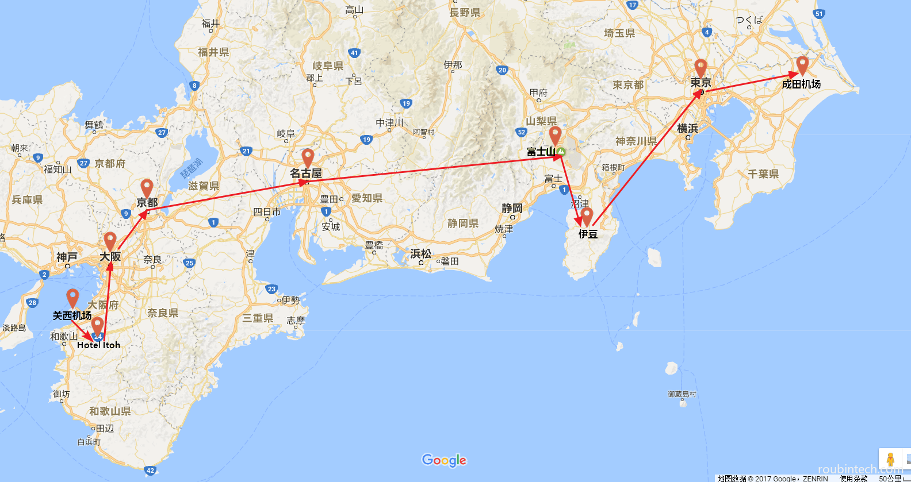

## 梦起
记得小学有位语文老师，一次在课堂上和我们聊起她去日本旅行的经历，她拿中日两国作了个简单对比，至今让我印象深刻：“……如果你在中国的大马路上不小心摔了跤，回去定得把脏衣服换了洗了，而如果是在日本，你只需要站起身，继续走你的路就好，连拍一下都不用，因为衣服根本不会脏……如果你拎着一只崭新的皮包，在中国的大城市玩上一天，回去摸摸包，一般会发现上面有一层油腻，黏糊糊，擦都擦不干净，而如果是在日本，一天下来只会留下一层薄灰，用手一抹就没了……”<!--more-->

虽说有点崇洋媚外，但不得不承认，在当时，除却那些背负着沉重历史包袱的课本，我们这群小p孩对“近邻”的了解，只限于《机器猫》、《阿童木》、《圣斗士》这类引进的动画片，而这位老师，却给我们描绘了一个完全不一样的日本，一个真实的日本，在我们心中激起层层涟漪的同时，也埋下了梦想的种子：嗯，等我长大了，也要到日本去看看。

一晃二十载过去。

## 梦圆

某日看到一篇文章《人生的30个梦想》，颇有感慨，于是便依葫芦画瓢，思索起自己的梦想清单来，不曾想，脑中第一个闪过的，竟然是小时候那个只梦过区区几秒的愿望：去日本。难怪人们总说做完的事容易忘，而没做的会一直留在心底（类似心理学上的“未完成事件”）。恰逢正准备新婚蜜月游，于是和老婆一说，觉得日本不错，便付诸实施了。

### 1.准备阶段

**a. 确定跟团 or 自由行：**因为是第一次去，人生地不熟，所以选择了跟团，有童鞋担心跟团日程会比较紧，是的，但相对的，在节省了自己做攻略时间的同时，能去到更多的景点，而且避免了旅途中很多不必要的麻烦，所以如果对日本的风土人情不了解的话，第一次还是建议跟团，后续熟悉之后，我会更推荐自由行，当然，还有一种折中的方案，后面再说。

**b. 确定行程及线路：**可以对比下网上几家大型旅行社往期赴日游线路，第一次去的话，旅行社一般都会推荐本州线6日/7日游（当然如果你特别想去北海道，就当我没说），然后你会发现，日本几个著名的城市/景点，基本都会被安排到，所以价格近似的情况下，内容相差不大，比如我这次的6日游行程（如下图），除了奈良，基本都走到了：

那么除去内容，差别会在什么地方呢？

一个是进出的城市，即落地和返程的地点。一般为（大）阪/西进东（京）出，或东进阪出，这都是比较推荐的走法，看上面图就懂了，不走回头路嘛；当然也有很多价格实惠的线路，落地在名古屋（中部机场），那么回头路就免不了了，名古屋到京都大概2h，名古屋到富士山是3h，其他城市间基本1~1.5h，你自己算算吧，反正当初我看到落地名古屋的线路，就直接无视了；有童鞋说落地茨城机场（小机场，成田机场再往北）怎么样？它到东京都内大概2h多点，我觉得价格/航班时间合适的话，可以考虑。

再一个就是航班起降的时间。这里就涉及到价格，正点的都贵，红眼便宜，然后记得要算上候机的时间，和航班延误的时间（老婆：就你乌鸦嘴）。因为我不喜欢红眼航班，所以当初就因为这个，砍掉了好多线路，最后选的是去程中午12点起飞，返程是晚上7点的航班，飞3h左右，感觉时间正合适。

最后一个是线路上有无安排自由行。就是上文提到的折中方案，一般安排一天自由行（也有2天的），即落地过来第二天，或返程前一天，城市多为东京或大阪（方便你买买买喽），具体出团书上都会写明。这样即兼顾了跟团的便利，又不失自由，是不错的选择，当然代价就是会略贵，原因嘛，你懂的。我还是推荐自由行一天放后面，毕竟前面几天玩下来，多少会熟悉点，如果一上来就自由行，那估计要懵圈。

**c. 确定预算花费：**其实上文已经提到一部分，基础价格大家都差不多，因为几家旅行社都是从批发商那儿批来的线路，可以多咨询几家比较下。然后差的大的，一般就是档期、航班（上面说的落地点和时间），住宿，和吃饭。

档期的话，黄金周价格肯定会贵，然后赏樱一般在3月底~4月初，赏枫叶在10~11月间，赏富士山雪景最好要等11月后，比如我十一黄金周过后去的，价格便宜些，可惜富士山还没开始下雪，来到五合目一看，整一个煤渣山嘛，略失望；然后有条件，最好避开当地的节假日，出团书上也说了，当地人举家出游，旅馆到时会挤满。

住宿的话，我这6天下来感觉基础设施所有酒店都差不多，但空间和舒适度上，就明显不同了，一般酒店和上档次的温泉酒店，可以说天壤之别，所以这块儿最好提前问清楚。

吃饭基本是团餐，日式定食或者温泉酒店提供的套餐，后者稍微丰富点，因为自己本来口味就偏清淡，对吃也没什么要求，所以感觉日餐吃着还行。

费用上，我这次6日游含一天自由行，2人共计1W出头点（含保险和接送），多一个伊豆半岛，带2晚温泉酒店，航班时间也可以，仅供参考吧。

**d. 办理护照和签证：**护照去公安局出入境中心办理就好，我用了不到一周；赴日签证也不难，具体可以咨询旅行社，每个旅行社会有细微的差别，因为它要为你做担保，但总体原则就是你收入越高，所需的材料就越少，且越容易办下来（但网上说单身女子赴日会直接被拒签？不知道真的假的）

**e. 兑换货币：**国内各大银行柜面可换，在当地换的话，有手续费。因为日本很多大商店、免税店都可以直接刷银联卡，所以现金我换的不多，就兑了4W日元（约RMB 2500），最后还是在成田机场勉强花完了，带回来没用啊

**f. 租随身wifi：**万能的淘宝一搜就有，挑一家买的人多的拍下，设备押金500元，日均开销在3~4元吧，充满电用一天，配合充电宝，续航更持久，如果你没有打电话的需求，那足够用了。wifi设备可以邮寄，也可以去自提，推荐还是自提吧，毕竟候机这么长时间，慢慢找好了，而且商铺位置也不难找，好多家都集中在那一块儿，当然，回来的时候记得先把wifi设备还掉，别因为急着赶车忘记啦~

**g. 看攻略/代购：**有空的话，最好事先看下攻略，方便对日后的行程有个大概了解，包括当地的一些习俗、风土人情，特别是购物，中国人过去基本就是“爆买”，那种争先恐后、你抢我夺的场景，可以让你的肾上腺素分分钟爆表，一点也不夸张，我们团里的上海大妈，都是一手臂一手臂的往购物车里扫货，看的我目瞪口呆。代购这块儿，亲戚同事同学朋友要的，出发前列张清单，查好国内的价格，日用品/化妆品的话，会比国内便宜很多；吃的/伴手礼建议最后一天回来在机场买，那里基本都有，还免税。最后的最后，一定记得给自己买点东西，不要像我这样“舍己为人”，唉，太湖的水，我的泪~~

### 2.注意事项

**a. 护照不能丢：**在国外护照就是身份证。丢了很麻烦，在日本补办一张护照要RMB 1W元（领队反复说了N遍），而且要折腾很久，另外享受免税商品，也要出示护照，丢了就没优惠，切记切记

**b. 调时差：**日本比中国快一个小时，落地后记得把手表/手机拨快一小时，哦，现在手机都有按时区自动调整时间功能，那当我没说吧

**c. 关于语言：**咳咳，先来讲个笑话吧，当然，这个笑话你一定听过。话说那天我和老婆来到银座著名的三越百货，想看下包包，于是清了清嗓子，操着我那口只有N3级别的日语，问门口一位导购小姐：“かばん売り场はどこですか？”，一边问一边还在脑中默念着日语的前后左右，想着后面好接她的话，此时，只见小姐淡定地看了我一眼，指指前面，用异常标准的普通话回道：“先僧，卖包的柜台就在呀里哦”，老婆瞬间就笑岔气了，唉，咱说好的日语对话呢

这个笑话告诉我们，日本一般的大商场，都配有中文导购，然后因为历史原因，很多店铺都是东北人过去开的，要么就是有中国留学生在店里打工的，再加上中日两国文字一脉相承，音近形似，所以不会日语，在日本基本不会有太大问题，当然，如果像我这样懂一点点的话，体验效果会更佳，呵呵

**d. 免税/退税：**不要看到免税，就觉得会便宜，除非你买的多买的贵，不然真心退不了几个钱，而且大商城退税还要排队，耗时耗力；退完税，店员会把退税凭证叠好，粘在你护照后面，最后返程那天，出关要查验，完了会都撕掉

**e. 交通：**日本是靠左行的。开始会有点不习惯，就像我，走在路上总在想自己应该靠哪边走。有次不知不觉就贴右道了，结果就逆行了，差点迎面撞上骑单车的日本小学生（嗯，日本行人和自行车是在一条道上，后面再细说），然后我赶紧让开，前方找个斑马线，匆匆走到对面道上去，挺尴尬的；至于电梯上的站位，左行右立，还是右行左立，我到现在也没搞清楚，因为大阪和东京就不同，一般我就跟着前面一位站吧。这次因为前期准备不充分，没能体验一把JR地铁，网上说在地铁站有针对外国游客的一日/三日通票，很划算，然后也可以买西瓜卡，可储值反复用的，下回去一定要试试；至于在日本打的士，费用会非常昂贵，不推荐。

**f. 就餐：**日本不少餐馆是自助点餐的，门口一个机器，类似国内自动售货机，点选想吃的菜品（看不懂日文可以看图样），然后投入纸币/硬币，就会有餐券和找零吐出来，把餐券给里面店员，坐等就好了

**g. 找零：**去日本的便利店（7+7、全家、罗森比较多）、超市购物，结账时记得把零钱放在收银台上的小盘子里，直接放台上是不礼貌的，然后店员也会把零钱用盘子端给你。一个追求效率的国度，每一处细节都如此用心。

**h. 行李：**我们这次来回坐的都是ANA(全日空)的航班，允许每人携带2个单重不超过23kg的拉杆箱（即合计46kg）托运，并可手提一件不超过10kg的随身行李登机，随身行李尺寸也不能太大，其他航空公司类似。所以如果东西买的多，可以在当地买一个拉杆箱来放，感觉比国内便宜；然后农副产品，比如水果、鸡蛋等是不能带离日本的（我好想带几个苹果啊），只能提前吃掉，最后一天领队会让大家把行李都过秤的，所以不要太担心。

攻略部分就先写这么多吧，原本打算把后面6天的游玩见闻/照片也一起放上，但似乎太长了，还是分两篇说吧

*老婆：开头挺文艺的，怎么写着写着成攻略了？？？*