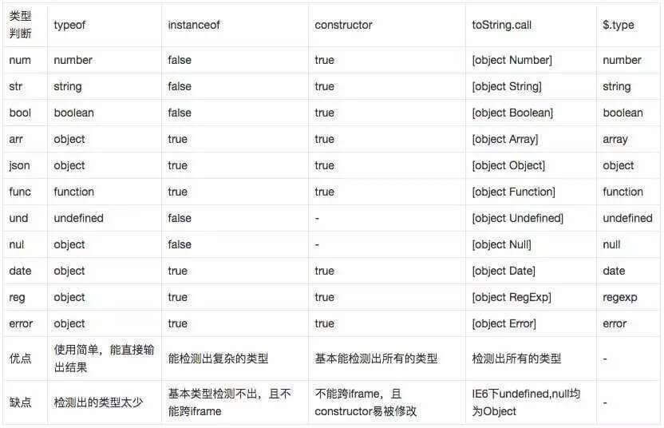

### JS中的数据类型
5种基本数据类型：Number、String、Boolean、Null、Undefined、Symbol

1种复杂数据类型：Object（Array、Function、Reg、Date...）<!--more-->

**1.typeof**

语法：`typeof num;`

结果：Number/String/Boolean/Undefined/Function/Symbol正常，null/Array/Reg/Date-->Object

**2.instanceof**

语法：`num instanceof Number;//true or false`

结果：Number/String/Boolean都为false，因为非构造函数创建，使用new Number创建则为true
```javascript
undefined instanceof Object;//true
null instanceof Object;//true
```

**3.constructor**

语法：`num.constructor==Number;`

结果：都为true，但此属性可能在继承时被修改

**4.Object.prototype.toString.call**

语法：`Object.prototype.toString.call(num)=="[object Number]";`

结果：可检测出所有类型

**5.jquery中$.type**

语法：`$.type(num)//number`

结果：同上（实质就是调用了方法4）

### 总结5种方法：

