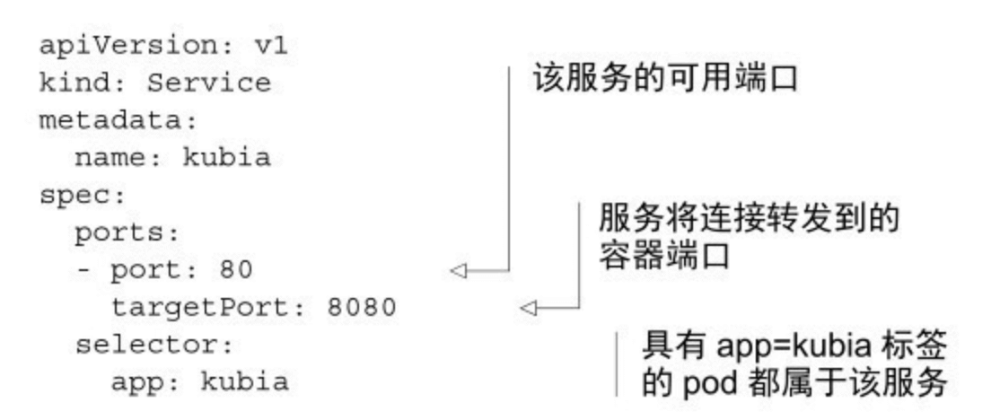
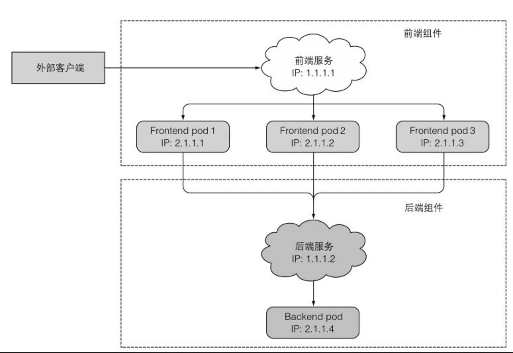
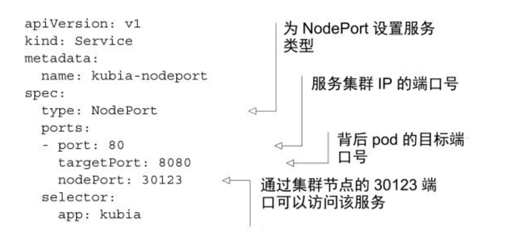
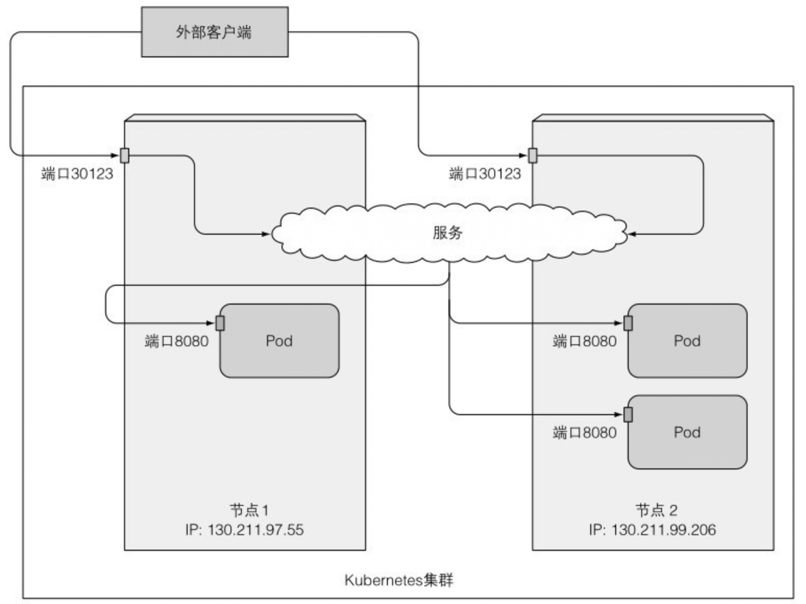
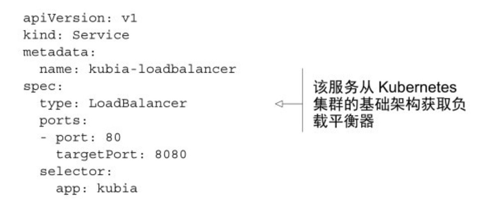
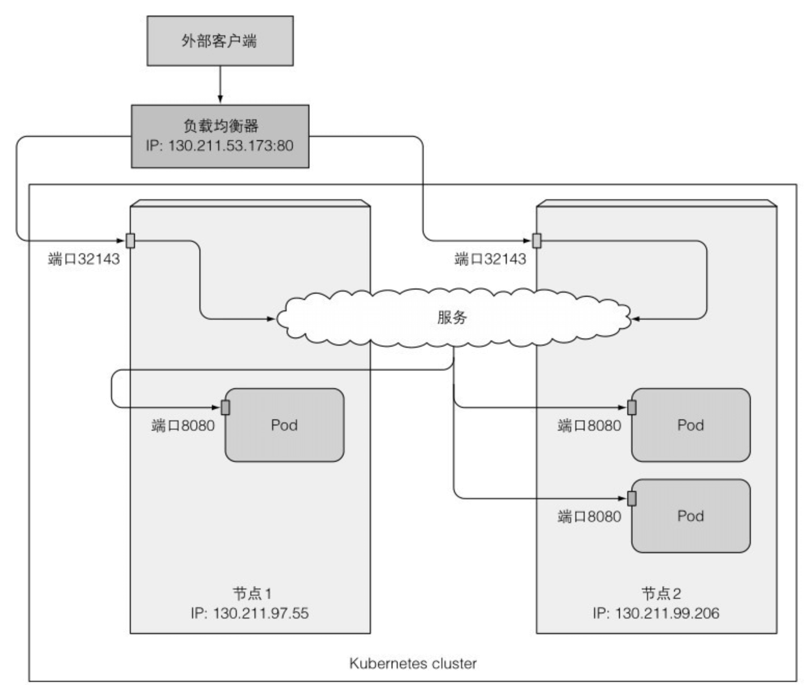
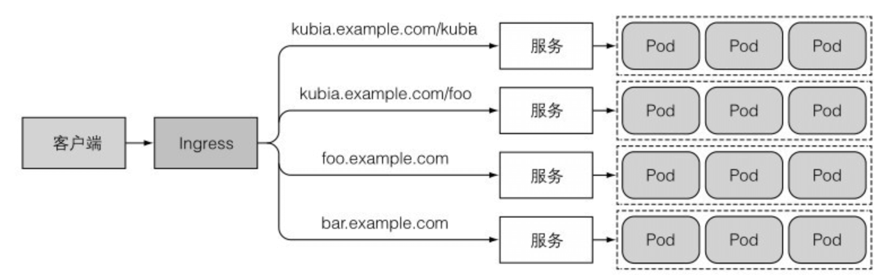
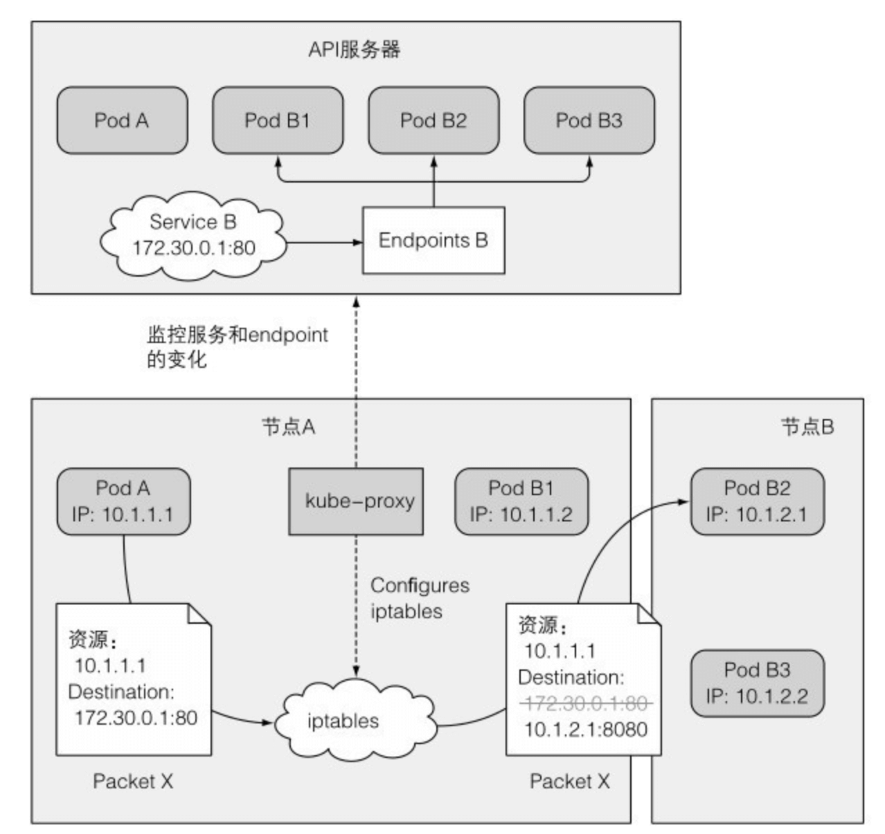

#### 一、什么是k8s service?
Kubernetes service是一种为一组具有相同功能的pod提供单一不变接入点的资源。当service存在时，它的IP地址和端口不会改变。客户端通过它，可以将请求负载均衡到该service包含的一组pod上，从而不需要知道每个单独的提供服务的pod的地址。
<!--more-->

#### 二、service相关概念
##### 1.什么是service的clusterIP、port、targetPort、selector？

clusterIP：service的ip，又称集群虚拟ip，仅可以在集群内部访问

port：service的port

targetPort：service会将连接转发到的容器的目标端口

selector：标签选择器，用于选择service包含的一组特定的pod资源


由上图，引出了两个问题：前端pod如何连接后端pod（集群内访问）？浏览器如何访问前端pod（集群外访问）？

#### 三、前端pod如何连接后端pod（集群内访问）？
k8s集群网络的一个特征是，所有pod通过ip，直接访问其他pod，而不管是否在同一台物理机上，具体可参考[k8s网络原理及方案](https://www.kubernetes.org.cn/2059.html)

##### 1.使用clusterIP类型的service来实现内部访问
虽然前端pod可以直接指向后端pod的ip，但pod是有生命周期的，删除重建后，ip会变化，不稳定。而使用k8s service，因其可以为一组选定的pod提供固定的ip和port，故可以为后端pod建立一个clusterIP类型的service，来解决ip变化的问题

##### 2.除了通过cluster-ip访问service，是否还有其他访问service的方式？
还可以通过k8s提供的DNS机制来访问service。在当前namespace中，会运行着一个叫kube-dns的pod，这个pod运行DNS服务，其他pod都被配置成使用其作为dns（k8s通过修改每个容器的/etc/resolv.conf文件实现）

可以通过如下方式（FQDN全限定域名）来访问service：
```shell
service-name.namespace.svc.cluster.local // service名称.服务所在的命名空间.集群域名
```

如果是在相同的namespace下，可直接简化为：
```shell
service-name
```
所以，前端pod可以通过service-name: port的方式，来和后端pod互通

#### 四、浏览器如何访问前端pod（集群外访问）？
有几种方式，可以在外部访问service:

##### 1.使用NodePort类型的service
让Kubernetes在其所有节点上保留一个端口（所有节点上都使用相同的端口号），并将传入的连接转发给service对应的pod



##### 2.使用LoadBalancer类型的service
在云提供商上运行的k8s集群，通常支持从云基础架构自动提供负载均衡器，它拥有自己独一无二的可公开访问的IP地址，并可以将连接重定向到service



##### 3.使用Ingress访问service
为何需要使用Ingress？一个重要的原因是每个LoadBalancer类型的service， 都需要自己的负载均衡器，以及独有的公有IP地址，而Ingress只需要一个公网IP就能为许多service提供访问。当客户端向Ingress发送HTTP请求时，Ingress会根据请求的主机名和路径决定请求转发到的service


#### 五、service内部实现
每个节点上都会运行一个kube-proxy进程，来处理和service相关的事情。当有service被创建时，各节点上的kube-proxy会更新自己的iptables规则，来保证新的service在本节点可被解析，以下图为例：

pod A发出的包，目的地初始设置为service的IP和端口（在本例中，service是在 172.30.0.1:80）。发送到网络之前，节点A的内核会根据配置在该节点上的iptables规则处理数据包。

内核会检查数据包是否匹配任何这些iptables规则。其中有个规则规定如果有任何数据包的目的地IP等于 172.30.0.1、目的地端口等于 80，那么数据包的目的地IP和端口应该被替换为随机选中的pod的IP和端口。

本例中的数据包满足规则，故而它的IP/端口被改变了。在本例中，pod B2 被随机选中了，所有数据包的目的地IP变更为10.1.2.1（pod B2 的IP），端口改为8080（Service中定义的targetPort），就好像是，客户端pod直接发送数据包给pod B而不是通过Service
