#### 1.数据从哪里来？如何构建数据集？
```
1.现场自行采集（成本比较高）
2.甲方提供
3.网络下载现成的
4.企业真实的数据（商业价值最高）
5.购买（合法购买和使用，千万不要侵犯别人的隐私）
6.爬虫（合法使用，不要侵犯别人的隐私）

数据分门别类,进行标注
```
<!--more-->

#### 2.数据量多大？
```
深度学习越多越好
最起码每个类别数百级单位
```

#### 3.数据量不够如何处理？
```
数据增强
CV: 旋转、缩放、裁剪、调整色调、亮度、对比度、添加噪声。。。
NLP: 近义词替换、文本摘要。。。。
```

#### 4.采用的模型是什么？为什么使用YOLOv8？
```
效果
  依据：根据实际需求，以及项目的难易程度，选择现有的、经典的、成熟的模型，更换成自己的数据集，进行训练，并调参
  
  如果不确定模型，选择多个模型，进行对比，选择效果最好的
  
  在有些情况下，需要多个模型配合使用，发挥各自的特长

YOLOv8优势
    1.保持高精度的同时，具有更快的推理速度，适合实时检测
    2.多模型尺寸、多任务能力
    3.友好的文档、API、社区支持
```

#### 5.什么情况下使用OpenCV，什么情况下使用深度学习？
```
Opencv：不需要程序理解图像的场景和内容，图像相对单一，干扰因素较少，需求比较简单，数据量比较少
深度学习：需要程序理解图像的内容和场景，场景复杂，干扰因素多，样本变化大，需求复杂，数据量足够大
```

#### 6.准确率是多少？
```
工业中至少要95%以上，越高越好，不要过拟合
```

#### 7.写项目经验注意的问题
```
项目背景(需求)：用户是谁？用在什么地方？解决什么问题？
数据集：来源？数量？数据增强？标注？预处理手段？
模型：模型选择？训练过程？调参优化过程？
遇到了什么问题？怎么解决的？
过拟合，欠拟合问题怎么解决的？
效果？
部署？
```

#### 8.什么是有监督学习（Supervised Learning）和无监督学习（Unsupervised Learning）？请举例说明每种类型的应用场景
```
有监督：训练数据集包含了标签，在训练过程中，模型学习输入与标签之间的映射关系
分类：图像分类、垃圾邮件分类
回归：房价预测

无监督：不依赖于标注数据，模型通过输入数据自行发现数据的结构或模式
聚类：客户分组
降维：从高维度数据中提取主要特征
```

#### 9.贝叶斯公式及推导过程，有哪些应用场景？
```
公式：P(A|B) = P(B|A)⋅P(A) / P(B)
解释：由先验概率和条件概率，推算出后验概率

推导：
由联合概率可知：P(A,B)=P(A∣B)⋅P(B)
由联合概率对称性可知：P(A,B)=P(B∣A)⋅P(A)
等式相等：P(A∣B)⋅P(B) = P(B∣A)⋅P(A)
两边除以P(B)得：P(A∣B) = P(B∣A)⋅P(A) / P(B)

应用：
朴素贝叶斯分类器
医疗诊断中，计算患者患有特定疾病的概率
风险评估
```

#### 10.什么是似然？
```
概念：在已知某些数据的情况下，模型参数取特定值的概率
与概率的区别：概率描述的是在已知参数的情况下，观测到某数据的概率，而似然则是相反的情况，即在已知数据的情况下，参数的可能值
```

#### 11.什么是欠拟合、过拟合？如何避免过拟合？如何避免欠拟合？
```
欠拟合：指模型无法从训练数据中学习到足够的模式，导致其在训练集和测试集上都表现不佳
原因：模型太小太简单、训练数据太少、训练时间不够
解决：
    1.增加模型复杂度
    2.增加特征数量
    3.增加训练数据
    4.训练更多轮数
    5.减小正则化强度

过拟合：指模型在训练集上表现很好，但在测试集上表现较差，即模型过度适应了训练数据，忽略了数据的总体趋势，导致泛化能力差
原因：模型太复杂、数据集太小、训练时间过长
解决：
    1.数据增强
    2.正则化
    3.提前终止
    4.集成学习
    5.dropout
```

#### 12.神经网络加速训练方法有哪些？
```
硬件：多GPU、分布式训练
数据：归一化、数据增强
模型：更好的优化器、BN、量化、剪枝、使用预训练模型
训练：提前终止、混合精度训练、自动化超参数调整
```

#### 13.目标检测常用算法有哪些，简述对算法的理解
```
两阶段检测
   	先产生候选区，在候选区上分类+定位
   	速度相对比较慢，精度高
   	RCNN系列  
   	
一阶段检测
   	预定义候选区，直接在特征图上分类+定位
   	速度比较快，精度较低
   	YOLO系列、SSD、RetinaNet
```

#### 14.什么是感受野？
```
CNN的feature map上的像素点，在原始图像上对应的区域大小
卷积层次越深：特征图越小，感受野越大，整体感越强（语意信息）
卷积层次越浅：特征图越大，感受野越小，几何细节越丰富
```

#### 15.什么是正则化？L1、L2、smooth L1正则化的区别
正则化：在损失函数后面添加一个范数（惩罚项），整体上压缩了参数的大小，来防止过拟合的手段

范数表达式如下：


```
L1正则化：也称为Lasso正则化，当p=1时，是L1范数，表示某个向量中所有元素绝对值之和
L2正则化：也称为Ridge正则化，当p=2时，是L2范数，表示某个向量中所有元素平方和再开方，即欧氏距离

区别：
L1正则化的效果是使模型的参数变得稀疏，即部分参数的值为0，可用于特征选择和模型压缩
L2正则化的效果是使模型的参数变得平滑，即相邻参数的值相差较小，可提升泛化能力
smooth L1: 结合了L1和L2的特点
```

#### ~~16.YOLOv8中的objectness loss是什么？~~

#### 17.什么是特征归一化？为什么要归一化？
```
归一化一般是将数据映射到指定的范围（[0, 1] 或 [-1, 1]），从而消除不同特征量纲的影响。
进行归一化处理，使得不同指标之间处于同一数量级，具有可比性。另外还能加速模型收敛，提升性能
```

#### 18.归一化常用方法？
```
Min-Max Normalization
公式：X = (X-Xmin) / (Xmax - Xmin)
--------------------------------------

import numpy as np
import sklearn.preprocessing as sp

raw_sample = np.array([[3.0, -100.0, 2000.0],
                       [0.0, 400.0, 3000.0],
                       [1.0, -400.0, 2000.0]])

mms_sample = raw_sample.copy()

# 1.减去最小值
# 2.减完之后的结果/极差
for col in mms_sample.T:
    col_min = col.min()
    col_max = col.max()
    col -= col_min
    col /= (col_max - col_min)
  
    
# 基于skLearn提供的API实现
scaler = sp.MinMaxScaler()
res = scaler.fit_transform(raw_sample)
```

#### 19.归一化处理适用模型
```
应用归一化的模型：在实际应用中，通过梯度下降法求解的模型通常是需要归一化的，包括线性回归、逻辑回归、支持向量机、神经网络等模型。
不使用归一化的模型：如决策树分类
```

#### 20.什么是标准化？常用方法？
```
标准化是将特征值调整为均值为0，标准差为1的标准正态分布

Z-Score Normalization
公式：X = (X - Xmean) / Xstd
-----------------------------------

import numpy as np
import sklearn.preprocessing as sp

raw_sample = np.array([[3.0, -100.0, 2000.0],
                       [0.0, 400.0, 3000.0],
                       [1.0, -400.0, 2000.0]])

std_sample = raw_sample.copy()

# 1.减去当前列的平均值
# 2.离差/原始数据的标准差
for col in std_sample.T:
    col_mean = col.mean()  # 平均值
    col_std = col.std()  # 标准差
    col -= col_mean
    col /= col_std

    
# 基于skLearn提供的API实现
scaler = sp.StandardScaler()
res = scaler.fit_transform(raw_sample)

```

#### 21.标准化和归一化的联系和区别
```
联系:
    我们都知道归一化是指normalization，标准化是指standardization，但根据wiki上对feature scaling方法的定义，standardization其实就是z-score normalization，也就是说标准化其实是归一化的一种，而一般情况下，我们会把z-score归一化称为标准化，把min-max归一化简称为归一化
    目的：都是通过缩放和平移来实现数据映射，消除不同特征量纲的影响

区别：
    归一化不会改变数据的状态分布，但标准化会
    归一化会将数据限定在一个具体的范围内，如 [0, 1]，但标准化不会
    归一化只受原样本数据中的极值影响，而标准化则受所有样本值的影响
    归一化对异常值敏感，而标准化则对异常值鲁棒
```

#### 22.均值、离差、离差方、方差、标准差之间的关系
```
import numpy as np

S = np.array([1, 2, 3, 4, 5, 6])

# 均值
mean = np.mean(S)
print(mean)  # 3.5

# 离差 = 观测值 - 均值
deviation = S - mean
print(deviation)  # [-2.5 -1.5 -0.5  0.5  1.5  2.5]

# 离差方 = 离差 ** 2
deviation_square = deviation ** 2
print(deviation_square)  # [6.25 2.25 0.25 0.25 2.25 6.25]

# 方差 = 离差方的均值
variance = np.mean(deviation_square)
print(variance)  # 2.9166666666666665

# 标准差 = 方差的平方根
std = np.sqrt(variance)
print(std)  # 1.707825127659933

```

#### 23.方差和标准差有什么区别？
```
方差和标准差都可以用来衡量数据的离散程度
区别：
1.计算方法不同
2.单位不同：标准差单位与数据的单位一致，因此更直观易理解

方差和标准差的缺点：
1.对异常值比较敏感
2.只能衡量单个变量的离散程度，不能反映变量之间的关系
3.数据需要满足正态分布
```

#### 24.回归问题的模型评估指标
```
1.均方误差(Mean Squared Error, MSE)
  公式：MSE = Σ(y_i - y'_i)^2 / n
  取值：越小越好
  特点：L2范数，对离群值敏感，因为平方放大了误差

2.均方根误差（Root Mean Squared Error, RMSE）
  公式：RMSE = √MSE
  取值：越小越好
  特点：RMSE是MSE的平方根，其单位与原始数据相同，便于描述真实值。也对离群值敏感
  
3.平均绝对误差（Mean Absolute Error, MAE）
  公式：MAE = Σ|y_i - y'_i| / n
  取值：越小越好
  特点：L1范数，对离群值不敏感
  
4.决定系数/拟合优度（R² 或 Coefficient of Determination）
  解释：表示模型的拟合度
  公式：R2 = 1 - MSE / Variance
  取值：0～1之间，越大越好
  特点：仅表示拟合程度，不代表模型预测准确度
```

#### 25.分类问题中的TP、FP、TN、FN是什么
```
TP：True Positive，正确得预测为正样本，实际就是正样本，即正样本被正确识别的数量
FP：False Positive，错误得预测为正样本，实际为负样本，即误报的数量
TN：True Negative，正确得预测为负样本，实际就是负样本，即负样本被正确识别的数量
FN：False Negative，错误得预测为负样本，实际为正样本，即漏报的数量

TP+FN：真实正样本的数量
FP+TN：真实负样本的数量
TP+FP：预测为正样本的数量
TN+FN: 预测为负样本的数量
TP+TN: 预测正确的数量
TP+TN+FP+FN: 样本总数量
```

#### 26.如何查看混淆矩阵
假设A为正样本：

|           | Real A | Real B |
|-----------|--------|--------|
| Predict A | 10(TP) | 20(FP) |
| Predict B | 30(FN) | 5(TN)  |

```
该类的预测总数：某一行的和
该类的真实总数：某一列的和
预测对的数量：主对角线上的值

以A为例：
    TP: 预测为A，实际也为A = 10
    FP: 预测为A，实际不是A = 20
    TN: 预测为B，实际也为B = 5
    FN: 预测为B，实际为A = 30 
    Accuracy(和某个类别无关)：预测正确的数量 / 样本总数量 = 10 + 5 / 10 + 20 + 30 + 5
    Precision(A)：正确预测为A的数量 / 预测为A的数量（行） = 10 / 10 + 20
    Recall(A): 正确预测为A的数量 / 真实为A的数量（列） = 10 / 10 + 30
```

#### 27.分类问题的模型评估指标
```
注意：每个类别都有自己的查准率、召回率、f1得分

"""
假设有100张图片，50张狗（正样本），50张猫（负样本），模型预测结果为60张狗（其中有40张是正确的，还有20张是猫）、40张猫（10张狗 + 30张猫）
"""

1.准确率（Accuracy）
  公式：(TP+TN) / (TP+TN+FP+FN)
  解释：预测正确的数量 / 样本总数量 = (40 + 30) / 100 = 0.7
  特点：如果样本不平衡，则准确率就没有参考价值

2.查准率（Precision）
  公式：TP / (TP+FP) = 40 / 60 = 0.67
  解释：正确预测为正样本的数量 / 预测为正样本的数量。Precision越高，表示FP越小，即误报越少
  
3.召回率/查全率（Recall）
  公式：TP / (TP+FN) = 40 / 50 = 0.8
  解释：正确预测为正样本的数量 / 真实正样本的数量。Recall越高，表示FN越小，即漏报越少
  
4.F1分数（F1 Score）
  公式：F1 = 2 * Precision * Recall / (Precision + Recall)
  解释：F1分数是查准率和召回率的调和平均数，在两者之间取得平衡。适用于需要在查准率和召回率之间权衡的场景。
 
5.混淆矩阵（Confusion Matrix）
 
6.ROC和AUC
  ROC 曲线以FPR为横坐标，以TPR为纵坐标，连接不同阈值下的点绘制而成。
    真正率（TPR）= 灵敏度 = Recall = TP/(TP+FN)
    假正率（FPR） = 1- 特异度 = FP/(FP+TN)，代表有多少负样本被错误得预测成了正样本
  ROC 曲线越靠近左上角，说明模型性能越好
  
  AUC是 ROC 曲线下的面积，其值介于 0 和 1 之间，值越大，说明模型性能越好
  
  特点：可以避免样本不平衡的问题，因为TPR只关注正样本，FPR只关注负样本
```

#### 28.回归问题的损失函数，为何使用平方（MSE）而不是绝对值（MAE）？
```
因为MSE函数是可微的，而MAE函数不可微，具体的：
1.曲线最低点可导
2.越接近最低点，曲线的坡度逐渐放缓，有助于通过当前的梯度来判断接近最低点的程度
```


#### 29.损失函数和评估函数（指标）的区别？
```
损失函数作用于训练集，为梯度下降提供方向，用来训练模型参数
评估函数（指标）作用于验证集和测试集，用于评估模型
```

#### 30.什么是超参数？有哪些常用的超参数调优手段？
```
超参数是在训练之前，人为预习设定的参数，而不是在训练中获得的参数

调优手段：
1.网格搜索（Grid Search）
  定义：在预定义的超参数空间内进行穷举搜索，尝试所有可能的组合
  特点：实现简单，但时间长，计算开销大
  
2.随机搜索（Random Search）
  定义：从预定义的超参数空间内随机选择超参数组合进行评估
  特点：相较网格搜索更高效，但可能无法找到最优组合
  
3.贝叶斯优化（Bayesian Optimization）
  定义：一种基于贝叶斯定理的调优方法。它会根据已评估的超参数组合来预测新的超参数组合。
  特点：比网格搜索和随机搜索更有效，但需要更多的计算时间 
  
4.遗传算法（Genetic Algorithms）
  定义：使用自然选择等生物进化的思想来优化超参数

```

#### 31.有哪些常见的超参数？各自对模型有怎样的影响？
```
1.学习率（Learning Rate）
  定义：学习率控制着模型参数更新的步长
  影响：学习率太大导致无法收敛，太小导致收敛缓慢
  
2.批量大小（Batch Size）
  定义：在一次迭代中使用的训练样本数量
  影响：较大的batch size可以提高训练速度，但会占用更大的内存和计算资源，较小的则可能导致收敛不稳定
  
3.正则化参数（Regularization Parameter）
  定义：用于控制模型的复杂度，以避免过拟合
  影响：太大可能欠拟合，太小可能过拟合
  
4.隐藏层数量和神经元数量（Number of Hidden Layers and Neurons）
  定义：决定了神经网络的容量和表达能力
  影响：更多的隐藏层和神经元可以捕捉更复杂的模式，但也增加了模型复杂度和过拟合的风险
  
5.迭代次数（Epochs）
  定义：模型训练的轮数
  影响：过少可能导致模型没有学习到数据的特征，过多可能导致过拟合
  
6.优化器（Optimizer）
  定义：优化器决定了模型的权重更新策略
  影响：不同优化器有不同的收敛速度和稳定性，对模型的最终性能影响显著
  
7.权重初始化（Weight Initialization）
  定义：权重初始化影响模型的初始状态，从而影响训练收敛速度和结果
  影响：常见的方法有随机初始化、Xavier初始化和He初始化等。选择合适的初始化方法可以加快收敛速度，避免梯度消失或梯度爆炸
```

#### 32. 什么是置信概率？
```
置信概率指模型对某个预测结果的确信程度，通常，分类模型（如逻辑回归、神经网络、随机森林等）在进行预测时，不仅给出一个类别标签，还会输出每个类别的置信概率。
值越大说明越确定
```

#### 33.什么是交叉验证？它有哪些常见类型？
```
交叉验证（Cross-Validation）是一种模型性能评估技术，在样本数量较少的情况下，它将数据集分成多份，每份轮流作为测试集，剩下部分作为训练集，通过这种方式，可以多次评估模型，每次的评估结果综合起来给出模型的总体性能

常见类型：
1.K折交叉验证（K-Fold CV）
  定义: 将数据集随机分成k个子集（或称为“折”），然后进行k次训练和测试。每次用k-1个子集进行训练，用剩下的一个子集进行测试
  
2.留一法交叉验证（Leave-One-Out Cross-Validation, LOOCV）
  定义: 留一法交叉验证是一种特殊的 K 折交叉验证，其中 k 等于样本数。在留一法交叉验证中，每次只使用一个样本作为测试集，其余样本作为训练集
  特点：最大限度利用数据，但计算量大
```

#### 34.对于类别不均衡问题，有哪些处理方法？
```
数据层面：
1.过采样（Oversampling）：增加少数类样本的数量
2.欠采样（Undersampling）：减少多数类样本的数量
3.合成数据（Synthetic Data Generation）：为少数类样本合成新的数据

算法层面：
1.调整类权重（Class Weight Adjustment）：给少数类样本赋予更高的权重，以增加其对损失函数的影响
2.集成方法（Ensemble Methods）：使用集成学习方法，如Bagging、Boosting来提高模型对少数类的识别能力
3.调整评估指标：使用适合不平衡数据集的评估指标，如PR曲线、F1、ROC、AUC
```

#### 35.神经网络权重初始值如何设置？
```
1.不能使用零初始化
2.随机初始化：对于小型网络，可以使用高斯分布或均匀分布来初始化权重，这有助于打破网络的对称性
3.Xavier初始化：又称为Glorot初始化，该方法将权重的方差初始化为1/输入特征数，当激活函数为sigmoid/tanh时，适合用这个
4.He初始化：又称为Delving初始化，该方法将权重的方差初始化为2/输入特征数，当激活函数为RELU时，适合用这个
```

#### 36.什么是线性回归？线性回归的特点是什么？
```
定义：用于分析两个或多个变量之间的关系的机器学习方法。它通过拟合一条直线来表示自变量和因变量之间的线性关系
公式：y = w0 + w1 * x1 + w2 * x2 + ... + wn * xn + b
特点：容易计算和实现、难以很好地表达非线性的数据
```

#### 37.什么是多项式回归？多项式回归的特点是什么？
```
定义：多项式回归是一种扩展的线性回归模型，用于处理自变量与因变量之间的非线性关系。虽然模型仍然是线性模型（因为参数是线性的），但它引入了自变量的多项式来捕捉更复杂的模式
公式：y = w0 + w1 * x + w2 * x^2 + ... + wn * x^n + b
特点：可以拟合非线性关系
```

#### 38.什么是决策树？工作原理是什么？特点？
```
定义：通过树形结构来表示决策过程，每个节点表示一个属性，每个分支表示一个属性值，叶节点表示一个类或决策结果

工作原理：
1.选择特征：从数据集中选择一个特征进行分割。常用的标准包括信息增益、信息增益率、基尼指数等。
2.分割数据：根据选择的特征，将数据分割成不同的子集。
3.递归构建：对每个子集重复上述过程，直到满足停止条件，如达到最大深度或子集中没有足够的数据点。
4.形成叶节点：当达到停止条件时，将当前节点设为叶节点，并分配一个预测值。

特点：
易于理解和解释、不需要预处理数据、可用于分类和回归任务
受数据影响大（高方差），容易出现过拟合（特征多，参数复杂，缺乏正则化手段）
```

#### 39.有哪些常见的决策树算法？

```
ID3：基于信息增益来选择分裂属性（每步选择信息增益最大的属性作为分裂节点，树可能是多叉的）。
C4.5：基于信息增益率来选择分裂属性（每步选择信息增益率最大的属性作为分裂节点，树可能是多叉的）。
CART(Classification And Regression Tree)：基于基尼系数/均方差来构建决策树（每步要求基尼系数最小，树是二叉的
```

#### 40.CART 在分类问题和回归问题中的异同
```
相同：
• 在分类问题和回归问题中，CART 都是一棵二叉树，除叶子节点外的所有节点都有且仅有两个子节点；
• 所有落在同一片叶子中的输入都有同样的输出。

不同：
• 在分类问题中，CART 使用基尼指数（Gini index）作为选择特征（feature）和划分（split）的依据；在回归问题中，CART 使用 mse（mean square error）或者 mae（mean absolute error）作为选择 feature 和 split 的 criteria。
• 在分类问题中，CART 的每一片叶子都代表的是一个 class；在回归问题中，CART 的每一片叶子表示的是一个预测值，取值是连续的。
```

#### 41.什么是集成学习？
```
集成学习就是组合多个弱监督模型，以期望得到一个更好的强监督模型。集成学习潜在的思想是即便某一个弱分类器得到了错误的预测，其他分类器也可以将错误纠正回来
类型：Bagging、Boosting、Stacking
关键点：
  1.弱学习器不能太“弱”，需要有一定的准确性
  2.弱学习器之间要具有“多样性”，即弱学习器之间存在差异性
```

#### 42.Bagging与Boosting的原理是什么？二者有何区别？
```
Bagging: 利用bootstrap方法从整体数据集中采取有放回抽样得到N个数据集，在每个数据集上学习出一个模型，最后的预测结果利用N个模型的输出得到；具体地：分类问题采用N个模型预测投票的方式，回归问题采用N个模型预测平均的方式。通过随机抽取数据的方式减少了可能的数据干扰，因此Bagging模型具有低方差
Boosting: 思路是逐步优化模型，持续地通过新模型来优化同一个基模型，从而不断减小模型的预测误差（偏差）


区别：
1.Bagging中每个训练集互不相关，也就是每个基分类器互不相关，而Boosting中训练集要在上一轮的结果上进行调整，也使得其不能并行计算；
2.Bagging中预测函数是均匀平等的，但在Boosting中预测函数是加权的
3.从偏差-方差分解角度看，Bagging主要关注降低方差，而Boosting主要关注降低偏差
```

#### 43.机器学习模型的偏差和方差是什么？
```
偏差：评判的是机器学习模型的准确度，偏差越小，模型越准确。它度量了算法的预测与真实结果的离散程度，刻画了学习算法本身的拟合能力。也就是每次打靶都比较准，比较靠近靶心。
方差：评判的是机器学习模型的稳定性(或称精度)，方差越小，模型越稳定。它度量了训练集变动所导致的学习性能变化，刻画了数据扰动所造成的影响。也就是每次打靶，不管打得准不准，击中点都比较集中
```

#### 44.什么是基于决策树的集合算法(集成学习)？
```
基于决策树构建的Bagging或Boosting类模型。
```

#### 45.简要介绍AdaBoost、GBDT、XGBoost
```
AdaBoost: 它通过对多个弱分类器进行加权组合来提高最终分类器的性能，具体的：在每一轮迭代中，样本的权重会根据前一轮的分类结果进行调整。分类错误的样本权重会增加，分类正确的样本权重会减小，以使后续的分类器更关注前一轮分类错误的样本
GBDT: Gradient Boosting Decision Tree, 它通过构造一系列的决策树，每一棵树都会针对前一棵树的残差进行优化，以此来减少整个模型的误差。
XGBoost: 是GBDT的改进版本，使用了二阶导数来优化决策树的划分点、添加正则化项、支持并行计算，来提升模型的性能
```

#### 46.什么是随机森林？
```
RF是一种集成学习算法，在以决策树作为基学习器构建Bagging集成的基础上，进一步在决策树的训练过程中加入了随机属性的选择,由此，随机森林的基学习器的“多样性”不仅来自样本的扰动，还来自属性的扰动，使得最终集成的泛化能力进一步增强
```

#### 47.什么是逻辑回归？它是如何实现二分类的？
```
逻辑回归是一种广义的线性回归，其原理是利用线性模型根据输入计算输出，然后在逻辑函数（sigmoid）和阈值作用下，将连续值转换为两个离散值（0或1），从而实现二分类
```

#### 48.什么是逻辑函数（sigmoid）？它有什么特点？
```
sigmoid函数能将(−∞,+∞)的值映射到(0,1)之间，通过选取合适的阈值转换为两个
离散值，从而实现二分类
公式：f(x) = 1 / (1 + exp(-x))
导数：f'(x) = f(x) * (1 - f(x))

代码实现：
def sigmoid(x):
    return 1 / (1 + np.exp(-x))
    
特点：
1.函数可微
2.输出范围为(0,1)，可以解释为概率，为分类做准备
3.单调递增：输入值越大，输出值越接近1；输入值越小，输出值越接近0
```

#### 49.什么是信息熵？
```
信息熵（information entropy）是度量样本集合纯度的常用指标，该值越大，表示该集合纯度越低（或越混乱），该值越小，表示该集合纯度越高（或越有序）
```

#### 50.什么是交叉熵损失函数？
```
交叉熵（Cross Entropy Loss）是一种在机器学习和深度学习中广泛使用的损失函数，主要用来衡量真实概率与预测概率之间的差异
二分类公式：−(ylog(p)+(1−y)log(1−p))
多分类公式：- ∑(y(i) * log(p(i)))
公式解释：y为真实标签（0或1），p为模型输出的预测值，i为第i个类别

代码实现：
def cross_entropy_error(p, y):
    delta = 1e-7 # 防止当出现np.log(0)时，np.log(0)会变为负无限大
    return -np.sum(y * np.log(p + delta))


// 神经网络版
def cross_entropy_error(y, t):
    if y.ndim == 1:
        t = t.reshape(1, t.size)
        y = y.reshape(1, y.size)

    # 在监督标签为one-hot-vector的情况下，转换为正确解标签的索引
    if t.size == y.size:
        t = t.argmax(axis=1)

    batch_size = y.shape[0]

    return -np.sum(np.log(y[np.arange(batch_size), t] + 1e-7)) / batch_size
```

#### 51.什么是朴素贝叶斯分类？特点是什么？何时使用？
```
朴素贝叶斯分类（Naive Bayes Classifier）是一种基于贝叶斯定理的概率分类方法。它假设特征之间是相互独立的，这一假设称为“朴素”假设。

原理：
1.对于给定的待分类样本，计算它属于每个类的后验概率。
2.选择具有最大后验概率的类作为该样本的预测类别

特点：
1.简单易实现
2.计算效率高
3.独立性假设不现实：特征之间往往存在相关性，这一假设在许多情况下并不成立

何时使用：
根据先验概率计算后验概率的情况，且样本特征之间独立性较强
```

#### 52.常见的朴素贝叶斯分类器有哪些？
```
高斯朴素贝叶斯（Gaussian Naive Bayes）：假设特征服从高斯分布，常用于连续数据
多项式朴素贝叶斯（Multinomial Naive Bayes）：适用于离散数据，常用于文本分类
伯努利朴素贝叶斯（Bernoulli Naive Bayes）：适用于二元离散值或是稀疏的多元离散值
```

#### 53.什么是支持向量机？

```
支持向量机（Support Vector Machine, SVM）是一种用于分类和回归的监督学习模型。它的基本思想是找到一个能够最大程度分离不同类别数据的超平面

超平面（Hyperplane）：在n维空间中的一个具有n-1维的几何结构
间隔（Margin）：是指超平面与离它最近的训练样本之间的距离。SVM通过最大化这个间隔来实现最优分类
支持向量（Support Vectors）：是指位于边界上或边界附近的训练样本点。这些点对定义超平面的位置起关键作用
```

#### 54.SVM寻找最优边界要求有哪些？
```
（1）正确性：对大部分样本都可以正确划分类别；
（2）安全性：离支持向量的距离最远；
（3）公平性：支持向量与分类边界的距离相等；
（4）简单性：采用线性方程表示分类边界。如果在原始维度中无法做线性划分，那么就通过升维变换，在更高维度空间寻求线性分割超平面
```

#### 55.SVM的工作原理？
```
线性可分情况：如果数据可以用一个直线（或超平面）完全分开，SVM会找到那个使得两个类别之间的间隔最大的超平面
线性不可分情况：SVM通过引入软间隔（Soft Margin）和核函数（Kernel Function）来处理。软间隔允许一些数据点位于错误的一侧，但通过引入惩罚项来最小化错误分类的影响。核函数则通过将数据映射到高维空间，使得在高维空间中数据变得线性可分
```

#### 56.SVM中的核函数是什么？常用的核函数有哪些？
```
主要作用是将原始特征空间中的数据映射到一个更高维的空间，使得在这个高维空间中，数据线性可分

常用：
1.线性核函数（Linear Kernel）：实际上没有进行升维，直接在原始空间中进行计算，适用于线性可分的数据
2.多项式核函数（Polynomial Kernel）：用增加高次项特征的方法做升维变换，当多项式阶数高时复杂度会很高
3.径向基核函数（Radial Basis Function, RBF）：又称高斯核函数，通过计算样本之间的欧几里得距离来实现映射，灵活性好，比多项式核函数参数少
```

#### 57.SVM的特点？
```
优点：
有严格的数学理论支持，可解释性强
采用核函数之后，可以处理非线性分类/回归任务

缺点：
训练时间长
样本较多时，效率不高，故只适合小批量样本的任务

```

#### 58.什么是聚类？
```
聚类是一种无监督学习方法，根据数据集中样本相似性，将它们分到不同的簇中，同一个簇中的样本之间相似度较高，不同簇之间的样本相似度较低

主要方法：
原型聚类：K-means
密度聚类：DBSCAN
层次聚类：凝聚层次
```

#### 59.有哪些常用的相似度度量方式？
```
1.欧氏距离（Euclidean Distance）：L2距离
公式：d(a, b) = √(Σ(xi - xj)²)

2.曼哈顿距离（Manhattan Distance）：L1距离
公式：d(a, b) = Σ|xi - xj|

3.切比雪夫距离（Chebyshev Distance）： L∞ 距离
公式：d(a, b) = max(|xi - xj|)

4.余弦相似度（Cosine Similarity）：表示两个向量的夹角余弦值
公式：cos(θ) = a·b / ||a|| ||b||
解释：a·b是点积（dot product），||a|| 和 ||b|| 分别为 a 和 b 的欧氏模长，||a|| = √(a1^2 + a2^2 + ... + an^2)

5.杰卡德相似系数（Jaccard Similarity Coefficient）：表示两个集合的交集与并集之比（与目标检测中的IOU概念相同）
公式：J(A, B) = |A ∩ B| / |A ∪ B|
```

#### 60.聚类问题的评价指标是什么？
```
轮廓系数（Silhouette Coefficient）：综合考虑簇内紧密程度和簇间分离程度来衡量聚类效果，取值[-1,1]，越接近1越好
公式：s(i) = (b(i) - a(i)) / max(b(i),a(i))
解释：
  a(i) = average(i向量到所有它属于的簇中其它点的距离)
  b(i) = min (i向量到各个非本身所在簇的所有点的平均距离)  
```

#### 61.什么是K-Means聚类？

```
K-Means聚类是一种基于原型的聚类算法，通过迭代的方式，将每个数据点分配到K个预定义的簇中，目标是最小化每个簇内点与簇中心的距离之和

步骤：
1.确定簇的数量K：首先决定要分成的簇的数量K。
2.初始化质心：随机选择K个点作为初始质心。
3.分配数据点：将每个数据点分配到最近的质心，形成K个簇。
4.更新质心：计算每个簇的质心，即簇内所有数据点的平均值。
5.重复步骤3和4：不断重新分配数据点并更新质心，直到质心不再变化或达到预定的迭代次数。

优点：
简单易理解
计算效率高

缺点：
需要预先设定K值
对初始质心敏感

何时使用：
已知K值、数据分布有明显的中心
```

#### 62.什么是DBSCAN（噪声密度）？

```
DBSCAN是一种基于密度的聚类算法，用于发现数据中的簇和噪声。DBSCAN与K-Means不同，不需要预先指定簇的数量，并且能够有效处理噪声点

主要概念：
• 核心点（Core point）：一个点的邻域内包含的点数大于等于MinPts个点，该点被称为核心点；
• 边界点（Border point）：一个点的邻域内包含的点数少于MinPts，但该点位于某个核心点的邻域内；
• 噪声点（Noise）：既不是核心点，也不是边界点的点；

步骤：
1.初始化：选择一个未访问的样本点p。
2.检查核心点：如果p的邻域内的样本点数目大于等于MinPts，则p是一个核心点，创建一个新的簇C，并将p及其邻域内的所有点加入簇C。
3.扩展簇：对于簇C中的每个点q，如果q也是核心点，则将q的邻域内的所有点也加入簇C。重复此过程，直到簇C不再扩展。
4.处理剩余点：选择下一个未访问的点，重复步骤2和3，直到所有点都被访问过

优点：
可自动确定簇的数量
可以发现形状不规则的聚类
能够有效处理噪声点

缺点：
参数敏感：邻域半径和最少样本数量两个参数对聚类结果影响较大

何时使用：
（1）数据没有明显中心
（2）噪声数据较多
（3）未知聚簇的数量
```

#### 63.什么是凝聚层次算法？
```
凝聚层次算法（Agglomerative Clustering）是一种基于层次的聚类方法，主要用于数据点或簇的逐步合并，以形成层次结构。其核心思想是从每个数据点作为一个独立的簇开始，然后逐步合并最相似的簇，直到满足某种终止条件，如达到预设的簇数量或所有数据点都在同一个簇中

步骤：
1.初始化：将每个数据点视为一个单独的簇。
2.计算相似度：计算所有簇之间的相似度，通常基于距离度量。
3.合并簇：选择最相似的两个簇进行合并，形成一个新的更大的簇。
4.重复过程：重复上述步骤，直到满足终止条件

优点：
没有聚类中心，不依赖中心的选择
不需要事先指定簇的数量K

缺点：
计算复杂度高
对噪声敏感
```

#### 64.什么是神经网络？它有哪些常见类型？
```
神经网络是一种模拟生物大脑结构和功能的机器学习技术，它由多个人工神经元组成，可以学习复杂的模式并作出预测

常见类型：
前馈神经网络（Feedforward Neural Networks, FNN）： 信息单向流动的网络，没有循环或反馈，最基础的神经网络类型
卷积神经网络（Convolutional Neural Networks, CNN）： 常用于图像和视频处理，具有卷积层和池化层，擅长提取局部特征
循环神经网络（Recurrent Neural Networks, RNN）： 具有循环连接，能够处理序列数据，如时间序列和自然语言处理。LSTM和GRU是RNN的改进版本
```

#### 65.神经网络中的权重和偏置是什么？
```
权重：控制输入信号重要性
偏置：控制神经元被激活的难易程度
```

#### 66.深度学习的优缺点是什么？
```
优点：
1.擅长处理复杂数据
2.自动特征提取
3.高精度高性能

缺点：
1.对数据质量要求高
2.模型复杂
3.难以解释
```

#### 67.什么是激活函数？为什么要使用激活函数？
```
在神经网络中，将输入信号的总和转换为输出信号的函数被称为激活函数（activation function）
激活函数可以引入非线性因素，增强模型的表达能力，选择合适的激活函数还可以避免梯度消失或梯度爆炸问题
```

#### 68.神经网络中常用的激活函数有哪些，各自有什么特点？
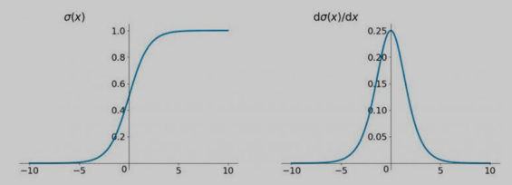
```
1.sigmoid: 又叫逻辑(Logistic)函数，能将(-∞, +∞)的数值映射到(0, 1)的区间，可以用来做二分类
输出范围：(0, 1)
公式：f(x) = 1 / (1 + exp(-x))
导数：f'(x) = f(x) * (1 - f(x))
优点：平滑、易于求导
缺点：容易出现梯度消失
```

```
2.tanh: 双曲正切函数
输出范围：(-1, 1)
公式：f(x) = (1 - exp(-2x)) / (1 + exp(-2x))
导数：f'(x) = 1 - f(x)^2
优点：比sigmoid收敛快
缺点：仍有轻微梯度消失
```


```
3.relu: Rectified Linear Units，修正线性单元，
输出范围：[0,+∞)
公式：relu(x) = max(0, x)
导数：f'(x) = 1 if x > 0 else 0
优点：计算速度快，避免了梯度消失问题（它的梯度在 x>0 时始终为1）
缺点：Dead ReLU问题：当输入为负时，梯度为0，导致神经元不再更新

代码实现：
def relu(x):
    return np.maximum(0, x)
```

```
4.Leaky ReLU
输出范围：(-∞, +∞)
公式：f(x) = max(α * x, x)，α通常是一个小于1的常数（如0.01）
导数：f'(x) = 1 if x > 0 else α
优点：解决了Dead ReLU问题
缺点：需要额外参数α
```
```
5.ELU
公式：x if x > 0 else a(exp(x) - 1)
优点：ReLU的梯度消失问题，同时还具有平滑性
```
```
6.softmax
输出范围：(0,1)，总和为1
公式：f(x) = exp(x) / sum(exp(x))；分子是输入信号的指数函数，分母是所有输入信号的指数函数之和
特点：可以将多分类的输出数值转化为相对概率，而这些值的累和为1

代码实现：
def softmax(x):
    if x.ndim == 2:
        x = x - x.max(axis=1, keepdims=True)  # 防止溢出
        x = np.exp(x)
        x /= x.sum(axis=1, keepdims=True)
    elif x.ndim == 1:
        x = x - np.max(x)  # 防止溢出
        x = np.exp(x) / np.sum(np.exp(x))
    return x
```

```
7.Mish
公式：Mish(x)=x⋅tanh(ln(1+exp(x)))
```

```
8.Swish
公式：f(x) = x * sigmoid(x)
```

#### 69.激活函数的比较
```
1)Sigmoid和RELU: Sigmoid容易出现梯度消失， RELU修正了梯度消失的问题

2)Sigmoid和tanh
  - Sigmoid范围0~1，均值点为0.5; tanh范围-1~1，均值点为0
  - tanh收敛速度比sigmoid快

3)Sigmoid和softmax: Sigmoid用于二分类，softmax用于多分类

4)softmax和Relu: softmax主要用于输出层，Relu主要用于隐藏层
```

#### 70.什么是损失函数？损失函数的作用是什么？
```
损失函数（Loss Function），又称代价函数（Cost Function），用来度量预测值和实际值之间的差异，在模型训练中，为梯度下降更新参数指明方向
```

#### 71.什么是梯度？什么是梯度下降？
```
梯度是一个向量，它表示一个函数在某一点的方向导数。简单来说，梯度告诉我们函数在某一点的增长最快的方向
梯度下降(Gradient Descent)是一种优化算法，用于寻找损失函数的极小值。其基本思想是，从一个初始点开始，沿着梯度的负方向逐步移动，从而使函数值逐步减少，直到达到某个极小值

步骤：
1）求损失函数值
2）是否达到停止条件？如果不是，计算损失函数的梯度
3）按梯度的反方向走一小步（调整权重，Wi+1=Wi−η∇f(Wi)）
4）重复2～3步
```

#### 72.什么是梯度消失？如何解决梯度消失问题？
```
梯度消失问题指的是在反向传播过程中，梯度在层与层之间逐渐变小，最终导致靠近输入层的隐层的权重更新非常缓慢甚至几乎不更新，使得模型难以学习到数据特征

解决方法：
1.选择合适的激活函数，如ReLU、Leaky ReLU等
2.选择合适的权重初始化方式
3.使用残差结构
4.使用批量归一化（Batch Normalization）
```

#### 73.什么是梯度爆炸？如何解决梯度爆炸问题？
```
梯度爆炸是指在神经网络训练过程中，梯度在反向传播的过程中不断累积，导致梯度值变得非常大，从而使权重更新幅度过大，导致网络训练不稳定，甚至无法收敛

解决方法：
1.动态调整学习率
2.选择合适的激活函数
3.梯度剪裁（Gradient Clipping）：在每次参数更新前对梯度进行剪裁，将梯度值控制在一定范围内，从而防止梯度过大
```

#### 74.什么是反向传播算法？为何要使用？
```
反向传播（Backpropagation algorithm）全称“误差反向传播”，是在深度神经网络中，根据输出层输出值，来反向调整隐层权重的一种方法
为了对隐层的参数使用梯度下降，需要先将误差反向传播至隐层，然后才能应用
```

#### 75.深度学习中，常见的优化器（梯度下降算法）有哪些？各有什么特点？
```
1.随机梯度下降（SGD）：每次随机使用一个样本来计算梯度和更新权重。优点是计算快，缺点是收敛速度慢
2.小批量梯度下降（Mini-batch Gradient Descent，MBGD）：结合了BGD和SGD的优点，使用一个小批量样本来计算梯度。平衡了计算效率和收敛速度
3.动量法（Momentum）：在SGD的基础上引入了一个动量项α（通常取0.9），会考虑之前参数更新的方向和速度，解决了SGD的收敛速度慢和陷入局部最低点这两个问题
4.Nesterov加速（NAG）：通过在梯度方向上进行预先的“看向”操作来加速收敛
5.自适应梯度（Adagrad）：根据每个参数的历史梯度平方和来调整学习率
6.RMSprop：采用滑动窗口加权平均值计算二阶动量，解决了Adagrad中学习率有时持续下降的问题
7.Adam（Adaptive Moment Estimation）：结合了Momentum和RMSprop的优点，适应性强，收敛速度快，适合大多数深度学习任务
8.AdamW：是Adam的改进版本，加入了权重衰减（Weight Decay）来正则化模型，防止过拟合。被证明在很多任务中比Adam效果更好
```

#### 76.CNN中的feature map、padding、stride分别是什么？
```
feature map：特征图，即经过卷积操作后输出的图像数据
padding：填充，用来控制输出结果的大小。keras中，设置为valid时，表示不填充；设置为same时，表示输出与输入尺寸相同
stride：步长，可用来控制输出结果的大小
```

#### 77.卷积运算输出矩阵大小的计算公式？
```
OH = (H + 2P - FH) / S + 1
OW = (W + 2P - FW) / S + 1

解释:
H/W：输入图像的高宽
P: padding
FH/FW: 卷积核高宽
S: stride
```

#### 78.CNN网络中的卷积层、激活层、池化层各有什么作用？
```
卷积层（Convolutional Layer）：降维和提取特征
激活层（Activation Layer）：引入非线性因素，增加模型表达能力
池化层（Pooling Layer）：降采样，减少计算量，防止过拟合
```

#### 79.什么是最大池化、平均池化？
```
最大池化（Max Pooling）：选取图像区域的最大值作为池化后的值，有助于提取关键信息
平均池化（Average Pooling）：计算图像区域的平均值作为池化后的值，平滑了特征，有助于去除噪声
```

#### 80.池化层有什么特点？
```
1）没有要学习的参数
2）通道数不发生变化
3）对微小的变化具有鲁棒性
```

#### 81.深度卷积网络中的降采样，有哪些方式？
```
1.stride大于1的pooling
2.stride大于1的conv
3.stride大于1的reorg，主要用于YOLO系列目标检测模型中
```

#### 82.什么是dropout？为什么dropout能避免过拟合？
```
在神经网络训练过程中，根据设置的比例，随机忽略一部分神经元，可以有效防止过拟合，还能提升模型精度

能避免过拟合的原因：
1.降低神经元的相互依赖性
2.降低模型复杂度
3.多模型的集成学习，提升了泛化能力
```

#### 83.什么是批量归一化（Batch Normalization），其优点是什么？
```
以进行学习时的mini-batch为单位，按mini-batch进行归一化。具体而言，就是使mini-batch的数据分布的均值为0、标准差为1

优点：
1.加速收敛
2.不那么依赖初始值
3.防止过拟合
```

#### 84.什么是分词？分词的作用是什么？
```
分词（Word Segmentation）指的是将一段连续的文本按照一定的标准切分成一个一个的词汇。
作用：
1.语义理解
2.信息检索
```

#### 85.中文分词有哪些方法？
```
一、基于规则的方法
1.正向最大匹配法（MM，Maximum Matching）
2.逆向最大匹配法（RMM，Reverse Maximum Matching）
3.双向最大匹配法（BiMM，Bidirectional Maximum Matching）

二、基于统计的方法
1.N-gram模型：计算相邻n个字同时出现的概率，根据概率大小判断词语边界
2.隐马尔可夫模型（HMM）：将词语序列视为一个马尔可夫链，根据模型参数判断词语边界
```

#### 86.什么是词性标记？
```
词性标记（Part-Of-Speech tagging, POS tagging）是将单词分配到各自对应词性的任务。
它可以是名词、动词、形容词、副词、介词等
```

#### 87.什么是词干提取？
```
词干提取（stemming）是抽取词的词干或词根形式，
样本中单词的单复数或时态对于语义分析并无太大影响，所以需要对单词进行
词干提取，比如：cats -> cat , catching -> catch
```

#### 88.什么是词袋模型？它的缺点是什么？
```
词袋模型（Bag-of-words model，BoW）是一种文本表示方法，它将文本转换为词的集合（袋子），忽略词的顺序和语法关系，只关心词的出现频率

缺点：
1.忽略了词语顺序和上下文
2.高维稀疏矩阵
```

#### 89.什么是TF-IDF？

```
TF-IDF（Term Frequency-Inverse Document Frequency，词频-逆文档频率）是一种文本分析和信息检索技术，常用于评估一个文档集中一个词对某份文档的重要程度，核心思想是，如果一个词在一篇文档中频繁出现，而在其他文档中很少出现，那么这个词对这篇文档具有较高的重要性
由两部分组成：
词频（Term Frequency，TF）= 词语i在文档j中出现的次数 / 文档j的总词数
逆文档频率（Inverse Document Frequency，IDF）= log(语料库的文档总数 / (包含词语i的文档数 + 1))
解释：由公式可知，词频越大，语义贡献度越大；出现的文档数越多（说明该词越通用），逆文档频率越接近0，语义贡献度越低
```

#### 90.常用的文本表示方法有哪些？各自特点是什么？
```
一、离散表示方法
1.独热编码（One-Hot）
定义：将每个词表示为一个向量，向量长度等于词典大小，当前词的位置为1，其余位置为0
缺点：忽略了上下文关系、高维稀疏矩阵

2.词袋模型（Bag of Words，BOW）
定义：将文本转换为词的集合（袋子），通过统计词频来表示文本
缺点：忽略了上下文关系、高维稀疏矩阵

3.TF-IDF（词频-逆文档频率）
定义：基于词袋模型，加入了逆文档频率来衡量词的重要性
缺点：忽略了上下文关系、高维稀疏矩阵

二、分布式表示方法
1.N-gram
定义：将连续出现的n个词语作为一个词组，并将其表示为向量

2.共现矩阵
定义：以词语周边的共现词的次数做为当前词语的向量
缺点：高维稀疏矩阵

3.词嵌入（Word Embeddings）
定义：词嵌入模型，如Word2vec、GloVe和FastText，将词语映射到一个低维的连续向量空间中，能够捕捉到词语之间的语义和上下文关系
缺点：计算资源要求高
```

#### 91.什么是语料库？它的特点、作用是什么？
```
语料库（corpus）是指存放语言材料的仓库。现代的语料库是指存放在计算机里的原始语料文本、或经过加工后带有语言学信息标注的语料文本

特点：
• 语料库中存放的是实际中真实出现过的语言材料
• 语料库是以计算机为载体承载语言知识的基础资源
• 真实语料需要经过分析、处理和加工，才能成为有用的资源

作用：
• 支持语言学研究和教学
• 支持NLP系统的开发
```

#### 92.什么是Word2vec？代表模型有哪些？
```
Word2vec是一种词嵌入技术，通过将单词转换为向量形式，使得词与词之间可以定量地度量它们之间的关系

代表模型：
CBOW（连续词袋模型）：从上下文单词预测目标词
Skip-gram（跳字模型）：通过目标词来预测上下文单词
```

#### 93.Word2vec中的负采样是什么？
```
负采样（Negative Sampling）是Word2vec中的一种优化技术，用于加速模型的训练过程。其主要目标是简化Softmax函数的计算，将多分类转变为二分类，从而提升训练效率
```

#### 94.常用的色彩空间有哪些？
```
1.RGB
2.HSV: 色相(hue)、饱和度(saturation)、亮度(value)
3.YUV: 亮度Y、色差信号UV
```

#### 95.什么是图像灰度化处理？具体步骤是怎样的？
```
图像灰度化处理是将彩色图像转换为灰度图像的过程。彩色图像通常使用RGB模型，每个像素由这三种颜色的不同强度组合而成。而灰度图像中，每个像素只包含一个表示亮度的值(0 ~ 255）

步骤：
1.提取RGB值：从彩色图像中提取每个像素的红、绿、蓝三个通道的值
2.计算灰度值：根据某种方法计算每个像素的灰度值。常用的方法有以下几种：
    平均法：灰度值 = (R + G + B) / 3
    加权平均法：灰度值 = 0.3 * R + 0.59 * G + 0.11 * B。这种方法更符合人眼对颜色敏感度的实际情况，人眼对绿色更敏感，因此绿通道的权重更大。
    最大值法：灰度值 = max(R, G, B)
    最小值法：灰度值 = min(R, G, B)
3.生成灰度图像：将计算得到的灰度值赋给图像中的每个像素，从而得到灰度图像

cv2代码实现：
# 将BGR格式转为灰度图像
img_gray = cv2.cvtColor(img, cv2.COLOR_BGR2GRAY)
```

#### 96.什么是图像二值化/反二值化处理，有什么优点？
```
图像二值化处理是将灰度图像或彩色图像转换为只有黑白两种颜色（即二值）的图像的过程
通过设定一个阈值：
二值化：像素值大于阈值的，设为255（白），小于阈值的，设为0（黑）
反二值化：像素值大于阈值的，设为0（黑），小于阈值的，设为255（白）

优点：简化数据，突出特征，便于后续处理

cv2代码实现：

img = cv2.imread("../dl_data/lena.jpg")
img_gray = cv2.cvtColor(img, cv2.COLOR_BGR2GRAY)
cv2.imshow("img_gray", img_gray)

# 二值化
t, binary = cv2.threshold(img_gray, 100, 255, cv2.THRESH_BINARY)  # 100为阈值，大于为255，小于为0
cv2.imshow("binary", binary)

# 反二值化
t2, binary_inv = cv2.threshold(img_gray, 100, 255, cv2.THRESH_BINARY_INV)  # 100为阈值，大于为0，小于为255
cv2.imshow("binary_inv", binary_inv)
```

#### 97.什么是直方图均衡化？
```
直方图均衡化是一种图像处理技术，用于改善图像的对比度。通过调整图像像素的灰度值，使得输出图像的灰度直方图尽可能均匀分布，从而增强图像的细节和对比度

cv2代码实现：
img = cv2.imread('../dl_data/sunrise.jpg', 0)  # 0表示灰度图像
cv2.imshow('img', img)

# 直方图均衡化
img_eq = cv2.equalizeHist(img)
cv2.imshow('img_eq', img_eq)
```

#### 98.图像加法运算有什么应用？
```
图像合成：例如，图像水印可以通过加法叠加到原始图像上
图像去噪：通过对同一场景的多幅图像进行加法运算，可以得到平均值图像，从而减少噪声

cv2代码实现：
# 图像直接相加
add_img = cv.add(lena, lily)  # 图像直接相加，会导致图像过亮、过白
cv.imshow("add_img", add_img)

# 图像权重相加
add_weighted_img = cv.addWeighted(lena, 0.8, lily, 0.2, 0)  # 亮度调节量为50
cv.imshow("add_weighted_img", add_weighted_img)
```

#### 99.图像减法运算有什么应用？
```
运动检测：通过对连续帧进行减法运算，可以检测出前后帧之间的差异，从而识别出运动物体
背景去除：在固定背景的场景中，可以通过减去背景图像来提取前景物体

cv2代码实现：
# 相减
subtract_img = cv.subtract(src1, src2)
```

#### 100.图像放大时，可以采用哪些插值法？
```
1.最近邻插值（Nearest Neighbor Interpolation）
原理：选择最近的一个像素的值作为插值点的值
优点：计算简单，速度快。
缺点：放大后的图像会有明显的锯齿和块状效果，不平滑

2.双线性插值（Bilinear Interpolation）
原理：根据插值点周围的四个像素值，进行线性插值计算，得到插值点的值。
优点：计算复杂度适中，插值结果较平滑。
缺点：图像细节和边缘会有一定程度的模糊。

3.双三次插值（Bicubic Interpolation）
原理：利用插值点周围的16个像素（4x4邻域），进行三次多项式插值计算。
优点：能较好地保留图像细节和边缘信息，插值结果平滑。
缺点：计算复杂度较高，速度比双线性插值慢。

cv2代码实现：
# 放大
dst_size2 = (int(w * 2), int(h * 2))
big_nearest = cv.resize(img, dst_size2, interpolation=cv.INTER_NEAREST)  # 最近邻插值
big_linear = cv.resize(img, dst_size2, interpolation=cv.INTER_LINEAR)  # 双线性插值
```

#### 101.对图像进行模糊平滑处理，可以使用哪些方式？
```
1.均值模糊 ：通过用邻域内所有像素的平均值替换中心像素来进行平滑
2.高斯模糊 ：会对邻域像素赋予不同的权重，距离中心像素越近的像素权重越大
3.中值模糊 ：使用邻域内像素的中值来替换中心像素，特别适用于去除椒盐噪声

cv2代码实现：
# 均值模糊
img_mean_blur = cv.blur(img, (5, 5))
cv.imshow("img_mean_blur", img_mean_blur)

# 高斯模糊
# 第三个参数为高斯核在X方向的标准差
img_gaussian_blur = cv.GaussianBlur(img, (5, 5), 3)
cv.imshow("img_gaussian_blur", img_gaussian_blur)

# 中值模糊
img_median_blur = cv.medianBlur(img, 5)
cv.imshow("img_median_blur", img_median_blur)
```

#### 102.对图像进行边沿检测，有哪些常用算子？
```
1.Sobel算子：基于一阶导数，简单高效
# cv.CV_64F: 输出图像深度，本来应该设置为-1，但如果设成-1，可能会发生计算错误，所以通常先设置为精度更高的CV_64F
# dx, dy: x和y方向的导数
img_sobel = cv.Sobel(img, cv.CV_64F, 1, 1, ksize=5)
cv.imshow("img_sobel", img_sobel)

2.laplacian算子：基于二阶导数，无方向性、噪声敏感
img_laplacian = cv.Laplacian(img, cv.CV_64F)
cv.imshow("img_laplacian", img_laplacian)

3.Canny算子：综合了多种边缘检测技术的改进型算子，抗噪声、效果好
img_canny = cv.Canny(img, 50, 150)  # 50和150是阈值
cv.imshow("img_canny", img_canny)
```

#### 103.图像的腐蚀有哪些实际的应用场景？
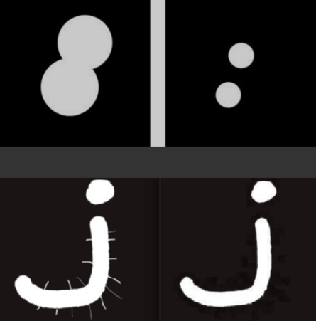
```
定义：沿着边界向内收缩
应用：去除噪声、分离连在一起的物体、去掉小的凸起或毛刺

cv2代码实现：
# 腐蚀
kernel = np.ones((3, 3), np.uint8)
erosion = cv.erode(img, kernel, iterations=3)
```

#### 104.图像的膨胀有哪些实际的应用场景？
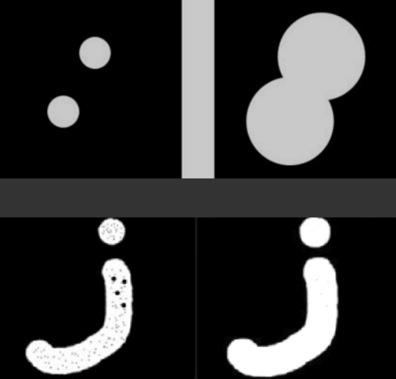
```
定义：向外扩充
应用：连接断开的物体、填补孔洞

cv2代码实现：
# 膨胀
kernel = np.ones((3, 3), np.uint8)
dilate = cv.dilate(img, kernel, iterations=3)
```

#### 105.图像的开运算有哪些实际的应用场景？
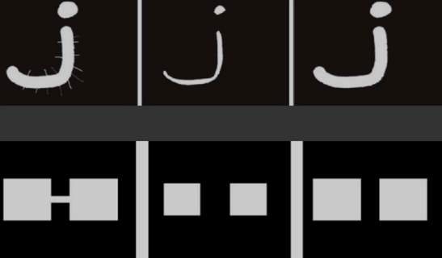
```
定义：先腐蚀，后膨胀
应用：去除噪声、分离物体

cv2代码实现：
# 开运算
kernel = np.ones((3, 3), np.uint8)
res = cv.morphologyEx(img, cv.MORPH_OPEN, kernel, iterations=3)
```

#### 106.图像的闭运算有哪些实际的应用场景？
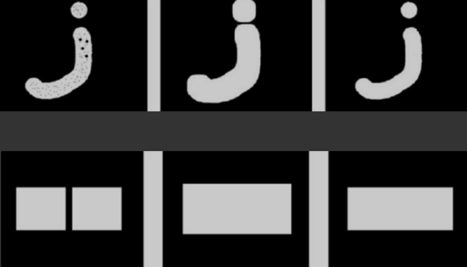
```
定义：先膨胀，后腐蚀
应用：填补孔洞、连接物体

cv2代码实现：
# 闭运算
kernel = np.ones((1, 4), np.uint8)
res = cv.morphologyEx(img, cv.MORPH_CLOSE, kernel, iterations=10)
```

#### 107.图像的形态学梯度运算是什么？

```
定义：膨胀图像减去腐蚀图像
应用：获取边缘信息

cv2代码实现：
# 形态学梯度
kernel = np.ones((2, 2), np.uint8)
res = cv.morphologyEx(img, cv.MORPH_GRADIENT, kernel)
```

#### 108.什么是图像的礼帽运算？

```
主要用于突出图像中的亮细节或暗细节
白礼帽运算 = 原始图像 - 开运算图像
黑礼帽运算 = 闭运算图像 - 原始图像
```

#### 109.在深度学习模型训练中，收敛速度和训练速度分别是什么？
```
收敛速度：指模型训练达到收敛状态所需的时间。收敛状态是指模型的损失函数不再发生显著变化，或者达到预先设定的终止条件
训练速度：指模型训练过程中完成一次迭代所需的时间
```

#### 110.在模型训练过程中，为何增加batch size可能会导致模型的收敛速度变快？
```
batch size 越大，梯度噪声越小，梯度下降的方向更加准确，从而加快收敛速度
```

#### 111.在SVM、逻辑回归等二分类模型中，在模型训练完成后，如果调高分类阈值，模型的precision、recall、auc值会如何变化？
```
precision: 提高
原因：precision = TP / (TP+FP)，当调高阈值时，模型会更倾向于将样本预测为负类，TP和FP都会减少，而FP（错误预测为正类）会减少的更大

recall: 降低
原因：recall = TP / (TP+FN)，当调高阈值时，模型会更倾向于将样本预测为负类，即FN会增加，TP减少

auc: 不变
原因：AUC是ROC曲线下面积，反映了模型在所有可能的分类阈值下的整体性能。本质上是不依赖于单一阈值的，而是反映了模型在不同阈值下的表现。因此，调高分类阈值不会改变AUC值。
```

#### 112.LSTM对比原始RNN的最大改进是什么？bi-LSTM对比LSTM最大的改进是什么？
```
LSTM解决了梯度消失，能处理更长的序列
bi-LSTM能够提取反向序列特征
```

#### 113.经过下列卷积操作后，3x3 conv -> 3x3 conv -> 2x2 max pool -> 3x3conv，卷积步长为1，没有填充，输出神经元感受野是多大？
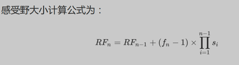
```
公式解释：RFn表示第n层感受野大小，fn表示第n层滤波器大小，si表示到n-1层的步长的连乘

con1:  fn = 3, s = 1
con2:  fn = 3, s = 1
pool3: fn = 2, s = 2
con3:  fn = 3, s = 1

RF1 = 3
RF2 = 3 + (3 - 1) * 1 = 5
RF3 = 5 + (2 - 1) * 1 * 1 = 6
RF4 = 6 + (3 - 1) * 1 * 1 * 2 = 10
```

#### 114.简述离散化的好处，并写出离散化的常用方法有哪些？
```
好处：降维、降低噪声的影响

方法：
1.等宽区间离散化：将连续型数据划分成等宽的区间，每个区间对应一个离散值。例如，可以将用户年龄划分为“0-10岁”、“10-20岁”、“20-30岁”等区间
2.等频离散化：将数据按照等频的原则进行划分。每个区间包含相同数量的数据点
3.基于聚类的离散化：使用聚类算法（如K-means）将数据分成若干簇，每个簇作为一个离散区间
```

#### 115.常见函数的求导公式
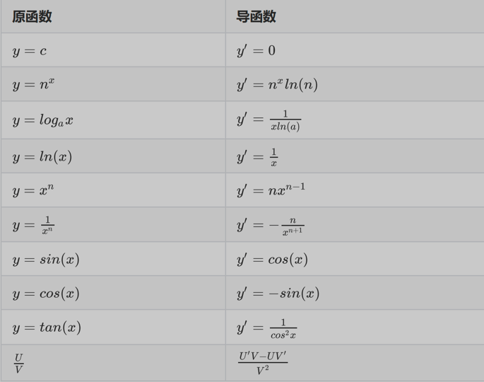
```
y = n^x，当x<0时，y' = -n^xln(n)
```

#### 116.利用梯度下降法优化目标函数ln(wx)，给定第一轮参数w=2, x=10，请写出第三轮优化后的参数值（学习率 = 0.1）
```
梯度下降参数更新公式：w = w - η*(▲fnloss/w)
公式解释：η：学习率；▲fnloss/w：损失函数关于参数w的导数

对ln(wx)求导 = ln(w) = 1 / w
第一轮：w = 2 - 0.1 * (1 / 2) = 1.95
第二轮：w = 1.95 - 0.1 * (1 / 1.95) ≈ 1.8987
第三轮：w = 1.8987 - 0.1 * (1 / 1.8987) ≈ 1.846
```

#### 117.已知卷积层中输入尺寸32x32x3，有10个大小为5x5的卷积核，stride=1，pad=2，输出特征图大小为多少？总的特征数量为多少？
```
特征图尺寸计算公式：OH = (H + 2P - FH) / S + 1

OH = OW = (32 + 2X2 - 5) / 1 + 1 = 32
总特征数量 = 32 x 32 x 10 = 10240
```

#### 118.Faster RCNN中，ROI pooling具体如何工作（怎么把不同大小的框，pooling到同样大小）？

```
这里有3个参数：pooled_w、pooled_h和spatial_scale
- 首先使用spatial_scale参数(16)将每个RoI映射回(M/16)x(N/16)大小的feature map尺度；
- 再将每个RoI对应的feature map区域水平分为 pool_w*pool_h 的网格；
- 对网格的每一份都进行max pooling处理
```

#### 119.简述SSD和YOLO的区别？
```
YOLO通常比SSD速度更快，但准确性略低；SSD通常比YOLO准确性更高，但速度略慢
```

#### 120.YOLOv2与YOLOv3的区别
```
骨干网：YOLOv3采用Darknet53，YOLOv2采用Darknet19
分类器：YOLOv3采用sigmoid，能进行多标签分类，YOLOv2采用softmax，只能进行单标签分类
多尺度融合：YOLOv3采用融合FPN（特征金字塔网络），实现多尺度检测
```

#### 121.测试集中有1000个样本，600个是A类，400个B类，模型预测结果700个判断为A类，其中正确有500个，300个判断为B类，其中正确有200个。请计算B类的查准率（Precision）和召回率（Recall）
```
B为正样本，混淆矩阵如下：

|           | Real A  | Real B  |
|-----------|---------|---------|
| Predict A | 500(TN) | 200(FN) |
| Predict B | 100(FP) | 200(TP) |

precision = TP / (TP + FP) = 200 / (200 + 100) = 2/3
recall = TP / (TP + FN) = 200 / (200 + 200) = 1/2 = 0.5
```

#### 122.Sigmoid函数的导数推导过程
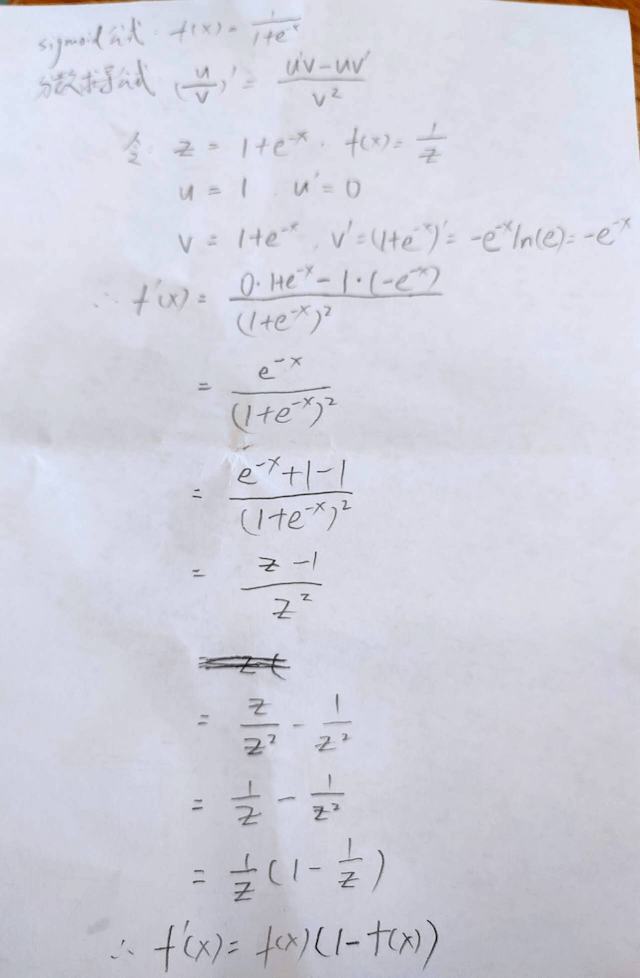

#### 123.深度学习中，实现上采样有哪些方法？
```
1.插值法：最近邻、双线性
2.反卷积
3.反池化
4.转置卷积
```

#### 124.深度可分离卷积是什么？
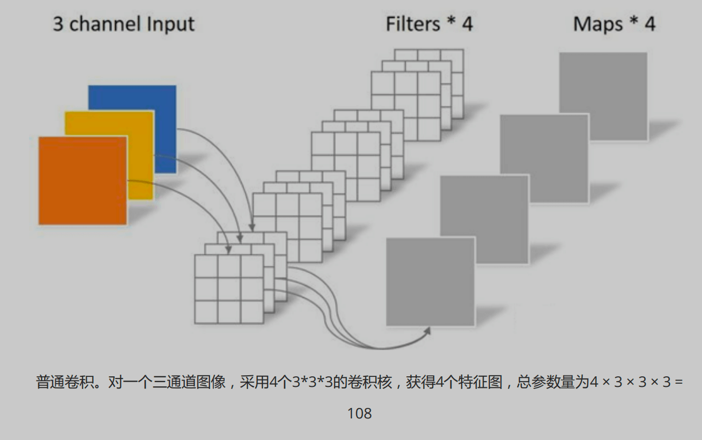
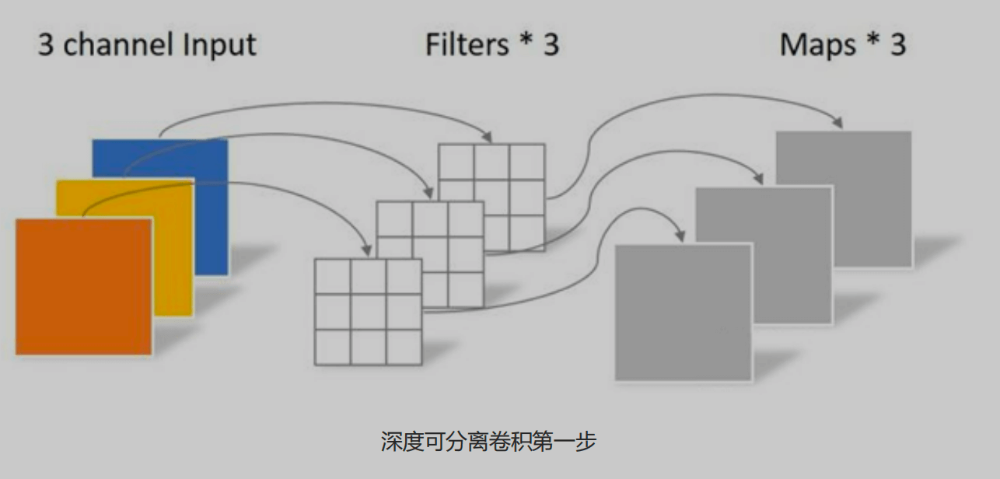
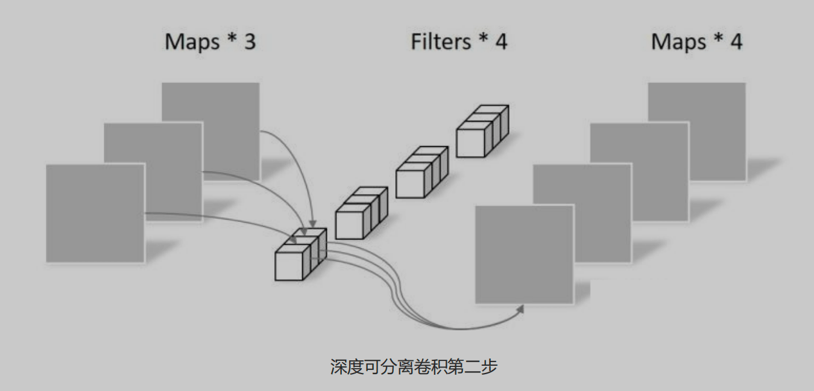
```
深度可分离卷积（Depthwise Separable Convolution）是一种卷积操作，它将标准卷积分解为两个独立的操作：深度卷积（Depthwise Convolution）和逐点卷积（Pointwise Convolution）。这种分解能够显著减少计算量和参数量，从而提高卷积神经网络的效率，特别适合移动端设备
第一步：使用深度卷积，对每个输入通道分别进行卷积操作，比如对于一张RGB的3通道图像，会使用3个卷积核分别对每个通道进行卷积，得到3个feature map
第二步：逐点卷积，使用n个 1×1x3 卷积核在所有深度卷积生成的特征图上进行卷积操作，得到n个特征图，以实现通道间的信息融合
```

#### 125.LSTM跟GRU的区别
```
1.结构：LSTM有三个门（forget，input，output），GRU只有两个门（update和reset）
2.计算效率：LSTM参数更多，推理更慢，GRU参数少，推理更快
```

#### 126.什么是一维傅里叶变换？它在图像分析中有哪些作用？
```
一维傅里叶变换（1D Fourier Transform）是一种将一维信号从时域转换到频域的数学方法。它可以将一个信号分解为不同频率的正弦波和余弦波的叠加。
在图像处理中，它能分离出图像高频部分和低频部分，从而实现边缘检测、图像去噪
```

#### 127.常用图像分割算法有哪些？各有什么优缺点？
```
1.FCN：又称全卷积网络，去掉了CNN中的全连接层。对输入图像进行层层卷积、上采样，预测出每个像素所属的类别
2.U-Net：模型简单、容易理解，针对样本较少的情况也能有较好分割效果
3.Mask RCNN：在Faster RCNN 上增加了FCN来产生定位和分割信息
4.DeepLab系列：引入了空洞卷积，条件随机场等策略，使得分割效果更好
```

#### 128.简单介绍几种常用的人脸检测算法
```
基于传统人脸检测算法：Haar级联人脸检测算法
深度学习人脸检测算法：MTCNN、DeepFace、RetinaFace
```

#### 129.你知道哪些OCR中的文字识别模型和文字检测模型？
```
文字识别模型: CRNN+CTC
文字检测模型: CTPN、SegLink、DB
```

#### 130.在图像处理中，滤波、模糊、去噪，这三者是什么关系？
```
滤波(Filtering)：是一个广泛的概念，指通过某种方式修改图像的像素值以达到特定目的，比如低通滤波可以平滑模糊图像，高通滤波可以锐化增强图像
模糊 (Blurring)：一种滤波的具体应用，使用了低通滤波操作，可以平滑图像，也可用于去噪。常见的模糊方法有均值模糊、中值模糊、高斯模糊
去噪 (Denoising)：指从图像中去除噪声。去噪的方法有很多，滤波是其中一种，基于滤波的常见的去噪方法有均值滤波、中值滤波、高斯滤波
```

#### 131.什么是HOUGH（霍夫）变换？
```
HOUGH（霍夫）变换是一种图像处理技术，用于检测图像中的几何形状（如直线、圆和椭圆等）。它的主要思想是通过将图像空间（通常是二维空间）中的点转换到参数空间（如极坐标空间），然后在参数空间中寻找累加器的局部最大值，这些最大值对应于图像空间中的几何形状
```

#### 132.列出机器学习中常见的分类算法，并比较各自的特点
```
1.逻辑回归（Logistic Regression）：通过Sigmoid函数将线性回归的结果映射到0和1之间
    优点：模型简单，易于理解和实现
    缺点：只能处理二分类问题
2.支持向量机（SVM）：基本思想是找到一个能够最大程度分离不同类别数据的超平面
    优点：有严格的数学理论支持，可解释性强；采用核函数之后，可以处理非线性问题
    缺点：计算复杂度高，适合中小数据集
3.决策树（Decision Tree）：通过树形结构来表示决策过程，每个节点表示一个属性，每个分支表示一个属性值，叶节点表示一个类或决策结果
    优点：易于理解和解释
    缺点：容易过拟合
4.朴素贝叶斯（Naive Bayes）：一种基于贝叶斯定理的概率分类方法。它假设特征之间是相互独立的，这一假设称为“朴素”假设
    优点：容易实现，计算效率高
    缺点：独立性假设在现实中往往不成立
5.K近邻（K-Nearest Neighbors, KNN）：通过计算样本与训练集中最近的K个邻居的距离进行分类
    优点：容易实现，易于理解
    缺点：计算复杂度高
6.随机森林（Random Forest）：基于决策树的Bagging类集成学习方法
    优点：泛化能力强
    缺点：计算复杂
```

#### 133.使用opencv将一个图像旋转180°
```python
def rotate(img, angle, center=None, scale=1.0):
    h, w = img.shape[:2]

    # 旋转中心默认为图像中心
    if center is None:
        center = (w / 2, h / 2)

    M = cv.getRotationMatrix2D(center, angle, scale)
    return cv.warpAffine(img, M, (w, h))
```

#### 134.机器学习中的降维有哪些常用方法？
```
1.主成分分析（PCA）：通过找到数据中最大方差的方向（主成分），将数据投影到这些方向上，从而实现降维
2.线性判别分析（LDA) ：主要用于分类问题。与PCA类似，但LDA不仅考虑数据的方差，还考虑类间差异，目的是最大化类间差异和最小化类内差异。
```

#### 135.vgg16的网络结构？
```
网络结构：16层，包含13个卷积层（卷积+最大池化）和3个全连接层，输出1000个分类
1.卷积层：卷积核统一为3x3，stride=1， padding=1
2.池化层：统一为2x2，stride=2
3.全连接层：2个FC-4096，1个FC-1000
4.使用ReLU激活函数
```

#### 136.ResNet的网络结构？
```
ResNet旨在解决深层网络训练中的梯度消失问题。其核心思想是通过引入残差连接（shortcut connection）来简化网络的训练过程，使得可以训练更深的网络结构
1.残差块(Residual Block)：通过shortcut connection将输入直接加到输出上，从而避免了梯度消失的问题
2.全局平均池化层：以降低参数量并提取全局特征
3.全连接层：搭配softmax给出1000个类别
```

#### 137.什么是学习率的余弦退火？
```
定义：余弦退火（Cosine Annealing）是一种在深度学习训练过程中动态调整学习率的方法。其核心思想是通过余弦函数来降低学习率，从而帮助模型更好地收敛并避免过拟合
公式：η_t = η_min + (η_max - η_min) * 1/2 * (1 + cos(t * π / T))
公式解释：η_t是当前学习率，η_min和η_max分别是最小和最大学习率，t是当前训练步数，T是总训练步数

在训练初期会设置一个较高的学习率，随着训练的进行，学习率按照余弦函数的变化规律逐渐减小，直到达到一个预设的最小值。这种方法可以有效地平衡训练过程中的速度和稳定性，使得模型在接近全局最优解时能够更加精细地调整参数
实际中会结合热重启(Warm Restart)，Warm Restart是指在训练过程中定期重启学习率，并在每次重启时增加学习率，以模拟不同的训练阶段。这种机制可以帮助模型跳出局部最小值，找到更优的解
```

#### 138.简述yolov8网络结构

#### 139.用python实现iou计算
```python
def intersection(box1,box2):
    box1_x1,box1_y1,box1_x2,box1_y2 = box1[:4]
    box2_x1,box2_y1,box2_x2,box2_y2 = box2[:4]
    x1 = max(box1_x1,box2_x1)
    y1 = max(box1_y1,box2_y1)
    x2 = min(box1_x2,box2_x2)
    y2 = min(box1_y2,box2_y2)
    return (x2-x1)*(y2-y1)
    
def union(box1,box2):
    box1_x1,box1_y1,box1_x2,box1_y2 = box1[:4]
    box2_x1,box2_y1,box2_x2,box2_y2 = box2[:4]
    box1_area = (box1_x2-box1_x1)*(box1_y2-box1_y1)
    box2_area = (box2_x2-box2_x1)*(box2_y2-box2_y1)
    return box1_area + box2_area - intersection(box1,box2)
    
def iou(box1,box2):
    return intersection(box1,box2)/union(box1,box2)
```

#### 140.什么是NMS？并用python实现
```
预测结果中，可能多个预测结果间存在重叠部分，需要保留交并比（IoU）最大的、去掉非最大的预测结果，这就是非极大值抑制（Non-Maximum Suppression，简写作NMS）

NMS的算法步骤如下：

1.将所有框放入队列中
2.先找到置信度最高的框（假设为A）
3.将A放入结果数组中
4.依次计算其他框与A的IoU值
5.如果某个框（假设为B）的IoU大于给定阈值（比如0.7），则认为B和A框定的是同一个物体，删除B
6.循环上述步骤，直到队列中没有框了
```
```python
# NMS
boxes.sort(key=lambda x: x[5], reverse=True)

result = []

while len(boxes)>0:
    result.append(boxes[0])
    boxes = [box for box in boxes if iou(box,boxes[0])<0.7]
```

#### 141.mAP值是如何计算的？
```
mAP（mean Average Precision）指的是平均精度均值，是用来评估目标检测算法性能的指标。它的计算方法如下：
1.对于每个类别，将检测结果按照置信度从大到小排序。
2.依次计算每个预测框的查准率和召回率，并绘制出查准率-召回率曲线。
3.计算该类别下面积最大的查准率-召回率曲线下的面积作为该类别的AP（Average
Precision）。
4.对所有类别的AP求平均得到mAP。
```

#### 142.使用pytorch训练模型的完整流程
1.create dataset
```python
device = torch.device("cuda" if torch.cuda.is_available() else "cpu")

class KeypointsDataset(Dataset):
    def __init__(self, img_dir, data_file):
        self.img_dir = img_dir
        with open(data_file, "r") as f:
            self.data = json.load(f)
        
        self.transforms = transforms.Compose([
            transforms.ToPILImage(),
            transforms.Resize((224, 224)),
            transforms.ToTensor(),
            transforms.Normalize(mean=[0.485, 0.456, 0.406], std=[0.229, 0.224, 0.225])
        ])
    
    def __len__(self):
        return len(self.data)
    
    def __getitem__(self, idx):
        item = self.data[idx]
        img = cv2.imread(f"{self.img_dir}/{item['id']}.png")
        h,w = img.shape[:2]

        img = cv2.cvtColor(img, cv2.COLOR_BGR2RGB)
        img = self.transforms(img)
        kps = np.array(item['kps']).flatten()
        kps = kps.astype(np.float32)

        kps[::2] *= 224.0 / w # Adjust x coordinates
        kps[1::2] *= 224.0 / h # Adjust y coordinates

        return img, kps
        
train_dataset = KeypointsDataset("data/images","data/data_train.json")
val_dataset = KeypointsDataset("data/images","data/data_val.json")

train_loader = DataLoader(train_dataset, batch_size=8, shuffle=True)
val_loader = DataLoader(val_dataset, batch_size=8, shuffle=True)
```
2.create model
```python
model = models.resnet50(pretrained=True)
model.fc = torch.nn.Linear(model.fc.in_features, 14*2) # Replaces the last layer
model = model.to(device)
```
3.train model
```python
criterion = torch.nn.MSELoss()
optimizer = torch.optim.Adam(model.parameters(), lr=1e-4)

epochs=20
for epoch in range(epochs):
    for i, (imgs,kps) in enumerate(train_loader):
        imgs = imgs.to(device)
        kps = kps.to(device)

        optimizer.zero_grad()
        outputs = model(imgs)
        loss = criterion(outputs, kps)
        loss.backward()
        optimizer.step()

        if i % 10 == 0:
            print(f"Epoch {epoch}, iter {i}, loss: {loss.item()}")
```
4.validate model
```python
model.eval()

total_loss = 0

with torch.no_grad():
    for i, (imgs,kps) in enumerate(val_loader):
        imgs = imgs.to(device)
        kps = kps.to(device)
        outputs = model(imgs)
        
        loss = criterion(outputs, kps)
        total_loss += loss.item()

        if i != 0 and i % 10 == 0:
            average_loss = total_loss / i
            print(f"val_iter {i}, val_avg_loss: {average_loss}")
```
5.save model
```python
torch.save(model.state_dict(), "keypoints_model.pth")
```

#### 143.什么是SIFT和HOG特征提取？
```
SIFT（尺度不变特征变换）：检测并描述图像中的局部特征点，具有尺度和旋转不变性。
HOG（方向梯度直方图）：用于描述图像局部梯度方向分布，常用于行人检测。
```
