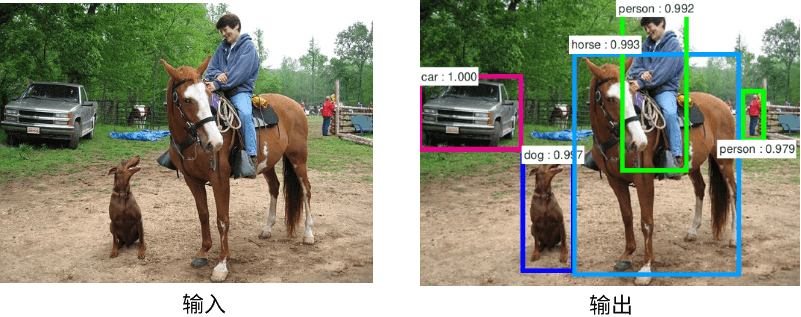
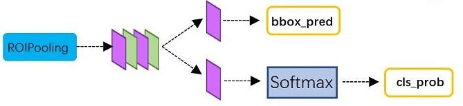
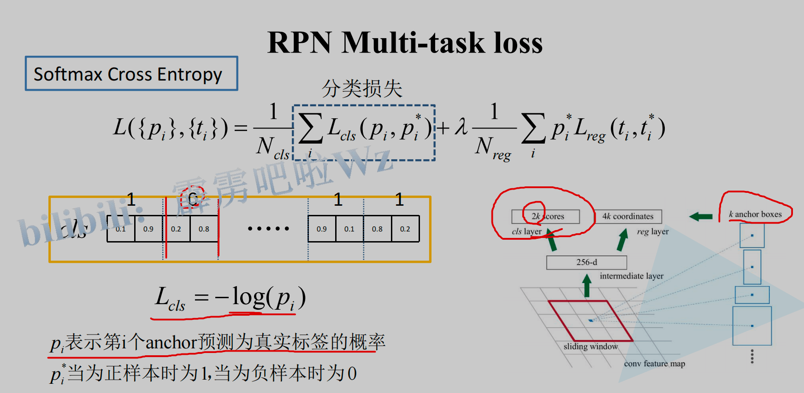

本文综合了网上部分讲解资料，旨在归纳并梳理Faster R-CNN算法相关原理，方便日后查阅复习

## 一、目标检测与Faster R-CNN
目标检测与图像分类同属于计算机视觉（CV）范畴，但前者较后者在难度和复杂度层面又上了一个台阶，因为目标检测不光需要解决“是什么”（分类）的问题，还需要解决“在哪儿”（定位）的问题。

<!--more-->
### 1.目标检测算法分类
基于深度学习的目标检测算法，主要分为两种：one-stage算法和two-stage算法。one-stage（一阶段）算法是在获取的图像特征上直接做分类+回归（定位），而two-stage（两阶段）算法则多了一步：获取图像特征，生成Region Proposal（候选区），再进行分类+回归（定位）

### 2.Faster R-CNN介绍
Faster R-CNN是由Ross B.Girshick在2016年提出的，做为two-stage算法的经典之作，它在前两作（R-CNN和Fast-RCNN）的基础上，又有了很大改进，最终在VOC2007测试集测试mAP达到73.2%，目标检测速度可达5帧/秒（但依然无法实现视频实时检测，所以后来有了one-stage著名的YOLO系列）。虽然提出的较早，但它至今仍是许多目标检测算法的基础，所以对其原理的学习和掌握有助于更好的了解后续模型和算法。

## 二、Faster R-CNN原理详解
### 1.网络结构

如上图，Faster R-CNN网络主要由五部分组成：
- Input(输入): 对于输入的图像，首先需要缩放至固定大小MxN，然后再将MxN图像送入网络。虽然Faster R-CNN本身并不限制输入图像的大小，但是在实际训练过程中，太大的图像容易撑爆内存
- Backbone(主干网络)：也有叫它Extractor的。主要为Conv layers（卷积层），来提取图像特征（feature maps），用于后续的RPN层和全连接层。此处可以使用ZF/vgg/Resnet/MobileNet等。以vgg16为例，包含了13个conv层+13个relu层+4个pooling层
- RPN(Region Proposal Network)：最大的创新点，解决了前两代算法使用ss（selective search）生成region proposals（候选区）太慢的问题。通过softmax判断anchors（下文会讲）属于positive或者negative，再利用bounding box regression修正anchors获得精确的proposals（第一次修正，后面还有一次），这里输出的proposals又称为RoIs（Region of Interests）
- ROI Pooling：输入的是Backbone给到的feature maps和RPN生成的RoIs，通过RoIs在feature map上进行截取，获得proposal feature maps，送入后续全连接层，用于最终的分类和第二次的bounding box（bbox，检测框）regression来修正检测框
- RoI Head：全连接层，有些书里将这部分称之为检测头，主要是利用proposal feature maps计算bbox的类别，同时再次bounding box regression获得检测框最终的精确位置。

下面分别详细介绍这五部分

### 2.Input
主要操作如下：
- 对图片进行缩放，相应的bounding boxes也要进行同等尺度的缩放（不然对不上）
- 归一化处理

会返还4个值供后续训练使用：
- images ： 3×H×W ，BGR三通道，宽W，高H
- bboxes： 4×K , K个bounding boxes，包含每个bounding box的左上角和右下角的座标，形如（Y_min,X_min, Y_max,X_max）
- labels：K， 对应K个bounding boxes的label（对于VOC取值范围为[0-19]）
- scale: 缩放的倍数, 原图H' ×W'被resize到了HxW（scale=H/H' ）

### 3.Backbone
这里面其实包含了conv，pooling，relu三种层。以vgg16为例，共有13个conv层，13个relu层，4个pooling层，值得注意的是：

- 所有的conv层都是：kernel_size=3，pad=1（即填充一圈0），stride=1。即经过conv层后，输出尺寸不变，依旧为MxN
- 所有的pooling层都是：kernel_size=2，pad=0，stride=2。即经过pooling层后，输出尺寸变为原来的1/2

以vgg16为例，因为有4个pooling层，所以一个MxN大小的矩阵经过Backbone后变为(M/16)x(N/16)，即下采样16倍，这个比列（16）很重要，后续feature map映射回原图时需要通过它来计算

### 4.RPN
RPN用于提供候选区域，它其实也是一个神经网络，有自己的loss function，以及相关概念，它实现了对Region Proposal的初步二分类和定位
#### (1)Anchor Box
在RPN中，作者提出了Anchor的概念。Anchor是人为预定义的边框(先验框)，也就是一组预设的边框。在训练时，以真实的边框位置相对于预设边框的偏移来构建训练样本。这就相当于，**预设边框先大致在可能的位置“框“出来目标，然后再在这些预设边框的基础上进行调整**。

在一幅图像中，要检测的目标可能出现在图像的任意位置，并且目标可能是任意的大小和任意形状，为了尽可能的框出目标可能出现的位置，预定义边框通常有上千个甚至更多

Anchor Box的生成是以Backbone最后生成的feature Map上的点为中心的（可以映射回原图），以vgg16为例，使用vgg对输入的图像下采样了16倍，也就是Feature Map上的一个点对应于输入图像上的一个16×16的正方形区域（感受野）。根据预定义的Anchor，Feature Map上的一点为中心，就可以在原图上生成9种不同形状不同大小的边框，如下图：


作者论文中用到的anchor有三种尺寸(scale)和三种比例(ratio)，如下图所示，三种尺寸分别是小（蓝128）中（红256）大（绿512），三个比例分别是1:1，1:2，2:1。3×3的组合总共有9种anchor。


例如，一张800x600的原始图片，经过vgg下采样后(生成特征矩阵)16倍大小，大小变为50*38，每个点设置9个anchor，则总数为:
```python
ceil(800/16) * cei1(600/16) * 9 = 50*38*9 = 17100
```
本质上，scale是用来表示目标的大小，ratio是用来表示目标的形状

#### (2)网络结构

结合上面两张图，可以看到RPN网络实际分为2条线，上面一条通过softmax分类anchors获得positive和negative分类，下面一条用于计算对于anchors的bounding box regression偏移量，以获得精确的proposal。

#### (3)流程步骤
##### a.做3x3卷积
对于Backbone输出的feature map，通道数为256（作者使用的ZF为256，如果是vgg则为512），RPN会先做一个3x3的卷积，此时输出通道数不变

##### b.设置anchor box
对于feature map上的每个点，计算出k（默认k=9）个anchor boxes(注意和proposal的差异)。

##### c.对anchor box分类
将这些anchor boxes输入到一个1*1的卷积层（如上图“RPN网络”的上路分支），获得一个特征向量，输出通道数为2k（默认k=9的话，就是2x9=18），至于为什么要乘以2，是因为后面需要用来区分每个anchor box是属于positive(前景，包含目标)，还是negative(背景，不包含目标)。然后做一个softmax（前后的2个reshape是为了便于softmax分类），这里也可以使用sigmoid来实现。

那RPN是如何对这些anchor boxes区分是positive还是negative的呢？论文中规定，符合下面条件之一的即为positive:
- 与任意GT(Ground Truth)区域的IoU大于0.7
- 与GT区域的IoU最大的anchor(也许不到0.7)

而与任意GT的区域的IoU都小于0.3的anchor设为negative，对于既不是positive也不是negative的anchor以及跨越图像边界的anchor就直接舍弃掉。

##### d.获取bounding box coordinates
在RPN网络图的下路，通过1x1的卷积，生成了一个包含4k（默认k=9的话，就是4x9=36）个coordinates（dx, dy, dw, dh, 相对于真实物体框的偏移）的特征向量，并结合上路分类获取的2k个score(如下图)，一起进入到最后的Proposal Layer

  


##### e.Proposal Layer
Proposal Layer负责综合所有coordinates(dx, dy, dw, dh)变换量和positive anchors，计算出精准的proposal，送入后续RoI Pooling Layer

该层有3个输入：
- positive or negative anchors分类结果(score)
- 上述anchor对应的bbox reg的coordinates(dx, dy, dw, dh)变换量
- im_info：对于原始图像PxQ，在Input时做了缩放，reshape到了MxN尺寸，则im_info=[M, N, scale_factor]
- feature_stride：Backbone中下采样的倍数。以vgg16为例，4个pooling层，每经过一个pooling，图像尺寸变为原来的1/2，所以feature_stride=16

该层的流程如下图 (摘自《深度学习之PyTorch物体检测实战》)：


首先生成大小固定的全部Anchors，然后将网络中得到的回归偏移作用到Anchor上使Anchor更加贴近于真值，并修剪超出图像尺寸的Proposal，得到最初的RoIs（region of interests）。在这之后，按照分类网络输出的得分对RoIs排序，保留前12000个得分高的RoIs。由于一个物体可能会有多个RoIs重叠对应，因此再应用非极大值抑制（NMS）将重叠的框去掉，最后在剩余的RoIs中再次根据RPN的预测得分选择前2000个，作为最终的RoIsl，输出到下一个阶段。

其中，对于anchor box的回归（定位）偏移调整又是如何实现的呢？这里偷个懒，直接贴一篇大神的解释：[Fast R-CNN中的边框回归](https://www.cnblogs.com/wangguchangqing/p/10393934.html)，讲的很详细

那NMS去掉重叠框又是怎么操作的呢？具体过程如下图：

假设有A和B两个框，A的score是0.98，B的score是0.86，计算AB的IoU，如果IoU大于阈值（比如0.5），则认为AB是同一个物体，然后删除score较小的B，以此循环来去掉重叠的框

RPN网络结构就介绍到这里，总结起来就是：
**生成anchors -> softmax分类器提取positvie anchors -> bbox reg回归修正positive anchors -> Proposal Layer生成RoIs**

### 5.RoI Pooling

该部分负责收集RoIs，并在原始的feature map上截取出proposal feature maps，送入后续网络。从上图中可以看到Rol pooling层有2个输入：
- 原始的feature maps
- RPN输出的RoIs

#### (1)为何需要RoI Pooling
因为RoIs是从anchor box修正来的，所以大小各不相同，而后面的FC（全连接层）又需要统一的输入尺寸，所以这里使用pooling将RoIs大小统一

#### (2)RoI Pooling运算过程
这里有3个参数：pooled_w、pooled_h和spatial_scale
- 首先使用spatial_scale参数(16)将每个RoI映射回(M/16)x(N/16)大小的feature map尺度；
- 再将每个RoI对应的feature map区域水平分为 pool_w*pool_h 的网格；
- 对网格的每一份都进行max pooling处理


  这样处理后，即使大小不同的RoI，输出结果都是 pool_w*pool_h 固定大小，实现了固定长度输出

RoI Pooling是一种特殊的Pooling操作，假设给定一张图片的feature map(512×H/16×W/16) ，和128个候选区域的座标（128×4），RoI Pooling将这些区域统一下采样到（512×7×7），就得到了128×512×7×7的向量。可以看成是一个batch-size=128，通道数为512，7×7的feature map 
#### (3)为什么要pooling成7×7的尺度？
  是为了能够共享权重。看下vgg网络结构图（如下），Faster R-CNN除了用到vgg前几层的卷积之外，最后的全连接层也可以继续利用。当所有的RoIs都被pooling成（512×7×7）的feature map后，将它reshape 成一个一维的向量，就可以利用vgg16预训练的权重，初始化前两层全连接


### 6.RoI Head

该部分网络结构如上图，利用已经获得的proposal feature maps，通过全连接层与softmax计算每个RoI具体属于哪个类别（人、车、电视等），输出cls_prob概率向量（这里有21个值，即20个类别+1个背景）；同时再次利用bounding box regression获得每个proposal的位置偏移量bbox_pred（这里有84个值，21个类 x 每个类有4个位置参数），用于回归更加精确的目标检测框

### 7.损失函数
Faster R-CNN的loss由两部分组成：RPN的loss + RoI Head中的loss构成，而这两部分中，每一个部分的loss又都是由分类loss + 回归loss组成。以RPN为例，如下图：


其中分类损失部分，使用多分类交叉熵，如下图：


也可以使用sigmoid实现，即二分类交叉熵，如下图：


回归损失部分，使用smooth L1函数，如下图：


关于smooth L1可以参考这篇文章：[回归损失函数1：L1 loss, L2 loss以及Smooth L1 Loss的对比](https://www.cnblogs.com/wangguchangqing/p/12021638.html)


## 三、QA
### 1.bbox、anchor box、RoI、region proposal的区别？

- bbox：全称是bounding box，边界框。其中GT(Ground Truth) Bounding Box是每一张图中人工标注的框的位置。一张图中有几个目标，就有几个框。Faster R-CNN的预测结果也可以叫bounding box，不过一般叫 Predict Bounding Box
- anchor box: 中文有翻译成锚框、先验框的。是人为选定的具有一定尺度、比例的框。一个feature map的锚框的数目可以有上万个（比如 20000）
- RoI: region of interest，候选框、候选区域。在RPN阶段，先穷举生成千上万个anchor，然后利用Ground Truth Bounding Boxes，训练这些anchor，而后从anchor中找出一定数目的候选区域（RoIs）。RoIs在下一阶段用来训练RoIHead，最后生成Predict Bounding Boxes
- region proposal：候选区域，简称proposal，个人认为和RoI是一个概念，只不过通过RPN生成的proposal，又起了一个新名字叫RoI

### 2.为什么需要anchor box，而不是直接去预测位置？
如果没有Anchor，做物体检测需要直接预测每个框的坐标，由于框的坐标变化幅度大，使网络很难收敛与准确预测，而Anchor相当于提供了一个先验的阶梯，使得模型去预测Anchor的偏移量，即可更好地接近真实物体。
实际上，Anchor是我们想要预测属性的先验参考值，并不局限于矩形框。如果需要，我们也可以增加其他类型的先验，如多边形框、角度和速度等。

### 3.Faster R-CNN中一共有几个loss？
有4个，如下：
- RPN分类损失：anchor是否为前景（二分类）
- RPN位置回归损失：anchor位置微调
- RoI分类损失：RoI所属类别（21分类，多了一个类作为背景）
- RoI位置回归损失：继续对RoI位置微调
  
四个损失相加作为最后的损失，反向传播，更新参数


参考文章：

[一文读懂Faster RCNN](https://zhuanlan.zhihu.com/p/31426458)

[从编程实现角度学习Faster R-CNN](https://zhuanlan.zhihu.com/p/32404424)

[目标检测中的Anchor详解](https://www.cnblogs.com/wangguchangqing/p/12012508.html)

[Fast R-CNN中的边框回归](https://www.cnblogs.com/wangguchangqing/p/10393934.html)

[精读Faster RCNN](https://zhuanlan.zhihu.com/p/82185598)

[回归损失函数1：L1 loss, L2 loss以及Smooth L1 Loss的对比](https://www.cnblogs.com/wangguchangqing/p/12021638.html)

[Faster R-CNN理论合集](https://www.bilibili.com/video/BV1af4y1m7iL/)

[原始论文](https://arxiv.org/abs/1506.01497)
