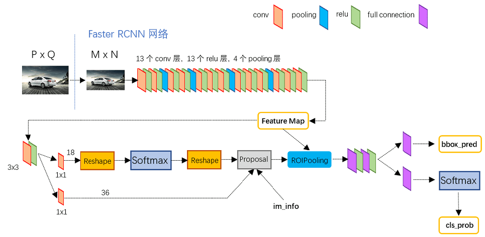
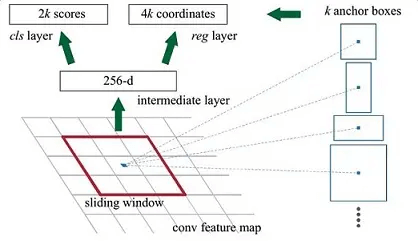

本文综合了网上部分讲解资料，旨在归纳并梳理Faster R-CNN算法相关原理，方便日后查阅复习

### 一、目标检测与Faster R-CNN
目标检测与图像分类同属于计算机视觉（CV）范畴，但前者较后者在难度和复杂度层面又上了一个台阶，因为目标检测不光需要解决“是什么”（分类）的问题，还需要解决“在哪儿”（定位）的问题。

#### 1.目标检测算法分类
基于深度学习的目标检测算法，主要分为两种：one-stage算法和two-stage算法。one-stage（一阶段）算法是在获取的图像特征上直接做分类+回归（定位），而two-stage（两阶段）算法则多了一步：获取图像特征，生成Region Proposal（候选区），再进行分类+回归（定位）

#### 2.Faster R-CNN介绍
Faster R-CNN是由Ross B.Girshick在2016年提出的，做为two-stage算法的经典之作，它在前两作（R-CNN和Fast-RCNN）的基础上，又有了很大改进，最终在VOC2007测试集测试mAP达到73.2%，目标检测速度可达5帧/秒（但依然无法实现视频实时检测，所以后来有了one-stage著名的YOLO系列）。虽然提出的较早，但它至今仍是许多目标检测算法的基础，所以对其原理的学习和掌握有助于更好的了解后续模型和算法。
<!---->
### 二、Faster R-CNN原理详解
#### 1.网络结构

如上图，Faster R-CNN网络主要由五部分组成：
- Input(输入): 对于输入的图像，首先需要缩放至固定大小MxN，然后再将MxN图像送入网络。虽然Faster R-CNN本身并不限制输入图像的大小，但是在实际训练过程中，太大的图像容易撑爆内存
- Backbone(主干网络)：主要为Conv layers（卷积层），来提取图像特征（feature maps），用于后续的RPN层和全连接层。此处可以使用vgg/Resnet/MobileNet等。以vgg16为例，包含了13个conv层+13个relu层+4个pooling层
- RPN(Region Proposal Network)：最大的创新点，解决了前两代算法使用ss（selective search）生成region proposals（候选区）太慢的问题。通过softmax判断anchors（下文会讲）属于positive或者negative，再利用bounding box regression修正anchors获得精确的proposals（第一次修正，后面还有一次），这里输出的proposals又称为RoIs（Region of Interests）
- ROI Pooling：输入的是Backbone给到的feature maps和RPN生成的RoIs，综合这些信息后输出proposal feature maps，送入后续全连接层，用于最终的分类和第二次的bounding box（bbox，检测框）regression来修正检测框
- RoI Head：全连接层，有些书里将这部分称之为检测头，主要是利用proposal feature maps计算bbox的类别，同时再次bounding box regression获得检测框最终的精确位置。

下面分别详细介绍这五部分

#### 2.Input
主要操作如下：
- 对图片进行缩放，相应的bounding boxes也要进行同等尺度的缩放（不然对不上）
- 归一化处理

会返还4个值供后续训练使用：
- images ： 3×H×W ，BGR三通道，宽W，高H
- bboxes： 4×K , K个bounding boxes，包含每个bounding box的左上角和右下角的座标，形如（Y_min,X_min, Y_max,X_max）
- labels：K， 对应K个bounding boxes的label（对于VOC取值范围为[0-19]）
- scale: 缩放的倍数, 原图H' ×W'被resize到了HxW（scale=H/H' ）

#### 3.Backbone
这里面其实包含了conv，pooling，relu三种层。以vgg16为例，共有13个conv层，13个relu层，4个pooling层，值得注意的是：

- 所有的conv层都是：kernel_size=3，pad=1（即填充一圈0），stride=1。即经过conv层后，输出尺寸不变，依旧为MxN
- 所有的pooling层都是：kernel_size=2，pad=0，stride=2。即经过pooling层后，输出尺寸变为原来的1/2

以vgg16为例，因为有4个pooling层，所以一个MxN大小的矩阵经过Backbone后变为(M/16)x(N/16)，即下采样16倍，这个比列（16）很重要，后续anchor box映射到feature map上时需要通过它来计算

#### 4.RPN
##### (1)Anchor Box
在RPN中，作者提出了Anchor的概念。Anchor是人为预定义的边框(先验框)，也就是一组预设的边框。在训练时，以真实的边框位置相对于预设边框的偏移来构建训练样本。这就相当于，**预设边框先大致在可能的位置“框“出来目标，然后再在这些预设边框的基础上进行调整**。

在一幅图像中，要检测的目标可能出现在图像的任意位置，并且目标可能是任意的大小和任意形状，为了尽可能的框出目标可能出现的位置，预定义边框通常有上千个甚至更多

本质上，scale是用来表示目标的大小，ratio是用来表示目标的形状

Anchor Box的生成是以Backbone最后生成的Feature Map上的点为中心的（映射回原图的坐标），以vgg16为例，使用vgg对输入的图像下采样了16倍，也就是Feature Map上的一个点对应于输入图像上的一个16×16的正方形区域（感受野）。根据预定义的Anchor, Feature Map上的一点为中心，就可以在原图上生成9种不同形状不同大小的边框，如下图：

作者论文中用到的anchor有三种尺寸(scale)和三种比例(ratio)，如下图所示，三种尺寸分别是小（蓝128）中（红256）大（绿512），三个比例分别是1:1，1:2，2:1。3×3的组合总共有9种anchor

##### (2)网络结构

可以看到RPN网络实际分为2条线，上面一条通过softmax分类anchors获得positive和negative分类，下面一条用于计算对于anchors的bounding box regression偏移量，以获得精确的proposal。

##### (3)RPN中的anchor box

参考文章：

[一文读懂Faster RCNN](https://zhuanlan.zhihu.com/p/31426458)

[从编程实现角度学习Faster R-CNN](https://zhuanlan.zhihu.com/p/32404424)

[目标检测中的Anchor详解](https://www.cnblogs.com/wangguchangqing/p/12012508.html)
