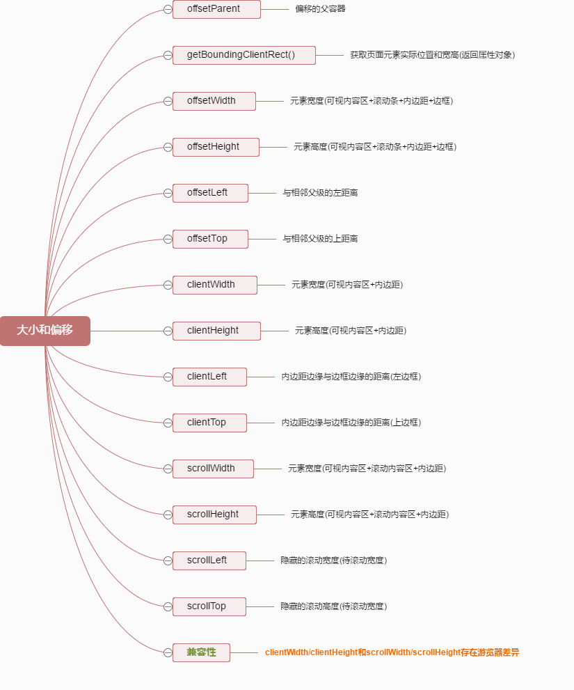
<!--more-->


## 一、JS宽高属性
### 1.window相关

| 属性 | 说明 |
|:----|:-----|
|   window.innerHeight  |   浏览器窗口高度，如果存在水平滚动条，则包括滚动条（不包括标题、工具栏、状态栏）   |
|  window.innerWidth   |   浏览器窗口宽度，如果存在垂直滚动条，则包括滚动条（不包括标题、工具栏、状态栏）   |
|   window.outerHeight  |   浏览器窗口整个高度，包括窗口标题、工具栏、状态栏等   |
|   window.outerWidth  |   浏览器窗口整个宽度，包括侧边栏，窗口镶边和调正窗口大小的边框   |
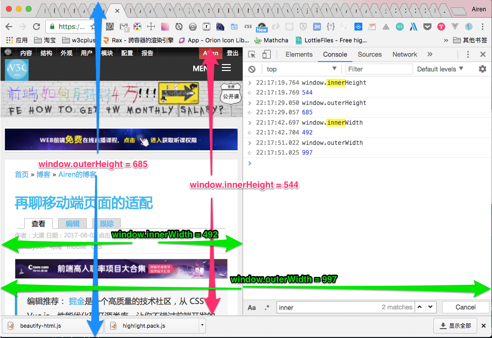

### 2.window.screen相关

| 属性  | 说明  |
|:--|:--|
|  window.screen.width | 显示器屏幕的宽度（与分辨率有关）|
| window.screen.height  | 显示器屏幕的高度（与分辨率有关）  |
|  window.screen.availHeight | 浏览器窗口在屏幕上可占用的垂直空间（桌面高度去掉任务栏高度）  |
| window.screen.availWidth  |  返回浏览器窗口可占用的水平宽度 |
|  window.screenTop |  返回浏览器上边距离屏幕上边界的距离 |
|  window.screenLeft | 返回浏览器左边距离屏幕左边界的距离  |
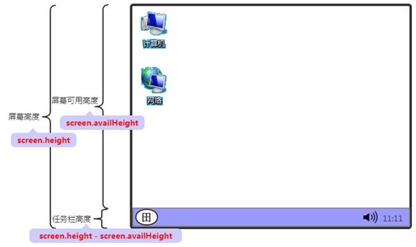

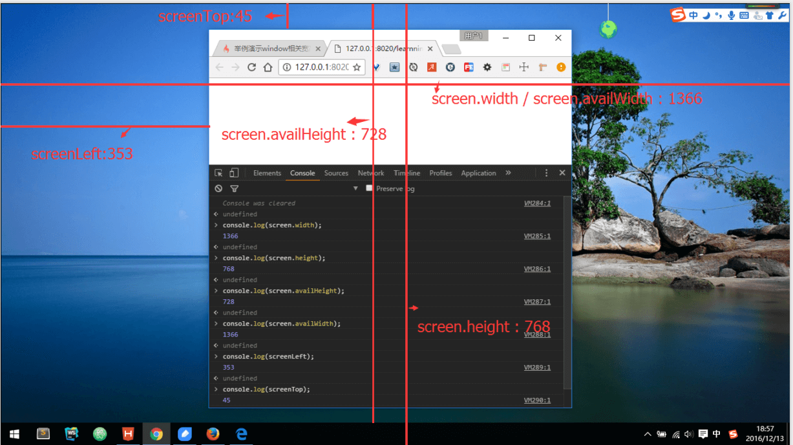

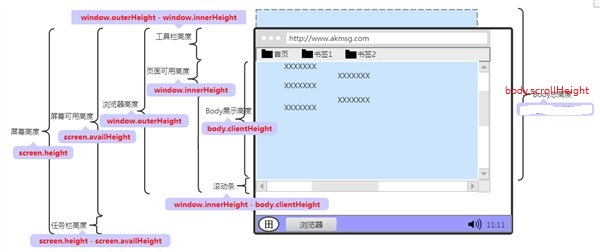

### 3.client相关

| 属性 | 说明 |
|:----|:-----|
| clientHeight    |   元素可视区域的高度，包含内边距，但不包括水平滚动条、边框和外边距   |
|   clientWidth  |   元素可视区域的宽度，包含内边距，但不包括垂直滚动条、边框和外边距   |
|  clientTop   |   元素顶部边框的宽度，等于border-top   |
|  clientLeft   |   元素左边边框的宽度，等于border-left   |
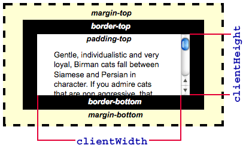

### 4.offset相关

| 属性 | 说明 |
|:----|:-----|
|  offsetParent   |   返回一个指向最近的包含该元素的已定位元素。如果没有定位的元素，则 offsetParent 为最近的 table元素对象或根元素（标准模式下为 html；怪异模式下为 body）。当元素的 style.display设置为 none 或定位为fixed时，offsetParent 返回 null   |
|   offsetHeight  |   在clientHeight的基础上， 加上边框和滚动条的高度   |
|  offsetWidth   |  在clientWidth的基础上， 加上边框和滚动条的高度    |
|   offsetLeft  |   当前元素到其offsetParent 节点的左边的距离   |
|  offsetTop   |   当前元素到其offsetParent 节点的上边的距离   |
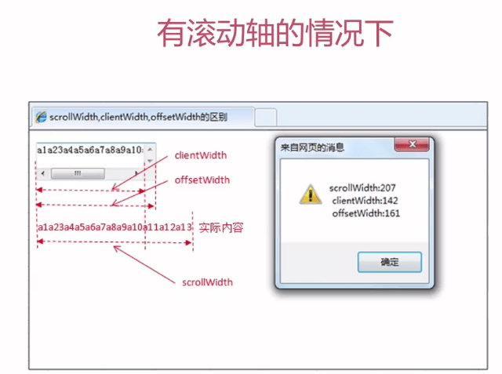

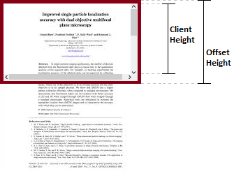

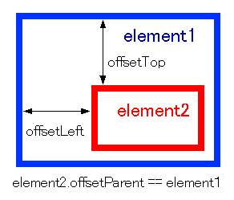

### 5.scroll相关

| 属性 | 说明 |
|:----|:-----|
|  scrollHeight   |   元素完整的高度和内边距，这个高度包括肉眼看不见、溢出、被窗口遮挡的部分   |
|  scrollWidth   |  元素完整的宽度和内边距，这个宽度度包括肉眼看不见、溢出、被窗口遮挡的部分    |
|  scrollTop   |   元素的 scrollTop 值是这个元素的顶部到它的最顶部可见内容（的顶部）的距离的度量。当一个元素的内容没有产生垂直方向的滚动条，那么它的 scrollTop 值为0；获取元素若为body时，document.body.scrollTop == window.scrollY;   |
|   scrollLeft  |   可以读取或设置元素滚动条到元素左边的距离，元素被卷起来的宽度；获取元素若为body时，document.body.scrollLeft == window.scrollX;   |
|  window.scrollX   |  返回文档/页面水平方向滚动的像素值    |
|  window.scrollY   |  返回文档在垂直方向已滚动的像素值    |
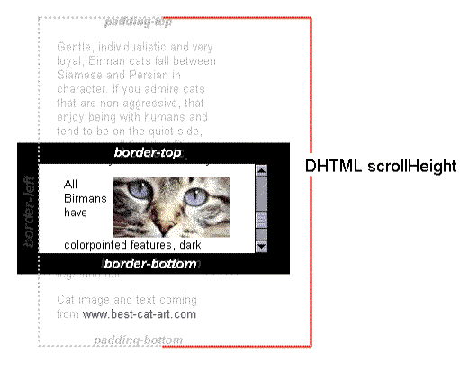

### 6.Event相关

| 属性 | 说明 |
|:----|:-----|
|  e.clientX/clientY   |  相对于可视区域左上角的坐标    |
|  e.pageX/pageY   |  相对于整个文档（包括未显示区域）左上角的坐标    |
|  e.screenX/screenY   |   相对于屏幕左上角的坐标   |
|   e.offsetX/offsetY  |   相对于事件源（当前元素）左上角的坐标   |
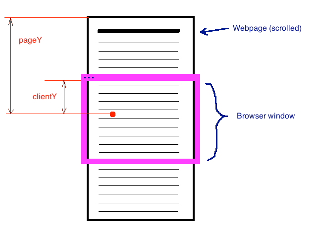

## 二、jQuery宽高属性

| 属性 | 说明 |
|:----|:-----|
|  width()   |   元素的content区域宽度   |
|  height()   |   元素的content区域高度   |
|  innerWidth()   |  元素的content+padding区域宽度    |
|  innerHeight()   |  元素的content+padding区域高度    |
|  outerWidth(Boolean)   |  可选，默认表示元素的content+padding+border区域的宽度，如果为true表示元素的content+padding+border+margin区域的宽度    |
|   outerHeight(Boolean)  |  可选，默认表示元素的content+padding+border区域的高度，如果为true表示元素的content+padding+border+margin区域的高度    |
|   scrollLeft()  |   相对于水平滚动条左边的距离   |
|   scrollTop()  | 相对于垂直滚动条上边的距离     |
|  offset()   |   返回相对于document的当前坐标值，包含left、top值   |
|  position()   |   返回相对于offsetParent的当前坐标值，包含left、top值   |
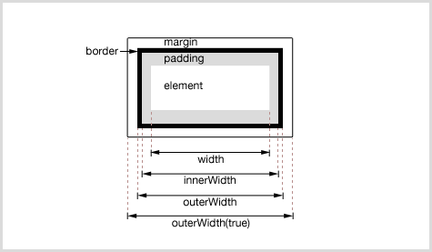

## 三、常用判断
### 1.判定元素是否滚动到底
如果元素滚动到底，下面等式返回true，没有则返回false：
```javascript
element.scrollHeight - element.scrollTop === element.clientHeight
```

### 2.offsetTop 与 style.top 的区别
(1) offsetTop 返回的是数字，而 style.top 返回的是字符串，除了数字外还带有单位：px

(2) offsetTop 只读，而 style.top 可读写

(3) 如果没有给 HTML 元素指定过 top 样式，则 style.top 返回的是空字符串

### 3.获取页面滚动条当前位置
```javascript
if (document.documentElement && document.documentElement.scrollTop) { 
    scrollTop = document.documentElement.scrollTop; 
} else if (document.body) {
	scrollTop = document.body.scrollTop; 
}
```

### 4.获取页面可视范围高度
```javascript
if (document.body.clientHeight && document.documentElement.clientHeight) { 
    warpHeight = Math.min(document.body.clientHeight, document.documentElement.clientHeight);
 } else { 
	warpHeight = Math.max(document.body.clientHeight, document.documentElement.clientHeight); 
} 
 ```

### 5.获取页面完整高度
```javascript
 Math.max(document.body.scrollHeight, document.documentElement.scrollHeight)
```

### 6.获取滚动条宽度
```javascript
var scrollBarWidth = el.offsetWidth - el.clientWidth;
```

### 7.页面滚动离开首屏(这时可显示回到顶部的按钮)
```javascript
document.body.scrollTop > window.innerHeight
```

### 8.图片懒加载判断
```javascript
function lazyload() {
	    var images = document.getElementsByTagName('img');
	    var len    = images.length;
	    var n      = 0;      //存储图片加载到的位置，避免每次都从第一张图片开始遍历		
	    return function() {
		var seeHeight = document.documentElement.clientHeight;
		var scrollTop = document.documentElement.scrollTop || document.body.scrollTop;
		for(var i = n; i < len; i++) {
		    if(images[i].offsetTop < seeHeight + scrollTop) {
		        if(images[i].getAttribute('src') === 'images/loading.gif') {
			     images[i].src = images[i].getAttribute('data-src');
			}
			n = n + 1;
		     }
		}
	    }
	}
	var loadImages = lazyload();
	loadImages();          //初始化首页的页面图片
	window.addEventListener('scroll', loadImages, false);
```

 参考链接：

 [JavaScript 及 jQuery 中的各种宽高属性图解](https://juejin.im/entry/58523bf8128fe1006d9990ee)

 [JavaScript学习笔记：视口宽高、位置与滚动高度](https://www.w3cplus.com/javascript/offset-scroll-client.html)

 [JS、jQuery各种宽高属性](https://segmentfault.com/a/1190000007681873)