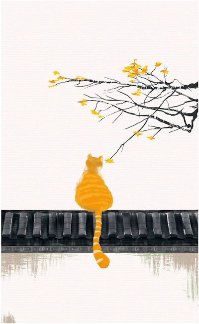

<!--more-->
_作者：季羡林_

不管你愿意不愿意，成为时间的奴隶就正是文明的表现。

“顺其自然”是最好的办法。

“不为无益之事，何以遣有涯之生！”

一个民族，一个人也一样，了解自己是非常不容易的

对荣誉的另一种追求，是我们对自己的长处评价过高。这是我们对自己怀有的本能的爱，这种爱使我们把自己看得和我们的实际情况完全不同。

一个人生在世间，如果想有所成就，必须具备三个条件：才能、勤奋、机遇。行行皆然，人人皆然，概莫能外。

天地之悠悠是自然规律，是人力所无法抗御的

关键问题，依我看，就是中国特有的“国粹”——面子问题。 同“面子”一样，“骨气”这个词儿也是无法译成外文的，是中国的国粹。

我从不叹老，也不嗟贫，认为“长江后浪推前浪，世上新人换旧人”，这是自然规律，用不着嗟叹。不过自己毕竟有了一把子年纪，迟早会向地球告别的。但是地球绝不停止转动，人类也不会停止进步，光明就在前面，希望在于将来。

如果人生真有意义与价值的话，其意义与价值就在于对人类发展的承上启下、承前启后的责任感。

一个人活在世界上，必须处理好三个关系：第一，人与大自然的关系；第二，人与人的关系，包括家庭关系在内；第三，个人心中思想与感情矛盾与平衡的关系。这三个关系，如果能处理得好，生活就能愉快；否则，生活就有苦恼。

至于个人心中思想感情的矛盾，则多半起于私心杂念。解之之方，唯有消灭私心，学习诸葛亮的“淡泊以明志，宁静以致远”，庶几近之。

不完满才是人生

顺其自然，尽上人事

我的座右铭：纵浪大化中，不喜亦不惧。应尽便须尽，无复独多虑。

人生在世一百年，天天有些小麻烦。最好办法是不理，只等秋风过耳边。

我问苍松，苍松不语。我问翠柏，翠柏不答。我问三十多年来目睹我这些悲欢离合的二月兰，她也沉默不语，兀自万朵怒放，笑对春风，紫气直冲霄汉

