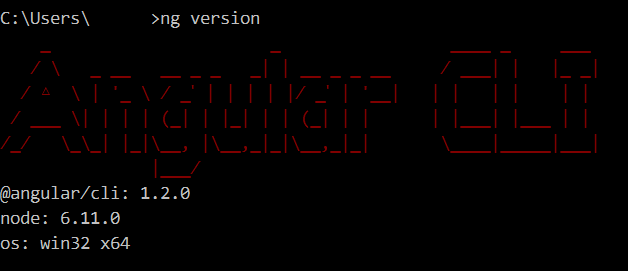
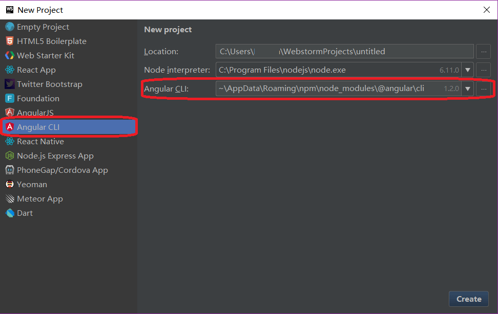
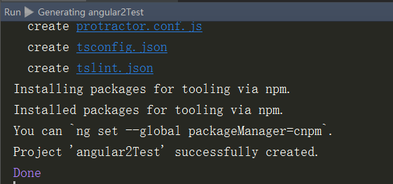
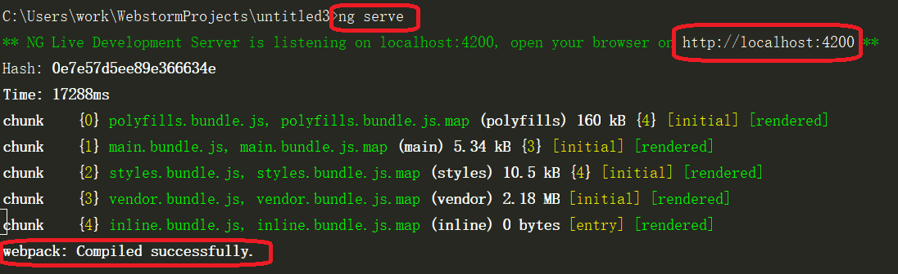
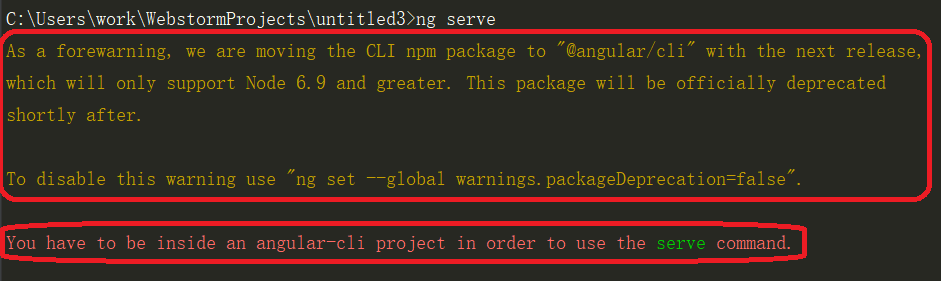
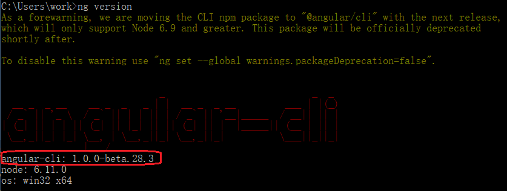

### 一、安装[nvm-windows](https://github.com/coreybutler/nvm-windows/releases "nvm-windows")，方便node版本切换
```shell
nvm list              #查看已安装的版本
nvm install 6.11.0    #安装Node.js 6.11.0，因为@angular/cli需要6.9版本以上支持
nvm use 6.11.0        #切换到新安装的版本
```
<!--more-->
### 二、为npm配置proxy(proxy软件需自行安装)
```shell
npm config set proxy=http://localhost:1080
npm config set https-proxy=http://localhost:1080
```


### 三、安装[@angular/cli](https://github.com/angular/angular-cli "@angular/cli")（正式版）
```shell
npm install -g @angular/cli
```
安装完后，查看ng版本（如下图）
```shell
ng version 
```



### 四、使用webstorm创建Angular 2项目
1.打开webstorm，选择"create new project"

2.选择Angular CLI，此时会自动侦测并配置刚才安装好的Angular CLI（如下图）



3.点右下角“create”，创建project

4.当Run窗格中出现“Installing packages for tooling via npm ”字样时，需稍等片刻，之后即可successfully created（如下图）




### 五、启动项目
1. terminal中输入
```shell
ng serve
```
2. 出现编译成功信息（如下图）


3. 浏览器地址栏输入：localhost:4200，显示如下图即OK


### *遇到的问题*
### 1.“You have to be inside an angular-cli project in order to use the serve command”
@angular/cli正式版安装后，依然在使用beta版，故报错（如下图）


查看版本，的确是beta版（如下图）


参考[官方升级文档](https://github.com/angular/angular-cli/wiki/stories-1.0-update "官方升级文档")，需卸载之前beta版
```shell
nvm use 5.12.0                        #切换node版本
npm uninstall -g angular-cli          # Remove global package
npm uninstall --save-dev angular-cli  # Remove from package.json

```


