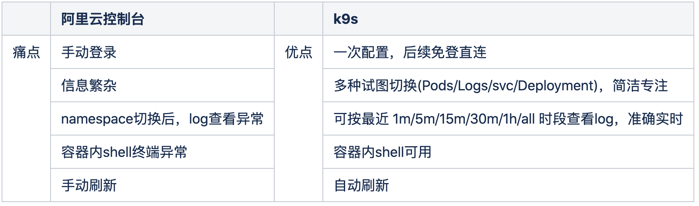
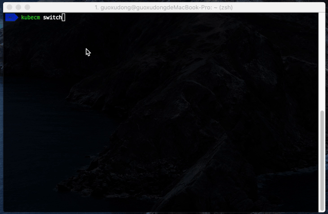
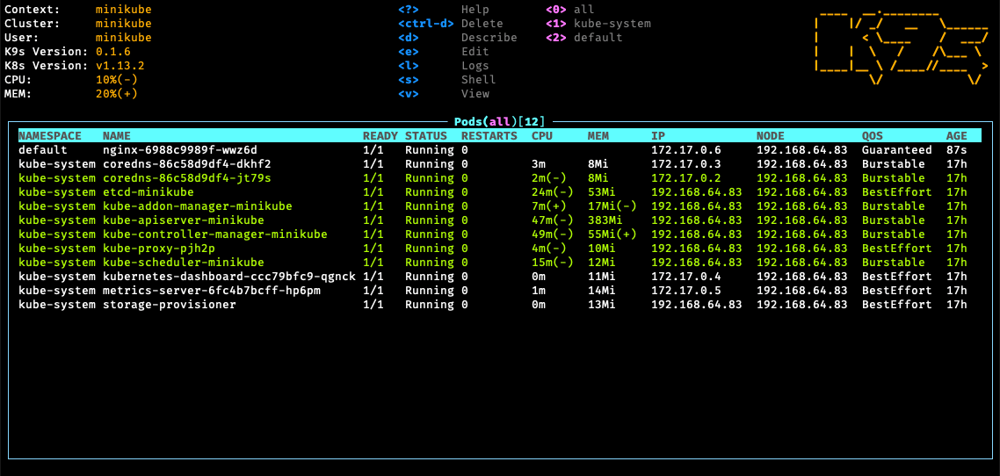
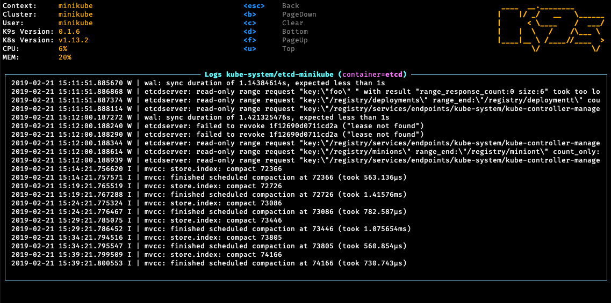
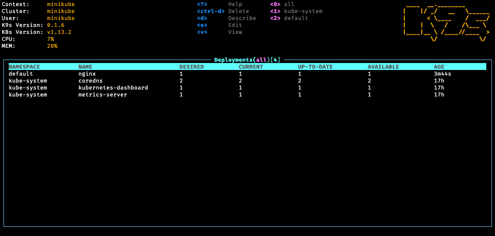
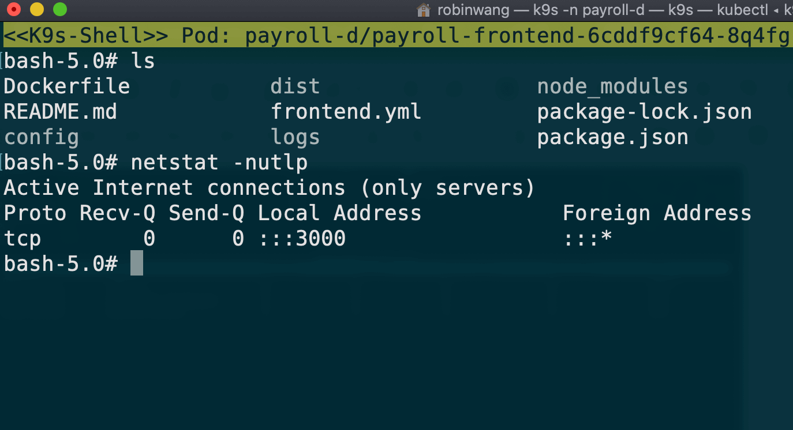
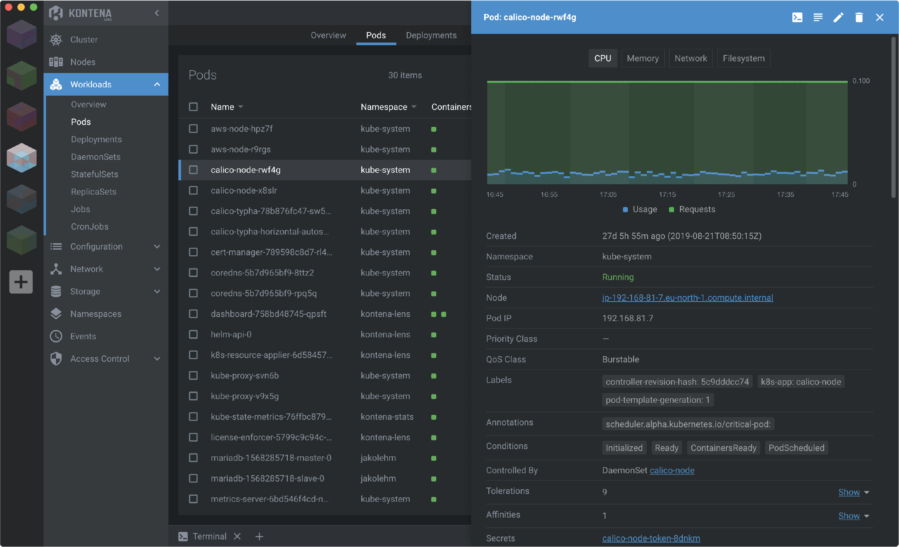

#### 一、什么是k9s？

k9s 是一个管理k8s集群很方便快捷的工具，不需要敲那么多的kubectl命令即可查看和操作集群。
<!--more-->

#### 二、为何使用k9s？



#### 三、如何使用k9s？
##### 1.完成如下3个步骤：
a.申请集群权限

b.安装kubectl: 可参考[官方文档](https://kubernetes.io/zh/docs/tasks/tools/install-kubectl/)安装

c.创建不同集群的kubeConfig文件（./kube/dev、stage、prod，但请保留原来存在的config文件）

##### 2.使用[kubeCM](https://github.com/sunny0826/kubecm)，合并配置，实现多集群context切换

a.[安装kubeCM](https://kubecm.cloud/#/en-us/install)

b.[多集群配置合并](https://cloud.tencent.com/developer/article/1649637) :
```shell
# Merge kubeconfig in the dir directory
kubecm merge -f dir
 
or
 
# Merge kubeconfig in the directory and overwrite the original kubeconfig file
kubecm merge -f dir -c
```
c.查看合并后的./kube/config文件中，是否包含了3个cluster的信息

d.使用kubecm switch切换context（注：出于运维安全考虑，可能大家的账户都没有k8s API权限，故暂时无法列出namespace）


##### 3.使用k9s查看集群
a.[安装k9s](https://github.com/derailed/k9s)

b.启动k9s，并查看当前context(之前kubecm switch到的)指定的namespace（注：出于运维安全考虑，如果大家的账户都没有k8s API权限，则无法列出namespace，只能手动指定）

```shell
k9s -n namespace // 指定的命名空间，例如：xxx-d, xxx-q
```

c.输入:pod，查看Pods


选择pod下某个container，按l，查看容器日志


输入:deploy，查看deployments


选择pod下某个container，按s，可进入容器shell，查看容器内情况


写在最后：其实除了k9s，还有很多更方便、更强大的k8s工具，比如lens：


但出于运维安全考虑，如果账户没有k8s API权限，无法列出namespace，则无法使用lens
