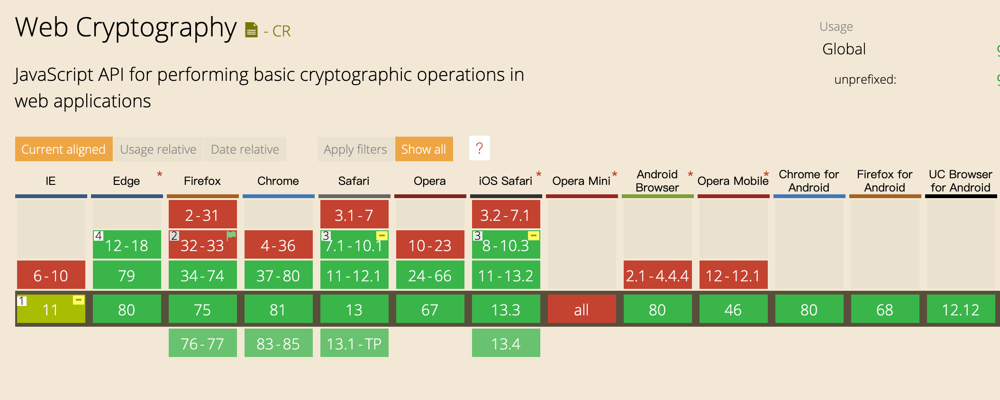

### 一、密码学家的工具箱
在密码学中，有一个著名的说法，叫“密码学家的工具箱”，指的是密码学中常用的6种技术：对称密码、公钥密码、单向散列函数、消息认证码、数字签名、伪随机数生成器。它们在信息安全中发挥着重要的作用，我们可以用下图来表示各项技术与其解决的问题之间的关系：
<!--more-->

随着近些年来Web标准的突飞猛进，新增的[Web Crypto API](https://developer.mozilla.org/zh-CN/docs/Web/API/SubtleCrypto)，就很好地实现了上述几种技术，它提供了常用算法的加密/解密/签名/验证/摘要/key生成/协商等操作，并统一采用Promise来处理异步逻辑，为密码学在Web端的实现，提供了较为标准的支持。

今天我们就来尝试下，使用Web Crypto API简单实现一个“密码学家的工具箱”

### 二、开工之前
#### 1.浏览器兼容性
由于是新特性，我们需要先查看下[浏览器兼容性](https://caniuse.com/#feat=cryptography)，来决定是否使用，如下图：

2个值得留意的问题是：
- 需要IE11及以上才支持
- 由于是安全相关的API，Chrome要求在HTTPS下才能使用

如果我们需要兼容旧版浏览器，还可以尝试下polyfill/shim: [webcrypto-shim](https://github.com/vibornoff/webcrypto-shim)、[webcrypto-liner](https://github.com/PeculiarVentures/webcrypto-liner)

#### 2.检测客户端浏览器是否支持
如下代码可以帮助我们检测当前浏览器是否存在crypto全局对象，因为大部分方法，都在crypto.subtle下：
```javascript
var crypto = window.crypto || window.msCrypto; // for IE 11

if (crypto.subtle){
	...
} else {
  console.log("Unable to create window.crypto object");
}
```
当然如果你对Web Crypto API或者密码学已经有所了解，需要查看某些密码算法在当前浏览器的支持情况，这里有一个[Live Table](https://diafygi.github.io/webcrypto-examples/)可以满足你的要求。

### 三、开始打造
#### 1.[伪随机数生成器](https://developer.mozilla.org/zh-CN/docs/Web/API/RandomSource/getRandomValues)
伪随机数在密码技术的很多场景中都会被用到，比如生成密钥(用于对称加密或消息认证码)、生成初始向量、生成盐等。

**API语法：**
```javascript
cryptoObj.getRandomValues(typedArray);
```

**说明：**
> 由于密码操作的对象本质上是比特序列，所以Web Crypto API传入的消息数据通常会是[ArrayBuffer](https://developer.mozilla.org/zh-CN/docs/Web/JavaScript/Reference/Global_Objects/ArrayBuffer)，比如这里的参数是一个[TypedArray](https://developer.mozilla.org/zh-CN/docs/Web/JavaScript/Reference/Global_Objects/TypedArray)，该参数会被符合密码学要求的随机值填充

**示例：**
```javascript
var array = new Uint32Array(10);
window.crypto.getRandomValues(array);
console.log(array); // [1894854709, 484538754, 1141990970, 1112093908, 2934866807, 2755048609, 2706065410, 344867006, 2460161930, 4126202407]
```

#### 2.[单向散列函数](https://developer.mozilla.org/en-US/docs/Web/API/SubtleCrypto/digest)
又称为单向哈希函数、杂凑函数，可以把任意长度的输入消息，转变成固定长度的输出(散列值)。单向，指的是无法根据散列值，反推输入的消息。常见的有SHA-256、SHA-512等

**API语法：**
```javascript
const digest = crypto.subtle.digest(algorithm, data);
```

**说明：**
> 当前支持的算法：
>- SHA-1(不推荐)
>- SHA-256
>- SHA-384
>- SHA-512

**示例：**
```javascript
const text = 'An obscure body in the S-K System, your majesty. The inhabitants refer to it as the planet Earth.';

async function digestMessage(message) {
  const encoder = new TextEncoder();
  const data = encoder.encode(message);
  const hash = await crypto.subtle.digest('SHA-256', data);
  return hash;
}

const digestBuffer = await digestMessage(text);
console.log(digestBuffer.byteLength); // 32
```

#### 3.[消息认证码](https://developer.mozilla.org/zh-CN/docs/Web/API/SubtleCrypto/sign)
消息认证码可以用来确保消息的完整性，并提供认证，需要配合共享密钥和特定算法来实现，最终会输出固定长度的MAC值。

HMAC是一种使用单向散列函数来构造消息认证码的方法，开头的H就是Hash的意思，在Web Crypto API中可以通过crypto.subtle.sign()和verify()方法实现

**语法：**
```javascript
const signature = crypto.subtle.sign(algorithm, key, data);

const result = crypto.subtle.verify(algorithm, key, mac, data);
```

**说明：**
> 通过传入"HMAC"字符串或者{ "name": "HMAC" }，来使用HMAC；key为共享密钥，可以事先生成或导入；mac为散列值；data为ArrayBuffer或ArrayBuffer视图对象

**示例：**
```javascript
const text = "An obscure body in the S-K System, your majesty. The inhabitants refer to it as the planet Earth.";

async function getMac(message, key){
  const encoder = new TextEncoder();
  const data = encoder.encode(message);
  return await crypto.subtle.sign("HMAC", key, data);
}

async function verifyMac(message, key, mac){
  const encoder = new TextEncoder();
  const data = encoder.encode(message);
  return await crypto.subtle.verify("HMAC", key, mac, data);
}

async function generateKey() {
  return await crypto.subtle.generateKey(
    {
      name: "HMAC",
      hash: { name: "SHA-256" } //可以是 "SHA-1", "SHA-256", "SHA-384", 或 "SHA-512"
    },
    true, // 是否可提取，比如用于导入导出
    ["sign", "verify"] // 用途
  );
}

const key = await generateKey();
const mac = await getMac(text, key);
console.log(mac.byteLength); // 32

const result = await verifyMac(text, key, mac);
console.log(result); // true
```

#### 4.[对称加密](https://developer.mozilla.org/en-US/docs/Web/API/SubtleCrypto/encrypt)
也称为共享密钥加密，即加密与解密使用相同的密钥，加解密效率高，但存在密钥配送的问题，常见的如DES、AES等。可以通过crypto.subtle.encrypt()和decrypt()方法实现，这里以[AES-GCM](https://juejin.im/post/5e93d001f265da47b924dcb5)为例：

**语法：**
```javascript
const result = crypto.subtle.encrypt(algorithm, key, data);

const result = crypto.subtle.decrypt(algorithm, key, data);
```

**说明：**
> 当前支持的对称加密算法：
>- AES-CBC
>- AES-CTR
>- AES-GCM
>
> key为共享密钥，可以事先生成或导入；data为ArrayBuffer或ArrayBuffer视图对象

**示例：**
```javascript
const text = "An obscure body in the S-K System, your majesty. The inhabitants refer to it as the planet Earth.";
let iv;

async function encryptMessage(message, key){
  const encoder = new TextEncoder();
  const data = encoder.encode(message);
  iv = crypto.getRandomValues(new Uint8Array(12));// 推荐12字节
  return await crypto.subtle.encrypt(
    {
      name: "AES-GCM",
      iv,
      tagLength: 128, //可选，默认128，还可以是32, 64, 96, 104, 112, 120
    },
    key,
    data
  );
}

async function decryptMessage(cipherText, iv, key){
  const result = await crypto.subtle.decrypt(
    {
      name: "AES-GCM",
      iv,
      tagLength: 128
    },
    key,
    cipherText
  );
  const decoder = new TextDecoder();
  return decoder.decode(result);
}

async function generateKey() {
  return await crypto.subtle.generateKey(
    {
      name: "AES-GCM",
      length: 256, //可以是128, 192, 256, 但Chrome当前不支持192
    },
    true,
    ["encrypt", "decrypt"]
  );
}

const key = await generateKey();
const cipherText = await encryptMessage(text, key);
const plainText = await decryptMessage(cipherText, iv, key);
console.log(plainText); // An obscure body in the S-K System, your majesty. The inhabitants refer to it as the planet Earth.
```

#### 5.[非对称加密](https://developer.mozilla.org/en-US/docs/Web/API/SubtleCrypto/encrypt)
又称公钥加密，使用前需要生成一对公私密钥对，用公钥加密的消息，只能用私钥解密。它解决了密钥配送的问题，通常会配合对称加密一起使用，常用的如RSA。我们依旧可以通过crypto.subtle.encrypt()和decrypt()方法实现

**语法：**
```javascript
const result = crypto.subtle.encrypt(algorithm, publicKey, data);

const result = crypto.subtle.decrypt(algorithm, privateKey, data);
```

**说明：**
> 当前支持的非对称加密算法：
>
>- RSA-OAEP
>
> publicKey/privateKey为公私密钥；data为ArrayBuffer或ArrayBuffer视图对象

**示例：**
```javascript
const text = "An obscure body in the S-K System, your majesty. The inhabitants refer to it as the planet Earth.";

async function encryptMessage(message, publicKey){
  const encoder = new TextEncoder();
  const data = encoder.encode(message);
  return await crypto.subtle.encrypt(
      {
        name: "RSA-OAEP",
      },
      publicKey,
      data
    );
}

async function decryptMessage(cipherText, privateKey){
  const result = await crypto.subtle.decrypt(
    {
      name: "RSA-OAEP"
    },
    privateKey,
    cipherText
  );
  const decoder = new TextDecoder();
  return decoder.decode(result);
}

async function generateKeyPair() {
  return await crypto.subtle.generateKey(
    {
      name: "RSA-OAEP",
      modulusLength: 2048, //密钥长度，可以是1024, 2048, 4096，建议2048以上
      publicExponent: new Uint8Array([0x01, 0x00, 0x01]), // 公共指数e，一般用65537
      hash: "SHA-256", //可以是"SHA-1", "SHA-256", "SHA-384", "SHA-512"
    },
    true,
    ["encrypt", "decrypt"]
  );
}

const keyPair = await generateKeyPair();
const cipherText = await encryptMessage(text, keyPair.publicKey);
const plainText = await decryptMessage(cipherText, keyPair.privateKey);
console.log(plainText); // An obscure body in the S-K System, your majesty. The inhabitants refer to it as the planet Earth.
```

#### 6.[数字签名](https://developer.mozilla.org/en-US/docs/Web/API/SubtleCrypto/sign)
消息认证码的局限性在于不能防否认，因为它使用了共享密钥，而配合公钥加密，数字签名就可以解决这个问题，流程如下图：

我们可以通过crypto.subtle.sign()和verify()方法实现

**语法：**
```javascript
const signature = crypto.subtle.sign(algorithm, privateKey, data);

const result = crypto.subtle.verify(algorithm, publicKey, signature, data);
```

**说明：**
> 当前支持的签名算法：
>
>- RSASSA-PKCS1-v1_5
>- RSA-PSS
>- ECDSA
>
> publicKey/privateKey为公私密钥；data为ArrayBuffer或ArrayBuffer视图对象

**示例：**
```javascript
const text = "An obscure body in the S-K System, your majesty. The inhabitants refer to it as the planet Earth.";

async function signMessage(message, privateKey){
  const encoder = new TextEncoder();
  const data = encoder.encode(message);
  return await crypto.subtle.sign(
      {
        name: "RSA-PSS",
        saltLength: 32,
      },
      privateKey,
      data
    );
}

async function verifyMessage(message, signature, publicKey){
  const encoder = new TextEncoder();
  const data = encoder.encode(message);
  return await crypto.subtle.verify(
    {
      name: "RSA-PSS",
      saltLength: 32,
    },
    publicKey,
    signature,
    data
  );
}

async function generateKeyPair() {
  return await crypto.subtle.generateKey(
    {
      name: "RSA-PSS",
      modulusLength: 2048, //密钥长度，可以是1024, 2048, 4096，建议2048以上
      publicExponent: new Uint8Array([0x01, 0x00, 0x01]), // 公共指数e，一般用65537
      hash: "SHA-256", //可以是"SHA-1", "SHA-256", "SHA-384", "SHA-512"
    },
    true,
    ["sign", "verify"]
  );
}

const keyPair = await generateKeyPair();
const signature = await signMessage(text, keyPair.privateKey);
const result = await verifyMessage(text, signature, keyPair.publicKey);
console.log(result); // true
```

### 四、完工收尾
通过Web Crypto API，我们简单实现了“密码学家的工具箱”，从示例代码中，我们会发现绝大部分的接口都是window.crypto.subtle的方法，方法的输入均为ArrayBuffer，返回则是Promise对象。

由于Web加密标准还在演进中，各浏览器对标准的支持各不相同，大家还是需要根据实际项目需求来取舍。除了文中谈到的，Web Crypto API还有一些其他方法，感兴趣的同学可以从[MDN](https://developer.mozilla.org/zh-CN/docs/Web/API/SubtleCrypto)了解更多。

由于文章中涉及的知识点较多，本人阅读材料有限，行文中难免疏漏，还望大家不吝指正。

参考文章：

[Web Crypto API - MDN](https://developer.mozilla.org/zh-CN/docs/Web/API/SubtleCrypto)

[Web Cryptography API Examples](https://github.com/diafygi/webcrypto-examples)

[Examples - MDN](https://github.com/mdn/dom-examples/tree/master/web-crypto)

[Web Crypto API简介](https://cloud.tencent.com/developer/article/1171800)

[W3C Recommendation](https://www.w3.org/TR/WebCryptoAPI/)


