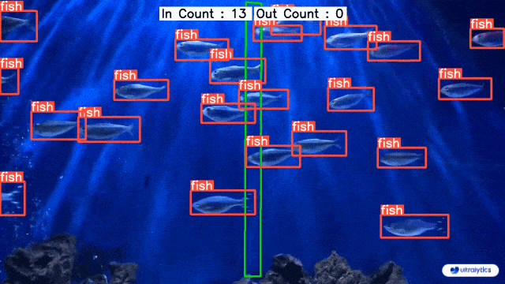

本文旨在梳理并总结项目过程，方便后续回顾查阅。

部分预测结果：

<!--more-->
### 一、目标检测的应用场景
基于深度学习的目标检测，目前在各个领域都有广泛的应用场景，可以归纳为以下几类：

- 交通领域：智能驾驶、智能交通、行人跟踪、车辆检测
- 工业领域：瑕疵检测、裂缝检测、归类检测、智能农业
- 商业领域：直播检测、商品检测、文本检测
- 医学领域：细胞检测、病灶检测





### 二、项目描述
#### 1.任务描述
- 基于YOLOv8和自定义数据集UNIMIB2016，对pretrained model进行fine tune来添加新的类别（意大利菜），从而实现对菜品的识别检测
- 使用 W&B sweep 进行 hyperparameter tune（超参数调优），来进一步优化模型性能

#### 2.数据集

使用的数据集来源于 [UNIMIB2016 Food Database](http://www.ivl.disco.unimib.it/activities/food-recognition/)，数据集在一家真实的意大利餐厅中收集而来，每张照片的尺寸为 (3264, 2448)，包含一个托盘和托盘上不同的食物。


一共有1027张照片，共计73种菜品，总计3616个菜品实例。一些种类的食物只是在成分上有所不同，所以命名为“FoodName 1”, “FoodName 2”。

因为菜品原文是意大利语，我用AI对其进行了翻译，大致中文译名如下：

| 编号 | 意大利语 | 中文翻译 |
| ---- | -------- | -------- |
| 0    | pane     | 面包     |
| 1    | mandarini| 橘子     |
| 2    | carote   | 胡萝卜   |
| 3    | patate/pure | 土豆/土豆泥 |
| 4    | cotoletta| 炸肉排   |
| 5    | fagiolini| 青豆     |
| 6    | yogurt   | 酸奶     |
| 7    | budino   | 布丁     |
| 8    | spinaci  | 菠菜     |
| 9    | scaloppine | 薄切肉片 |
| 10   | pizza    | 披萨     |
| 11   | pasta_sugo_vegetariano | 素食酱汁意大利面 |
| 12   | mele     | 苹果     |
| 13   | pasta_pesto_besciamella_e_cornetti | 香蒜酱白酱意大利面和羊角面�� |
| 14   | zucchine_umido | 炖西葫芦 |
| 15   | lasagna_alla_bolognese | 博洛尼亚千层面 |
| 16   | arancia  | 橙子     |
| 17   | pasta_sugo_pesce | 海鲜酱汁意大利面 |
| 18   | patatine_fritte | 炸薯条 |
| 19   | pasta_cozze_e_vongole | 贻贝和蛤蜊意大利面 |
| 20   | arrosto  | 烤肉     |
| 21   | riso_bianco | 白米饭 |
| 22   | medaglioni_di_carne | 肉丸 |
| 23   | torta_salata_spinaci_e_ricotta | 菠菜和羊乳酪馅饼 |
| 24   | pasta_zafferano_e_piselli | 藏红花和豌豆意大利面 |
| 25   | patate/pure_prosciutto | 土豆/土豆泥配火腿 |
| 26   | torta_salata_rustica_(zucchine) | 乡村馅饼（西葫芦） |
| 27   | insalata_mista | 混合沙拉 |
| 28   | pasta_mare_e_monti | 海陆意大利面 |
| 29   | polpette_di_carne | 肉丸 |
| 30   | pasta_pancetta_e_zucchine | 意大利熏肉和西葫芦意大利面 |
| 31   | pasta_ricotta_e_salsiccia | 羊乳酪和香肠意大利面 |
| 32   | orecchiette_(ragu) | 意大利小耳面（肉酱） |
| 33   | pizzoccheri | 荞麦面疙瘩 |
| 34   | finocchi_gratinati | 烤茴香 |
| 35   | pere     | 梨       |
| 36   | pasta_tonno | 金枪鱼意大利面 |
| 37   | riso_sugo | 米饭配酱汁 |
| 38   | pasta_tonno_e_piselli | 金枪鱼和豌豆意大利面 |
| 39   | piselli  | 豌豆     |
| 40   | torta_salata_3 | 馅饼 3 |
| 41   | torta_salata_(alla_valdostana) | 馅饼（瓦尔多斯坦风格） |
| 42   | banane   | 香蕉     |
| 43   | salmone_(da_menu_sembra_spada_in_realta) | 鲑鱼（菜单上看起来像剑鱼） |
| 44   | pesce_2_(filetto) | 鱼 2（鱼片） |
| 45   | bruscitt | 烤面包片 |
| 46   | guazzetto_di_calamari | 鱿鱼炖菜 |
| 47   | pasta_e_fagioli | 意大利面和豆子 |
| 48   | pasta_sugo | 意大利面配酱汁 |
| 49   | arrosto_di_vitello | 小牛肉烤肉 |
| 50   | stinco_di_maiale | 猪腿 |
| 51   | minestra_lombarda | 伦巴第炖菜 |
| 52   | finocchi_in_umido | 炖茴香 |
| 53   | pasta_bianco | 白面意大利面 |
| 54   | cavolfiore | 花椰菜 |
| 55   | merluzzo_alle_olive | 橄榄鳕鱼 |
| 56   | zucchine_impanate | 炸西葫芦 |
| 57   | pesce_(filetto) | 鱼（鱼片） |
| 58   | torta_crema_2 | 奶油蛋糕 2 |
| 59   | roastbeef | 烤牛肉 |
| 60   | rosbeef  | 烤牛肉   |
| 61   | cibo_bianco_non_identificato | 未识别的白色食物 |
| 62   | torta_crema | 奶油蛋糕 |
| 63   | passato_alla_piemontese | 皮埃蒙特蔬菜汤 |
| 64   | pasta_e_ceci | 意大利面和鹰嘴豆 |
| 65   | crema_zucca_e_fagioli | 南瓜和豆子奶油 |
| 66   | focaccia_bianca | 白底油炸饼 |
| 67   | minestra | 汤       |
| 68   | torta_cioccolato_e_pere | 巧克力梨蛋糕 |
| 69   | torta_ananas | 菠萝蛋糕 |
| 70   | rucola   | 火箭菜   |
| 71   | strudel  | 德式卷饼 |
| 72   | insalata_2_(uova_mais) | 沙拉 2（鸡蛋和玉米） |

#### 3.项目环境
| Software/Hardware | Version                          |
| ----------------- | -------------------------------- |
| OS                | Linux-5.15.0-101-generic-x86_64-with-glibc2.35 |
| Python            | 3.10.13                          |
| W\&B CLI Version  | 0.16.5                           |
| ultralytics       | 8.0.186                          |
| PyTorch           | 2.2.0                            |
| CUDA              | 12.1                             |
| CPU               | E5-2696 v4                       |
| GPU               | 1 x RTX A4000                    |
| GPU Memory        | 16G                              |
| Memory            | 32G                              |
| HDD               | 80G                              |

### 三、数据预处理
#### 1.标注(label)数据提取
原数据集中的每张图片，都有对应的label，保存在annotations.mat文件（.mat文件是Matlab的Map对象）中，需要先将其提取出来，这里我参考了[这篇博文](https://blog.csdn.net/IYXUAN/article/details/124524700)，代码如下：
```matlab
% .
% ├── annotations.mat
% ├── demo.m
% ├── formatted_annotations
% │   ├── 20151127_114556.txt
% │   ├── 20151127_114946.txt
% │   ├── 20151127_115133.txt
% │   ├── ...
% │   └── 20151221_135642.txt
% └── load_annotations.m


%% load_annotations.m


clc; clear;


% output path
output = './formatted_annotations/';


% Load the annotations in a map structure
load('annotations.mat');


% Each entry in the map corresponds to the annotations of an image.
% Each entry contains many cell tuples as annotated food
% A tuple is composed of 8 cells with the annotated:
% - (1) item category (food for all tuples)
% - (2) item class (e.g. pasta, patate, ...)
% - (3) item name
% - (4) boundary type (polygonal for all tuples)
% - (5) item's boundary points [x1,y1,x2,y2,...,xn,yn]
% - (6) item's bounding box [x1,y1,x2,y2,x3,y3,x4,y4]


image_names = annotations.keys;


n_images = numel(image_names);


for j = 1 : n_images


    image_name = image_names{j};
    tuples = annotations(image_name);
    count = size(tuples,1);
    coordinate_mat = cell2mat(tuples(:,6));


    % open file
    file_path = [output image_name '.txt'];
    ffile = fopen(file_path, 'w');


    % write file
    for k = 1 : count
        item = tuples(k,:);
        fprintf(ffile, '%s %d %d %d %d %d %d %d %d\n', ...
            string(item(2)), ...  % item class
            coordinate_mat(k,:)); % item's bounding box
    end


    % close file
    fclose(ffile);


end


%% fprintf
% Write data to text file
% https://www.mathworks.com/help/matlab/ref/fprintf.html

```
运行上述Matlab脚本文件，在./formatted_annotations文件夹下生成以图片名命名的*.txt文件，每一行的格式为class x1 y1 x2 y2 x3 y3 x4 y4（如下所示）
```shell
patate/pure 2000 1200 2680 1200 2680 1950 2000 1950
pasta_mare_e_monti 843 667 1623 667 1623 1467 843 1467
```
这里的x1 y1代表检测框的左上顶点，顺时针依此类推。

#### 2.数据集有效性检查
这里主要做两个检查：
- 图片和label是否一一对应
- label格式是否正确（即需要按照class x1 y1 x2 y2 x3 y3 x4 y4中间用空格隔开）

检查代码如下：
```python
# check_dataset.py


import os


# path of formatted_annotations
f_path = os.path.join(os.getcwd(), '../source/annotations/formatted_annotations')


# path of images
img_path = os.path.join(os.getcwd(), '../source/original')


def check_dataset():
    annotations = [i[:-4] for i in os.listdir(f_path)]
    imgs = [i[:-4] for i in os.listdir(img_path)]


    for annotation in annotations:
        label = annotation + '.txt'
        label_path = os.path.join(f_path, label)


        try:
            if annotation not in imgs:
                # remove annotation which is not in images
                print('not found image: {}, remove its annotation'.format(annotation))
                print(label_path)
                # 将文件名带(0)的图片重命名为annotation + '.jpg'
                old_img_path = os.path.join(img_path, annotation + '(0).jpg')
                new_img_path = os.path.join(img_path, annotation + '.jpg')
                os.rename(old_img_path, new_img_path)
                raise FileExistsError


            else:
                # check extra spaces in a line
                with open(label_path) as f:
                    lines = f.readlines()
                    for line in lines:
                        item = line.split()
                        if len(item) > 9:
                            print('wrong label format: {}, {}'.format(annotation, line))
                            raise FileExistsError


        except FileExistsError:
            pass


if __name__ == '__main__':
    check_dataset()

```
上述代码实际已经包含了修复图片和label的功能。因为实际检查中会发现有21个label找不到对应的image（如下图）


但仔细观察，这21张图片只是文件名后面多了个(0)，将(0)去掉后，与对应label一起显示出来，会发现数据是正常的（中间还遇到了EXIF的问题，具体过程后面再说）


除了上述21张图片名有问题外，还有一个label有异常，它的格式如下：
```shell
insalata_2_(uova mais) 1017 795 1951 795 1951 1679 1017 1679
```
就是`uova mais`里多了一个空格，被判定为异常，于是我把空格用下划线替代了。

#### 3.EXIF问题
这是在检查上面21张文件名异常的图片时遇到的。为了确认这21张图片只是文件名有问题，还是本身就和label不匹配，我需要将它们和label一起显示出来看看，代码如下：
```python
import cv2
import numpy as np


label = '../source/valid/20151211_122610.txt'
image = '../source/valid/20151211_122610.jpg'


label_list = []
with open(label) as file:
    lines = file.readlines()
    for line in lines:
        line = line.strip().split(' ')
        label_list.append(line)
print(label_list)


# 加载图片
image = cv2.imread(image)


for line in label_list:
    x1, y1, x2, y2, x3, y3, x4, y4 = map(int, line[1:])
    points = np.array([[x1, y1], [x2, y2], [x3, y3], [x4, y4]])
    points = points.astype(np.int32)
    cv2.polylines(image, [points], True, (0, 0, 255), 4)


# 显示图片
cv2.imshow('Image', image)
cv2.waitKey(0)
cv2.destroyAllWindows()

```
显示出来发现label和菜品对不上，但仔细观察发现，似乎把图片旋转一下就能对上了


在查阅了一些[资料](https://blog.csdn.net/IYXUAN/article/details/124427316)后，知道是EXIF信息造成的问题。简单来说，EXIF 信息就是由数码相机在拍摄过程中采集一系列的信息，然后把信息放置在我们熟知的 JPEG/TIFF 文件的头部，也就是说 Exif信息是镶嵌在 JPEG/TIFF 图像文件格式内的一组拍摄参数（如下图）


其中的EXIF Orientation tag（EXIF方向参数）让你随便怎么照，在电脑上都可以看到正确方向的照片，而无需手动旋转


在目标检测中，给数据集做标记的时候，是不关注图像的 EXIF Orientation tag，而图像本身是含有 EXIF Orientation tag 的，某些软件（比如cv2）在读取图片时，对其做了旋转，导致label和图片对不上，所以需要我们手动移除EXIF信息，代码如下：
```python
# rectify_imgs.py


import os
from PIL import Image
import numpy as np


# image type
img_type = '.jpg'


# image folder path
path = os.path.join(os.getcwd(), './dataset/images')


def rectify_imgs():
    for img_name in os.listdir(path):
        if not img_name[-4:] == img_type:
            continue
        img_path = os.path.join(path, img_name)
        image = Image.open(img_path)
        data = list(image.getdata())
        image_without_exif = Image.new(image.mode, image.size)
        image_without_exif.putdata(data)
        image_without_exif.save(img_path)
        print(img_name)


if __name__ == '__main__':
    rectify_imgs()

```

移除后的图片没有了EXIF信息：


和label一起显示的效果，都对应上了：


#### 4.类别统计
主要是看一下类别分布情况，编写代码如下：
```python
# class_count.py


import os
import pandas as pd


# formatted_annotations path
path = os.path.join(os.getcwd(), '../source/annotations/formatted_annotations')


# output path
output = os.path.join(os.getcwd(), './class_counts_result.csv')


# read file list of formatted_annotations
annotations = os.listdir(path)


if __name__ == '__main__':
    labels = []
    for annotation in annotations:
        with open(os.path.join(path, annotation)) as file:
            for line in file:
                item = line.split()
                cls = item[0]
                labels.append(cls)
    counts = pd.Series(labels).value_counts()
    counts.to_csv(output, header=False)

```

部分数据如下，发现类别存在分布不平衡的情况，对后续训练和检测效果会有一定影响


#### 5.label格式转换
yolov8对label格式有一些要求，如下图：


解释一下：
- .txt中的每行代表一个物体
- 每行的格式为：类名 x中心坐标 y中心坐标 宽 高
- 数据需要做归一化（0-1之间）
- 类别以数字代替（从0开始）

所以我们的label还需要做一下转换，以符合上述要求，转换代码如下：
```python
# toYolo.py


import os
from PIL import Image


# formatted_annotations path
path = os.path.join(os.getcwd(), '../source/annotations/formatted_annotations')


# path of images
img_path = os.path.join(os.getcwd(), '../source/original')


# output path
output_path = os.path.join(os.getcwd(), './labels')


# class count file path
class_file_path = os.path.join(os.getcwd(), './class_counts_result.csv')


def convert_box(size, box):
    # convert VOC to yolo format
    # box: [xmin, xmax, ymin, ymax]
    dw, dh = 1. / size[0], 1. / size[1]  # 归一化比例
    x, y, w, h = (box[0] + box[1]) / 2.0, (box[2] + box[3]) / 2.0, box[1] - box[0], box[3] - box[2]  # 中心点坐标和宽高
    return [x * dw, y * dh, w * dw, h * dh]  # 归一化后的坐标


def convert_bbox(ibb):
    # convert ibb to VOC format
    # ibb = [x1,y1,x2,y2,x3,y3,x4,y4]
    X = ibb[0::2]  # [x1,x2,x3,x4]
    Y = ibb[1::2]  # [y1,y2,y3,y4]
    xmin = min(X)
    ymin = min(Y)
    xmax = max(X)
    ymax = max(Y)
    return xmin, ymin, xmax, ymax


def get_classes():
    # output: class list
    cf = open(class_file_path, 'r')
    clss = [line.split(',')[0] for line in cf.readlines()]
    cf.close()
    return clss


def toYolo():
    # read file list of formatted_annotations
    annotations = os.listdir(path)


    # get class list
    clss = get_classes()


    # convert every annotation in ./formatted_annotations/ to yolo format
    for annotation in annotations:


        with open(os.path.join(path, annotation)) as file, open(os.path.join(output_path, annotation), 'w') as opfile:


            # read img
            img_f_path = os.path.join(img_path, annotation[:-4] + '.jpg')
            img = Image.open(img_f_path)


            # get img size
            size = img.size


            # process every item in ./formatted_annotations/*.txt
            for line in file:
                item = line.split(' ')


                # get class num
                cls = item[0]
                cls_num = clss.index(cls)


                # get bbox coordinates
                item_bounding_box = list(map(float, item[1:]))
                xmin, ymin, xmax, ymax = convert_bbox(item_bounding_box)
                b = [xmin, xmax, ymin, ymax]
                bb = convert_box(size, b)


                # append item to output file: ../labels/*.txt
                item_str = list(map(str, [cls_num] + bb))
                line_yolo = ' '.join(item_str)
                opfile.write(line_yolo + '\n')


            print(annotation)


if __name__ == '__main__':
    toYolo()

```
转换完后的label长这样：
```shell
3 0.7169117647058824 0.6433823529411765 0.20833333333333334 0.30637254901960786
28 0.37775735294117646 0.43586601307189543 0.2389705882352941 0.32679738562091504
```

#### 6.在Roboflow中管理dataset
[roboflow](https://roboflow.com/) 是一个专注于cv模型标注、训练和部署的ML平台，也是yolov8官方推荐的。在整个项目过程中，我觉得使用roboflow做dataset的management很方便，原因有三点：
- 有version的概念。可以对dataset做不同操作（augmentation、split、resize），然后保存成一个version
- 根据不同条件，筛选/浏览图片和label
- 将dataset下载到各算力平台的速度很快

我在准备好dataset后，将它导入roboflow，然后整体浏览下label和图片是否正常：

至此，数据预处理基本就完成了。

### 四、数据集准备
#### 1.YOLOv8 介绍
[YOLOv8](https://github.com/ultralytics/ultralytics) 是YOLO系列目标检测算法的一个版本，由Ultralytics公司于2023年1月10日开源发布。它在YOLOv5的基础上进行了多项改进，在速度、精度和灵活性方面都取得了显著提升。


可用于图片分类、目标检测、图像分割、目标追踪、姿势估计


其中，用于目标检测的有5个模型（从n到x，模型参数量逐渐增大，mAP逐渐提升，但检测速度会变慢），它们都是基于COCO数据集训练的：


综合考量模型的准确度和速度，本次选用的pretrained model是YOLOv8s，搭配W&B记录过程中的数据和结果。

#### 2.数据集划分
按训练集：验证集：测试集 = 7:2:1比例来划分dataset，代码如下：
```python
import os
import shutil
import random


# 获取images文件夹下所有图片的文件名
image_dir = './dataset/images'
image_files = [f for f in os.listdir(image_dir) if os.path.isfile(os.path.join(image_dir, f)) and f.endswith('.jpg')]
label_dir = './dataset/labels'
label_files = [f for f in os.listdir(label_dir) if os.path.isfile(os.path.join(label_dir, f)) and f.endswith('.txt')]


# 随机打乱文件名
random.shuffle(image_files)


# 按照7:2:1的比例划分图片
total = len(image_files)
train_ratio, val_ratio = 0.7, 0.2
train_files = image_files[:int(total * train_ratio)]
val_files = image_files[int(total * train_ratio):int(total * (train_ratio + val_ratio))]
test_files = image_files[int(total * (train_ratio + val_ratio)):]


# 创建目标文件夹
os.makedirs(f'{image_dir}/train', exist_ok=True)
os.makedirs(f'{image_dir}/val', exist_ok=True)
os.makedirs(f'{image_dir}/test', exist_ok=True)
os.makedirs(f'{label_dir}/train', exist_ok=True)
os.makedirs(f'{label_dir}/val', exist_ok=True)
os.makedirs(f'{label_dir}/test', exist_ok=True)


# 将图片复制到对应的文件夹下
for f in train_files:
    shutil.copy(os.path.join(image_dir, f), f'{image_dir}/train')
    # 找到同名的label_file并复制到对应的文件夹下
    label_file = f.replace('.jpg', '.txt')
    shutil.copy(os.path.join(label_dir, label_file), f'{label_dir}/train')
for f in val_files:
    shutil.copy(os.path.join(image_dir, f), f'{image_dir}/val')
    label_file = f.replace('.jpg', '.txt')
    shutil.copy(os.path.join(label_dir, label_file), f'{label_dir}/val')
for f in test_files:
    shutil.copy(os.path.join(image_dir, f), f'{image_dir}/test')
    label_file = f.replace('.jpg', '.txt')
    shutil.copy(os.path.join(label_dir, label_file), f'{label_dir}/test')

```

#### 3.文件夹结构和dataset.yaml文件
YOLOv8使用自定义dataset训练时，需要编写一个dataset描述文件（`dataset.yaml`），训练启动时，程序会读取`dataset.yaml`中的配置信息，加载对应目录下的数据，所以`dataset.yaml`和实际的目录需要对应起来才能工作。

有如下两种目录组织方式：
##### （1）coco目录格式


根目录是datasets，下面有一个`coco`文件夹，`coco`文件夹下分别有2个子文件夹：`images` 文件夹直接存放所有图片数据，`labels` 文件夹直接存放图片对应的*.txt标记文件：
```shell
.
├── images
│   ├── 20151127_114556.jpg
│   ├── 20151127_114946.jpg
│   └── 20151127_115133.jpg
├── labels
│   ├── 20151127_114556.txt
│   ├── 20151127_114946.txt
│   └── 20151127_115133.txt
```
对应的dataset.yaml长这样：
```yaml
# yolov/data/coco.yaml
path: ../datasets/coco  # dataset root dir
train: train2017.txt  # train images (relative to 'path')
val: val2017.txt  # val images
test: test-dev2017.txt
```
train2017.txt, val2017.txt,test-dev2017.txt中存放训练集、验证集、测试集的图片文件路径，其内容如下所示：
```shell
./images/20151127_114556.jpg
./images/20151127_114946.jpg
./images/20151127_115133.jpg
```

##### （2）coco128目录格式
我用的就是这种格式，目录结构长这样：
```shell
coco128
├── images
│   ├── test
│   │   └── 20151127_115133.jpg
│   └── train
│       └── 20151127_114556.jpg
└── labels
    ├── test
    │   └── 20151127_115133.txt
    └── train
        └── 20151127_114556.txt
```

unimib2016.yaml（配置文件）内容如下：
```yaml
# Train/val/test sets as 1) dir: path/to/imgs, 2) file: path/to/imgs.txt, or 3) list: [path/to/imgs1, path/to/imgs2, ..]
path: ./unimib2016 # dataset root dir
train: images/train # train images (relative to 'path')
val: images/val # val images (relative to 'path')
test: images/test #test images (optional)
# number of classes
nc: 73


# class names ['0', '1', '2']
names:
  0: pane
  1: mandarini
  2: carote
  3: patate/pure
  4: cotoletta
  5: fagiolini
  6: yogurt
  7: budino
  8: spinaci
  9: scaloppine
  10: pizza
  11: pasta_sugo_vegetariano
  12: mele
  13: pasta_pesto_besciamella_e_cornetti
  14: zucchine_umido
  15: lasagna_alla_bolognese
  16: arancia
  17: pasta_sugo_pesce
  18: patatine_fritte
  19: pasta_cozze_e_vongole
  20: arrosto
  21: riso_bianco
  22: medaglioni_di_carne
  23: torta_salata_spinaci_e_ricotta
  24: pasta_zafferano_e_piselli
  25: patate/pure_prosciutto
  26: torta_salata_rustica_(zucchine)
  27: insalata_mista
  28: pasta_mare_e_monti
  29: polpette_di_carne
  30: pasta_pancetta_e_zucchine
  31: pasta_ricotta_e_salsiccia
  32: orecchiette_(ragu)
  33: pizzoccheri
  34: finocchi_gratinati
  35: pere
  36: pasta_tonno
  37: riso_sugo
  38: pasta_tonno_e_piselli
  39: piselli
  40: torta_salata_3
  41: torta_salata_(alla_valdostana)
  42: banane
  43: salmone_(da_menu_sembra_spada_in_realta)
  44: pesce_2_(filetto)
  45: bruscitt
  46: guazzetto_di_calamari
  47: pasta_e_fagioli
  48: pasta_sugo
  49: arrosto_di_vitello
  50: stinco_di_maiale
  51: minestra_lombarda
  52: finocchi_in_umido
  53: pasta_bianco
  54: cavolfiore
  55: merluzzo_alle_olive
  56: zucchine_impanate
  57: pesce_(filetto)
  58: torta_crema_2
  59: roastbeef
  60: rosbeef
  61: cibo_bianco_non_identificato
  62: torta_crema
  63: passato_alla_piemontese
  64: pasta_e_ceci
  65: crema_zucca_e_fagioli
  66: focaccia_bianca
  67: minestra
  68: torta_cioccolato_e_pere
  69: torta_ananas
  70: rucola
  71: strudel
  72: insalata_2_(uova_mais)
```
### 五、训练与调优
#### 1.构建baseline model
先用官方默认参数，跑一个baseline model，在此基础上，再进行提升和调优，完整的notebook代码如下：
```python
# 检查 GPU devices.
!nvidia-smi


# 安装包
!pip install --upgrade ultralytics==8.0.186
import ultralytics
ultralytics.checks()


# 查看配置
from ultralytics import settings, YOLO
print(settings)


# 加载wandb
!pip install wandb -qU
import wandb
wandb.login()


# 初始化project
wandb.init(project="yolov8_food", job_type="training")


# 加载模型
model = YOLO('yolov8s.pt')


# 调用wandb记录数据
from wandb.integration.ultralytics import add_wandb_callback
add_wandb_callback(model, enable_model_checkpointing=True)


# 训练，先跑25轮
results = model.train(project="yolov8_food", data='/datasets/unimib2016.yaml', epochs=25, imgsz=640)


# 验证
model = YOLO('./best.pt')
metrics = model.val() 


# 结束记录
wandb.finish()

```

结果如下：


#### 2.增加数据量
考虑到dataset中有73个class，图片的数量相对来说并不多，所以重新对dataset做了划分，舍弃了测试集，按训练集：验证集 = 8:2比例来重新训练，增加数据量，同时增加epoch到50
```python
results = model.train(project="yolov8_food", data='./datasets/unimib2016.yaml', epochs=50, imgsz=640)
```
和25epoch对比，各项指标均有所提升，但loss下降不明显，具体结果如下：


#### 3.超参数调优
考虑使用W&B的sweep进行超参数调优，进一步提升模型性能。使用起来也很方便，参数结果有直观的分析和展示，notebook代码如下：
```python
!pip install --upgrade ultralytics==8.0.186
import ultralytics
ultralytics.checks()


from ultralytics import settings, YOLO
print(settings)


!pip install wandb -qU
import wandb
wandb.login()


# 参考官方文档：https://docs.ultralytics.com/usage/cfg/#train-settings
sweep_config = {
    "name": "yolov8s_random_search",
    "method": "random",
    "metric": {"goal": "maximize", "name": "mAP50_95"},
    "parameters": {
        'lr0': {'distribution': 'uniform', 'min': 0, 'max': 0.015},
        'lrf': {'distribution': 'uniform', 'min': 0, 'max': 0.015},
        "batch": {"values": [8, 16]},
        "epochs": {"value": 10},
        'imgsz': {'value': 640},
        "optimizer": {"values": ["Adam", "AdamW"]},
        'momentum': {'distribution': 'uniform', 'min': 0.6, 'max': 0.98},
        'weight_decay': {'distribution': 'uniform', 'min': 4e-4, 'max': 5e-4},
        'warmup_epochs': {'value': 3},
        'warmup_momentum': {'value': 0.8},
        'warmup_bias_lr': {'value': 0.1},
        'box': {'distribution': 'uniform', 'min': 0.045, 'max': 8.5},
        'cls': {'value': 0.5},
        'dfl': {'distribution': 'uniform', 'min': 0, 'max': 2},
        'nbs': {'value': 64},
        'hsv_h': {'value': 0.015},
        'hsv_s': {'value': 0.7},
        'hsv_v': {'value': 0.4},
        "close_mosaic": {"value": 0},
        "mosaic": {"value": 1.0},
        "degrees": {'distribution': 'uniform', 'min': 0, 'max': 180},
        "flipud": {'distribution': 'uniform', 'min': 0.0, 'max': 0.7},
        "fliplr": {'distribution': 'uniform', 'min': 0.0, 'max': 0.7},
        "mixup": {'distribution': 'uniform', 'min': 0.0, 'max': 0.7},
        "translate": {'distribution': 'uniform', 'min': 0.0, 'max': 0.7},
        "copy_paste": {'value': 0.0},
        "scale": {'value': 0.5},
    },
}


sweep_id = wandb.sweep(sweep=sweep_config, project="yolov8_food")


def main():
    wandb.init(project="yolov8_food", job_type="training")
    config = wandb.config
    model = YOLO('yolov8s.pt')
    results = model.train(project="yolov8_food", data='./datasets/unimib2016.yaml', **config, seed=42, plots=False, save=False, val=True)
    mAP50_95 = results.results_dict['metrics/mAP50-95(B)']
    mAP50 = results.results_dict['metrics/mAP50(B)']
    precision = results.results_dict['metrics/precision(B)']
    recall = results.results_dict['metrics/recall(B)']
    wandb.log({"mAP50_95": mAP50_95, "mAP50": mAP50, "precision": precision, "recall": recall})


wandb.agent(sweep_id, function=main, count=40)

```
以mAP50-90为评估指标，使用随机搜索，跑40组参数组合，每个组合跑8个epoch，用时大概3h，最终结果如下：


然后选取sweep-19的这组超参数，重新训练50个epoch，代码如下：
```python
results = model.train(project="yolov8_food", data='./datasets/unimib2016.yaml', epochs=50, imgsz=640, batch=8, box=2.285159746664883, cls=0.5, copy_paste=0,degrees=7.264354980360233,dfl=1.2742635530219004,fliplr=0.46688928408226266,flipud=0.05092823462093257,hsv_h=0.015,hsv_s=0.7,hsv_v=0.4,lr0=0.0006620608428909274,lrf=0.01497033032001488,mixup=0.19795652459646865,momentum=0.6595923950852437,mosaic=1,nbs=64,optimizer="Adam",scale=0.5,translate=0.2671635746059477,warmup_bias_lr=0.1,warmup_epochs=3,warmup_momentum=0.8,weight_decay=0.0004662556589982582)
```
和之前的25/50epoch对比，precision有小幅提升，loss下降更多，结果如下：


部分预测结果：


### 六、总结
#### 1.遇到的问题
**(1) error: Dataset 'dataset/unimib2016.yaml' images not found, missing path '/Users/robin/Git/tedu-ml/dataset/images/val'**
答：一开始目录结构没设置正确，和yaml配置文件对不上，调整之后解决了。

**(2) error: No labels found in /path/train.cache**
答：拷贝数据时，一部分label拷贝错了目录，结果和image没有对应上，训练开始时报了这个错。重新把label拷贝对了就好了。

**(3) warning: Corrupt JPEG data: premature end of data segment ... Corrupt JPEG data: 4 extraneous bytes before marker 0xd9**
答：在自己的Mac M1上训练时遇到的，网上查了下[资料](https://github.com/ultralytics/yolov5/issues/916)，和底层c++库有关，后来换到算力平台上用linux没再遇到，怀疑是去除EXIF信息时造成的。

**(4) error: libGL.so.1: cannot open shared object file**
答：原因1是某些算力平台缺乏一些基础library，可以尝试`apt-get install -y libgl1-mesa-dev`重新安装一下解决。原因2是opencv版本存在冲突，卸载opencv后尝试`pip install opencv-python-headless`解决。

#### 2.反思
整个过程大概花费了一周，大部分时间都用在了数据预处理和调参上，基本一个run跑完都要2～3h，比想象中慢多了

超参数调优的结果没有想象中那么明显，一是数据的问题，存在数据量不大、类别不均衡；二是官方本身有一组默认超参数，也是经过反复优化得到的，自己调的不一定有官方的好，当然还有s模型本身的局限性

训练完成的模型，其实还可以拿来做视频实时检测，但要找一个和训练图片很相似的视频不容易，所以暂时没弄

模型部署的部分，本来也想弄的，但碍于时间和实用性（意大利菜不常见），后续考虑训练其他数据集来尝试

#### 3.可以改进的地方
- 增加数据量：收集更多图片和标注数据。YOLOv8模型实际上是有默认做data augmentation的，但如果图片不多的话，再怎么增强效果也不会明显
- 更好模型：比如YOLOv8m，当然前提是要考虑到部署后的推理速度。目前基于Transformer的DETR在目标检测领域效果也非常好，可以试试
- 更换参数搜索方式：比如使用贝叶斯搜索等

W&B详细报告：[基于YOLOv8的菜品检测项目](https://wandb.ai/wangbinxp/yolov8_food/reports/-YOLOv8---Vmlldzo3MzEwOTE4?accessToken=uq09cnk2aei7x4669t03bnwsgrk53v00gf0fvbm80w7jb52gt7isyym17xy4thu4)

> 版权声明：本文为博主原创文章，转载请注明作者和出处
> 作者：CV肉饼王
> 链接：https://roubin.me/yolov8-food-detection/
