之前的一些实验，主要集中在模型的搭建、训练和调优上，没有涉及部署的环节，所以这次尝试将模型部署到端侧设备（浏览器），来熟悉一下部署的流程。
<!--more-->
**整个过程大致包含如下步骤：**
- YOLOv8的自定义数据集训练
- YOLOv8模型导出onnx格式
- 搭配onnxruntime的数据预处理
- 搭配onnxruntime的数据后处理
- 基于onnxruntime的模型量化
- 针对CPU (wasm) execution provider的性能优化措施

**最终效果：** 让模型在PC端浏览器中运行，通过调用端侧摄像头，实现了目标检测的功能。
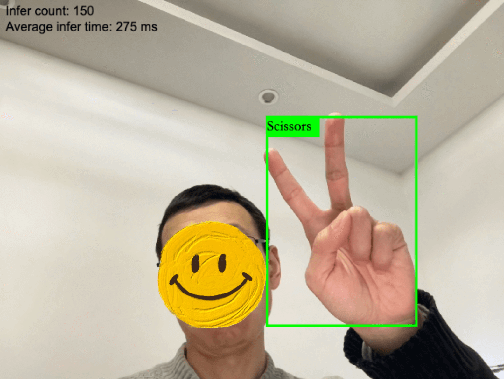

**项目完整代码参考：**[这个仓库](https://github.com/satorioh/yolov8_onnx_js)

**demo地址：**[Paper, Rock, Scissors Webcam Detection](https://rps.regulusai.top/)

```
建议：
1.使用PC端浏览器开启demo，手机端算力资源有限，推理速度较慢
2.需要给予浏览器摄像头权限
3.由于部署在vercel海外节点，对于大文件（模型）的传输，速度不太稳定，如超过2min仍在loading，可以刷新再试
```

### 一、前期准备
#### 1.数据集
考虑到最终效果需要直观、清晰、易理解，这次选择了roboflow上的[石头剪刀布](https://universe.roboflow.com/roboflow-58fyf/rock-paper-scissors-sxsw)目标检测数据集：


roboflow官方已经对该数据集做了几个版本的迭代，并且添加了预处理和数据增强（如下图）
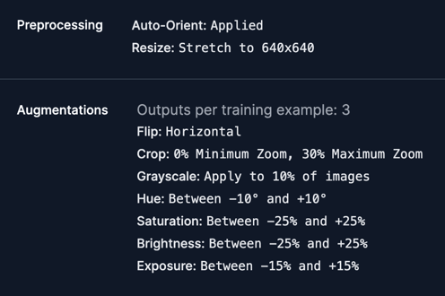

我下载的是[v14版本](https://universe.roboflow.com/roboflow-58fyf/rock-paper-scissors-sxsw/dataset/14)，包含3个类别（Rock、Paper、Scissors），7335张图片（训练集6445、验证集576、测试集304），图片尺寸统一reshape成了640x640，虽然图片数量很多，但每张只有几十kb，所以整个数据集也就238M。

#### 2.端侧设备与预训练模型选择
端侧设备：这次选择了浏览器端来部署，一是因为自己对js比较熟悉（老本行嘛），二是浏览器端有其天然优势：
- 更快：直接把模型放在浏览器里运行，省去了请求后端的时间
- 更安全：因为模型下载到本地，即使离线也可运行，保证了一定的数据隐私
- 更便宜：直接使用客户端资源做推理，省去了租赁云端算力的开销

预训练模型选择：考虑到浏览器加载模型的耗时，以及任务本身的精度要求，选择YOLOv8中最小的模型YOLOv8n比较合适

### 二、模型训练
训练方法可以参考我之前的[基于YOLOv8的菜品检测实验](https://wandb.ai/wangbinxp/yolov8_food/reports/-YOLOv8---Vmlldzo3MzEwOTE4?accessToken=uq09cnk2aei7x4669t03bnwsgrk53v00gf0fvbm80w7jb52gt7isyym17xy4thu4)，只是数据集换成了石头剪刀布，去掉了超参数调优的环节。

使用yolov8n模型，跑100轮，通过wandb记录训练过程，核心notebook代码如下：
```python
model = YOLO('yolov8n.pt')
results = model.train(project="yolov8_rps", data='./datasets/data.yaml', epochs=100, imgsz=640)
```

最终训练结果如下，除了mAP50-95低了点，其他都在90以上：
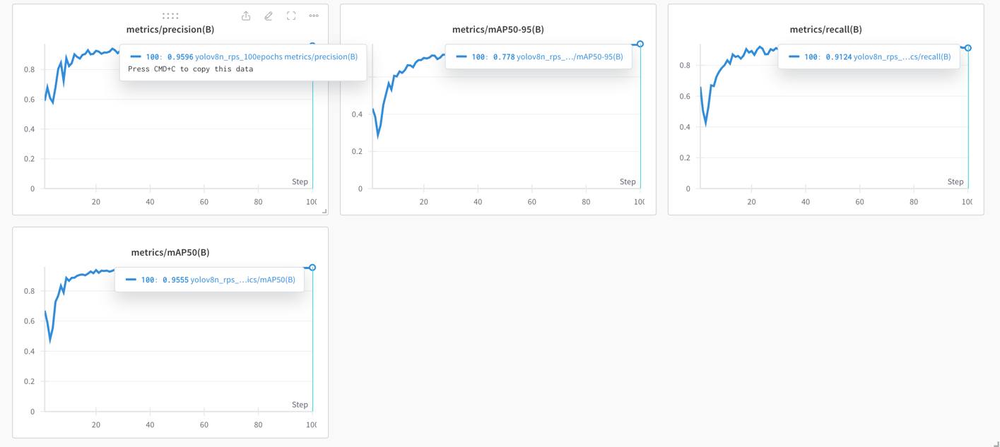


使用训练好的模型，跑一下视频推理（如下），效果还可以
<iframe src="//player.bilibili.com/player.html?aid=1502879386&bvid=BV1mD421H7Mc&cid=1500625973&p=1&autoplay=0" scrolling="no" border="0" frameborder="no" framespacing="0" allowfullscreen="true"> </iframe>

### 三、模型导出onnx格式
#### 1.什么是ONNX和ONNX Runtime
ONNX是 Open Neural Network Exchange 的缩写，是一种用于表示深度学习模型的开放格式。它使得不同的深度学习框架（如 TensorFlow、PyTorch、Caffe2 等）可以相互转换和共享模型。

ONNX Runtime 是由微软开发的一款推理框架，用于在多种运行后端（如 CPU、GPU、TensorRT、DML 等）上运行 ONNX 格式的模型 。ONNX Runtime支持跨平台、高性能的深度学习推理，可以加载和运行 ONNX 格式的模型 。它可以与各种深度学习框架无缝集成，提供了简单易用的 API，并支持多种编程语言和平台

#### 2.导出onnx格式
导出可以直接使用YOLOv8官方封装好的`export`方法，支持多种格式导出，其中就包括ONNX

具体参数选项可参考[官方文档](https://docs.ultralytics.com/modes/export/#arguments)，运行如下代码，导出为ONNX格式：
```python
from ultralytics import YOLO

model = YOLO('./rps_best.pt') # 加载之前训练好的模型
model.export(format='onnx')
```
控制台输出如下：
```shell
Ultralytics YOLOv8.1.45 🚀 Python-3.10.12 torch-2.2.1+cu121 CPU (Intel Xeon 2.20GHz)
Model summary (fused): 168 layers, 3006233 parameters, 0 gradients, 8.1 GFLOPs

PyTorch: starting from 'rps_best.pt' with input shape (1, 3, 640, 640) BCHW and output shape(s) (1, 7, 8400) (6.0 MB)
requirements: Ultralytics requirement ['onnx>=1.12.0'] not found, attempting AutoUpdate...
Collecting onnx>=1.12.0
  Downloading onnx-1.16.0-cp310-cp310-manylinux_2_17_x86_64.manylinux2014_x86_64.whl (15.9 MB)
     ━━━━━━━━━━━━━━━━━━━━━━━━━━━━━━━━━━━━━━━━ 15.9/15.9 MB 41.0 MB/s eta 0:00:00
Requirement already satisfied: numpy>=1.20 in /usr/local/lib/python3.10/dist-packages (from onnx>=1.12.0) (1.25.2)
Requirement already satisfied: protobuf>=3.20.2 in /usr/local/lib/python3.10/dist-packages (from onnx>=1.12.0) (3.20.3)
Installing collected packages: onnx
Successfully installed onnx-1.16.0

requirements: AutoUpdate success ✅ 18.0s, installed 1 package: ['onnx>=1.12.0']
requirements: ⚠️ Restart runtime or rerun command for updates to take effect


ONNX: starting export with onnx 1.16.0 opset 17...
ONNX: export success ✅ 20.5s, saved as 'rps_best.onnx' (11.7 MB)

Export complete (25.5s)
Results saved to /content
Predict:         yolo predict task=detect model=rps_best.onnx imgsz=640  
Validate:        yolo val task=detect model=rps_best.onnx imgsz=640 data=./datasets/data.yaml  
Visualize:       https://netron.app

'rps_best.onnx'
```
导出的模型大概有12M，输出信息中有一个`opset 17`比较重要，表示对模型算子的支持版本，较新的版本支持更多算子，较老的则对平台兼容性更好，详情可参考[官方说明](https://onnxruntime.ai/docs/reference/compatibility.html)

### 四、搭配onnxruntime的数据预处理
#### 1.YOLOv8和onnxruntime在使用上的区别
对于目标检测模型（比如YOLOv8）的推理过程，通常是这样的:
- (1)读取图片 
- (2)对图片数据做预处理，以符合模型input层的格式
- (3)模型加载处理后的图片数据
- (4)模型输出
- (5)解析模型输出，将相关信息绘制到原始图片上

比如YOLOv8官方已经将上述步骤都封装在了`predict`方法里，直接调用就行。但是onnxruntime不同，因为它需要支持多种深度学习框架、多个平台、各种不同的模型，它实现的是一个通用的API，只包含上述过程的(3)和(4)，其他需要我们自己来实现。

#### 2.python版的数据预处理
先介绍python的实现，因为python在对数据张量的处理方面，有很多高效的库，能让整个流程看起来更清晰易懂。

安装并导入onnxruntime
```python
!pip install onnxruntime
import onnxruntime as ort
```

加载onnx模型并实例化
```python
ort_model = ort.InferenceSession('./rps_best.onnx')
```

查看模型input层shape
```python
for input in ort_model.get_inputs():
    print("input name: ", input.name)
    print("input shape: ", input.shape)
    print("input type: ", input.type)
```

打印结果如下: 
```python
Name: images
Type: tensor(float)
Shape: [1, 3, 640, 640]
```
输入为四维浮点数据，包含一张3通道（RGB）的图片，尺寸640x640，像下面这样：

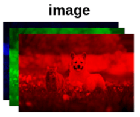

以单张图片为例，使用PIL调整图片尺寸
```python
!pip install pillow
from PIL import Image

img = Image.open("test.jpg")
img_width, img_height = img.size
img = img.resize((640,640))
```
删除alpha通道
```python
img = img.convert("RGB")
```

将图片数据转换为浮点数矩阵
```python
import numpy as np

input = np.array(img)
```

查看当前数据的shape
```python
input.shape
output:(640, 640, 3)
```

由于我们需要的是(3, 640, 640)，得做一下转换
```python
input = input.transpose(2,0,1)

input.shape
output:(3, 640, 640)
```

由于需要的格式是四维的，还要做一下升维
```python
input = input.reshape(1,3,640,640) #或者用expand_dims

input.shape
output:(1, 3, 640, 640)
```

shape对了，还要对数据做归一化
```python
input = input/255.0

input[0,0,0,0]
output: 0.9137254901960784
```
至此，python版的数据预处理完成

#### 3.javascript版的数据预处理
首先，通过canvas的`getImageData`获取图片的像素数组
```javascript
function prepare_input(img) {
  const canvas = document.createElement("canvas");
  canvas.width = 640;
  canvas.height = 640;
  const context = canvas.getContext("2d");
  context.drawImage(img, 0, 0, 640, 640);

  const data = context.getImageData(0, 0, 640, 640).data;
}
```
此时拿到的data是一个一维数组，需要按下图做转换：
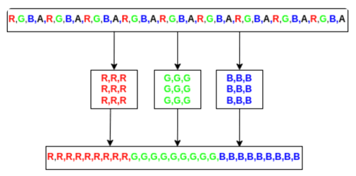

```python
  const red = [],
  green = [],
  blue = [];
  
  for (let index = 0; index < data.length; index += 4) {
    red.push(data[index] / 255);
    green.push(data[index + 1] / 255);
    blue.push(data[index + 2] / 255);
  }
  return [...red, ...green, ...blue];
```
javascript版的数据预处理就是这些

### 五、搭配onnxruntime的数据后处理
#### 1.python版的数据后处理
先查看模型输出的shape
```python
outputs = ort_model.get_outputs()
output = outputs[0]
print("Name:",output.name)
print("Type:",output.type)
print("Shape:",output.shape)
```
打印结果如下：模型返回一个三维浮点数组，代表一张图片上有8400个检测框（8400是YOLOv8可以检测的最大边界框数量，并且无论实际检测到多少个对象，它都会为任何图像返回 8400 行），每个框有4个坐标点信息+3个类别置信度
```shell
Name: output0
Type: tensor(float)
Shape: [1, 7, 8400]
```
可以用模型跑一下推理，看一下实际的输出
```python
input = input.astype(np.float32) # input代表预处理后的数据，这里先转成单精度浮点
outputs = ort_model.run(["output0"], {"images":input})
output = outputs[0]
output.shape # (1, 7, 8400)
```
取出其中的二维数据，做转置，方便后续处理
```python
output = output[0]
output.shape # (7, 8400)
output = output.transpose() # 转置
output.shape # (8400, 7)
```
这里的(8400, 7)代表有8400行7列，可以看下第一行的数据
```python
row = output[0]
print(row) 
# [     14.623      22.475      29.157      45.249  1.4901e-07  3.2783e-07  5.9605e-08]
```
前4项代表检测框的xcenter、ycenter、width、height，后面3项代表'Paper', 'Rock', 'Scissors'的概率，这里需要将坐标信息转换为x1y1(矩形框左上角),x2y2(矩形框右下角)形式，方便画图，还要获取最大概率值和对应的类别
```python
yolo_classes = ['Paper', 'Rock', 'Scissors']

def parse_row(row):
    xc,yc,w,h = row[:4]
    x1 = (xc-w/2)/640*img_width
    y1 = (yc-h/2)/640*img_height
    x2 = (xc+w/2)/640*img_width
    y2 = (yc+h/2)/640*img_height
    prob = row[4:].max()
    class_id = row[4:].argmax()
    label = yolo_classes[class_id]
    return [x1,y1,x2,y2,label,prob]
```
对于模型返回的概率较低的检测框我们需要过滤掉，这里设置丢弃概率<0.5的框
```python
boxes = [row for row in [parse_row(row) for row in output] if row[5]>0.5]

len(boxes) # 20
```
还有20个框，将这20个框绘制到测试图片上，可以发现它们很多都是重叠的
```python
from PIL import ImageDraw
img = Image.open("test.jpg")
draw = ImageDraw.Draw(img)

for box in boxes:
    x1,y1,x2,y2,class_id,prob = box
    draw.rectangle((x1,y1,x2,y2),None,"#00ff00")
```
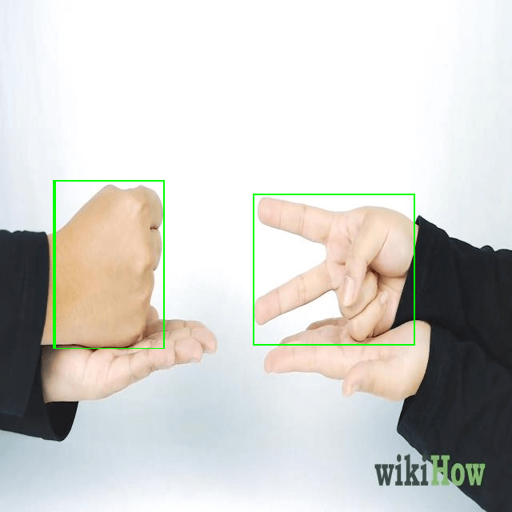
这时候就需要使用NMS算法做处理

#### 2.IoU与NMS的实现
IoU：可以使用IoU（Intersection over Union，交并比）来判断检测框定位的好坏。所谓交并比，是指预测边框与实际边框的交集和并集的比率，取值范围为0～1，越接近1越好
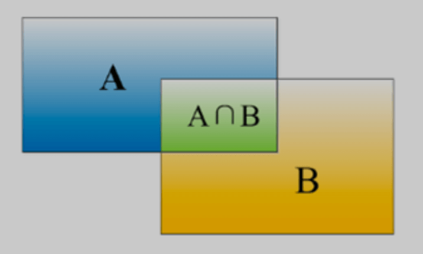
代码实现：
```python
def intersection(box1,box2):
    box1_x1,box1_y1,box1_x2,box1_y2 = box1[:4]
    box2_x1,box2_y1,box2_x2,box2_y2 = box2[:4]
    x1 = max(box1_x1,box2_x1)
    y1 = max(box1_y1,box2_y1)
    x2 = min(box1_x2,box2_x2)
    y2 = min(box1_y2,box2_y2)
    return (x2-x1)*(y2-y1)
    
def union(box1,box2):
    box1_x1,box1_y1,box1_x2,box1_y2 = box1[:4]
    box2_x1,box2_y1,box2_x2,box2_y2 = box2[:4]
    box1_area = (box1_x2-box1_x1)*(box1_y2-box1_y1)
    box2_area = (box2_x2-box2_x1)*(box2_y2-box2_y1)
    return box1_area + box2_area - intersection(box1,box2)
    
def iou(box1,box2):
    return intersection(box1,box2)/union(box1,box2) 
```


NMS：预测结果中，可能多个预测结果间存在重叠部分，需要保留交并比（IoU）最大的、去掉非最大的预测结果，这就是非极大值抑制（Non-Maximum Suppression，简写作NMS）

NMS的算法步骤如下：
- 将所有框放入队列中
- 先找到置信度最高的框（假设为A）
- 将A放入结果数组中
- 依次计算其他框与A的IoU值
- 如果某个框（假设为B）的IoU大于给定阈值（比如0.7），则认为B和A框定的是同一个物体，删除B
- 循环上述步骤，直到队列中没有框了

代码实现：
```python
# NMS
boxes.sort(key=lambda x: x[5], reverse=True)

result = []

while len(boxes)>0:
    result.append(boxes[0])
    boxes = [box for box in boxes if iou(box,boxes[0])<0.7] #<0.7则不是同一物体，要保留
```
经过NMS处理后，result中只剩2个框了
```python
print(result)

[[316.81634521484375,
  242.34803009033203,
  517.7810668945312,
  431.6143112182617,
  'Scissors',
  0.9387282],
 [69.72752380371094,
  226.46387481689453,
  205.6693878173828,
  435.36669158935547,
  'Rock',
  0.9296297]]
```

#### 3.javascript版的数据后处理
计算IoU的实现
```javascript
function iou(box1, box2) {
  return intersection(box1, box2) / union(box1, box2);
}

function union(box1, box2) {
  const [box1_x1, box1_y1, box1_x2, box1_y2] = box1;
  const [box2_x1, box2_y1, box2_x2, box2_y2] = box2;
  const box1_area = (box1_x2 - box1_x1) * (box1_y2 - box1_y1);
  const box2_area = (box2_x2 - box2_x1) * (box2_y2 - box2_y1);
  return box1_area + box2_area - intersection(box1, box2);
}

function intersection(box1, box2) {
  const [box1_x1, box1_y1, box1_x2, box1_y2] = box1;
  const [box2_x1, box2_y1, box2_x2, box2_y2] = box2;
  const x1 = Math.max(box1_x1, box2_x1);
  const y1 = Math.max(box1_y1, box2_y1);
  const x2 = Math.min(box1_x2, box2_x2);
  const y2 = Math.min(box1_y2, box2_y2);
  return (x2 - x1) * (y2 - y1);
}
```

获取x1、y1、x2、y2、最大置信度和对应的类别，这里没有做行列的转置，而是直接使用了绝对索引来定位
```javascript
for (let index = 0; index < 8400; index++) {
    const [class_id, prob] = [...Array(yolo_classes.length).keys()]
      .map((col) => [col, output[8400 * (col + 4) + index]])
      .reduce((accum, item) => (item[1] > accum[1] ? item : accum), [0, 0]);
    if (prob < 0.5) {
      continue;
    }
    const label = yolo_classes[class_id];
    const xc = output[index];
    const yc = output[8400 + index];
    const w = output[2 * 8400 + index];
    const h = output[3 * 8400 + index];
    const x1 = ((xc - w / 2) / 640) * img_width;
    const y1 = ((yc - h / 2) / 640) * img_height;
    const x2 = ((xc + w / 2) / 640) * img_width;
    const y2 = ((yc + h / 2) / 640) * img_height;
    boxes.push([x1, y1, x2, y2, label, prob]);
}
```
NMS算法实现：
```javascript
let boxes = [];
boxes = boxes.sort((box1, box2) => box2[5] - box1[5]);

const result = [];
while (boxes.length > 0) {
    result.push(boxes[0]);
    boxes = boxes.filter((box) => iou(boxes[0], box) < 0.7);
}
```

### 六、模型部署与推理
在浏览器上部署，用到的是`onnxruntime-web`这个library，它可以调用端侧的cpu(wasm)、webgl或webGPU来执行模型推理。我这里使用的是cpu来执行，因为兼容性比较好。

onnx官方推荐把模型推理这部分代码，放到web worker中执行，因为是cpu密集型操作，可以有效防止阻塞主线程，具体参考[官方文档](https://onnxruntime.ai/docs/tutorials/web/performance-diagnosis.html)
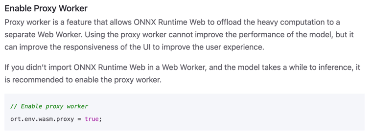

worker.js的代码如下
```javascript
importScripts(
  "https://cdn.jsdelivr.net/npm/onnxruntime-web@1.17.1/dist/ort.min.js",
);

let model = null;
ort.InferenceSession.create("./rps_best.onnx", {
  executionProviders: ["wasm"],
  graphOptimizationLevel: "all",
}).then((res) => {
  model = res;
  console.log("model", model);
  postMessage({ type: "modelLoaded" });
});

async function run_model(input) {
  if (!model) {
    model = await model;
  }
  input = new ort.Tensor(Float32Array.from(input), [1, 3, 640, 640]);
  const outputs = await model.run({ images: input });
  return outputs["output0"].data;
}

onmessage = async (event) => {
  const { input, startTime } = event.data;
  const output = await run_model(input);
  postMessage({ type: "modelResult", result: output, startTime });
};

```
绘制最终检测框的代码如下：
```javascript
function draw_boxes(canvas, boxes) {
  const ctx = canvas.getContext("2d");
  ctx.strokeStyle = "#00FF00";
  ctx.lineWidth = 3;
  ctx.font = "18px serif";
  boxes.forEach(([x1, y1, x2, y2, label]) => {
    ctx.strokeRect(x1, y1, x2 - x1, y2 - y1);
    ctx.fillStyle = "#00ff00";
    const width = ctx.measureText(label).width;
    ctx.fillRect(x1, y1, width + 10, 25);
    ctx.fillStyle = "#000000";
    ctx.fillText(label, x1, y1 + 18);
  });

  // 绘制 Infer count 和 Average infer time
  ctx.font = "16px Arial";
  ctx.fillStyle = "black";
  ctx.fillText(`Infer count: ${inferCount}`, 10, 20);
  ctx.fillText(
    `Average infer time: ${
      inferCount ? parseInt(totalInferTime / inferCount) : 0
    } ms`,
    10,
    40,
  );
}
```

刚开始运行，除了会加载模型文件（12.2M），还会加载一个wasm library（2.6M）作为backend来调用cpu资源
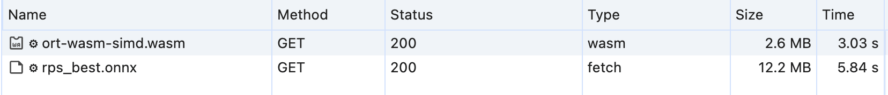

在我的 Mac M1 Chrome浏览器上，平均推理一次差不多要600ms（如下图）
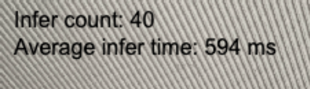

后续主要从两个方向着手优化：
- 减小模型文件尺寸，提升加载速度
- 挖掘端侧性能，从而降低推理耗时

### 七、优化
#### 1.模型量化
模型量化是指将模型中的浮点权重和激活值转换为低精度整数类型，例如 int8 或 int16 的过程，这可以显著减小模型的大小和内存占用

我这里使用了动态uint8量化，在量化前还需要做一次preprocess，其中包含了对model的optimize，具体可参考[官方文档](https://onnxruntime.ai/docs/performance/model-optimizations/quantization.html)
```python
!pip install onnxruntime

# https://github.com/microsoft/onnxruntime-inference-examples/blob/main/quantization/image_classification/cpu/ReadMe.md
!python -m onnxruntime.quantization.preprocess --input rps_best.onnx --output rps_best_infer.onnx

from onnxruntime.quantization import quantize_dynamic, quantize_static, QuantType
model_fp32 = './rps_best_infer.onnx'
model_quant = './rps_best_uint8.onnx'
quantized_model = quantize_dynamic(model_fp32, model_quant, weight_type=QuantType.QUInt8)
```
量化后的模型，大小从12.2M，减少到3.3M，体积减小了四分之一
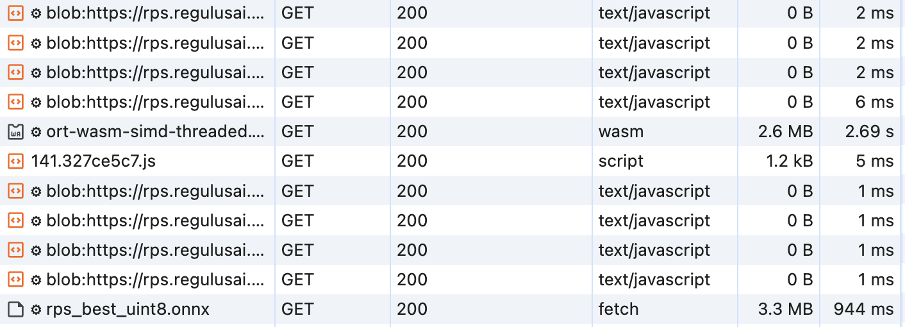

#### 2.使用SIMD+多线程加速wasm backend
SIMD 是 Single Instruction, Multiple Data 的缩写，指的是单指令多数据。SIMD 指令可以同时对多个数据进行操作，从而提高数据处理速度

多线程可以有效利用多核CPU资源，从而提高性能
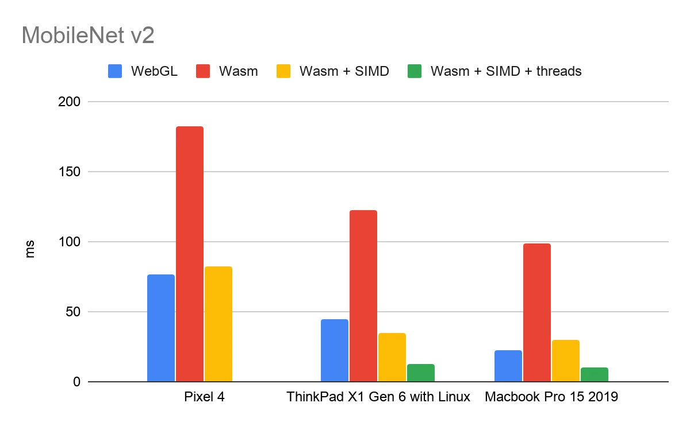

onnxruntime-web的SIMD是默认开启的，而多线程需要服务端返回COOP/COEP响应头，以在浏览器端启用跨域隔离（如下图），详情参考[这里](https://web.dev/articles/cross-origin-isolation-guide?hl=zh-cn)
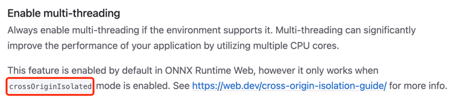

由于我使用的vercel部署，直接在`vercel.json`中添加配置即可让vercel返回相关http头
```json
{
  "headers": [
    {
      "source": "/(.*)",
      "headers": [
        {
          "key": "Cross-Origin-Embedder-Policy",
          "value": "require-corp"
        },
        {
          "key": "Cross-Origin-Opener-Policy",
          "value": "same-origin"
        }
      ]
    }
  ]
}

```
启用wasm多线程后，在PC端Chrome上的平均推理时间，从600ms左右减少到269ms
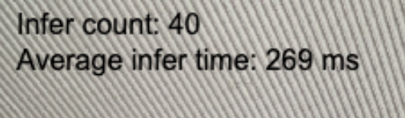

### 八、有待改进的地方
1.最新版onnx支持int4量化，可以进一步压缩模型体积，减少通过网络传输的数据量

2.尝试将模型资源部署到国内节点，提升传输速度和稳定性

3.在手机浏览器上测试，平均推理时间需要1600ms~2000ms，不确定是手机计算资源孱弱，还是某些加速功能未开启，有待验证

4.在尝试使用WebGL和WebGPU provider时，遇到了一些问题，还未解决，如果能利用端侧设备的GPU资源，则可以更好得加速模型推理

5.可以尝试onnx以外的解决方案，也许会有更好的性能


参考：

[使用 SIMD 和多线程增强 TensorFlow.js WebAssembly 后端](https://www.infoq.cn/article/hi2vrxfevlelcvvov0g7)

[关于启用跨域隔离的指南](https://web.dev/articles/cross-origin-isolation-guide?hl=zh-cn)

[AI模型部署 | onnxruntime部署RT-DETR目标检测模型](https://mp.weixin.qq.com/s/i_vAtCfM5eE6N6R5Sqo6zA)

[How to create YOLOv8-based object detection web service using Python, Julia, Node.js, JavaScript, Go and Rust](https://dev.to/andreygermanov/how-to-create-yolov8-based-object-detection-web-service-using-python-julia-nodejs-javascript-go-and-rust-4o8e#explore)

[ONNX Web官方文档](https://onnxruntime.ai/docs/tutorials/web/)

[How to detect objects in videos in a web browser using YOLOv8 neural network and JavaScript](https://dev.to/andreygermanov/how-to-detect-objects-in-videos-in-a-web-browser-using-yolov8-neural-network-and-javascript-lfb)

[YOLOv8初体验：检测、跟踪、模型部署](https://juejin.cn/post/7210273155885645885)
